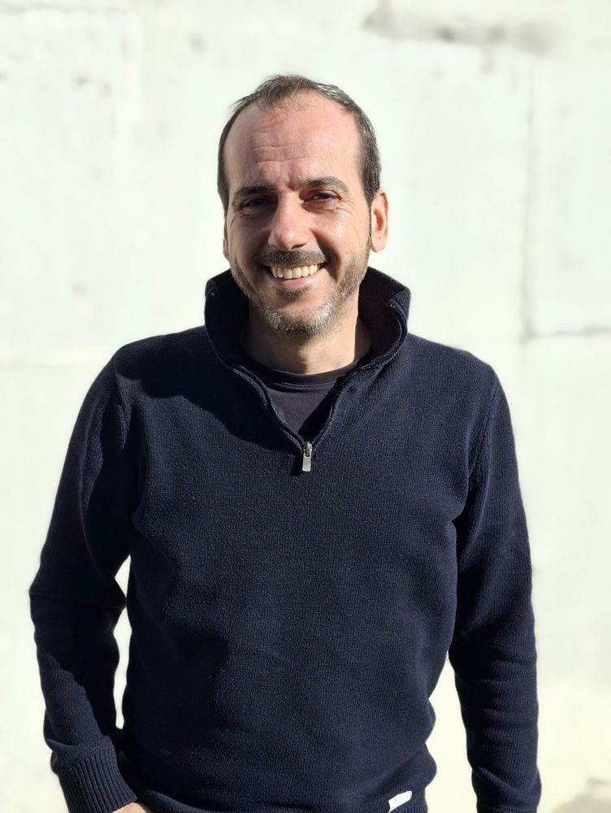
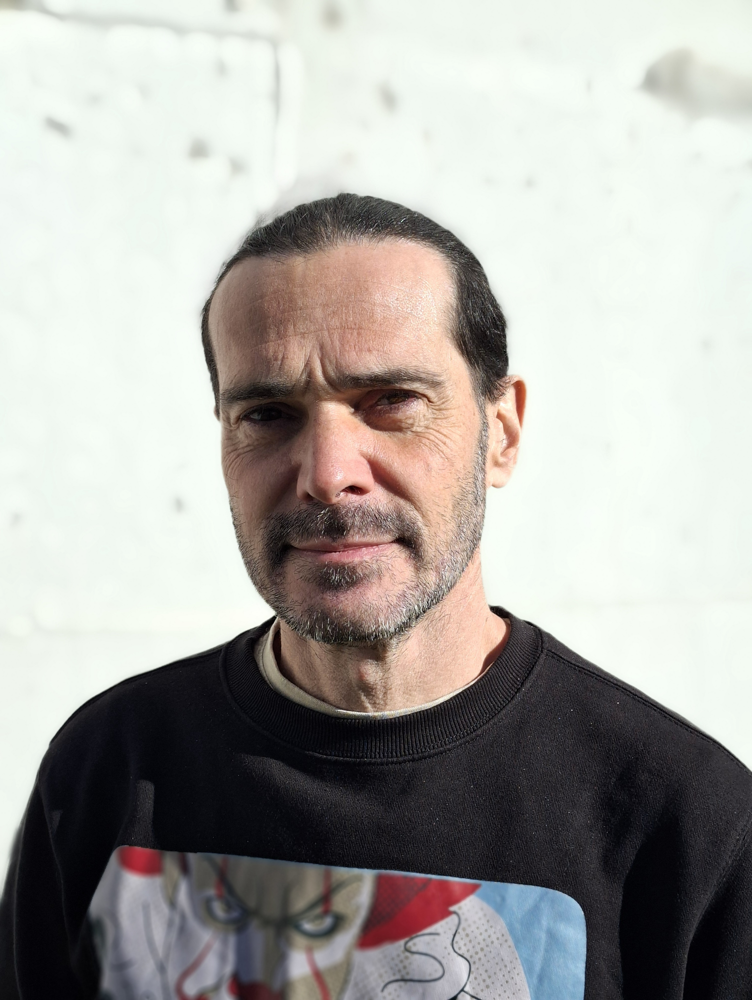
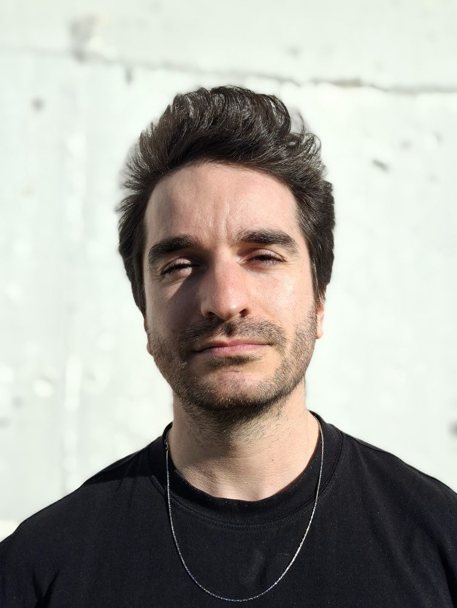
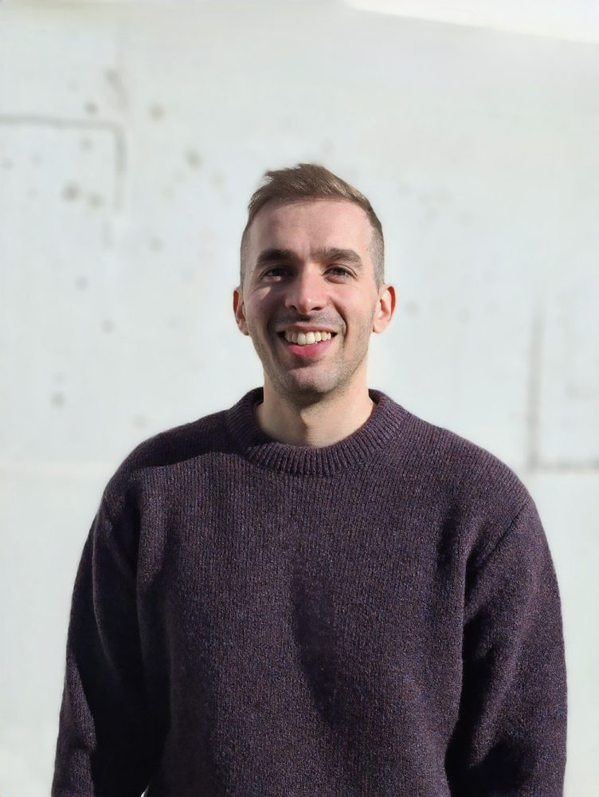
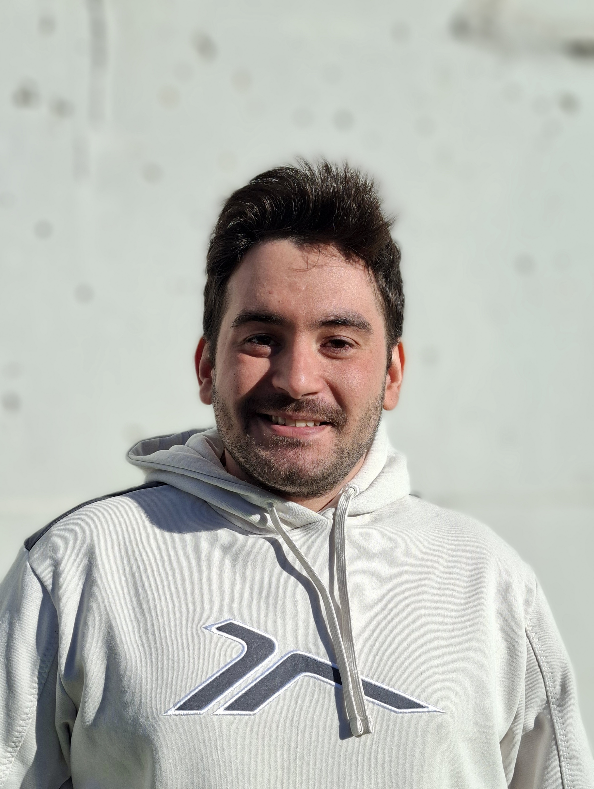
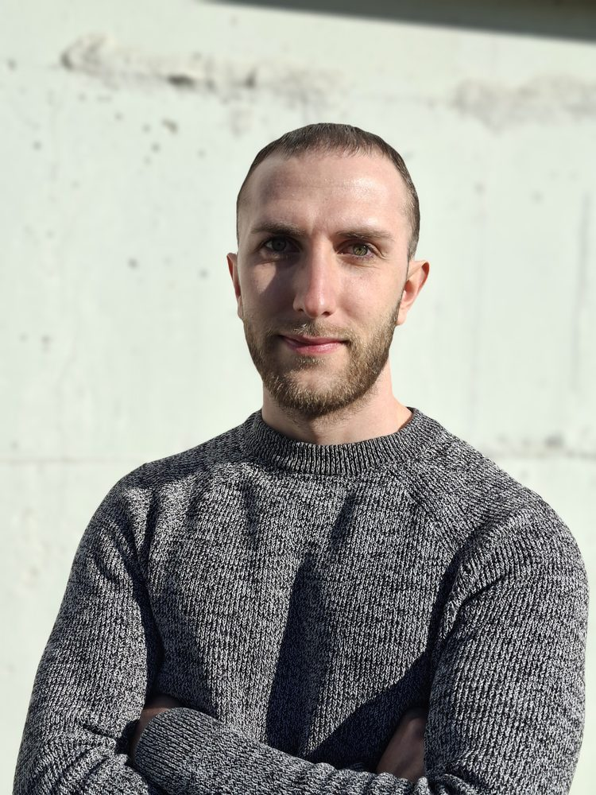
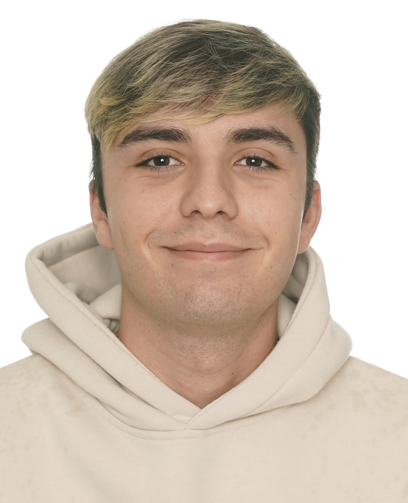

# About Us

## Micael Gallego

**I'm a founder of OpenVidu, and technical lead of the OpenVidu team. During 10 years I've been leading this project.**

I'm a software engineer, and earned a Ph.D. in computer science in 2008. I was awarded with a national prize... I'm an Associate Professor at the University Rey Juan Carlos, and I have participated in and directed multiple national and European technical and research projects. 

In the private sector, I have also participated in, directed, and collaborated with various private and projects, including Kurento, either as a consultor or as a technical lead. 

My main research activities are related to software engineering, software testing, and real-time communications. I have authored more than 40 papers in important journals and conferences with peer review. Those research works related to WebRTC and real-time communications in general can be found on our [research page](research.md).

[:simple-github:](https://github.com/micaelgallego){ .md-social__link title="github.com" target="_blank" }
[:simple-x:](https://x.com/micael_gallego){ .md-social__link title="x.com" target="_blank" }

{ .dark-img .svg-img .about-us-img loading=lazy width=752 height=1000 }

---

## Francisco Gortázar

**I'm a founder of OpenVidu, currently focusing on research activities around real-time communications and on OpenVidu marketing.**

I'm a software engineer, and I hold a PhD on Computer Science, earned in 2007. I'm an associate professor at Universidad Rey Juan Carlos. I have participated and directed several national and European technical and research projects.

I've been involved in many projects in the private sector, mainly related to cloud computing, engineering and testing, including Kurento. 

My main research activities are related to software testing and real-time communications, and I've authored more than 30 publications in prestigious peer-reviewed journals and conferences. Some of these research works help push OpenVidu forward in areas such as QoE, load testing, and scaling of real-time communication services. My research works related to real-time communications are listed on our [research page](research.md).

[:simple-github:](https://github.com/gortazar){ .md-social__link title="github.com" target="_blank" }

{ .dark-img .svg-img .about-us-img loading=lazy width=752 height=1000 }

---

## Pablo Fuente

**I'm a senior software engineer currently helping develop OpenVidu. I have worked for more than 8 years in the project, building its core features from the very beginning. I have contributed to both the architectural design and low-level implementation of the platform.** 

I have worked with countless languages, technologies and frameworks throughout my career (too many to list them, really!). But as a small glance, my expertise includes real-time communication protocols, media streaming, and scalable, fault-tolerant backend systems. I also understand the importance of good quality documentation and communication: a product is valuable as long as people understand it and use it!

My academic background consists of a Double Degree in Computer Science and Software Engineering from the University of Rey Juan Carlos in Madrid, Spain, in which I graduated with the best academic records of my year. I also completed a Master's Degree in Engineering of Software Systems. I have worked as assistant professor for a cloud-native application development Master's Degree program for two years, and I have also been a speaker in some technical conferences and meetups. This background has laid a solid foundation for a journey that has been both challenging and rewarding. Looking forward to seeing what the future holds!

[:simple-github:](https://github.com/pabloFuente){ .md-social__link title="github.com" target="_blank" }

{ .dark-img .svg-img .about-us-img loading=lazy width=752 height=1000 }

---

## Carlos Santos

**I’m a senior Full-Stack Software Engineer focused on building distributed, high-availability systems for real-time communication platforms such as OpenVidu. I work across the full development lifecycle — frontend, backend, integration, testing, and CI/CD — applying DevOps practices delivering scalable and reliable software.**

I hold a Software Engineering degree and a Master’s in Cloud Apps: Development and Deployment of Cloud Applications from Universidad Rey Juan Carlos.

My experience centers on Node.js, TypeScript, and Angular, complemented by strong skills in mobile development, frontend architecture, and microservices. I design resilient, fault-tolerant applications that leverage WebSockets and REST APIs for efficient, real-time communication. My focus on automation, observability, and continuous integration ensures maintainable, high-performance systems ready for production.

[:simple-github:](https://github.com/CSantosM){ .md-social__link title="github.com" target="_blank" }

{ .dark-img .svg-img .about-us-img loading=lazy width=752 height=1000 }

---

## Carlos Ruiz

**I’m a senior SRE and Software Developer at OpenVidu. I specialize in designing and managing OpenVidu deployment architecture, developing tools for efficient installation and management, and contributing to all OpenVidu projects.**

I hold a Bachelor’s in Computer Science, a Bachelor’s in Software Engineering, and a Master’s in Software Systems Engineering. As an open-source enthusiast, I actively contribute to OpenVidu and manage my own ones.

My expertise spans backend development (Java, Node.js, Golang), frontend development (JavaScript, Angular), and Linux and virtualization automation and administration (Bash, Python, Docker, Kubernetes).

[:simple-github:](https://github.com/cruizba){ .md-social__link title="github.com" target="_blank" }
[:simple-x:](https://x.com/cruizba){ .md-social__link title="x.com" target="_blank" }

{ .dark-img .svg-img .about-us-img loading=lazy width=752 height=1000 }

---

## Juan Carlos Moreno

**I'm currently working as a Full-Stack Software Engineer, contributing to the design, development, and deployment of tools that enhance the OpenVidu platform.**

I hold a Double Degree in Computer Engineering and Software Engineering from Universidad Rey Juan Carlos, where I graduated top of my class and received the Extraordinary End-of-Degree Award. I also completed a Master’s Degree in Development and Operations (DevOps) at Universidad Internacional de La Rioja, achieving a GPA of 9.85.

I have professional experience mainly with Node.js, TypeScript, and Angular, as well as with Java, Spring Boot, and Go. I also have solid experience with Docker, Kubernetes, and AWS, focusing on automation and observability across development and deployment processes.

[:simple-github:](https://github.com/juancarmore){ .md-social__link title="github.com" target="_blank" }

{ .dark-img .svg-img .about-us-img loading=lazy width=750 height=1000 }

---

## Sergio Fernández

**I'm currently involved in Cloud Deployments of OpenVidu and CI, as a DevOps.**

I hold a computer engineer degree from Universidad Rey Juan Carlos.

My experience includes working with the most common public clouds and with their Cloud Formation Languages such as Terraform for GCP and Bicep for Azure. 

[:simple-github:](https://github.com/Piwccle){ .md-social__link title="github.com" target="_blank" }

{ .dark-img .svg-img .about-us-img loading=lazy width=1200 height=1478 }

---

  <h2 style="margin-bottom: 1em">Some of us are researchers, and push OpenVidu forward by advancing the state-of-the-art on the field with our passion for science and technology!</h2>
  

    <a href="/research" class="md-button home-secondary-button">Have a look at our research works</a>
  

