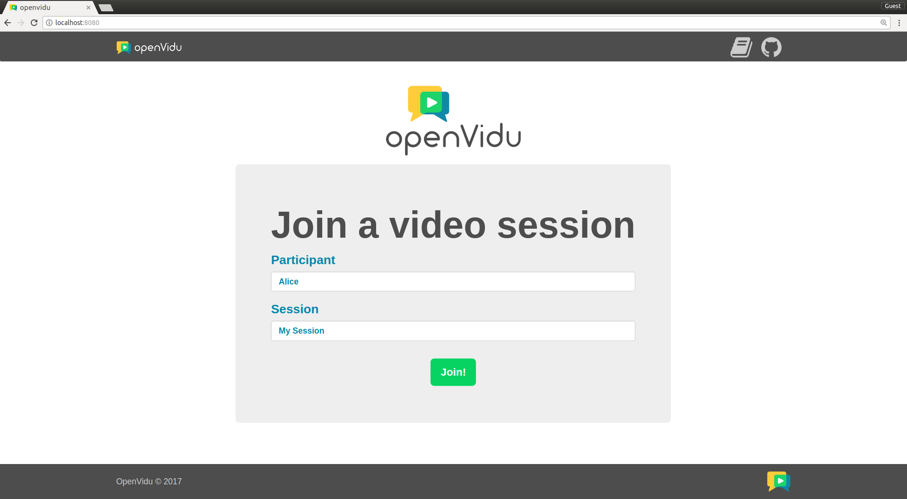
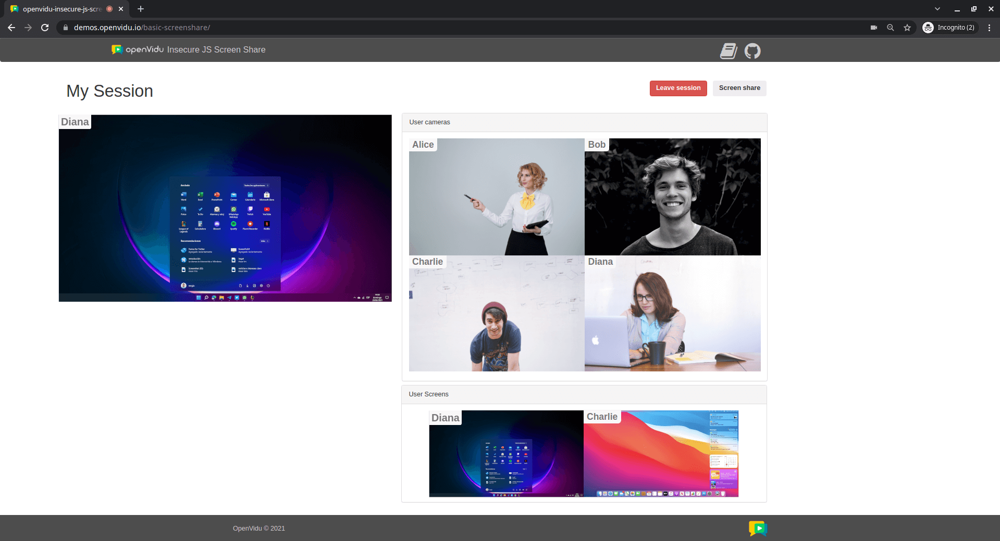

[Try it now](https://demos.openvidu.io/basic-screenshare/){ .md-button .md-button--primary .margin-right-button target=_blank }
[Source code :simple-github:](https://github.com/OpenVidu/openvidu-tutorials){ .md-button target=_blank }

This is based in the [Basic Videoconference](basic-videoconference.md) demo but adding screen sharing capabilites. Users can freely connect to any videoconference room and share their screen with other participants. If a room does does not exist, a new one will be created.

<!-- Somehow the following plain HTML elements being in one line greatly affects MKDocs performance and ability to build the site -->

