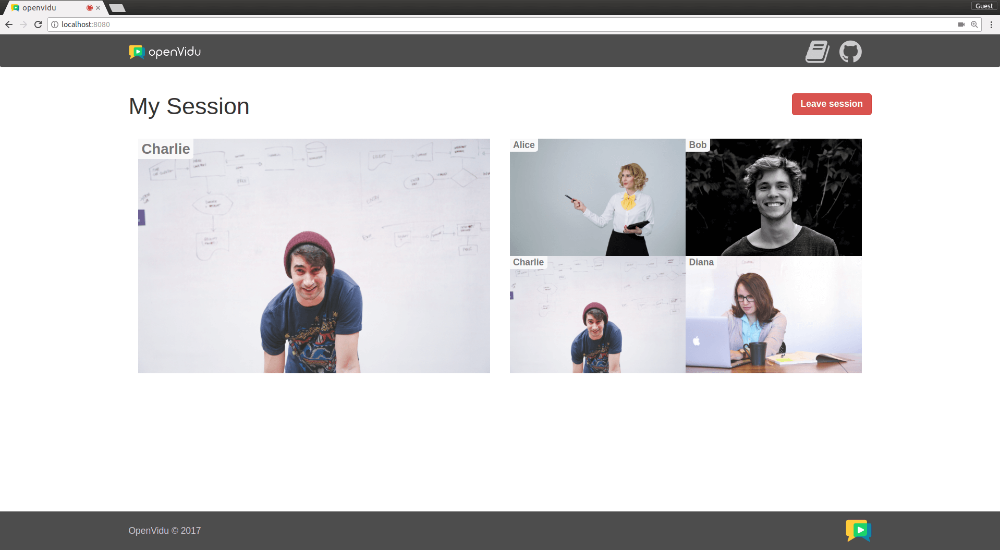

[Try it now](https://demos.openvidu.io/basic-videoconference/){ .md-button .md-button--primary .margin-right-button target=_blank }
[Source code :simple-github:](https://github.com/OpenVidu/openvidu-tutorials){ .md-button target=_blank }

Users can freely connect to any videoconference session. If it does not exist, a new one will be created.

This demo is derived directly from the tutorials. If you want a deep understanding of the ins and outs you can check either of the following tutorials (whichever you feel most comfortable with):

- [openvidu-js]()
- [openvidu-angular]()
- [openvidu-react]()
- [openvidu-vue]()

<!-- Somehow the following plain HTML elements being in one line greatly affects MKDocs performance and ability to build the site -->

