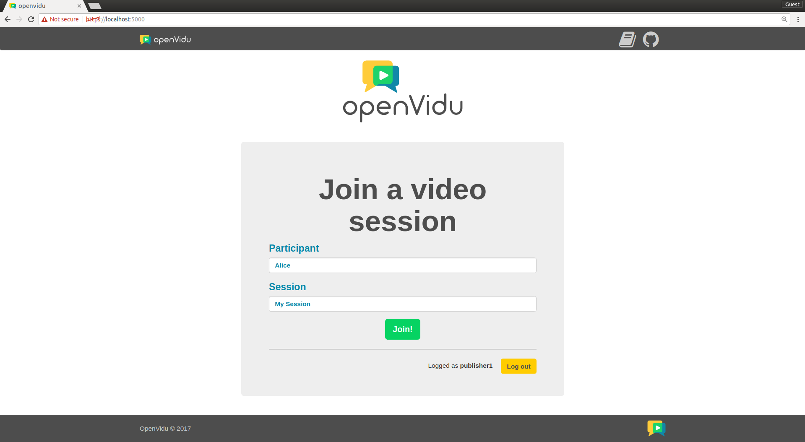
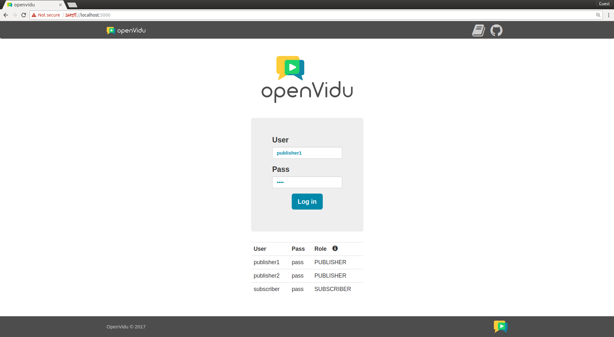
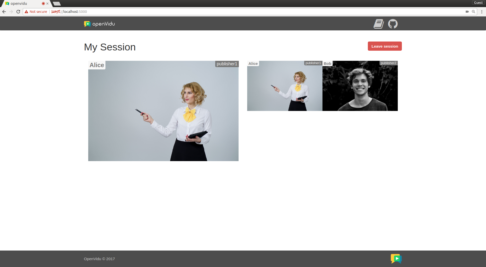
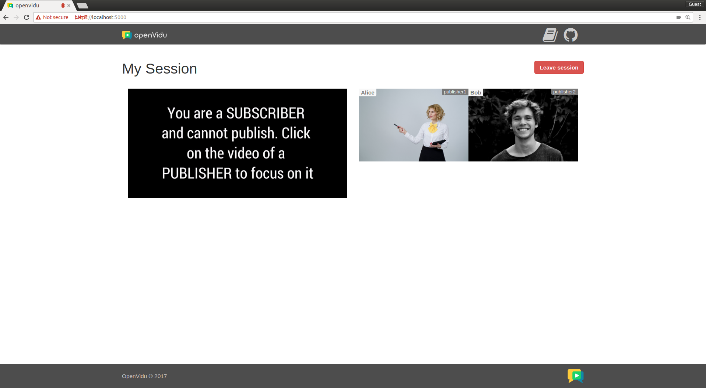

[Try it now](https://demos.openvidu.io/basic-webinar/){ .md-button .md-button--primary .margin-right-button target=_blank }
[Source code :simple-github:](https://github.com/OpenVidu/openvidu-tutorials){ .md-button target=_blank }

Users are identified via a login authentication system. This means users are given a certain role depending on their identity when connecting to a videoconference room. This demo wraps a simple frontend and a straightforward backend, making use of OpenVidu in a secure manner.

<!-- Somehow the following plain HTML elements being in one line greatly affects MKDocs performance and ability to build the site -->

