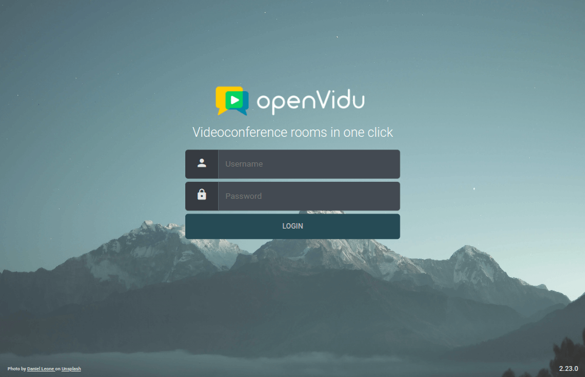
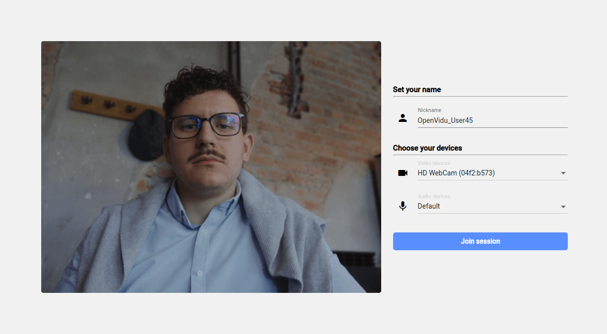

[Try it now](https://demos.openvidu.io/openvidu-call/){ .md-button .md-button--primary .margin-right-button target=_blank }
[Source code :simple-github:](https://github.com/OpenVidu/openvidu-tutorials){ .md-button target=_blank }

OpenVidu Call is a videoconference application that provides the features you can find in any other popular service. It allows you to join into multi-party videoconference calls, displayed in a nice and intelligent layout. Inside the calls you can mute/unmute and publish/unpublish your microphone and webcam, share your screen and chat with the rest of users. It also integrates advanced features such as recording, live broadcasting, virtual backgrounds and subtitles.

The front-end is implemented in **Angular** and the backend in **Node.js** with **Express**.

<!-- Somehow the following plain HTML elements being in one line greatly affects MKDocs performance and ability to build the site -->

<a class="glightbox" href="../../assets/videos/ov-call-greetings.mp4" data-type="video"><video src="../../assets/videos/ov-call-greetings.mp4" muted playsinline autoplay loop async></video></a>

<a class="glightbox" href="../../assets/videos/ov-call-chat.mp4" data-type="video"><video src="../../assets/videos/ov-call-chat.mp4" muted playsinline autoplay loop async></video></a>

<a class="glightbox" href="../../assets/videos/ov-call-participants.mp4" data-type="video"><video src="../../assets/videos/ov-call-participants.mp4" muted playsinline autoplay loop async></video></a>

<a class="glightbox" href="../../assets/videos/ov-call-screenshare.mp4" data-type="video"><video src="../../assets/videos/ov-call-screenshare.mp4" muted playsinline autoplay loop async></video></a>

