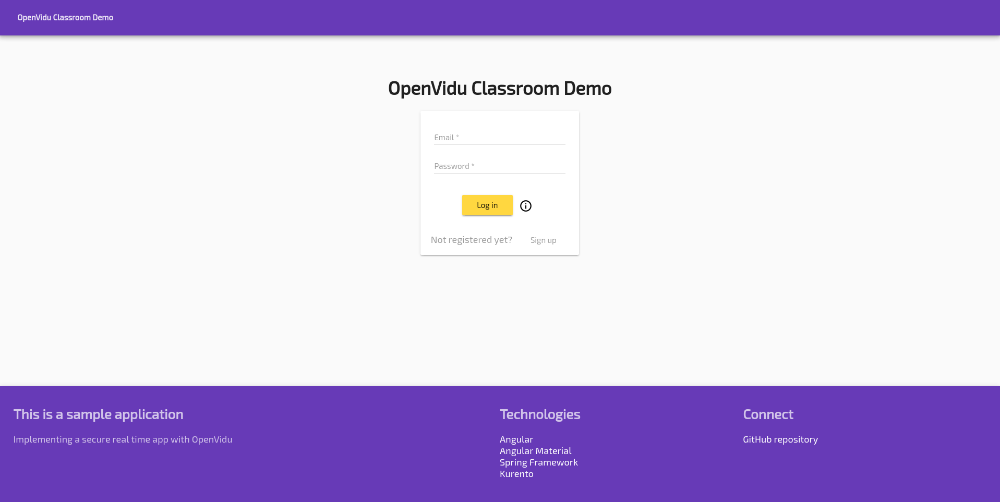
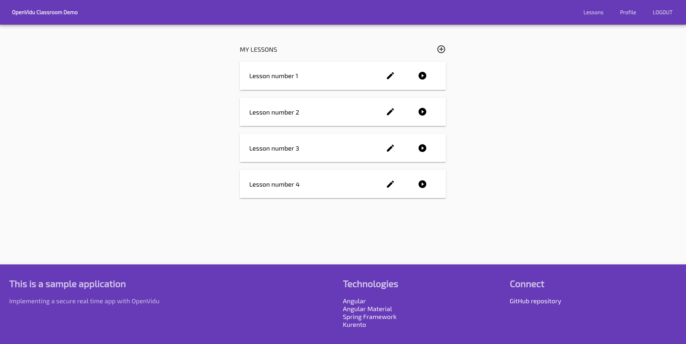

[Try it now](https://demos.openvidu.io/classroom/){ .md-button .md-button--primary .margin-right-button target=_blank }
[Source code :simple-github:](https://github.com/OpenVidu/openvidu-tutorials){ .md-button target=_blank }

This is a fully functional application that makes use of OpenVidu to connect teachers and students in video rooms. It has a frontend built with **Angular**, a backend built with **Spring Boot** and a **MySQL** database. There are two types of roles: teachers and students. First ones can create/edit/remove lessons and invite students to them. Only when a teacher initialize a lesson authorized students can connect to it.

Checkout the source code [TODO]().

<!-- Somehow the following plain HTML elements being in one line greatly affects MKDocs performance and ability to build the site -->

