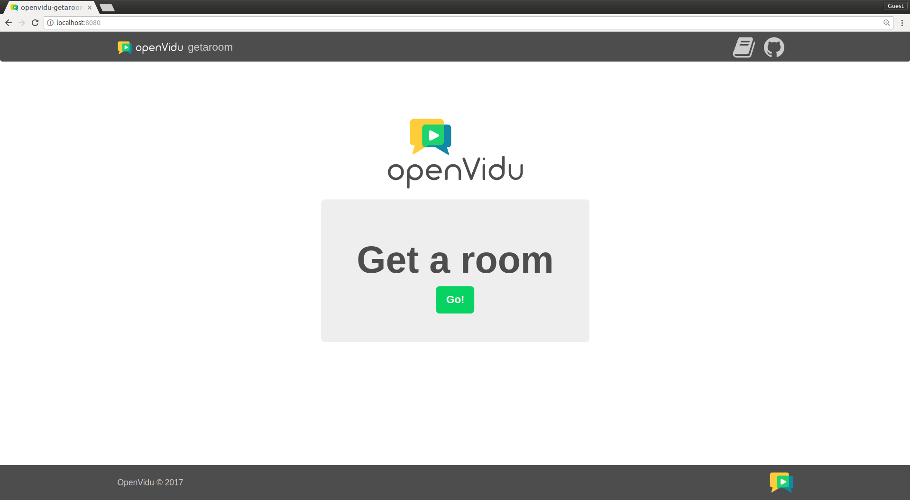

[Try it now](https://demos.openvidu.io/getaroom/){ .md-button .md-button--primary .margin-right-button target=_blank }
[Source code :simple-github:](https://github.com/OpenVidu/openvidu-tutorials){ .md-button target=_blank }

Users can create new videoconference rooms by clicking a button. Then they can share the link of the room to invite new participants.

<!-- Somehow the following plain HTML elements being in one line greatly affects MKDocs performance and ability to build the site -->

