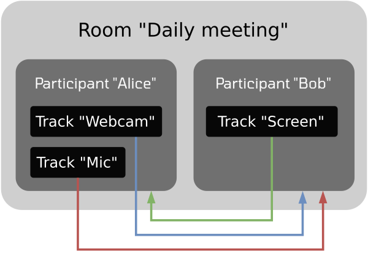
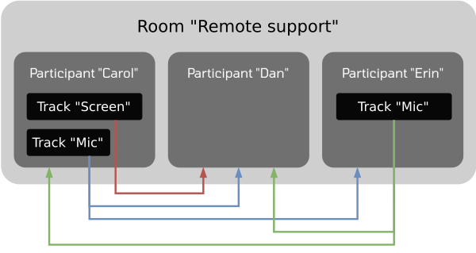

<h1 class="logo-header platform-header">

</h1>

<h2 class="meetplatform-slogan">
Build your real-time application with complete freedom using SDKs
</h2>

## What is OpenVidu Platform?

OpenVidu Platform enables you to build real-time applications. You can build your new OpenVidu application from scratch, but it is also very easy to integrate OpenVidu in your already existing application.

OpenVidu is based on WebRTC technology and allows developing any kind of use case you can imagine: one-to-one calls, video conference rooms, massive live-streaming events, management and processing of drones and camera feeds...

OpenVidu is built on the best open source technologies: [LiveKit :fontawesome-solid-external-link:{.external-link-icon}](https://livekit.io){target="\_blank"}, from which it inherits all its amazing SDKs to integrate it into your front-end and back-end applications, and [mediasoup :fontawesome-solid-external-link:{.external-link-icon}](https://mediasoup.org){target="\_blank"}, from which it inherits the best performance and optimization for media routing.

<figure markdown>
  { .mkdocs-img .do-not-include-in-gallery }
  { .mkdocs-img .do-not-include-in-gallery }
  <figcaption style="max-width: 27rem">OpenVidu is a custom fork of LiveKit, 100% compatible in terms of its API and SDKs, with the power of mediasoup at its core. This and other integrations provide improved performance, new features and facilitate the deployment and management of your self-hosted, production-grade cluster.</figcaption>
</figure>

## Use cases

OpenVidu is a super versatile platform that can be used to build just about any kind of real-time application you can think of. Most common use cases can be classified into one of the following categories:

### Video conferencing

Video conferencing rooms are virtual spaces where two or more users can send video and audio and interact with each other in real-time. They can scale in size, from a simple 1-to-1 call to a massive video conference with thousands of participants. For example:

- A 1-to-1 **video-call center** to attend your customers face to face.
- An **e-health application** where doctors can treat their patients directly from it, in a private and secure manner using end-to-end encryption.
- A **banking application** where customers may sign a contract, live and recording the call as proof of it.
- A **webinar platform** where speakers can give their talks to large audiences, with the possibility of viewers temporarily turning their cameras to ask questions.

### Live-streaming

Live streaming applications allow one publisher to broadcast video to many viewers. It can be a single video feed, multiple video feeds (webcam and screen share) or there could be even multiple publishers. The general rule is that the ratio of viewers to publishers is very high, in the order of thousands.

Ultra-low latency live-streaming (below 300ms) allows for actual real-time interaction between the viewers and the publishers. This differs from traditional live-streaming platforms where the latency is usually in the order of seconds. In this way you can build applications like:

- A **TEDx-like application**, where a speaker can give a talk to a massive audience of thousands of viewers, who may communicate through a chat. Real time subtitles and translations can be added to the stream.
- An application to **stream sport events**, where viewers can switch between different cameras to watch the game from different angles to increase fan engagement.
- A **global live auction platform** where the auctioneer can be seen by the bidders in real-time with sub-second latency all around the world.

### AI Agents

AI has changed the world, forever. OpenVidu can be used to integrate any kind of AI agent in your in application, using real-time audio/video/data tracks as inputs for LLMs or any other kind of AI model. With these capabilities, you can expand your application to new horizons:

- Implement **real-time subtitles, translations, word-detection, sentiment analysis, profanity filter**, etc. in your video conferences.
- Add a **summary generator** to your video conference app, that can extract the most important parts of the conversation to be shared with the participants.
- Build a 1-to-1 **virtual assistant** that can speak naturally with your users, using the latest Text-To-Speech AI models.
- Implement **object detection** in your live-streaming app, to detect and track objects in real-time in the video feed.

### Robotics and embedded systems

The future lies in the integration of cameras and sensors in all kinds of devices, everywhere: industry, homes, public spaces, emergency services... OpenVidu can be used to receive and process video and audio streams from these devices, and doing so in real-time. For example:

- A **security system** to receive the feed of IP cameras and sending an alert when detecting a person.
- A **drone control system** to receive the video feed from each drone camera and securely record it. Any other sensor reading could also be sent to be synchronized later with the recorded video feed.
- A **real-time translation app** that uses the latest AI models to provide high-quality translations of spoken language in real time.

## OpenVidu application architecture

Every OpenVidu application consists of 3 main components:

- **Your OpenVidu deployment**: provides all the necessary infrastructure for streaming real-time audio and video. It is built upon **LiveKit server** and **mediasoup server**, but it can usually be treated as a black box where its internal aspects are not important: you just deploy it and connect your application to it. It can be a single server or a cluster, deployed on premises or in your cloud provider.
- **Your Application client**: runs in your user devices and interacts with the OpenVidu server through any **LiveKit client SDK**. As OpenVidu server is 100% compatible with LiveKit protocol, you can integrate any LiveKit client SDK in your Application client. Your users will join rooms as participants to send and receive real-time audio and video tracks. It needs a token generated by the Application server to join a room.
- **Your Application server**: interacts with the OpenVidu deployment through any **LiveKit server SDK**. As OpenVidu server is 100% compatible with LiveKit protocol, you can integrate any LiveKit server SDK in your application server. At a minimum, it is responsible for the generation of tokens for the Application client to join a room. But you can implement your own business logic managing rooms, participants and tracks from the safety of your Application server.

## Basic concepts

### Room

A Room is a virtual space where Participants can connect to send and receive media Tracks. Two Participants can only communicate if they are connected to the same Room.

### Participant

A Participant is a user connected to a specific Room. Each Participant can publish as many video and audio Tracks as needed, and subscribe to any other Participant's Tracks, as long as they are connected to the same Room.

### Track

A Track is a data flow of audio or video. Participants create them from a local media source (a webcam, a microphone, a screen share) and publish them into a Room. Other Participants of the same Room can subscribe to them.

With these three concepts you can build any kind of real-time application you can think of. The figure below shows two simple examples.

<figure markdown>
  {.basic-concepts-img-1}
  <figcaption style="margin-top: 3em">Room "Daily meeting" has 2 Participants: "Alice" is publishing Track "Webcam" and "Mic" and is receiving Track "Screen" from "Bob". "Bob" is publishing Track "Screen" and receiving Tracks "Webcam" and "Mic" from "Alice".</figcaption>
</figure>

<figure markdown>
  {.basic-concepts-img-2}
   <figcaption>Room "Remote support" has 3 Participants: Participant "Dan" is not publishing any Track, but receiving all Tracks in the Room. Participant "Erin" is only receiving Track "Mic" from Participant "Carol", but not Track "Screen".</figcaption>
</figure>

### Other concepts

Apart from these basic building blocks, there are other concepts that will be tipically used in your OpenVidu application. All of them are just special types of [Participants](#participant) that connect to Rooms to perform specific tasks:

- **Egress**: a process that exports media out of a Room. It is a special type of Participant that only subscribes to Tracks. It allows recording tracks to a file or streaming them to an external destination (via HLS or RTMP).
- **Ingress**: a process that imports media into a Room. It is a special type of Participant that only publishes Tracks. It allows bringing external media sources into a Room, such as an MP4 file, an IP camera or a RTMP stream.
- **Agents**: a process that performs AI-driven operations to the media of a Room. It is a special type of Participant that can both subscribe and publish Tracks, analyzing and/or modifying them in between. It allows implementing any AI task you can imagine: real-time subtitles, translations, object detection, AI voice bots, etc.

## OpenVidu Editions

OpenVidu is available in two editions:

- **OpenVidu** <a href="/pricing/#openvidu-community">COMMUNITY</a>: free to use. It is a single-server deployment and provides a custom LiveKit distribution with Egress, Ingress, S3 storage and monitoring. Ideal for development and testing, but also for medium-scale production deployments. You can host hundreds of simultaneous participants in your rooms by running OpenVidu Community in a sufficiently powerful server!
- **OpenVidu** <a href="/pricing/#openvidu-pro">PRO</a>: OpenVidu commercial edition. It is a multi-server deployment with all the features of OpenVidu Community plus 2x performance, scalability, fault tolerance and improved monitoring and observability. Ideal for large-scale production deployments with heavy traffic that require the highest standards. You can start with OpenVidu Community and upgrade to OpenVidu Pro when needed.

 

| Type of deployment        | <a href="#openvidu-local-development"><strong>OpenVidu Local (development)</strong>         | 
<a href="#openvidu-single-node"><strong>OpenVidu Single Node</strong></a>
 | <a href="#openvidu-elastic"><strong>OpenVidu Elastic</strong></a> | <a href="#openvidu-high-availability"><strong>OpenVidu High Availability</strong></a> |
| ------------------------- | ------------------------------------ | -------------------- | ---------------- | -------------------------- |
| **OpenVidu Edition**          | COMMUNITY PRO | COMMUNITY PRO | PRO | PRO |
| **Suitability**               | For local development in your laptop | For applications with medium user load | For applications with dynamic user load that require scalability | For applications where both scalability and fault tolerance are critical |
| **Features**                  | Friendly Docker Compose setup with Redis, Egress, Ingress, S3 storage and observability. With automatic certificate management to test across devices in your network | COMMUNITY Custom LiveKit distribution with Redis, Egress, Ingress, S3 storage and observability.  PRO Same features but adding **2x performance** and **advanced observability**. | Same benefits as OpenVidu Single Node plus **2x performance**, **advanced observability** and **scalability** | Same benefits as OpenVidu Elastic plus **fault tolerance** |
| **Number of servers**         | Your laptop | 1 Node | 1 Master Node + N Media Nodes | 4 Master Nodes + N Media Nodes |
| **Installation instructions** | [Install](./self-hosting/local.md){ .md-button } | [Install](./self-hosting/single-node/index.md){ .md-button } | [Install](./self-hosting/elastic/index.md){ .md-button } | [Install](./self-hosting/ha/index.md){ .md-button } |
