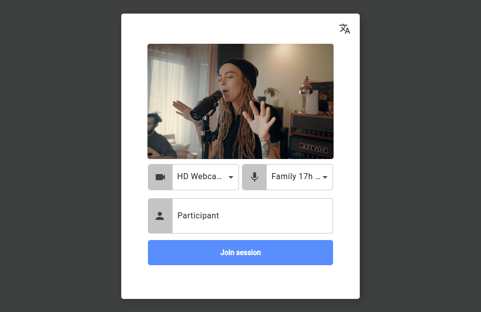
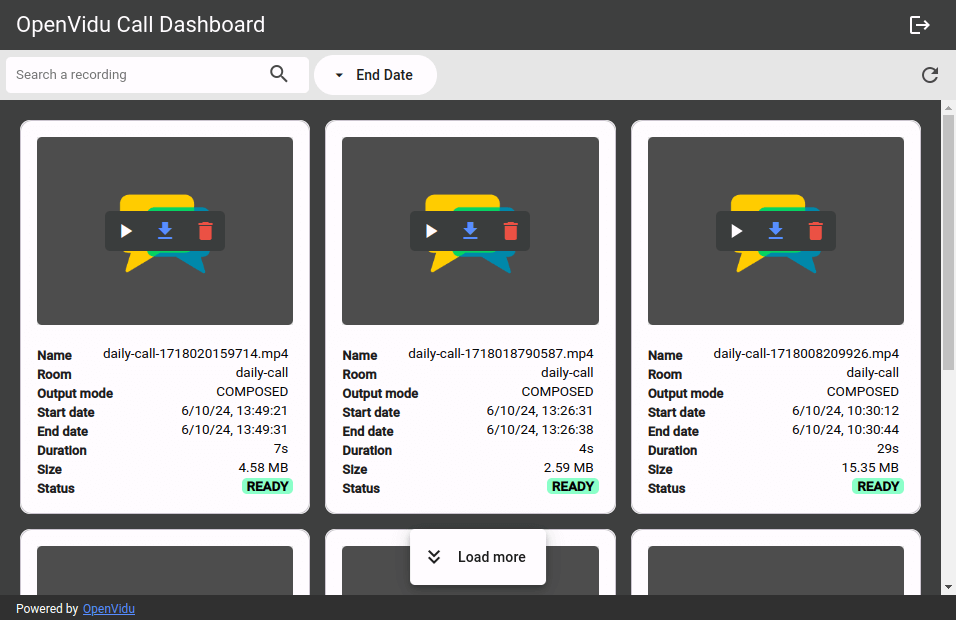

---
hide:
  - toc
  - footer
---

<h1 class="ov-call-commercial-title"> OpenVidu Call </h1>

<h3 class="ov-call-commercial-subtitle">
The videoconference application built on top of OpenVidu
</h3>

-   :material-rocket-launch-outline:{ .ov-call-commercial-icon .middle } __Ready to use__{ .ov-call-commercial-card-title }

	---

    Experience all the **features you need** only with a click: multiparty videoconferences, screen sharing, chat, and more

	[Try it](https://demos.openvidu.io/openvidu-call/){target="_blank" .md-button .ov-call-to-action-btn}

-   :material-brush:{ .ov-call-commercial-icon .middle } __Fully Customizable__{ .ov-call-commercial-card-title }

	---
	Built on an **open-source license**, OpenVidu Call offers full customization to fit your needs

	[Customize it](./docs.md){ .md-button .ov-call-to-action-btn}

-   :material-server:{ .ov-call-commercial-icon .middle } __Deploy Anywhere__{ .ov-call-commercial-card-title }

	---

    Install OpenVidu Call **on your own servers** or any **cloud provider**.

	[Install it](../self-hosting/deployment-types.md){ .md-button .ov-call-to-action-btn }

<h2 class="ov-call-commercial-features-title"> Features </h2>
---
<!-- feature card -->

-	:material-lock:{ .ov-call-commercial-icon .middle } __Secure room access__{ .ov-call-commercial-card-title }

	OpenVidu Call offers a straightforward **authentication system** enabling users to join rooms with a single click.

	Additionally, it automatically generates **unique room names**, providing a distinct URL for each room. This allows users to easily share the URL with friends and colleagues to join the room.

{.round-corners}

---

<!-- feature card -->

{.round-corners}

-	:fontawesome-solid-gear:{ .ov-call-commercial-icon .middle } __Setting up your room__{ .ov-call-commercial-card-title }

	OpenVidu Call provides users with various options and **configurations** to personalize their experience **before and after entering a room**.

	This includes testing and **selecting audio and video devices**, choosing a nickname, and **adjusting the preferred language**.

---

<!-- feature card -->

-	:material-account-group:{ .ov-call-commercial-icon .middle } __Multi-party videoconference__{ .ov-call-commercial-card-title }

	OpenVidu Call offers a **multi-party videoconference** feature that allows users to connect with multiple participants in a single room.

	Flexible and easy to use, it allows you to see all participants at once, making it ideal for team meetings, webinars, and more.

{.round-corners}

---

<!-- feature card -->

<video class="round-corners"  src="../../assets/videos/ov-call-chat.mp4" defer muted playsinline autoplay loop async></video>

-	:material-chat:{ .ov-call-commercial-icon .middle } __Chatting time!__{ .ov-call-commercial-card-title }

	Chatting is an essential feature for any videoconference application.

	OpenVidu Call offers a **chat feature** that allows users to communicate with each other during a videoconference.

---

<!-- feature card -->

-	:material-record-rec:{ .ov-call-commercial-icon .middle } __Recording your sessions for posterity__{ .ov-call-commercial-card-title }

	Recording your videoconference sessions is a great way to keep a **record of important meetings**, webinars, and more.

	Record, playback, download and share your videoconference sessions with OpenVidu Call's **recording feature**.

<video class="round-corners"  src="../../assets/videos/ov-call-recording.mp4" defer muted playsinline autoplay loop async></video>

---
<!-- feature card -->

<video class="round-corners"  src="../../assets/videos/ov-call-vb.mp4" defer muted playsinline autoplay loop async></video>

-	:material-blur:{ .ov-call-commercial-icon .middle } __Background effects__{ .ov-call-commercial-card-title }

	Virtual backgrounds are a fun and useful feature that allows users to **change their background** during a videoconference.

	OpenVidu Call offers a **virtual background feature** that allows users to choose from a variety of backgrounds for **enhancing privacy and professionalism**.

---

<!-- feature card -->

-	:material-note-search:{ .ov-call-commercial-icon .middle } __Recording Management__{ .ov-call-commercial-card-title }

	Allow administrators to manage recordings, including deleting, downloading, and sharing them.

	The **admin dashboard** provides a simple interface to manage all recordings.

{.round-corners}

  <h3 style="text-align: center">
	And much more...
  </h3>

-   :material-broadcast:{ .ov-call-commercial-icon .middle } __Broadcasting (Live Streaming)__

    Allows **live streaming** of the video conference to platforms like **YouTube**, **Twitch**, and others **for a wider audience**

-   :material-connection:{ .ov-call-commercial-icon .middle } __Automatic Reconnection__

    Ensures that **users are automatically reconnected** to the call in case of temporary network issues

-   :material-account-voice:{ .ov-call-commercial-icon .middle } __Speaker Detection__

    **Highlights the active speaker automatically**, making it easier for participants to follow the conversation

-   :material-monitor-share:{ .ov-call-commercial-icon .middle } __Screen Sharing__

    ---

    Allow users to **share their screen and their camera at the same time** with other participants in the call

-   :material-fullscreen:{ .ov-call-commercial-icon .middle } __Fullscreen Mode__

	---

	Offers a fullscreen mode for users to **focus on the videoconference without any distractions**

-   :material-view-grid-plus:{ .ov-call-commercial-icon  .middle } __Powerful Layout__

    Offers a powerful layout where users can **view multiple participants simultaneously** in a **grid layout** or **focus on a single participant**

---

  <h2>
	All the features you need to quickly build your perfect real-time application
  </h2>

[Try it](https://demos.openvidu.io/openvidu-call/){target="_blank" .md-button .ov-call-to-action-btn }

[Customize it](./docs.md){ .md-button .ov-call-to-action-btn }

[Install it](../self-hosting/deployment-types.md){ .md-button .ov-call-to-action-btn }

