# OpenVidu Elastic: AWS Configuration and Administration

The deployment of OpenVidu Elastic on AWS is automated using AWS CloudFormation, with Media Nodes managed within an [Auto Scaling Group](https://docs.aws.amazon.com/autoscaling/ec2/userguide/auto-scaling-groups.html){:target=_blank}. This group dynamically adjusts the number of instances based on a target average CPU utilization. Internally, the AWS deployment mirrors the on-premises setup, allowing you to follow the same administration and configuration guidelines provided in the [On Premises Elastic](../on-premises/admin.md) documentation. However, there are specific considerations unique to the AWS environment that are worth taking into account.

## Cluster Shutdown and Startup

The Master Node is an EC2 instance, while the Media Nodes are part of an Auto Scaling Group. The process for starting and stopping these components differs. The following sections detail the procedures.

=== "Shutdown the Cluster"

    To shut down the cluster, you need to stop the Media Nodes first and then stop the Master Node. This way, any ongoing session will not be interrupted.

    1. Navigate to the [CloudFormation Dashboard](https://console.aws.amazon.com/cloudformation/home){:target=_blank} on AWS.
    2. Select the CloudFormation Stack that you used to deploy OpenVidu Elastic.
    3. In the _"Resources"_ tab, locate the resource with the logical ID: **`OpenViduMediaNodeASG`**, and click on it to go to the Auto Scaling Group Dashboard with the Auto Scaling Group of the Media Nodes selected.
        <figure markdown>
        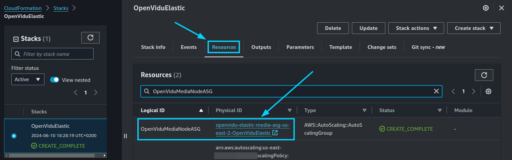{ .svg-img .dark-img }
        </figure>
    4. Click on _"Actions > Edit"_.
        <figure markdown>
        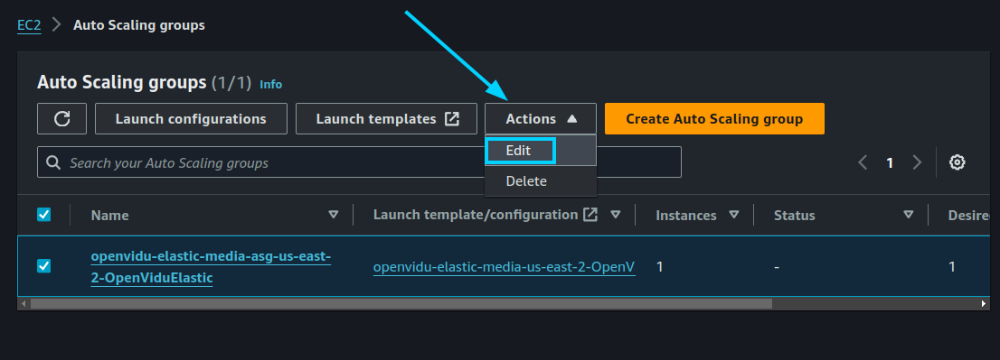{ .svg-img .dark-img }
        </figure>
    5. Set the _"Desired capacity"_, _"Min desired capacity"_, and _"Max desired capacity"_ to 0, and click on _"Update"_.
        <figure markdown>
        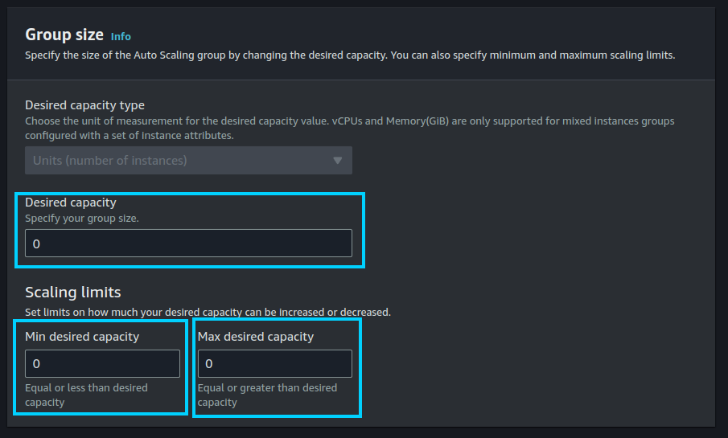{ .svg-img .dark-img }
        </figure>
    6. Wait until the _"Instance Management"_ tab shows that there are no instances in the Auto Scaling Group.
        <figure markdown>
        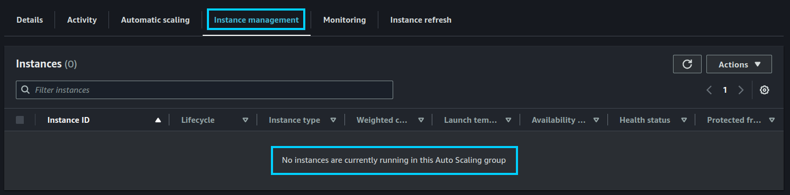{ .svg-img .dark-img }
        </figure>

        !!!warning
            It may happen that some instances are still in the _"Terminating:Wait"_ lifecycle state after setting the desired capacity to 0. This is because the Auto Scaling Group waits for the instances to finish processing any ongoing room, ingress, or egress operations before terminating them. This can take a few minutes. If you want to force the termination of the instances, you can manually terminate them from the EC2 Dashboard.

    7. After confirming that all Media Node instances are terminated, go back to the CloudFormation Stack and locate the resource with the logical ID: **`OpenViduMasterNode`**. Click on it to go to the EC2 Dashboard with the Master Node instance selected.
        <figure markdown>
        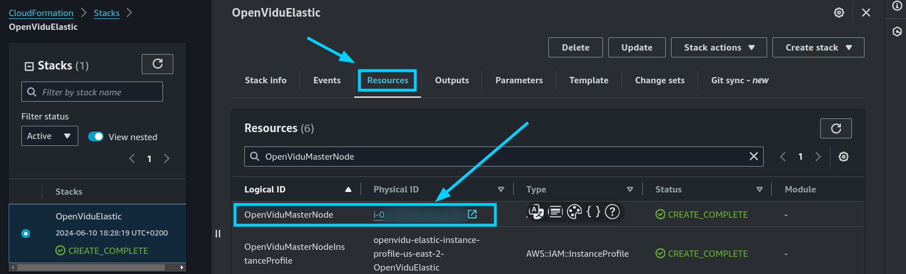{ .svg-img .dark-img }
        </figure>
    8. Right-click on the instance and select _"Stop instance"_.
        <figure markdown>
        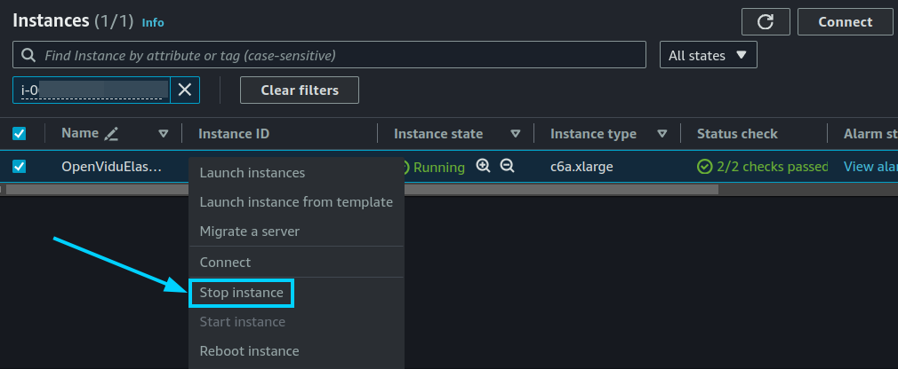{ .svg-img .dark-img }
        </figure>

=== "Startup the Cluster"

    To start the cluster, we recommend starting the Master Node first and then the Media Nodes.

    1. Navigate to the [CloudFormation Dashboard](https://console.aws.amazon.com/cloudformation/home){:target=_blank} on AWS.
    2. Select the CloudFormation Stack that you used to deploy OpenVidu Elastic.
    3. Locate the resource with the logical ID: **`OpenViduMasterNode`**. Click on it to go to the EC2 Dashboard with the Master Node instance selected.
        <figure markdown>
        { .svg-img .dark-img }
        </figure>
    4. Right-click on the instance and select _"Start instance"_.
        <figure markdown>
        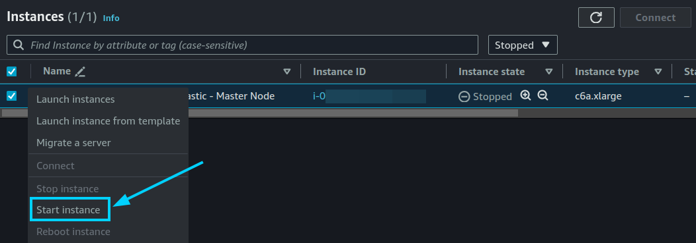{ .svg-img .dark-img }
        </figure>
    5. Wait until the instance is running.
    6. Go back to the CloudFormation Stack and locate the resource with the logical ID: **`OpenViduMediaNodeASG`**. Click on it to go to the Auto Scaling Group Dashboard with the Auto Scaling Group of the Media Nodes selected.
        <figure markdown>
        { .svg-img .dark-img }
        </figure>
    7. Click on _"Actions > Edit"_.
        <figure markdown>
        { .svg-img .dark-img }
        </figure>
    8. Set the _"Desired capacity"_, _"Min desired capacity"_, and _"Max desired capacity"_ to the desired number of Media Nodes, and click on _"Update"_. In this example, we set the desired capacity to 2.
        <figure markdown>
        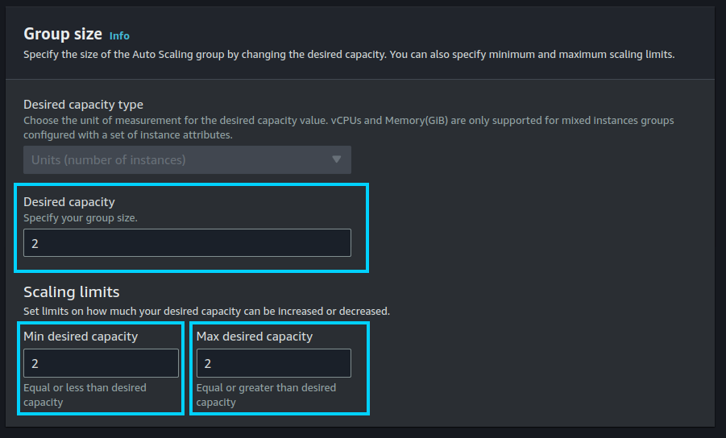{ .svg-img .dark-img }
        </figure>
    9. Wait until the _"Instance Management"_ tab shows that there are the desired number of instances in the Auto Scaling Group.
        <figure markdown>
        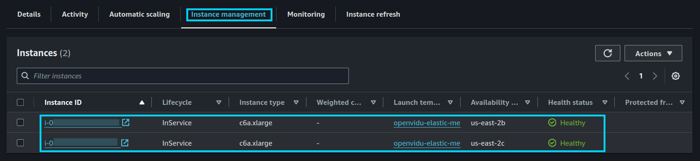{ .svg-img .dark-img }
        </figure>


## Change the instance type

It is possible to change the instance type of both the Master Node and the Media Nodes. However, since the Media Nodes are part of an Auto Scaling Group, the process differs. The following section details the procedures.

=== "Master Nodes"

    !!!warning
        This procedure requires downtime, as it involves stopping the Master Node.

    1. [Shutdown the cluster](#shutdown-the-cluster).

        !!! info
            You can stop only the Master Node instance to change its instance type, but it is recommended to stop the whole cluster to avoid any issues.
    2. Go to the CloudFormation Stack and locate the resource with the logical ID: **`OpenViduMasterNode`**. Click on it to go to the EC2 Dashboard with the Master Node instance selected.
        <figure markdown>
        { .svg-img .dark-img }
        </figure>
    3. Right-click on the instance and select _"Instance Settings > Change Instance Type"_.
        <figure markdown>
        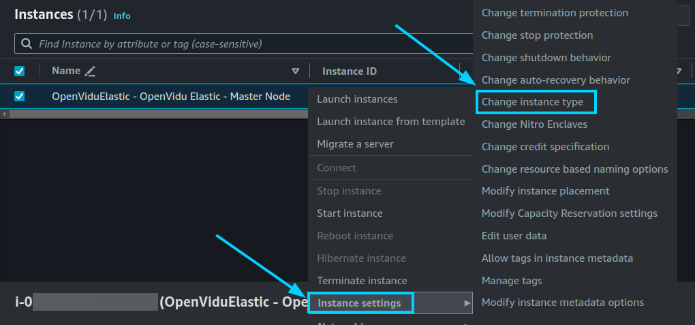{ .svg-img .dark-img }
        </figure>
    4. Select the new instance type and click on _"Apply"_.
    5. [Start the cluster](#startup-the-cluster).

=== "Media Nodes"

    1. Go to the [CloudFormation Dashboard](https://console.aws.amazon.com/cloudformation/home){:target=_blank} on AWS.
    2. Select the CloudFormation Stack that you used to deploy OpenVidu Elastic.
    3. Locate the resource with the logical ID: **`OpenViduMediaNodeLaunchTemplate`**. Click on it to go to the Launch Template Dashboard with the Launch Template of the Media Nodes selected.
        <figure markdown>
        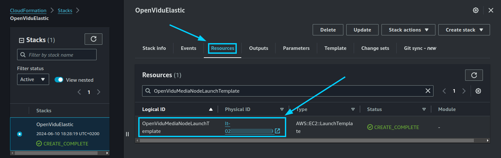{ .svg-img .dark-img }
        </figure>
    4. Click on _"Actions > Modify template (Create new version)"_.
        <figure markdown>
        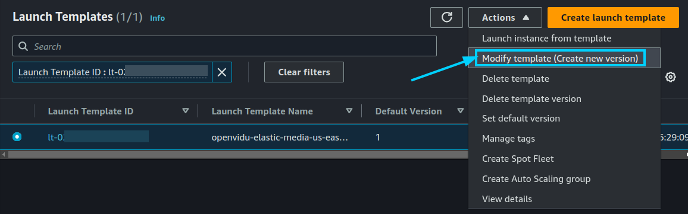{ .svg-img .dark-img }
        </figure>
    5. In the _"Instance type"_ section, select the new instance type and click on _"Create template version"_.
        <figure markdown>
        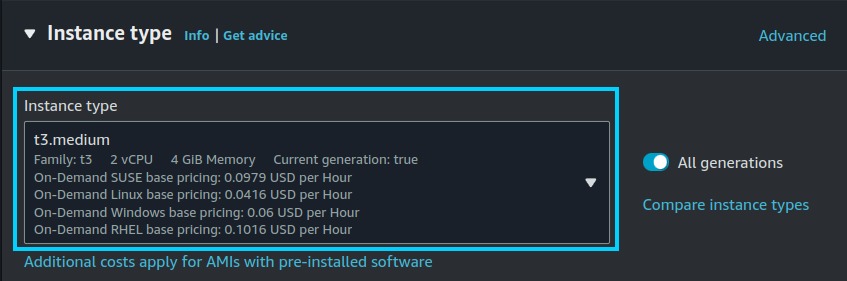{ .svg-img .dark-img }
        </figure>
    6. Go to the CloudFormation Stack and locate the resource with the logical ID: **`OpenViduMediaNodeASG`**. Click on it to go to the Auto Scaling Group Dashboard with the Auto Scaling Group of the Media Nodes selected.
        <figure markdown>
        { .svg-img .dark-img }
        </figure>
    7. Click on _"Actions > Edit"_.
        <figure markdown>
        { .svg-img .dark-img }
        </figure>
    8. In the Launch Template section, select the new version of the launch template we just created at step 5, which is the highest version number.

        Then, click on _"Update"_.

        !!!info
            By configuring _"Latest"_ as the launch template version, you no longer need to update the Auto Scaling Group every time you modify the launch template. The Auto Scaling Group will automatically use the latest version of the launch template.

        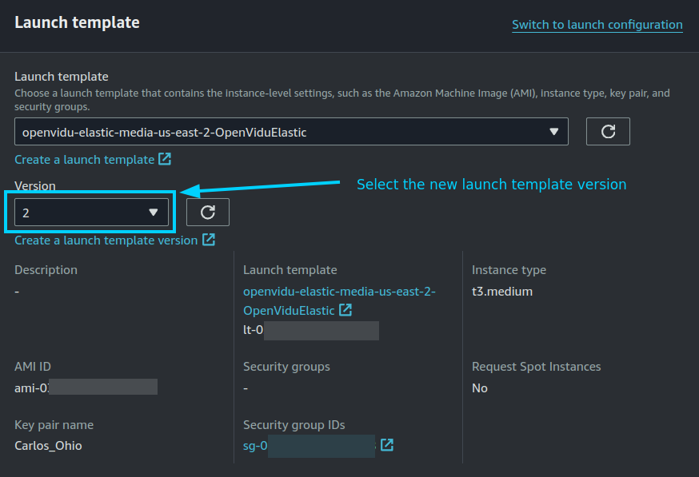{ .svg-img .dark-img }

    9. Terminate the old instances manually from the EC2 Dashboard if you want to force the termination of the instances. New instances will be launched with the new instance type.

        !!!info
            If you want to avoid downtime, you can wait until the Auto Scaling Group replaces the old instances with the new ones. But you will need to increase the desired capacity to force the replacement of the instances and then decrease it to the desired number of instances.

## Media Nodes Autoscaling Configuration

To configure the Auto Scaling settings for the Media Nodes, follow the steps outlined below. This configuration allows you to set the parameters that control how the Auto Scaling Group will scale based on the target average CPU utilization.

=== "Media Nodes Autoscaling Configuration"

    1. Navigate to the [CloudFormation Dashboard](https://console.aws.amazon.com/cloudformation/home){:target=_blank} on AWS.
    2. Select the CloudFormation Stack that you used to deploy OpenVidu Elastic.
    3. In the _"Resources"_ tab, locate the resource with the logical ID: **`OpenViduMediaNodeASG`** and click on it to go to the Auto Scaling Group Dashboard.
        <figure markdown>
        { .svg-img .dark-img }
        </figure>
    4. Click on _"Actions > Edit"_.
        <figure markdown>
        { .svg-img .dark-img }
        </figure>
    5. To configure scaling policies, navigate to the _"Automatic scaling"_ tab within the Auto Scaling Group Dashboard, select the unique _"Target tracking scaling"_ autoscaling policy, and click on _"Actions > Edit"_.
        <figure markdown>
        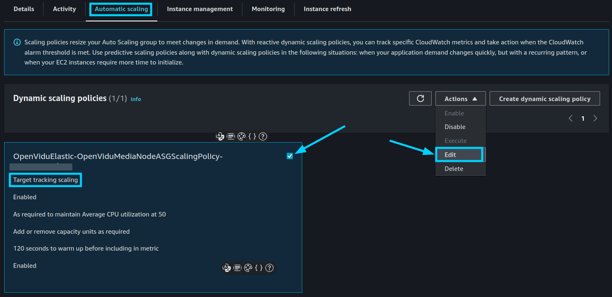{ .svg-img .dark-img }
        </figure>
    6. It will open a panel where you can configure multiple parameters. In this example, we set the target average CPU utilization to 30%. Then, click on _"Update"_.
        <figure markdown>
        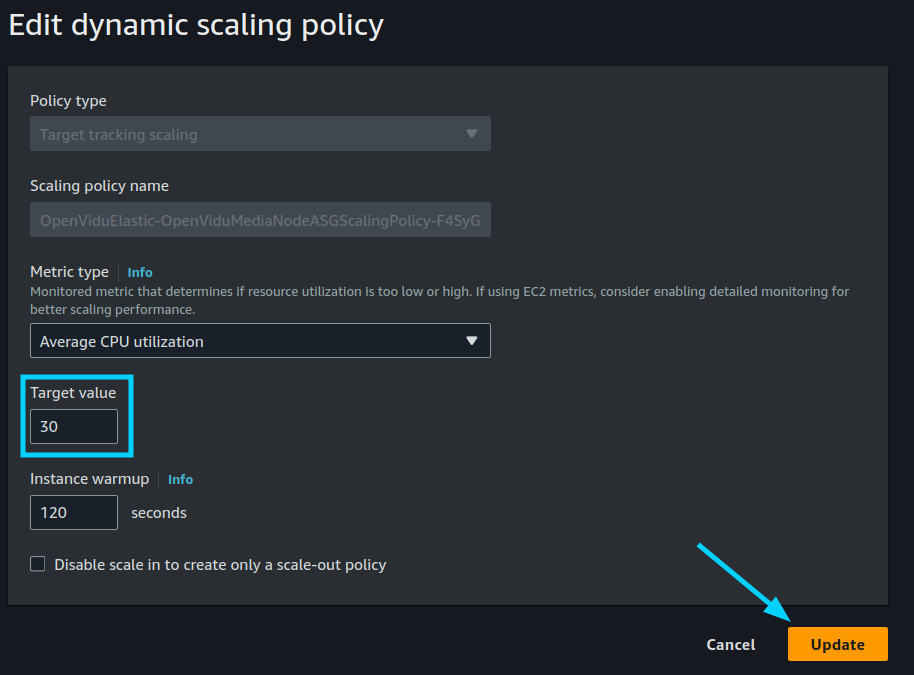{ .svg-img .dark-img }
        </figure>

        !!!info
            OpenVidu Elastic is by default configured with a _"Target tracking scaling"_ policy that scales based on the target average CPU utilization, however, you can configure different autoscaling policies according to your needs. For more information on the various types of autoscaling policies and how to implement them, refer to the [AWS Auto Scaling documentation](https://docs.aws.amazon.com/autoscaling/ec2/userguide/as-scale-based-on-demand.html){:target=_blank}.

## Fixed Number of Media Nodes

If you need to maintain a fixed number of Media Nodes instead of allowing the Auto Scaling Group to dynamically adjust based on CPU utilization, you can configure the desired capacity settings accordingly. Follow the steps below to set a fixed number of Media Nodes:

=== "Set Fixed Number of Media Nodes"

    1. Navigate to the [CloudFormation Dashboard](https://console.aws.amazon.com/cloudformation/home){:target=_blank} on AWS.
    2. Select the CloudFormation Stack that you used to deploy OpenVidu Elastic.
    3. In the _"Resources"_ tab, locate the resource with the logical ID: **`OpenViduMediaNodeASG`** and click on it to go to the Auto Scaling Group Dashboard.
        <figure markdown>
        { .svg-img .dark-img }
        </figure>
    4. Click on _"Actions > Edit"_.
        <figure markdown>
        { .svg-img .dark-img }
        </figure>
    5. Set the _"Desired capacity"_, _"Min desired capacity"_, and _"Max desired capacity"_ to the fixed number of Media Nodes you require, and click on _"Update"_. In this example, we set the desired capacity to 2.
        <figure markdown>
        { .svg-img .dark-img }
        </figure>
    6. Wait until the _"Instance Management"_ tab shows that the Auto Scaling Group has the fixed number of instances running.
        <figure markdown>
        { .svg-img .dark-img }
        </figure>


## Configuration Management

This section explains how to manage and update the configuration settings for your OpenVidu Elastic deployment. It is divided into three parts:

1. **Configuring CloudFormation YAML for Node Services Configuration**: Details how to pre-configure settings in the CloudFormation template to avoid manual interventions post-deployment.
2. **Global Configuration**: Covers parameters that affect the entire cluster when the CloudFormation stack is already deployed.
3. **Node Services Configuration**: Focuses on settings specific to Master and Media Nodes services when the CloudFormation stack is already deployed.

### Configuring CloudFormation YAML for Node Services Configuration

To avoid manual intervention after deployment, you can pre-configure the node services configuration directly in the CloudFormation YAML template. This ensures that the necessary configurations are applied automatically upon deployment.

=== "Master Node"

    1. Get the CloudFormation YAML template used to deploy [OpenVidu Elastic on AWS](../aws/install.md).
    2. Locate the section defining the Launch Template for the Master Node and update the `UserData` property with the required configuration parameters. The section looks like this:

        ```yaml
        OpenViduMasterNode:
            Type: AWS::EC2::Instance
            Properties:
                UserData:
                    Fn::Base64: !Sub |
                        #!/bin/bash
                        ...
                        ...
                        # Install OpenVidu
                        /usr/local/bin/install.sh || { echo "[OpenVidu] error installing OpenVidu"; exit 1; }

                        ######### APPLY CUSTOM CONFIGURATIONS #########
                        # If you want to apply any modification to the configuration files
                        # of the OpenVidu services at /opt/openvidu, you can do it here.
                        # Examples:
                        #
                        # - Change minio public port
                        # yq eval '.apps.http.servers.minio.listen[0] = ":9001"' -i /opt/openvidu/config/caddy.yaml
                        #
                        # - Disable dashboard access
                        # yq eval 'del(.apps.http.servers.public.routes[] | \
                        #  select(.handle[]?.handler == "subroute" and \
                        #  .handle[].routes[].handle[].strip_path_prefix == "/dashboard"))' \
                        #  -i /opt/openvidu/config/caddy.yaml


                        ######### END CUSTOM CONFIGURATIONS #########

                        # Start OpenVidu
                        systemctl start openvidu || { echo "[OpenVidu] error starting OpenVidu"; exit 1; }
                        ...
                        ...

        ```

        The area between **`APPLY CUSTOM CONFIGURATIONS`** and **`END CUSTOM CONFIGURATIONS`** is where you can add your custom configuration commands. You can use [`yq`](https://mikefarah.gitbook.io/yq){:target=_blank} to modify the configuration files of the OpenVidu services. The example shows how to change the `minio` public port and how to disable dashboard access in the `caddy.yaml` configuration file.

    3. Save the YAML file and use it to deploy your CloudFormation stack. This will apply the Master Node configuration automatically during the deployment process.

=== "Media Nodes"

    1. Get the CloudFormation YAML template used to deploy [OpenVidu Elastic on AWS](../aws/install.md).
    2. Locate the section defining the Launch Template for the Media Nodes and update the `UserData` property with the required configuration parameters. The section looks like this:

        ```yaml
        OpenViduMediaNodeLaunchTemplate:
            Type: "AWS::EC2::LaunchTemplate"
            Properties:
            LaunchTemplateData:
                UserData:
                    Fn::Base64: !Sub |
                        #!/bin/bash
                        ...
                        ...
                        # Install OpenVidu #
                        /usr/local/bin/install.sh || { echo "[OpenVidu] error installing OpenVidu"; /usr/local/bin/set_as_unhealthy.sh; exit 1; }

                        ######### APPLY CUSTOM CONFIGURATIONS #########
                        # If you want to apply any modification to the configuration files
                        # of the OpenVidu services at /opt/openvidu, you can do it in this section.
                        # Examples:
                        #
                        # - Announce specific IP address for the Media Node
                        # yq eval '.rtc.node_ip = 1.2.3.4' -i /opt/openvidu/config/livekit.yaml
                        #
                        # - Add webhooks to livekit
                        # yq eval '.webhook.urls += ["http://new-endpoint.example.com/webhook"]' -i /opt/openvidu/config/livekit.yaml


                        ######### END CUSTOM CONFIGURATIONS #########

                        # Start OpenVidu
                        systemctl start openvidu || { echo "[OpenVidu] error starting OpenVidu"; /usr/local/bin/set_as_unhealthy.sh; exit 1; }
        ```

        The area between **`APPLY CUSTOM CONFIGURATIONS`** and **`END CUSTOM CONFIGURATIONS`** is where you can add your custom configuration commands. You can use [`yq`](https://mikefarah.gitbook.io/yq){:target=_blank} to modify the configuration files of the OpenVidu services. The example shows how to change the `rtc.node_ip` parameter and how to add a webhook to the `livekit.yaml` configuration file.

    3. Save the YAML file and use it to deploy your CloudFormation stack. This will apply the node services configuration automatically during the deployment process.

By pre-configuring the CloudFormation template, you streamline the deployment process and reduce the need for post-deployment manual configuration.

### Global Configuration

The global configuration parameters for the OpenVidu Elastic deployment are stored in a secret resource deployed by the CloudFormation stack. These parameters can affect the configuration of all the nodes in the cluster. To update any of these parameters, follow the steps below:

=== "Update Global Configuration Parameters"

    1. Navigate to the [CloudFormation Dashboard](https://console.aws.amazon.com/cloudformation/home){:target=_blank} on AWS.
    2. Select the CloudFormation Stack that you used to deploy OpenVidu Elastic.
    3. In the _"Resources"_ tab, locate the resource with the logical ID: **`OpenViduSharedInfo`** and click on it to view the secret in AWS Secrets Manager.
        <figure markdown>
        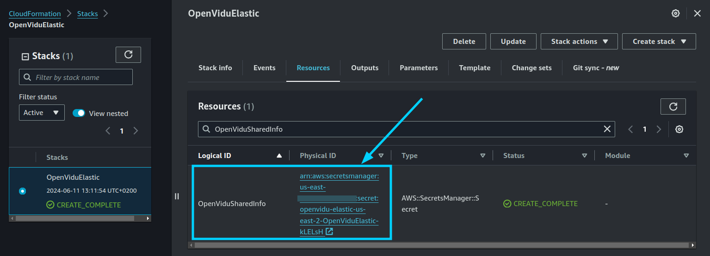{ .svg-img .dark-img }
        </figure>
    4. Click on _"Retrieve secret value"_ to view the parameters.
        <figure markdown>
        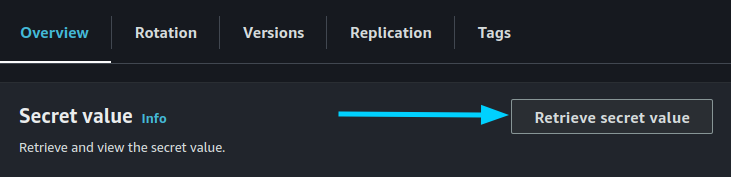{ .svg-img .dark-img }
        </figure>
    5. Edit the desired parameters within the secret. For example, you can change the `RTC_ENGINE` parameter to `pion` or `mediasoup` depending on the WebRTC engine you want to use. Just click on _"Edit"_, modify the value, and click on _"Save"_.
        <figure markdown>
        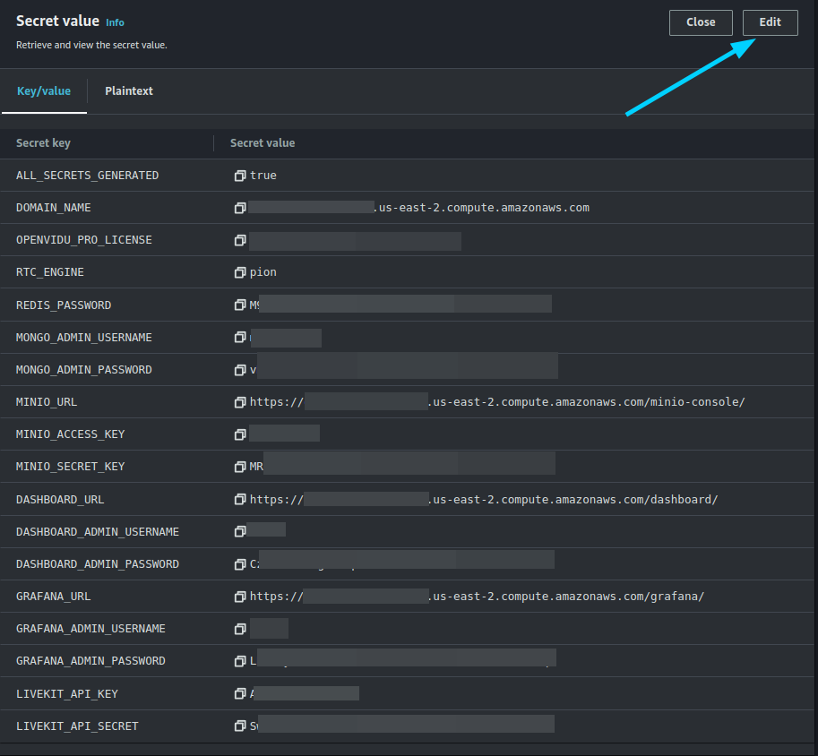{ .svg-img .dark-img }
        </figure>
    6. To apply the changes, stop the cluster and then start it again following the procedures outlined in the [Cluster Shutdown and Startup](#cluster-shutdown-and-startup) section.

### Node Services Configuration

The configuration for individual node services can be managed through different methods depending on the node type.

=== "Master Node"

    The Master Node's configuration can be directly modified on the internal machine since it is an EC2 instance. To update the configuration:

    1. Connect to the Master Node EC2 instance using SSH.
    2. Edit the configuration files as necessary. Check the [On Premises Elastic](../on-premises/admin.md#master-node) documentation related to the Master Node configuration.

    Once the changes are made, restart the OpenVidu Server to apply the new configuration.

    ```bash
    sudo systemctl restart openvidu
    ```

    !!!warning
        Take into account that some changes may require modifying the Master Nodes configuration as well. Check the [On Premises Elastic Advanced Configuration](../on-premises/admin.md#advanced-configuration) for more information.

=== "Media Node"

    Media Node configurations require changes to be made in the Launch Template _"User Data"_ section. To update the configuration:

    1. Navigate to the [CloudFormation Dashboard](https://console.aws.amazon.com/cloudformation/home){:target=_blank} on AWS.
    2. Select the CloudFormation Stack that you used to deploy OpenVidu Elastic.
    3. Locate the resource with the logical ID: **`OpenViduMediaNodeLaunchTemplate`**. Click on it to go to the Launch Template Dashboard with the Launch Template of the Media Nodes selected.
        <figure markdown>
        { .svg-img .dark-img }
        </figure>
    4. Click on _"Actions > Modify template (Create new version)"_.
        <figure markdown>
        { .svg-img .dark-img }
        </figure>
    5. Go to the _"Advanced details"_ section and modify the _"User data"_ field with the new configuration. You can modify the configuration parameters of the services running on the Media Nodes following the same script structure as the one used in the [Automatic installation and configuration of nodes](../on-premises/admin.md#automatic-installation-and-configuration-of-nodes) for the Media Nodes. When you finish, click on _"Create template version"_.
        <figure markdown>
        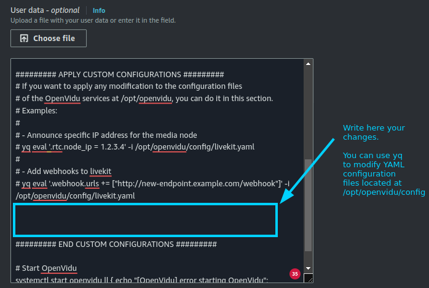{ .svg-img .dark-img }
        </figure>
    6. Go to the CloudFormation Stack and locate the resource with the logical ID: **`OpenViduMediaNodeASG`**. Click on it to go to the Auto Scaling Group Dashboard with the Auto Scaling Group of the Media Nodes selected.
        <figure markdown>
        { .svg-img .dark-img }
        </figure>
    7. Click on _"Actions > Edit"_.
        <figure markdown>
        { .svg-img .dark-img }
        </figure>
    8. In the Launch Template section, select the new version of the launch template we just created at step 5, which is the highest version number. Then, click on _"Update"_.

        !!!info
            By configuring _"Latest"_ as the launch template version, you no longer need to update the Auto Scaling Group every time you modify the launch template. The Auto Scaling Group will automatically use the latest version of the launch template.

        { .svg-img .dark-img }

    9. Terminate the old instances manually from the EC2 Dashboard if you want to force the termination of the instances. New instances will be launched with the new configuration.

        !!!warning
            This process requires downtime, as it involves terminating the old instances and launching new ones with the updated configuration.
