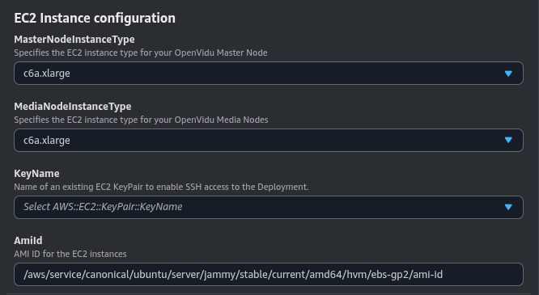
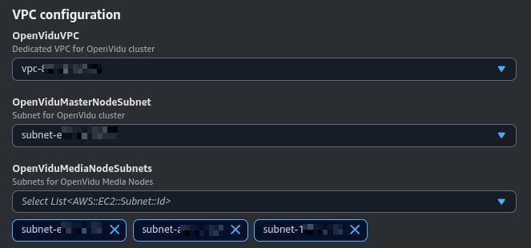

# OpenVidu Elastic Installation: AWS

!!!info
    OpenVidu Elastic is part of **OpenVidu <span class="openvidu-tag openvidu-pro-tag">PRO</span>**. Before deploying, you need to [create an OpenVidu account](https://openvidu.io/account){:target=_blank} to get your license key.
    There's a 15-day free trial waiting for you!

This section contains the instructions to deploy a production-ready OpenVidu Elastic deployment in AWS. Deployed services are the same as the [On Premises Elastic Installation](../on-premises/install.md) but automate the process with AWS CloudFormation.

First of all, import the template in the AWS CloudFormation console. You can click the following button...

<div class="center-align" markdown>
[Deploy OpenVidu Elastic in :fontawesome-brands-aws:{style="font-size:32px; margin-left: 7px"}](https://console.aws.amazon.com/cloudformation/home?#/stacks/new?stackName=OpenViduElastic&templateURL=https://s3.eu-west-1.amazonaws.com/get.openvidu.io/pro/elastic/latest/aws/cf-openvidu-elastic.yaml){.md-button .deploy-button target="_blank"}
</div>

...or access your [AWS CloudFormation console](https://console.aws.amazon.com/cloudformation/home?#/stacks/new){:target=_blank} and manually set this S3 URL in the `Specify template` section:

```
https://s3.eu-west-1.amazonaws.com/get.openvidu.io/pro/elastic/latest/aws/cf-openvidu-elastic.yaml
```

=== "Architecture overview"

    This is how the architecture of the deployment looks:

    <figure markdown>
    { .svg-img .dark-img }
    <figcaption>OpenVidu Elastic AWS Architecture</figcaption>
    </figure>

    - The Master Node acts as a Load Balancer, managing the traffic and distributing it among the Media Nodes and deployed services in the Master Node.
    - The Master Node has its own Caddy server acting as a Layer 4 (for TURN with TLS and RTMPS) and Layer 7 (for OpenVidu Dashboard, OpenVidu Call, etc., APIs) reverse proxy.
    - WebRTC traffic (SRTP/SCTP/STUN/TURN) is routed directly to the Media Nodes.
    - An autoscaling group of Media Nodes is created to scale the number of Media Nodes based on the system load.

## CloudFormation Parameters

Depending on your needs, you need to fill in the following CloudFormation parameters:

--8<-- "docs/docs/self-hosting/shared/aws-ssl-domain.md"

### OpenVidu Elastic Configuration

In this section, you need to specify some properties needed for the OpenVidu Elastic deployment.

=== "OpenVidu Elastic Configuration"

    The parameters in this section might appear as follows:

    

    Make sure to provide the **OpenViduLicense** parameter with the license key. If you don't have one, you can request one [here](https://openvidu.io/account){:target=_blank}.

    For the **RTCEngine** parameter, you can choose between **Pion** (the engine used by LiveKit) and **Mediasoup** (experimental).

    --8<-- "docs/docs/self-hosting/shared/mediasoup-warning.md"

### EC2 Instance Configuration

You need to specify some properties for the EC2 instances that will be created.

=== "EC2 Instance configuration"

    The parameters in this section may look like this:

    

    Simply select the type of instance you want to deploy at **MasterNodeInstanceType** and **MediaNodeInstanceType**, the SSH key you want to use to access the machine at **KeyName**, and the Amazon Image ID (AMI) to use at **AmiId**.

    By default, the parameter **AmiId** is configured to use the latest LTS Ubuntu AMI, so ideally you don’t need to modify this.

### Media Nodes Autoscaling Group Configuration

The number of Media Nodes can scale up or down based on the system load. You can configure the minimum and maximum number of Media Nodes and a target CPU utilization to trigger the scaling up or down.

=== "Media Nodes Autoscaling Group Configuration"

    The parameters in this section may look like this:

    

    The **InitialNumberOfMediaNodes** parameter specifies the initial number of Media Nodes to deploy. The **MinNumberOfMediaNodes** and **MaxNumberOfMediaNodes** parameters specify the minimum and maximum number of Media Nodes that you want to be deployed.

    The **ScaleTargetCPU** parameter specifies the target CPU utilization to trigger the scaling up or down. The goal is to keep the CPU utilization of the Media Nodes close to this value. The autoscaling policy is based on [Target Tracking Scaling Policy](https://docs.aws.amazon.com/autoscaling/application/userguide/target-tracking-scaling-policy-overview.html){:target=_blank}.

### VPC Configuration

In this section, you need to specify the VPC and Subnet configuration for the deployment.

=== "VPC Configuration"

    The parameters in this section may look like this:

    

    The **OpenViduVPC** parameter specifies the VPC where the deployment will be created.

    The **OpenViduMasterNodeSubnet** and **OpenViduMediaNodeSubnet** parameters specify the subnets where the Master and Media Nodes will be deployed. All of them must be in the previously specified **OpenViduVPC**.

    !!!warning
        You must use public subnets for the Master Nodes and Media Nodes and have enabled the auto-assign public IP option.

--8<-- "docs/docs/self-hosting/shared/aws-turn-domain.md"

## Deploying the Stack

When you are ready with your CloudFormation parameters, just click on _"Next"_, specify in _"Stack failure options"_ the option _"Preserve successfully provisioned resources"_ to be able to troubleshoot the deployment in case of error, click on _"Next"_ again, and finally _"Submit"_.

When everything is ready, you will see the following links in the _"Outputs"_ section of CloudFormation:

=== "CloudFormation Outputs"

    

## Deployment Credentials

The Output Key **ServicesAndCredentials** of the [previous section](#deploying-the-stack) points to an AWS Secret Manager secret that contains all URLs and credentials to access the services deployed. You can access the secret by clicking on the link in the **Output Value** column.

Then, click on **Retrieve secret value** to get the JSON with all the information.

<div class="grid-container">

<div class="grid-50"><p><a class="glightbox" href="/assets/images/self-hosting/elastic/aws/1-secrets-retrieve.png" data-type="image" data-width="100%" data-height="auto" data-desc-position="bottom"></a></p></div>

<div class="grid-50"><p><a class="glightbox" href="/assets/images/self-hosting/elastic/aws/2-secrets.png" data-type="image" data-width="100%" data-height="auto" data-desc-position="bottom"></a></p></div>

</div>

To point your applications to your OpenVidu deployment, check the values of the JSON secret. All access credentials of all services are defined in this object.

Your authentication credentials and URL to point your applications would be:

- Applications developed with LiveKit SDK:
    - **URL**: The value in `.env` of `DOMAIN_NAME` as a URL. It could be `wss://openvidu.example.io/` or `https://openvidu.example.io/` depending on the SDK you are using.
    - **API Key**: The value in `.env` of `LIVEKIT_API_KEY`
    - **API Secret**: The value in `.env` of `LIVEKIT_API_SECRET`

- Applications developed with OpenVidu v2:
    - **URL**: The value in `.env` of `DOMAIN_NAME` as a URL. For example, `https://openvidu.example.io/`
    - **Username**: `OPENVIDUAPP`
    - **Password**: The value in `.env` of `LIVEKIT_API_SECRET`

## Troubleshooting Initial CloudFormation Stack Creation

--8<-- "docs/docs/self-hosting/shared/aws-troubleshooting.md"

4. If everything seems fine, check the [status](../on-premises/admin.md#checking-the-status-of-services) and the [logs](../on-premises/admin.md#checking-logs) of the installed OpenVidu services in the Master Node and Media Nodes.

## Configuration and administration

When your CloudFormation stack reaches the **`CREATE_COMPLETE`** status, your OpenVidu Elastic deployment is ready to use. You can check the [Configuration and Administration](../aws/admin.md) section to learn how to manage your OpenVidu Elastic deployment.
