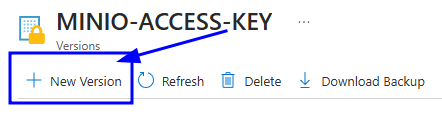

# OpenVidu Elastic administration: Azure

The deployment of OpenVidu Elastic on Azure is automated using Azure Resource Manager Templates, with Media Nodes managed within a [Virtual Machine Scale Set](https://learn.microsoft.com/en-us/azure/virtual-machine-scale-sets/overview){:target=\_blank}. This group dynamically adjusts the number of instances based on a target average CPU usage.

Internally, the Azure Elastic deployment mirrors the On Premises Elastic deployment, allowing you to follow the same administration and configuration guidelines of the [On Premises Elastic](../on-premises/admin.md) documentation. However, there are specific considerations unique to the Azure environment that are worth taking into account:

## Cluster shutdown and startup

The Master Node is a Virtual Machine Instance, while the Media Nodes are part of a Virtual Machine Scale Set. The process for starting and stopping these components differs:

=== "Shutting down the cluster"

    To shut down the cluster, you need to stop the Media Nodes and then stop the Master Node.

    !!! warning "Gracefully stopping Media Nodes"

        There is currently a limitation with Media Nodes that prevents them from stopping gracefully. Please exercise caution when stopping Media Nodes, as they will terminate immediately without waiting for active Rooms to complete. You may want to wait for your active Rooms to finish before stopping the cluster.  
        We are working to implement the same graceful shutdown behavior offered by AWS and On Premises deployments. In the meantime, Media Nodes include a script that allows for a graceful shutdown. To use it, SSH to the Media Node you want to stop and execute script **`./usr/local/bin/stop_media_node.sh`**

    1. Navigate to the [Azure Portal Dashboard](https://portal.azure.com/#home){:target=_blank} and go to the Resource Group where you deployed OpenVidu Elastic.
    2. Then click into the Virtual Machine Scale Set resource called `<STACK_NAME>-mediaNodeScaleSet` and click _"Availability + scale"_ on the left panel, here click on _"Scaling"_ option.
        <figure markdown>
        { .svg-img .dark-img }
        </figure>
    3. On this tab, go at the very bottom and modify the _"Instance Limits"_ to 0.
        <figure markdown>
        { .svg-img .dark-img }
        </figure>
    4. Click on save and wait until is completed, you can check how is going in the _"Instances"_ tab.
        <figure markdown>
        { .svg-img .dark-img }
        </figure>
    5. After confirming that all Media Node instances are terminated, go back to the Resource Group and locate the resource called _"stackName-VM-MasterNode"_. Click on it to go to the Master Node instance. There, click on _"Stop"_ to stop the instance.
        <figure markdown>
        { .svg-img .dark-img }
        </figure>

=== "Starting up the cluster"

    To start the cluster, first start the Master Node and then the Media Nodes.

    1. Navigate to the [Azure Portal Dashboard](https://portal.azure.com/#home){:target=_blank} and go to the Resource Group where you deployed OpenVidu Elastic.
    2. In the resource group click on the resource called _"stackName-VM-MasterNode"_, here click on start to start the Master Node.
        <figure markdown>
        { .svg-img .dark-img }
        </figure>
    3. Wait until the instance is running.
    4. Go back to the Resource Group, and there click into the Virtual Machine Scale Set resource called _"stackName-mediaNodeScaleSet"_ and click _"Availability + scale"_ on the left panel, here click on _"Scaling"_ option.
        <figure markdown>
        { .svg-img .dark-img }
        </figure>
    5. On this tab, modify the _"Instance Limits"_ to your desired ones.
        <figure markdown>
        { .svg-img .dark-img }
        </figure>
    6. Click on save and wait until is completed. You can check the progress in the _"Instances"_ tab.
        <figure markdown>
        { .svg-img .dark-img }
        </figure>

## Change the instance type

It is possible to change the instance type of both the Master Node and the Media Nodes. However, since the Media Nodes are part of a Virtual Machine Scale Set, the process differs. The following section details the procedures:

=== "Master Nodes"

    !!! warning

        This procedure requires downtime, as it involves stopping the Master Node.

    1. [Shutdown the cluster](#shutting-down-the-cluster).

        !!! info

            You can stop only the Master Node instance to change its instance type, but it is recommended to stop the whole cluster to avoid any issues.
    2. Go to the Azure Resource Group where you deployed and locate the resource with the name _"stackName-VM-MasterNode"_ and click on it.
    3. On the left panel click on _"Availability + scale"_ tab and inside click on _"Size"_ tab. Then select the size you desire and click on _"Resize"_
        <figure markdown>
        { .svg-img .dark-img }
        </figure>
    4. [Start the cluster](#starting-up-the-cluster).

=== "Media Nodes"

    !!! info

        This will forcely restart the Media Nodes. If you want to stop them gracefully to avoid the disruption of active Rooms, check the [Shutting downd the cluster](#shutting-down-the-cluster) tab.

    1. Go to the [Azure Portal Dashboard](https://portal.azure.com/#home){:target=_blank} on Azure.
    2. Select the Resource Group where you deployed OpenVidu Elastic.
    3. Locate the resource with the name _"stackName-mediaNodeScaleSet"_. Click on it to navigate to the Virtual Machine Scale Set.
    4. On the left panel click on _"Availability + scale"_ tab, then on _"Size"_.
        <figure markdown>
        { .svg-img .dark-img }
        </figure>
    5. Select the new instance type and click on _"Resize"_.

## Media Nodes Autoscaling Configuration

You can modify the autoscaling configuration of the Media Nodes by adjusting the scaling rules of the Virtual Machine Scale Set:

=== "Media Nodes Autoscaling Configuration"

    1. Go to the [Azure Portal Dashboard](https://portal.azure.com/#home){:target=_blank} on Azure.
    2. Select the Resource Group where you deployed OpenVidu Elastic.
    3. Locate the resource with the name _"stackName-mediaNodeScaleSet"_ and click on it.
    4. On the left panel click on _"Availability + scale"_ tab and inside click on _"Scaling"_ option.
        <figure markdown>
        { .svg-img .dark-img }
        </figure>
    5. In the _"Default"_ box you will find a section called _"Rules"_. Here you can add new rules or modify existing ones.

        !!! info

            Currently there is only one rule to scale out. We are actively working in providing a graceful scale in process for Media Nodes to avoid active Rooms disruption.

        <figure markdown>
        { .svg-img .dark-img }
        </figure>

    === "Modify existing rules"

        Click on the rule you want to modify and change the **Criteria** as desired. To accept the changes click on _"Update_".
        <figure markdown>
        { .svg-img .dark-img }
        </figure>

    === "Add a new rule"

        Click on _"Add a rule"_ option and fill the **Criteria** as desired. To add the rule click on _"Add"_.
        <figure markdown>
        { .svg-img .dark-img }
        </figure>

    !!! info

        OpenVidu Elastic is by default configured with a _"Target tracking scaling"_ policy that scales based on the target average CPU usage. However, you can configure different autoscaling policies according to your needs. For more information on the various types of autoscaling policies and how to implement them, refer to the [Azure Scaling Set documentation](https://learn.microsoft.com/en-us/azure/virtual-machine-scale-sets/virtual-machine-scale-sets-autoscale-portal){:target=_blank}.

## Fixed Number of Media Nodes

If you prefer to maintain a fixed number of Media Nodes instead of allowing the Virtual Machine Scale Set to perform dynamic scaling:

=== "Set Fixed Number of Media Nodes"

    1. Go to the [Azure Portal Dashboard](https://portal.azure.com/#home){:target=_blank} on Azure.
    2. Select the Resource Group where you deployed OpenVidu Elastic, locate the resource with the name _"stackName-mediaNodeScaleSet"_ and click on it
    3. On the left panel click on _"Availability + scale"_ and then in _"Scaling"_ tab.
        <figure markdown>
        { .svg-img .dark-img }
        </figure>
    4. On this tab, go at the very bottom and modify the _"Instance Limits"_ to the value of fixed number of Media Nodes you want. In this case is set to 2.
        <figure markdown>
        { .svg-img .dark-img }
        </figure>
    5. Click on save and wait until is completed, you can check how is going in the _"Instances"_ tab.
        <figure markdown>
        { .svg-img .dark-img }
        </figure>

## Administration and configuration

Regarding the administration of your deployment, you can follow the instructions in section [On Premises Elastic Administration](../on-premises/admin.md).

Regarding the configuration of your deployment, you can follow the instructions in section [Changing Configuration](../../configuration/changing-config.md). Additionally, the [How to Guides](../../how-to-guides/index.md) offer multiple resources to assist with specific configuration changes.

In addition to these, an Azure deployment provides the capability to manage global configurations via the Azure portal using Key Vault Secrets created during the deployment:

=== "Changing configuration through Key Vault secrets"

    1. Navigate to the [Azure Portal Dashboard](https://portal.azure.com/#home){:target=_blank} on Azure.
    2. Select the Resource Group where you deployed OpenVidu Elastic.
    3. In the _"stackname-keyvault"_ resource, click on _"Objects"_ 🡒 _"Secrets"_ on the left panel. This will show you all the secrets that are stored in the Key Vault of the OpenVidu Elastic deployment.
        <figure markdown>
        { .svg-img .dark-img }
        </figure>
    4. Click on the desired secret you want to change and click on _"New Version"_.
        <figure markdown>
        { .svg-img .dark-img }
        </figure>
    5. Enter the new secret value on _"Secret Value"_ filed and click on _"Create"_.
        <figure markdown>
        { .svg-img .dark-img }
        </figure>
    6. Go to the Master Node resource and click on _"Restart"_ to apply the changes to the OpenVidu Elastic deployment.
        <figure markdown>
        { .svg-img .dark-img }
        </figure>

    Changes will be applied automatically.
