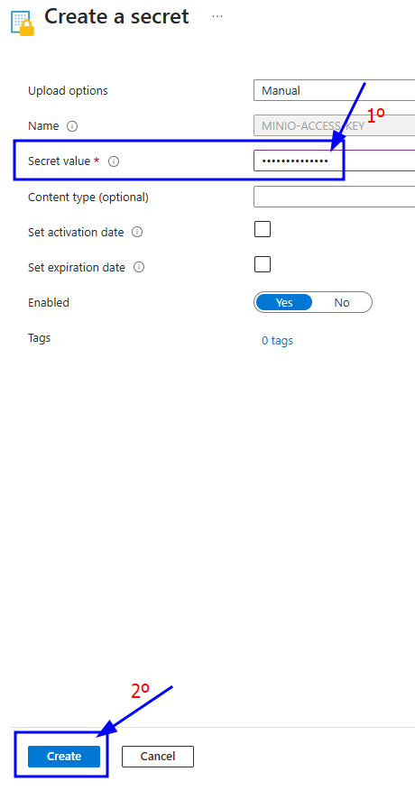

# OpenVidu Elastic administration: Azure

The deployment of OpenVidu Elastic on Azure is automated using Templates from ARM, with Media Nodes managed within an [Virtual Machine Scaling Set](https://learn.microsoft.com/en-us/azure/virtual-machine-scale-sets/overview){:target=_blank}. This group dynamically adjusts the number of instances based on a target average CPU utilization.   

Internally, the Azure deployment mirrors the on-premises setup, allowing you to follow the same administration and configuration guidelines provided in the [On Premises Elastic](../on-premises/admin.md) documentation. However, there are specific considerations unique to the Azure environment that are worth taking into account.

## Cluster Shutdown and Startup

The Master Node is a Virtual Machine Instance, while the Media Nodes are part of a Virtual Machine Scaling Set. The process for starting and stopping these components differs. The following sections detail the procedures.

=== "Shutdown the Cluster"

    To shut down the cluster, you need to stop the Media Nodes and then stop the Master Node.

    !!! warning "Gracefully stop of Media Nodes"

        We have a limitation in Media Nodes that makes them to doesn't stop gracefully, be carefull stopping Media Nodes because they will simply stop without waiting for the possible ongoing sesion. You may wait for them to finish and then stop the cluster.   
        We are working on removing this limitation, to leave the same behavior as we have in AWS or in OnPremises deployments. Currently the Media Nodes have a script that can make a gracefully stop of them, ssh to the Media Node you want to stop and execute `./usr/local/bin/stop_media_node.sh`

    1. Navigate to the [Azure Portal Dashboard](https://portal.azure.com/#home){:target=_blank} and go to the Resource Group where you deployed OpenVidu Elastic.
    2. Then click into the Virtual Machine Scale Set resource called _"stackName-mediaNodeScaleSet"_ and click _"Availability + scale"_ on the left panel, here click on _"Scaling"_ option.
        <figure markdown>
        { .svg-img .dark-img }
        </figure>
    3. On this tab, go at the very bottom and modify the _"Instance Limits"_ to 0.
        <figure markdown>
        { .svg-img .dark-img }
        </figure>
    4. Click on save and wait until is completed, you can check how is going in the _"Instances"_ tab.
        <figure markdown>
        { .svg-img .dark-img }
        </figure>
    5. After confirming that all Media Node instances are terminated, go back to the Resource Group and locate the resource called _"stackName-VM-MasterNode"_. Click on it to go to the Master Node instance. There, click on _"Stop"_ to stop the instance.
        <figure markdown>
        { .svg-img .dark-img }
        </figure>

=== "Startup the Cluster"

    To start the cluster, we recommend starting the Master Node first and then the Media Nodes.

    1. Navigate to the [Azure Portal Dashboard](https://portal.azure.com/#home){:target=_blank} and go to the Resource Group where you deployed OpenVidu Elastic.
    2. In the resource group click on the resource called _"stackName-VM-MasterNode"_, here click on start to start the Master Node.
        <figure markdown>
        { .svg-img .dark-img }
        </figure>
    3. Wait until the instance is running.
    4. Go back to the Resource Group, and there click into the Virtual Machine Scale Set resource called _"stackName-mediaNodeScaleSet"_ and click _"Availability + scale"_ on the left panel, here click on _"Scaling"_ option.
        <figure markdown>
        { .svg-img .dark-img }
        </figure>
    5. On this tab, go at the very bottom and modify the _"Instance Limits"_ to your desired ones.
        <figure markdown>
        { .svg-img .dark-img }
        </figure>
    6. Click on save and wait until is completed, you can check how is going in the _"Instances"_ tab.
        <figure markdown>
        { .svg-img .dark-img }
        </figure>

## Change the instance type

It is possible to change the instance type of both the Master Node and the Media Nodes. However, since the Media Nodes are part of an Virtual Machine Scale Set, the process differs. The following section details the procedures.

=== "Master Nodes"

    !!! warning
        
        This procedure requires downtime, as it involves stopping the Master Node.

    1. [Shutdown the cluster](#shutdown-the-cluster).

        !!! info
            
            You can stop only the Master Node instance to change its instance type, but it is recommended to stop the whole cluster to avoid any issues.
    2. Go to the Azure Resource Group where you deployed and locate the resource with the name _"stackName-VM-MasterNode"_ and click on it.
    3. On the left panel click on _"Availability + scale"_ tab and inside click on _"Size"_ tab. Then select the size you desire and click on _"Resize"_
        <figure markdown>
        { .svg-img .dark-img }
        </figure>
    4. [Start the cluster](#startup-the-cluster).

=== "Media Nodes"

    !!! info
        
        This will restart the media nodes without the gracefully delete option, if you want to stop them gracefully check the [Shutdown the Cluster](#shutdown-the-cluster) tab

    1. Go to the [Azure Portal Dashboard](https://portal.azure.com/#home){:target=_blank} on Azure.
    2. Select the Resource Group where you deployed OpenVidu Elastic.
    3. Locate the resource with the name _"stackName-mediaNodeScaleSet"_. Click on it to go to the Virtual Machine Scale Set.
    4. On the left panel click on _"Availability + scale"_ tab and inside click on _"Size"_.
        <figure markdown>
        { .svg-img .dark-img }
        </figure>
    5. Select the new instance type and click on _"Resize"_.

## Media Nodes Autoscaling Configuration

To configure the Auto Scaling settings for the Media Nodes, follow the steps outlined below. This configuration allows you to set the parameters that control how the Virtual Machine Scale Set will scale based on the target average CPU utilization.

=== "Media Nodes Autoscaling Configuration"

    1. Go to the [Azure Portal Dashboard](https://portal.azure.com/#home){:target=_blank} on Azure.
    2. Select the Resource Group where you deployed OpenVidu Elastic.
    3. Locate the resource with the name _"stackName-mediaNodeScaleSet"_ and click on it.
    4. On the left panel click on _"Availability + scale"_ tab and inside click on _"Scaling"_ option.
        <figure markdown>
        { .svg-img .dark-img }
        </figure>
    5. To configure scaling policies, navigate to the very bottom in the _"Default"_ box, you will find there a section called _"Rules"_. Here you can add new rules or else modify the existing ones
        
        !!! info

            You will find just one rule to scale out, thats because we have not implemented the gracefully delete of the media nodes and we are not scaling in this cluster by default.

        <figure markdown>
        { .svg-img .dark-img }
        </figure>

    === "Modify existing rules"
        
        If you chose to modifying an existing rule you just need to click on the rule you want to modify and change the **Criteria** based on your choices. When you are done, click on _"Update_".
        <figure markdown>
        { .svg-img .dark-img }
        </figure>

    === "Add a new rule"

        If you chose to add a new rule you just need to click on _"Add a rule"_ option and fill the **Criteria** based on your choices. When you are done, click on _"Add"_.
        <figure markdown>
        { .svg-img .dark-img }
        </figure>

    !!! info
        
        OpenVidu Elastic is by default configured with a _"Target tracking scaling"_ policy that scales based on the target average CPU utilization, however, you can configure different autoscaling policies according to your needs. For more information on the various types of autoscaling policies and how to implement them, refer to the [Azure Scaling Set documentation](https://learn.microsoft.com/en-us/azure/virtual-machine-scale-sets/virtual-machine-scale-sets-autoscale-portal){:target=_blank}.

## Fixed Number of Media Nodes

If you need to maintain a fixed number of Media Nodes instead of allowing the Virtual Machine Scale Set to dynamically adjust based on CPU utilization, you can configure the desired capacity settings accordingly. Follow the steps below to set a fixed number of Media Nodes:

=== "Set Fixed Number of Media Nodes"

    1. Go to the [Azure Portal Dashboard](https://portal.azure.com/#home){:target=_blank} on Azure.
    2. Select the Resource Group where you deployed OpenVidu Elastic, locate the resource with the name _"stackName-mediaNodeScaleSet"_ and click on it
    3. On the left panel click on _"Availability + scale"_ and then in _"Scaling"_ tab.
        <figure markdown>
        { .svg-img .dark-img }
        </figure>
    4. On this tab, go at the very bottom and modify the _"Instance Limits"_ to the value of fixed number of media nodes you want. In this case is set to 2.
        <figure markdown>
        { .svg-img .dark-img }
        </figure>
    5. Click on save and wait until is completed, you can check how is going in the _"Instances"_ tab.
        <figure markdown>
        { .svg-img .dark-img }
        </figure>

## Administration and configuration

For administration, you can follow the instructions from the [On Premises Elastic Administration](../on-premises/admin.md) section.

Regarding the configuration, in Azure it is managed similarly to an on-premises deployment. For detailed instructions, please refer to the [Changing Configuration](../../configuration/changing-config.md) section. Additionally, the [How to Guides](../../how-to-guides/index.md) offer multiple resources to assist with specific configuration changes.

In addition to these, an Azure deployment provides the capability to manage global configurations via the Azure portal using Key Vault Secrets created during the deployment. To manage configurations this way, follow these steps:

=== "Changing Configuration through Key Vault secrets"

    1. Navigate to the [Azure Portal Dashboard](https://portal.azure.com/#home){:target=_blank} on Azure.
    2. Select the Resource Group where you deployed your OpenVidu Elastic Stack.
    3. In the _"stackname-keyvault"_ resource, click at _"Objects -> Secrets"_ on the left panel. This will show you all the secrets that are stored in the Key Vault of the OpenVidu Elastic deployment.
        <figure markdown>
        { .svg-img .dark-img }
        </figure>
    4. Click on the desired secret you want to change and click on _"New Version"_.
        <figure markdown>
        { .svg-img .dark-img }
        </figure>
    5. Enter the new secret value on _"Secret Value"_ filed and click on _"Create"_.
        <figure markdown>
        { .svg-img .dark-img }
        </figure>
    6. Go to the Master Node resource and click on _"Restart"_ to apply the changes to the OpenVidu Elastic deployment.
        <figure markdown>
        { .svg-img .dark-img }
        </figure>

    The changes will be applied automatically.
