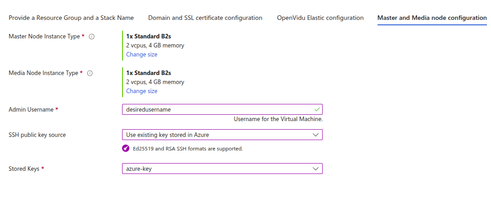

# OpenVidu Elastic Installation: Azure

!!! info
    
    OpenVidu Elastic is part of **OpenVidu <span class="openvidu-tag openvidu-pro-tag">PRO</span>**. Before deploying, you need to [create an OpenVidu account](/account/){:target=_blank} to get your license key.
    There's a 15-day free trial waiting for you!

This section contains the instructions to deploy a production-ready OpenVidu Elastic deployment in Azure. Deployed services are the same as the [On Premises Elastic Installation](../on-premises/install.md) but they will be resources in Azure and you can automate the process with the Template Spec of ARM.

To import the template into Azure you just need to click the button below and you will be redirected to azure.   
<div class="center-align" markdown>
[](https://portal.azure.com/#create/Microsoft.Template/uri/https%3A%2F%2Fs3.eu-west-1.amazonaws.com%2Fget.openvidu.io%2Fpro%2Felastic%2Fmain%2Fazure%2Fcf-openvidu-elastic.json)
</div>

=== "Architecture overview"

    This is how the architecture of the deployment looks like:

    <figure markdown>
    { .svg-img .dark-img }
    <figcaption>OpenVidu Elastic Azure Architecture</figcaption>
    </figure>

    - The Master Node acts as a Load Balancer, managing the traffic and distributing it among the Media Nodes and deployed services in the Master Node.
    - The Master Node has its own Caddy server acting as a Layer 4 (for TURN with TLS and RTMPS) and Layer 7 (for OpenVidu Dashboard, OpenVidu Call, etc., APIs) reverse proxy.
    - WebRTC traffic (SRTP/SCTP/STUN/TURN) is routed directly to the Media Nodes.
    - A Scaling Set of Media Nodes is created to scale the number of Media Nodes based on the system load.

## Template Parameters

Depending on your needs, you need to fill in the following parameters:

--8<-- "shared/self-hosting/azure-ssl-domain.md"

### OpenVidu Elastic Configuration

In this section, you need to specify some properties needed for the OpenVidu Elastic deployment.

=== "OpenVidu Elastic Configuration"

    The parameters in this section might appear as follows:

    <figure markdown>
    { .svg-img .dark-img }
    </figure>

    Make sure to provide the **OpenVidu License** parameter with the license key. If you don't have one, you can request one [here](/account/){:target=_blank}.

    For the **RTC Engine** parameter, you can choose between **Pion** (the engine used by LiveKit) and **Mediasoup** (experimental).

    --8<-- "shared/self-hosting/mediasoup-warning.md"

### Azure Instance Configuration

You need to specify some properties for the Azure instances that will be created.

=== "Azure Instance configuration"

    The parameters in this section may look like this:

    <figure markdown>
    { .svg-img .dark-img }
    </figure>

    Simply select the type of instance you want on the master nodes at **Master Node Instance Type** and select the type of instance you want on the media nodes at **Media Node Instance Type**, modify the username that will be the one standard in the instance at **Admin Username**, and paste the value of the public key you've created previously in Azure to be able to make ssh to the instance. 

    !!! info "SSH key"
    
        We are working to make the UI of the template less tedious to fill it up and one of the things when releasing a full version of this feature will be selecting the SSH key pair from the UI and be able to create a new one from there. 

### Media Nodes Scaling Set Configuration

!!! info "Scale In"

    We are working in the scale in feature in the elastic deployment because Azure doesn't make the gracefull delete of the Media Nodes possible so for now we only have scale up, to be able to scale down you will need to delete the media nodes manually.

The number of Media Nodes can scale up based on the system load. You can configure the minimum and maximum number of Media Nodes and a target CPU utilization to trigger the scaling up.

=== "Media Nodes Scaling Set Configuration"

    The parameters in this section may look like this:

    <figure markdown>
    { .svg-img .dark-img }
    </figure>

    The **Initial Number Of Media Nodes** parameter specifies the initial number of Media Nodes to deploy. The **Min Number Of Media Nodes** and **Max Number Of Media Nodes** parameters specify the minimum and maximum number of Media Nodes that you want to be deployed.

    The **Scale Target CPU** parameter specifies the target CPU utilization to trigger the scaling up or down. The goal is to keep the CPU utilization of the Media Nodes close to this value. The autoscaling policy is based on [Target Tracking Scaling Policy](https://learn.microsoft.com/en-us/azure/architecture/best-practices/auto-scaling){:target=_blank}

--8<-- "shared/self-hosting/azure-turn-domain.md"

## Deploying the Stack

!!! warning

    Don't forget about changing the resource group where all the previous resources may be created (in case you use an existing public IP) and don't forget to fill the parameter **Stack Name** with the name you want for the stack (it will be used to create the names of the resources).

When you are ready with your Template parameters, just click on _"Next"_, then it will go through some validations, and if everything is correct, click on _"Create"_, then it will start deploying and you will have to wait the time that takes to install Openvidu, it takes about 5 to 10 minutes.

When everything is ready, you will see the following links in the Key Vault resource:   

=== "Azure Key Vault Outputs"

    1. Go to the Key Vault created called **yourstackname-keyvault** in the Resource Group that you deployed, you can access in [Azure Portal Dashboard](https://portal.azure.com/#home){:target="_blank"}.


    2. Once you are in the Key Vault on the left panel click on _"Objects"_ and then into _"Secrets"_.

        <figure markdown>
        { .svg-img .dark-img }
        </figure>

    3. Here click on the secret of your choice or whatever you need to check and click again in the current version of that secret

        <figure markdown>
        { .svg-img .dark-img }
        </figure>

    4. Now you will see a lot of properties but the one you are searching for is located at the bottom and it will be revealed by clicking in _"Show Secret Value"_.

        <figure markdown>
        { .svg-img .dark-img }
        </figure>
=== "Check outputs in the instance"

    You will need to do SSH to the single instance of Master Node that is created and there you need to make the following steps:   
    
    First go to the config folder using the following command: ```cd /opt/openvidu/config/cluster```. There you will see two folders and one **.env** file. To retrieve all access credentials check the following files:

    - `openvidu.env`
    - `master_node/app.env`

## Configure your Application to use the Deployment

As we mentioned before, if you have permissions to give yourself access to the Key Vault you will be able to check there all the outputs, if you dont have them check the tab [Check outputs in the instance](#check-outputs-in-the-instance).

Your authentication credentials and URL to point your applications would be:

- Applications developed with LiveKit SDK:
    - **URL**: The value in the Key Vault Secret of `DOMAIN_NAME` or in the instance in `openvidu.env` as a URL. It could be `wss://openvidu.example.io/` or `https://openvidu.example.io/` depending on the SDK you are using.
    - **API Key**: The value in the Key Vault Secret of `LIVEKIT_API_KEY` or in the instance in `openvidu.env`.
    - **API Secret**: The value in the Key Vault Secret of `LIVEKIT_API_SECRET` or in the instance in `openvidu.env`.

- Applications developed with OpenVidu v2:
    - **URL**: The value in the Key Vault Secret of `DOMAIN_NAME` or in the instance in `openvidu.env` as a URL. For example, `https://openvidu.example.io/`.
    - **Username**: `OPENVIDUAPP`.
    - **Password**: The value in the Key Vault Secret of `LIVEKIT_API_SECRET` or in the instance in `openvidu.env`.
 
## Troubleshooting Initial Azure Stack Creation

--8<-- "shared/self-hosting/azure-troubleshooting.md"

3. If everything seems fine, check the [status](../on-premises/admin.md#checking-the-status-of-services) and the [logs](../on-premises/admin.md#checking-logs) of the installed OpenVidu services.

## Configuration and administration

When your Azure stack reaches the **`Succeeded`** status, it means that all the resources have been created. You will need to wait about 5 to 10 minutes to let the instance install OpenVidu. When this time has passed, try connecting to the deployment URL. If it doesn't work, we recommend checking the previous section. Once finished you can check the [Administration](./admin.md) section to learn how to manage your deployment.