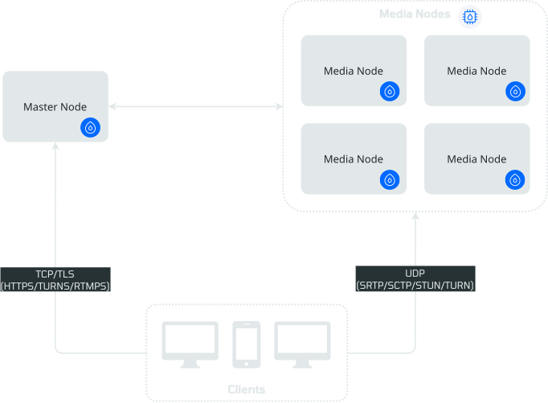
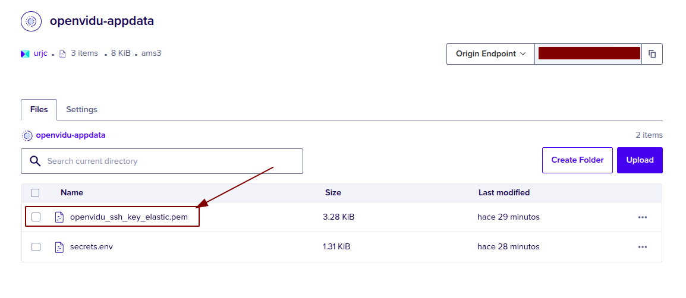
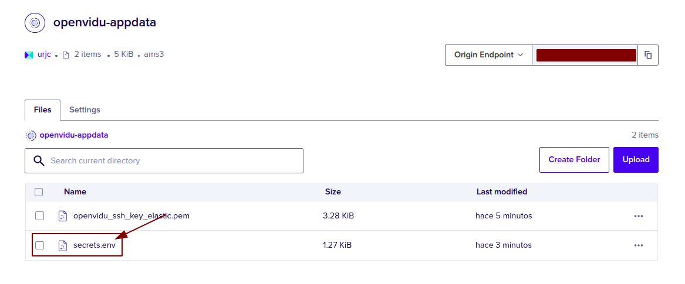

# OpenVidu Elastic installation: DigitalOcean

<div class="provider-chip" markdown>

:material-digital-ocean:{ .provider-chip-icon } DigitalOcean

</div>


--8<-- "self-hosting/common/elastic-license-intro.md"

This section describes how to deploy a production-ready OpenVidu Elastic instance on DigitalOcean. The deployed services are identical to those in the [On Premises Elastic installation](../on-premises/install.md), but are provisioned as DigitalOcean resources and can be automated using Terraform CLI.

- DigitalOcean **Spaces Object Storage** (S3-compatible) is used for storing application data, recordings.
- Media Node scalability is managed via an **automated process (DigitalOcean Functions)** that scales the number of Media Nodes based on system load, although you can use a fixed number of media nodes.

!!! info
    Port `9000` is MinIO's port. This deployment stores recordings and application data in DigitalOcean Spaces instead of MinIO, so MinIO is not deployed and port `9000` does not need to be open.

## Prerequisites

* You need to have a DigitalOcean account with a [Personal Access Token :fontawesome-solid-external-link:{.external-link-icon}](https://docs.digitalocean.com/reference/api/create-personal-access-token/){:target="_blank"}.
* You need to have installed [Terraform CLI :fontawesome-solid-external-link:{.external-link-icon}](https://developer.hashicorp.com/terraform/tutorials/aws-get-started/install-cli){:target="_blank"}.
* You need to have installed Git.

=== "Architecture overview"

    This is what the deployment architecture looks like:

    { .svg-img .dark-img loading=lazy }

    - The Master Node acts as a Load Balancer, managing the traffic and distributing it among the Media Nodes and deployed services in the Master Node.
    - The Master Node has its own Caddy server acting as a Layer 4 (for TURN with TLS and RTMPS) and Layer 7 (for OpenVidu Dashboard, OpenVidu Meet, etc., APIs) reverse proxy.
    - WebRTC traffic (SRTP/SCTP/STUN/TURN) is routed directly to the Media Nodes.
    - An automated process using DigitalOcean Functions handles the scale-in and scale-out of Media Nodes based on system load. The initial Media Node(s) are provisioned right after the Master Node is ready (a bootstrap invocation avoids waiting for the first scheduled tick). A full deployment is typically ready in **5 to 8 minutes**.

--8<-- "self-hosting/digitalocean/custom-scale-in.md"

## Deployment details

1. Clone the OpenVidu repository with the terraform files:
    ```bash
    git clone https://github.com/OpenVidu/openvidu-digitalocean.git
    git -C openvidu-digitalocean checkout 3.8.0
    cd openvidu-digitalocean/pro/elastic
    ```
2. Copy **terraform.tfvars.example** to **terraform.tfvars**, update the required parameters with your values, and optionally adjust defaults.
  <details>
    <summary>Information about parameters</summary>

    <h4>Mandatory Parameters</h4>

    <div align="center">
    <table>
    <thead>
    <tr>
    <th>Input Value</th>
    <th>Description</th>
    </tr>
    </thead>
    <tbody>
    <tr>
    <td class="nowrap"><code>doToken</code></td>
    <td>DigitalOcean Personal Access Token for API authentication.</td>
    </tr>
    <tr>
    <td class="nowrap"><code>stackName</code></td>
    <td>Stack name for OpenVidu deployment.</td>
    </tr>
    <tr>
    <td class="nowrap"><code>openviduLicense</code></td>
    <td>OpenVidu License for PRO deployments. Go <a href="https://openvidu.io/account" target="_blank">here</a> for more information.</td>
    </tr>
    </tbody>
    </table>
    </div>

    <h4>Optional Parameters</h4>

    <div align="center">
    <table>
    <thead>
    <tr>
    <th>Input Value</th>
    <th>Default Value</th>
    <th>Description</th>
    </tr>
    </thead>
    <tbody>
    <tr>
    <td class="nowrap"><code>region</code></td>
    <td class="nowrap"><code>"ams3"</code></td>
    <td>DigitalOcean region where resources will be created.</td>
    </tr>
    <tr>
    <td class="nowrap"><code>masterNodeInstanceType</code></td>
    <td class="nowrap"><code>"s-4vcpu-8gb"</code></td>
    <td>Specifies the DigitalOcean Droplet size for your Master Node.</td>
    </tr>
    <tr>
    <td class="nowrap"><code>mediaNodeInstanceType</code></td>
    <td class="nowrap"><code>"s-4vcpu-8gb"</code></td>
    <td>Specifies the DigitalOcean Droplet size for your Media Nodes.</td>
    </tr>
    <tr>
    <td class="nowrap"><code>initialNumberOfMediaNodes</code></td>
    <td class="nowrap"><code>1</code></td>
    <td>Number of Media Nodes to create at initial deployment. On its first run the autoscaler brings the cluster straight to <code>max(minNumberOfMediaNodes, initialNumberOfMediaNodes)</code> Media Nodes; afterwards the number stays between <code>minNumberOfMediaNodes</code> and <code>maxNumberOfMediaNodes</code> based on CPU load. Ignored when <code>fixedNumberOfMediaNodes</code> &gt; 0.</td>
    </tr>
    <tr>
    <td class="nowrap"><code>minNumberOfMediaNodes</code></td>
    <td class="nowrap"><code>1</code></td>
    <td>Minimum number of media nodes. The autoscaler never scales below this value.</td>
    </tr>
    <tr>
    <td class="nowrap"><code>maxNumberOfMediaNodes</code></td>
    <td class="nowrap"><code>5</code></td>
    <td>Maximum number of media nodes. The autoscaler never scales above this value.</td>
    </tr>
    <tr>
    <td class="nowrap"><code>scaleTargetCPU</code></td>
    <td class="nowrap"><code>50</code></td>
    <td>Target CPU percentage to scale up or down.</td>
    </tr>
    <tr>
    <td class="nowrap"><code>fixedNumberOfMediaNodes</code></td>
    <td class="nowrap"><code>0</code></td>
    <td>Fixed number of media nodes to create (0 = use autoscaling).</td>
    </tr>
    <tr>
    <td class="nowrap"><code>rtcEngine</code></td>
    <td class="nowrap"><code>"pion"</code></td>
    <td>Media Engine. Available options: <code>pion</code>, <code>mediasoup</code>.</td>
    </tr>
    <tr>
    <td class="nowrap"><code>certificateType</code></td>
    <td class="nowrap"><code>"letsencrypt"</code></td>
    <td>Certificate type for OpenVidu deployment. Options: <ul><li><code>selfsigned</code> - Not recommended for production use. Just for testing purposes or development environments. You don't need a FQDN to use this option.</li><li><code>owncert</code> - Valid for production environments. Use your own certificate. You need a FQDN to use this option.</li><li><code>letsencrypt</code> - Valid for production environments. Can be used with or without a FQDN (if no FQDN is provided, the public IP is used as the domain name and a <a href="https://letsencrypt.org/2026/01/15/6day-and-ip-general-availability" target="_blank">Let's Encrypt</a> certificate is issued for it).</li></ul>
    </td>
    </tr>
    <tr>
    <td class="nowrap"><code>domainName</code></td>
    <td class="nowrap"><code>(none)</code></td>
    <td>Domain name for the OpenVidu Deployment. Not mandatory; if not provided, the public IP is used as the domain name.</td>
    </tr>
    <tr>
    <td class="nowrap"><code>ownPublicCertificate</code></td>
    <td class="nowrap"><code>(none)</code></td>
    <td>If certificate type is 'owncert', this parameter will be used to specify the public certificate in base64 format.</td>
    </tr>
    <tr>
    <td class="nowrap"><code>ownPrivateCertificate</code></td>
    <td class="nowrap"><code>(none)</code></td>
    <td>If certificate type is 'owncert', this parameter will be used to specify the private certificate in base64 format.</td>
    </tr>
    <tr>
    <td class="nowrap"><code>initialMeetAdminPassword</code></td>
    <td class="nowrap"><code>(none)</code></td>
    <td>Initial password for the 'admin' user in OpenVidu Meet. If not provided, a random password will be generated.</td>
    </tr>
    <tr>
    <td class="nowrap"><code>initialMeetApiKey</code></td>
    <td class="nowrap"><code>(none)</code></td>
    <td>Initial API key for OpenVidu Meet. If not provided, no API key will be set and the user can set it later from Meet Console.</td>
    </tr>
    <tr>
    <td class="nowrap"><code>spaceName</code></td>
    <td class="nowrap"><code>(none)</code></td>
    <td>Name of the DigitalOcean Space (S3-compatible bucket) to store application data and recordings. If empty, a bucket will be created with default name.</td>
    </tr>
    <tr>
    <td class="nowrap"><code>spaceRegion</code></td>
    <td class="nowrap"><code>"ams3"</code></td>
    <td>DigitalOcean Spaces region where the bucket will be created.</td>
    </tr>
    <tr>
    <td class="nowrap"><code>spacesAccessId</code></td>
    <td class="nowrap"><code>(none)</code></td>
    <td>Access key ID for DigitalOcean Spaces (S3-compatible). Required if spaceName is empty.</td>
    </tr>
    <tr>
    <td class="nowrap"><code>spacesSecretKey</code></td>
    <td class="nowrap"><code>(none)</code></td>
    <td>Secret access key for DigitalOcean Spaces (S3-compatible). Required if spaceName is empty.</td>
    </tr>
    <tr>
    <td class="nowrap"><code>additionalInstallFlags</code></td>
    <td class="nowrap"><code>(none)</code></td>
    <td>Additional optional flags to pass to the OpenVidu installer (comma-separated, e.g., '--flag1=value, --flag2'). Currently we only have one flag that is `--force-utc-timezone` to force UTC as the timezone for OpenVidu. By default, OpenVidu uses the timezone configured in the host machine where it is installed. Note that in general it is recommended to use UTC, and DigitalOcean Droplets already default to UTC, so this flag is not usually necessary.</td>
    </tr>
    </tbody>
    </table>
    </div>

    </details>
    !!! warning

        In DigitalOcean, you need [Space Access Keys :fontawesome-solid-external-link:{.external-link-icon}](https://cloud.digitalocean.com/spaces/access_keys){:target="_blank"} to create a bucket. If you leave the **spaceName** variable empty, you must configure these keys with full access so a new bucket can be created. [Here is how :fontawesome-solid-external-link:{.external-link-icon}](https://docs.digitalocean.com/products/spaces/how-to/manage-access/#access-keys){:target="_blank"}.
        
1. Use the following commands to deploy with terraform.
  ```bash
  terraform init
  terraform apply
  ```
1. You will see logs appear in the terraform apply execution console. Wait for it to finish and display `Apply Complete!`. Now go to [Space Object Storage](https://cloud.digitalocean.com/spaces){:target="_blank"} and wait for the ssh key to appear in the bucket you have configured.   

    !!! warning
        After downloading the SSH key, it is highly recommended to **DELETE IT** from the bucket. This file is the private key used to access the droplet. If exposed, unauthorized users could gain access to the instance.
    { .svg-img .dark-img loading=lazy }

2. Give the SSH Key the necessary permissions for it to work.

    === "Linux"
        Command in Linux:
        ```
        chmod 600 <PATH_TO_THE_KEY>/openvidu_ssh_key_elastic.pem
        ```
    === "Powershell"
        Command in powershell:
        ```
        $KeyPath = "<PATH_TO_THE_KEY>" &&
        icacls $KeyPath /inheritance:r &&
        icacls $KeyPath /grant:r "$($env:USERNAME):(R)"
        ```

### Access OpenVidu

Wait for the `secrets.env` file to appear in the bucket that you've configured and open it to view the credentials of OpenVidu. This file is uploaded as soon as the Master Node has generated the secrets, before the installation finishes, so the credentials become available a while before the deployment is actually reachable: **OPENVIDU_URL** responding is the signal that everything is up and running.

=== "View OpenVidu credentials in the Web"
    Go to the Space Object Storage bucket that you've configured and download the `secrets.env` file.
    { .svg-img .dark-img loading=lazy }


=== "View OpenVidu credentials in the instance"

    SSH to the instance by running this command from the directory where your SSH key is located:
    ```
    ssh -i openvidu_ssh_key_elastic.pem root@PUBLIC_DROPLET_IP
    ```

    Then navigate to /opt/openvidu/ and you will find all credentials needed in the `secrets.env`.

Then open **OPENVIDU_URL** and you will see the OpenVidu Meet interface. Log in with **MEET_INITIAL_ADMIN_PASSWORD** and you will be able to enjoy the features of OpenVidu Meet.

## Configure your application to use the deployment 

You may need your Digital Ocean credentials to configure your OpenVidu application. You can check these secrets following these steps ([View OpenVidu credentials in the Web](#view-openvidu-credentials-in-the-web)) or ([View OpenVidu credentials in the instance](#view-openvidu-credentials-in-the-instance)).

Your authentication credentials and the URL to point your applications to are:

--8<-- "self-hosting/digitalocean/credentials-general.md"
--8<-- "self-hosting/digitalocean/credentials-v2compatibility.md"

### Troubleshooting initial DigitalOcean deployment creation

--8<-- "self-hosting/digitalocean/troubleshooting.md"

3. If everything seems fine, check the [status](../on-premises/admin.md#checking-the-status-of-services) and the [logs](../on-premises/admin.md#checking-logs) of the installed OpenVidu services.

### Configuration and administration

When your **OPENVIDU_URL** is reachable, it means that everything has gone well. Now you can check the [Administration](./admin.md) section to learn how to manage your deployment.
