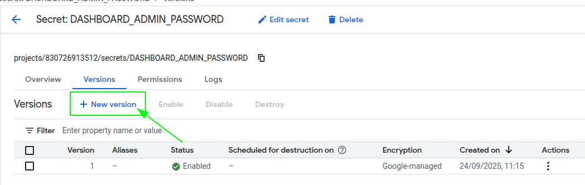

# OpenVidu Elastic administration: Google Cloud Platform

The deployment of OpenVidu Elastic on Google Cloud Platform is automated using Infra Structure Manager in Google Cloud Console, with Media Nodes managed within a [Managed Instance Group :fontawesome-solid-external-link:{.external-link-icon}](https://cloud.google.com/compute/docs/instance-groups?hl=en){:target=\_blank}. This group dynamically adjusts the number of instances based on a target average CPU usage.

Internally, the Google Cloud Platform Elastic deployment mirrors the On Premises Elastic deployment, allowing you to follow the same administration and configuration guidelines of the [On Premises Elastic](../on-premises/admin.md) documentation. However, there are specific considerations unique to the Google Cloud Platform environment that are worth taking into account:

## Cluster shutdown and startup

The Master Node is a Virtual Machine Instance, while the Media Nodes are part of a Managed Instance Group. The process for starting and stopping these components differs:

=== "Shutting down the cluster"

    To shut down the cluster, you need to stop the Media Nodes and then stop the Master Node.

    1. Navigate to the [Google Cloud Platform Console :fontawesome-solid-external-link:{.external-link-icon}](https://console.cloud.google.com/compute/overview){:target=_blank}.
    2. Then click into the Managed Instance Group resource called `<STACK_NAME>-media-node-group` and click on _"Edit"_.
        <figure markdown>
        { .svg-img .dark-img }
        </figure>
    3. On this tab, go at the **Group Size & autoscaling** tab and change the _"Minimun"_ and _"Maximum"_ number of instances to 0.
        <figure markdown>
        { .svg-img .dark-img }
        </figure>
    4. Click on save and wait, it needs the lambda function to run until is completed, you can check how is going in the _"VM instances"_ tab.
        <figure markdown>
        { .svg-img .dark-img }
        </figure>
    5. After confirming that all Media Node instances are terminated, in _"VM instances"_ tab select the instance called `<STACK_NAME>-master-node`. Click on it to go to the Master Node instance. There, click on "Stop" to stop the instance.
        <figure markdown>
        { .svg-img .dark-img }
        </figure>    

=== "Starting up the cluster"

    To start the cluster, first start the Master Node and then the Media Nodes.

    1. Navigate to the [Google Cloud Platform Console :fontawesome-solid-external-link:{.external-link-icon}](https://console.cloud.google.com/compute/overview){:target=_blank}.
    2. In _"VM instances"_ tab select the instance called `<STACK_NAME>-master-node`, here click on start to start the Master Node.
        <figure markdown>
        { .svg-img .dark-img }
        </figure>
    3. Wait until the instance is running.
    4. Go to the _"Instance Groups"_ tab, and there click into the Managed Instance Group resource called `<STACK_NAME>-media-node-group` and click on _"Edit"_.
        <figure markdown>
        { .svg-img .dark-img }
        </figure>
    5. Go to **Group Size & autoscaling** tab and change the _"Minimun"_ and _"Maximum"_ number of instances to your desired ones.
        <figure markdown>
        { .svg-img .dark-img }
        </figure>
    6. Click on save and wait until is completed. You can check the progress in the _"Instances"_ tab.
        <figure markdown>
        { .svg-img .dark-img }
        </figure>

## Change the instance type

It is possible to change the instance type of both the Master Node and the Media Nodes. However, since the Media Nodes are part of a Managed Instance Group, the process differs. The following section details the procedures:

=== "Master Nodes"

    !!! warning

        This procedure requires downtime, as it involves stopping the Master Node.

    1. [Shutdown the cluster](#shutting-down-the-cluster).

        !!! info

            You can stop only the Master Node instance to change its instance type, but it is recommended to stop the whole cluster to avoid any issues.
    2. Go to the [Google Cloud Platform Console :fontawesome-solid-external-link:{.external-link-icon}](https://console.cloud.google.com/compute/overview) and locate the resource with the name `<STACK_NAME>-master-node` and click on it.
    3. Click on _"Edit"_ and inside change the _"Machine Type"_. Then select the size you desire and click on _"Save"_
        <figure markdown>
        { .svg-img .dark-img }
        </figure>
    4. [Start the cluster](#starting-up-the-cluster).

=== "Media Nodes"

    !!! info

        This will delete the media nodes without the graceful delete option, if you want to stop them gracefully check the [Shutdown the Cluster](#shutting-down-the-cluster) tab

    1. Go to the _"Instance Group"_ tab and select the resource called `<STACK_NAME>-media-node-group` and click on the _"Template"_.
        <figure markdown>
        { .svg-img .dark-img }
        </figure>
    2. To change the size click on _"Create similar"_ and create a new one with the desired size.
        <figure markdown>
        { .svg-img .dark-img }
        </figure>
    3. Go back to the _"Instace Group"_ and click on _"Edit"_
        <figure markdown>
        { .svg-img .dark-img }
        </figure>
    4. In _"Instace template & overrides"_ change the template for the one you've created previously and then _"Save"_.
        <figure markdown>
        { .svg-img .dark-img }
        </figure>
    5. Delete the old sized instances.
        <figure markdown>
        { .svg-img .dark-img }
        </figure>

## Media Nodes Autoscaling Configuration

You can modify the autoscaling configuration of the Media Nodes by adjusting the scaling signals of the Managed Instance Group:

=== "Media Nodes Autoscaling Configuration"

    1. Go to the [Google Cloud Platform Console :fontawesome-solid-external-link:{.external-link-icon}](https://console.cloud.google.com/compute/overview){:target=_blank}.
    2. Go to the _"Instance Groups"_ tab, and there click into the Managed Instance Group resource called `<STACK_NAME>-media-node-group` and click on _"Edit"_.
        <figure markdown>
        { .svg-img .dark-img }
        </figure>
    3. On this tab, go to _"Group size & autoscaling"_ and change the tab called _"Autoscaling signals"_
    4. In this tab you will find the signal that is actually using. Here you can add new signals or modify existing ones.
        <figure markdown>
        { .svg-img .dark-img }
        </figure>

    !!! info

        OpenVidu Elastic is by default configured with a _"Target tracking scaling"_ policy that scales based on the target average CPU usage. However, you can configure different autoscaling policies according to your needs. For more information on the various types of autoscaling policies and how to implement them, refer to the [Google Cloud Platform
        MIG documentation :fontawesome-solid-external-link:{.external-link-icon}](https://cloud.google.com/compute/docs/autoscaler?hl=en#autoscaling_policy){:target=_blank}.

## Fixed Number of Media Nodes

If you prefer to maintain a fixed number of Media Nodes instead of allowing the Managed Instance Group to perform dynamic scaling:

=== "Set Fixed Number of Media Nodes"

    1. Go to the [Google Cloud Platform Console :fontawesome-solid-external-link:{.external-link-icon}](https://console.cloud.google.com/compute/overview){:target=_blank}.
    2. Go to the _"Instance Groups"_ tab, and there click into the Managed Instance Group resource called `<STACK_NAME>-media-node-group` and click on _"Edit"_.
        <figure markdown>
        { .svg-img .dark-img }
        </figure>
    3. On this tab, go to _"Group size & autoscaling"_ and change the _"Auto-scaling mode"_ to **Off**, then set the _"Number of instances"_ on the top to the value of fixed number of Media Nodes you want. In this case is set to 3. Click on save next and wait to be applied
        <figure markdown>
        { .svg-img .dark-img }
        </figure>

    !!! info

        This will delete the media nodes if you have set them to less than the number of media nodes that existed, if you want to stop them gracefully check the [Shutdown the Cluster](#shutting-down-the-cluster) tab.

### Deactivate Scale In
If you want a fixed number of Media Nodes you probably want to deactivate the Cloud Run Function that controls scale in actions. Follow these steps to do it:

=== "Deactivate Cloud Run Function"

    1. Go to the [Cloud Scheduler Jobs](https://console.cloud.google.com/cloudscheduler) and select the scheduler that controls the trigger of the Cloud Run Function you want to deactivate, then click on _"Pause"_ and it will not execute more until you click on _"Resume"_ whenever you want to make the cluster scale in again.
        <figure markdown>
        { .svg-img .dark-img }
        </figure>

## Administration and configuration

Regarding the administration of your deployment, you can follow the instructions in section [On Premises Elastic Administration](../on-premises/admin.md).

Regarding the configuration of your deployment, you can follow the instructions in section [Changing Configuration](../../configuration/changing-config.md). Additionally, the [How to Guides](../../how-to-guides/index.md) offer multiple resources to assist with specific configuration changes.

In addition to these, a Google Cloud Platform deployment provides the capability to manage global configurations via the Google Cloud Platform Console using Secrets Manager created during the deployment:

=== "Changing configuration through Secrets Manager"

    1. Navigate to the [GCP Secrets Manager :fontawesome-solid-external-link:{.external-link-icon}](https://console.cloud.google.com/security/secret-manager){:target=_blank} on Google Cloud Platform.
    2. Click on the desired secret you want to change and click on _"New Version"_.
        <figure markdown>
        { .svg-img .dark-img }
        </figure>
    3. Enter the new secret value on _"Secret Value"_ filed and click on _"Add new version"_.
        <figure markdown>
        { .svg-img .dark-img }
        </figure>
    4. Go to the Master Node resource and click on _"Stop"_ -> _"Start"_ to apply the changes to the OpenVidu Elastic deployment.

    Changes will be applied automatically.

## Backup and Restore

Review the [Backup and restore OpenVidu deployments](../../how-to-guides/backup-and-restore.md) guide for recommended backup workflows.