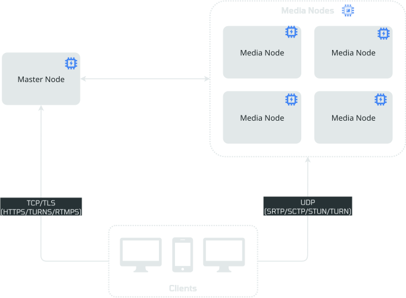
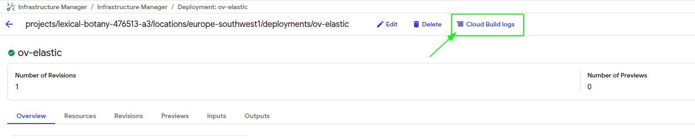
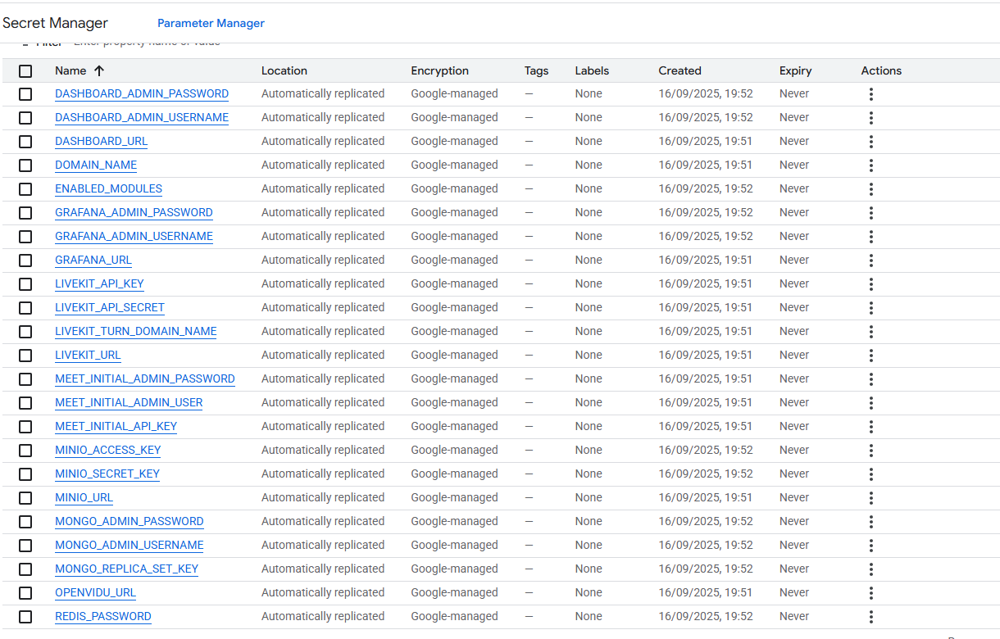
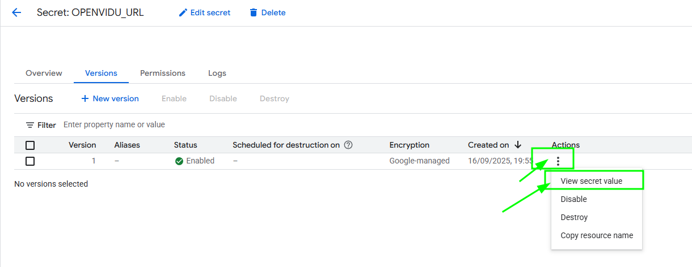
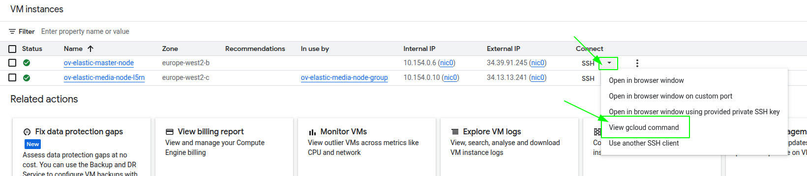

# OpenVidu Elastic installation: Google Cloud Platform

<div class="provider-chip" markdown>

:material-google-cloud:{ .provider-chip-icon } Google Cloud Platform

</div>


--8<-- "self-hosting/common/elastic-license-intro.md"

This section describes how to deploy a production-ready OpenVidu Elastic instance on Google Cloud Platform. The deployed services are identical to those in the [On Premises Elastic installation](../on-premises/install.md), but are provisioned as Google Cloud Platform resources and can be automated through the Google Cloud Console.

To deploy OpenVidu on Google Cloud Platform, log in to [Infrastructure Manager :fontawesome-solid-external-link:{.external-link-icon}](https://console.cloud.google.com/infra-manager/deployments) in the GCP Console. Then follow the next steps and fill in your preferred parameters.

=== "Architecture overview"

    This is what the deployment architecture looks like:

    { .svg-img .dark-img loading=lazy }

    - The Master Node acts as a Load Balancer, managing the traffic and distributing it among the Media Nodes and deployed services in the Master Node.
    - The Master Node has its own Caddy server acting as a Layer 4 (for TURN with TLS and RTMPS) and Layer 7 (for OpenVidu Dashboard, OpenVidu Meet, etc., APIs) reverse proxy.
    - WebRTC traffic (SRTP/SCTP/STUN/TURN) is routed directly to the Media Nodes.
    - A Managed Instance Group of Media Nodes is created to scale the number of Media Nodes based on system load.

--8<-- "self-hosting/gcp/custom-scale-in.md"

## Deployment details

--8<-- "self-hosting/gcp/info-deployment.md"

To deploy OpenVidu, first create a new deployment using the top-left button, as shown in the image.

{ .svg-img .dark-img loading=lazy }

Once you click the button, you will see this window.

{ .svg-img .dark-img loading=lazy }

* Fill **Deployment ID** with any name you prefer (for example, openvidu-elastic-deployment).   
* Change the **Region** to the one you prefer.
!!! warning

    If you change the region in the previous step, don't forget to update the [region and zone :fontawesome-solid-external-link:{.external-link-icon}](https://docs.cloud.google.com/compute/docs/regions-zones?hl=en){:target="_blank"} in the Terraform values.

* Leave **Terraform version** as 1.5.7.   
* For **Service Account**, you will need to create a new one with _"Owner"_ permissions. To do this, click the _"Service Account"_ label and then _"New Service Account"_. Choose your service account name, click _"Create and Continue"_, select the _"Owner"_ role, click _"Continue"_, and then _"Done"_.   
??? details "New Service Account Steps"

    <figure markdown>
    { .svg-img .dark-img loading=lazy }
    <figcaption>Step 1: Create Service Account</figcaption>
    </figure>

    <figure markdown>
    { .svg-img .dark-img loading=lazy }
    <figcaption>Step 2: Service Account Details</figcaption>
    </figure>

    <figure markdown>
    { .svg-img .dark-img loading=lazy }
    <figcaption>Step 3: Grant Permissions</figcaption>
    </figure>

    <figure markdown>
    { .svg-img .dark-img loading=lazy }
    <figcaption>Step 4: Complete Setup</figcaption>
    </figure>

* Fill **Git repository** with this link, which corresponds to our Git repository where the Terraform files to deploy OpenVidu are located:

    ```
    https://github.com/OpenVidu/openvidu.git
    ```

* Fill the **Git directory** with the following path:

    ```
    openvidu-deployment/pro/elastic/gcp
    ```

* For the **Git ref**, use the version you want to deploy:

    ```
    v3.8.0
    ```

Finally, click Continue.

## Input Values

In Google Cloud Platform, there is no built-in template with parameters. You need to manually enter the parameters in the console declared in our Terraform files, so below is a detailed table of all optional and mandatory parameters.

### Mandatory Parameters
<div class="text-center">
    | Input Value | Description |
|---|---|
| projectId | GCP project id where the resources will be created. |
| stackName | Stack name for OpenVidu deployment. |
| openviduLicense | Your OpenVidu License. Get one [here](https://openvidu.io/account) if you don't have one. |

</div>

### Optional Parameters
<div class="text-center">
    <table border="1" cellspacing="0" cellpadding="6" style="margin: 0 auto;">
      <tr>
        <th>Input Value</th>
        <th>Default Value</th>
        <th>Description</th>
      </tr>
      <tr>
        <td>region</td>
        <td>"europe-west2"</td>
        <td>GCP region where resources will be created.</td>
      </tr>
      <tr>
        <td>zone</td>
        <td>"europe-west2-b"</td>
        <td>GCP zone that some resources will use.</td>
      </tr>
      <tr>
        <td>certificateType</td>
        <td>"letsEncrypt"</td>
        <td>Certificate type for OpenVidu deployment. Options:
          <ul>
            <li><strong>[selfsigned]</strong> Not recommended for production use. Just for testing purposes or development environments. You don't need a FQDN to use this option.</li>
            <li><strong>[owncert]</strong> Valid for production environments. Use your own certificate. You need a FQDN to use this option.</li>
            <li><strong>[letsencrypt]</strong> Valid for production environments. Can be used with or without a FQDN (if no FQDN is provided, the public IP is used as the domain name and a <a href="https://letsencrypt.org/2026/01/15/6day-and-ip-general-availability" target="_blank">Let's Encrypt</a> certificate is issued for it).</li>
          </ul>
              </td>    </tr>
      <tr>
        <td>publicIpAddress</td>
        <td>(none)</td>
        <td>Previously created Public IP address for the OpenVidu Deployment. Blank will generate a public IP.</td>
      </tr>
      <tr>
        <td>domainName</td>
        <td>(none)</td>
        <td>Domain name for the OpenVidu Deployment.</td>
      </tr>
      <tr>
        <td>ownPublicCertificate</td>
        <td>(none)</td>
        <td>If certificate type is 'owncert', this parameter will be used to specify the public certificate in base64 format.</td>
      </tr>
      <tr>
        <td>ownPrivateCertificate</td>
        <td>(none)</td>
        <td>If certificate type is 'owncert', this parameter will be used to specify the private certificate in base64 format.</td>
      </tr>
      <tr>
        <td>initialMeetAdminPassword</td>
        <td>(none)</td>
        <td>Initial password for the 'admin' user in OpenVidu Meet. If not provided, a random password will be generated.</td>
      </tr>
      <tr>
        <td>initialMeetApiKey</td>
        <td>(none)</td>
        <td>Initial API key for OpenVidu Meet. If not provided, no API key will be set and the user can set it later from Meet Console.</td>
      </tr>
      <tr>
        <td>masterNodeInstanceType</td>
        <td>"e2-standard-2"</td>
        <td>Specifies the GCE machine type for your OpenVidu Master Node.</td>
      </tr>
      <tr>
        <td>mediaNodeInstanceType</td>
        <td>"e2-standard-2"</td>
        <td>Specifies the GCE machine type for your OpenVidu Media Nodes.</td>
      </tr>
      <tr>
        <td>initialNumberOfMediaNodes</td>
        <td>1</td>
        <td>Number of initial media nodes to deploy.</td>
      </tr>
      <tr>
        <td>minNumberOfMediaNodes</td>
        <td>1</td>
        <td>Minimum number of media nodes to deploy.</td>
      </tr>
      <tr>
        <td>maxNumberOfMediaNodes</td>
        <td>5</td>
        <td>Maximum number of media nodes to deploy.</td>
      </tr>
      <tr>
        <td>scaleTargetCPU</td>
        <td>50</td>
        <td>Target CPU percentage to scale out or in.</td>
      </tr>
      <tr>
        <td>bucketName</td>
        <td>(none)</td>
        <td>Name of the GCS bucket to store data and recordings. If empty, a bucket will be created.</td>
      </tr>
      <tr>
        <td>rtcEngine</td>
        <td>"pion"</td>
        <td>RTCEngine media engine to use. Allowed values are 'pion' and 'mediasoup'.</td>
      </tr>
      <tr>
        <td>additionalInstallFlags</td>
        <td>(none)</td>
        <td>Additional optional flags to pass to the OpenVidu installer (comma-separated, e.g., '--flag1=value, --flag2').</td>
      </tr>
    </table>
</div>

For more details, you can check the [variables.tf :fontawesome-solid-external-link:{.external-link-icon}](https://github.com/OpenVidu/openvidu/blob/master/openvidu-deployment/pro/elastic/gcp/variables.tf) file to see additional information about the inputs.   

!!! warning
    It's important that you enter the input variables with the exact same names as they appear in the table, as shown in the next image.

    { .svg-img .dark-img loading=lazy }

## Deploying the stack

When you are satisfied with your input values, click _"Continue"_ and then _"Create deployment"_. The deployment will be validated and all resources will be created. Wait around 7 to 12 minutes for the nodes to install OpenVidu.

!!! warning

    In case of failure, check the Cloud Build logs shown at the top of the screen and redeploy after applying the required changes. If the failure is related to an API, delete the deployment and create a new one. If it keeps failing, contact us.
    
    { .svg-img .dark-img loading=lazy }

When everything is ready, you can check the secrets on the [Secret Manager :fontawesome-solid-external-link:{.external-link-icon}](https://console.cloud.google.com/security/secret-manager) or by connecting through SSH to the instances:

=== "Check deployment outputs in GCP Secret Manager"

    1. Go to the [Secret Manager :fontawesome-solid-external-link:{.external-link-icon}](https://console.cloud.google.com/security/secret-manager).

    2. Once you are in the Secret Manager you will see all the secrets by their name.

        { .svg-img .dark-img loading=lazy }

    3. Click on the secret of your choice, choose the last version and then click on the _"3 dots"_ -> _"View secret value"_ to retrieve that secret.

        { .svg-img .dark-img loading=lazy }

=== "Check deployment outputs in the instance"

    SSH to the Master Node by gcloud command generated in the web console and navigate to the config folder `/opt/openvidu/config/cluster`. Files with the deployment outputs are:

    - `openvidu.env`
    - `master_node/meet.env`

    To find out the command go to [Compute Engine Instances :fontawesome-solid-external-link:{.external-link-icon}](https://console.cloud.google.com/compute/instances) and click on the arrow close to the SSH letters and then _"View gcloud command"_.
    { .svg-img .dark-img loading=lazy }

    To install gcloud in your shell follow the official [instructions :fontawesome-solid-external-link:{.external-link-icon}](https://cloud.google.com/sdk/docs/install?hl=en#linux){:target="_blank"}.

## Configure your application to use the deployment 

You need the secret outputs from Google Cloud Platform to configure your OpenVidu application. You can check these secrets in Secret Manager using either of these two methods: ([Check deployment outputs in GCP Secret Manager](#check-deployment-outputs-in-gcp-secret-manager)) or ([Check deployment outputs in the instance](#check-deployment-outputs-in-the-instance)).

Your authentication credentials and the URL to point your applications to are:

--8<-- "self-hosting/gcp/credentials-general.md"
--8<-- "self-hosting/gcp/credentials-v2compatibility.md"

## Troubleshooting initial Google Cloud Platform deployment creation

--8<-- "self-hosting/gcp/troubleshooting.md"

3. If everything seems fine, check the [status](../on-premises/admin.md#checking-the-status-of-services) and the [logs](../on-premises/admin.md#checking-logs) of the installed OpenVidu services.

## Configuration and administration

When your Google Cloud Platform deployment reaches the **`Active`** state, it means that all resources have been created. You will need to wait about 7 to 12 minutes for the instances to install OpenVidu, as mentioned before. After this time, try connecting to the deployment URL. If it doesn't work, we recommend checking the previous section. Once everything is ready, you can check the [Administration](./admin.md) section to learn how to manage your deployment.
