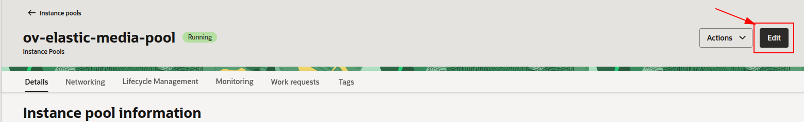
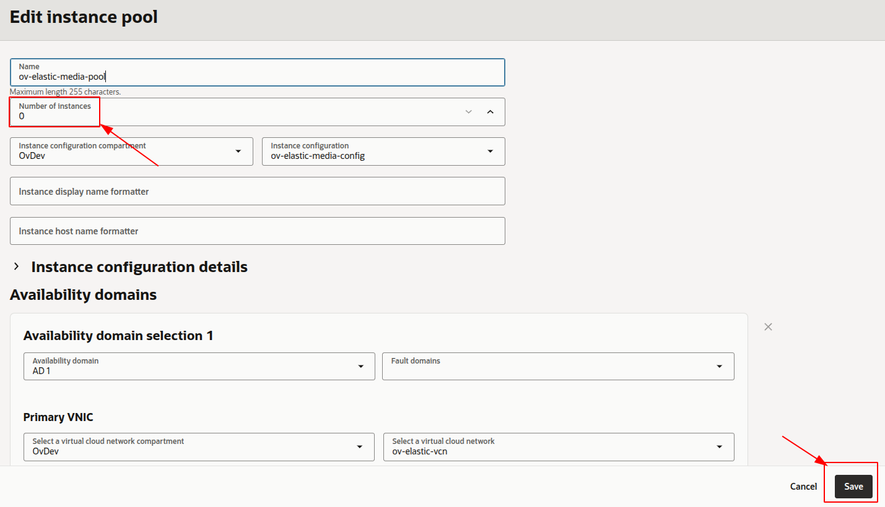
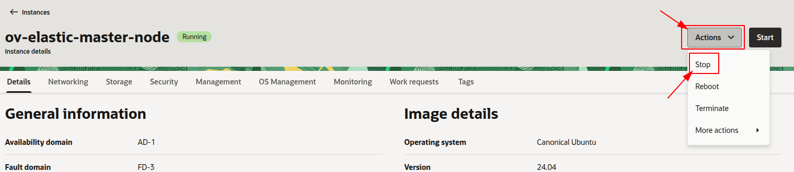
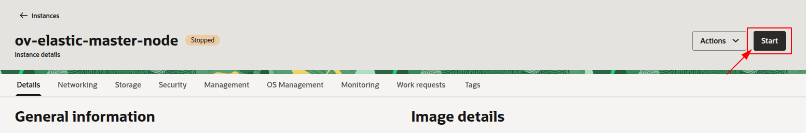
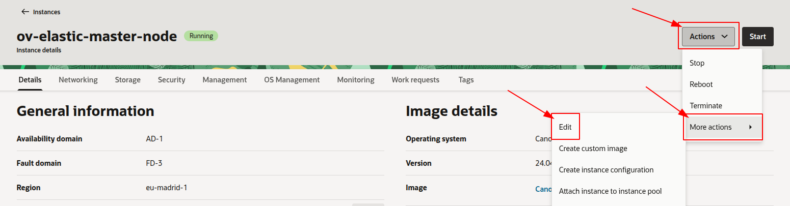
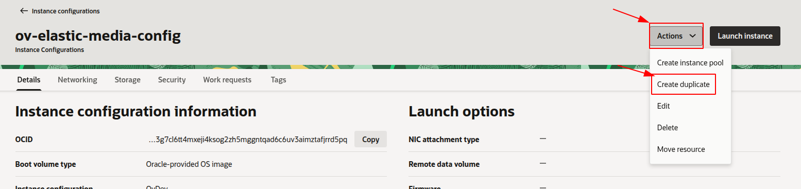
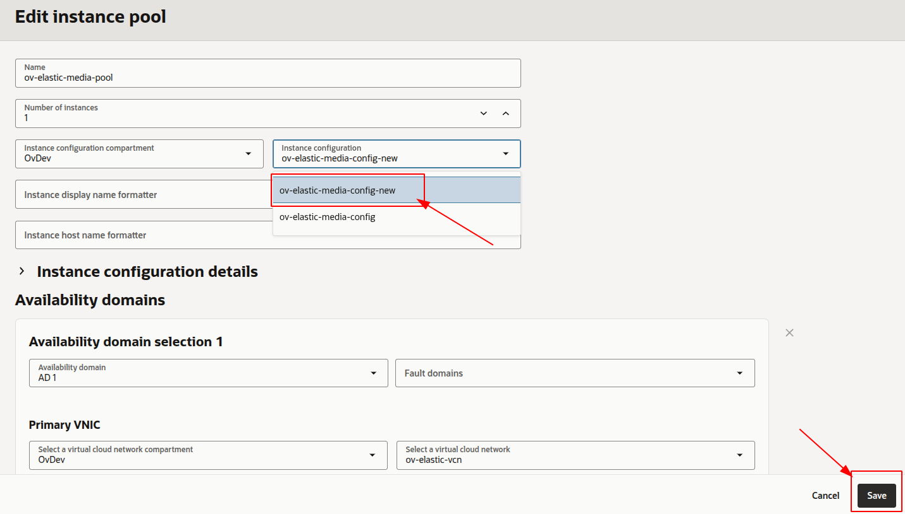
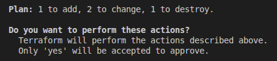
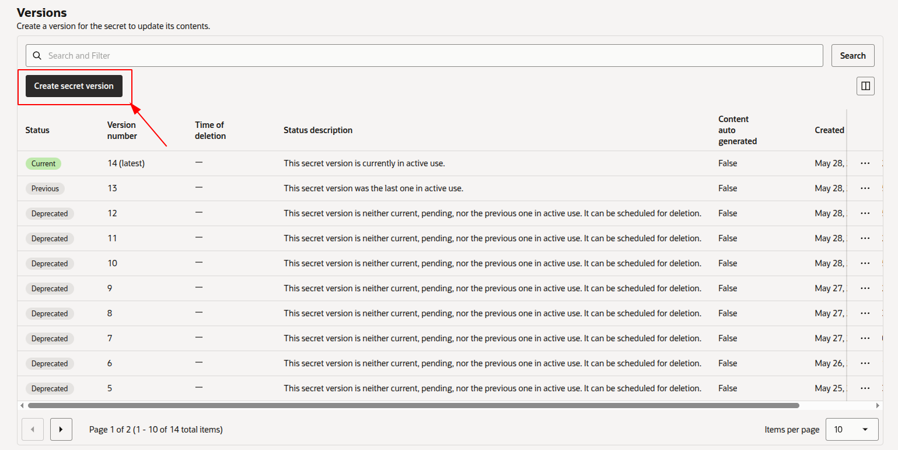
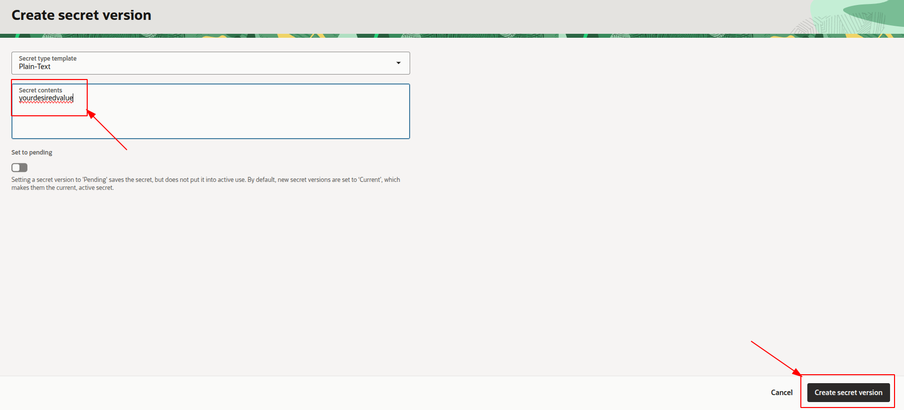

# OpenVidu Elastic administration: Oracle Cloud Infrastructure

<div class="provider-chip" markdown>

:custom-oracle-cloud-infrastructure:{ .provider-chip-icon } Oracle Cloud Infrastructure

</div>


The deployment of OpenVidu Elastic on Oracle Cloud Infrastructure is automated using the Terraform CLI, where Media Nodes are part of an [OCI Instance Pool :fontawesome-solid-external-link:{.external-link-icon}](https://docs.oracle.com/en-us/iaas/Content/Compute/Tasks/creatinginstancepool.htm){:target=\_blank}. An OCI Function takes care of triggering scale-in actions, while the Instance Pool itself handles scale-out when more capacity is needed.

Internally, the Oracle Cloud Infrastructure Elastic deployment mirrors the On Premises Elastic deployment, allowing you to follow the same administration and configuration guidelines of the [On Premises Elastic](../on-premises/admin.md) documentation. However, there are specific considerations unique to the Oracle Cloud Infrastructure environment that are worth keeping in mind:

## Cluster shutdown and startup

The Master Node is a Compute instance, while the Media Nodes are part of an OCI Instance Pool. The process for starting and stopping these components differs:

=== "Shutting down the cluster"

    To shut down the cluster, you need to stop the Media Nodes and then stop the Master Node.

    1. Navigate to the [OCI Instance Pools :fontawesome-solid-external-link:{.external-link-icon}](https://cloud.oracle.com/compute/instance-pools){:target=_blank}.
    2. Click into the Instance Pool called `<STACK_NAME>-media-pool`, then click on _"Edit"_.
        <figure markdown>
        { .svg-img .dark-img }
        </figure>
    3. Set the **Number of instances** to 0, then click _"Save changes"_ and wait for the change to be applied.
        <figure markdown>
        { .svg-img .dark-img }
        </figure>
    4. After confirming that all Media Node instances are terminated, go to [OCI Compute Instances :fontawesome-solid-external-link:{.external-link-icon}](https://cloud.oracle.com/compute/instances){:target=_blank} and click the instance called `<STACK_NAME>-master-node`. There, click _"Stop"_ to stop the Master Node.
        <figure markdown>
        { .svg-img .dark-img }
        </figure>


=== "Starting up the cluster"

    To start the cluster, first start the Master Node and then the Media Nodes.

    1. Navigate to the [OCI Compute Instances :fontawesome-solid-external-link:{.external-link-icon}](https://cloud.oracle.com/compute/instances){:target=_blank}.
    2. Select the instance named `<STACK_NAME>-master-node`, then click _"Start"_ to start the Master Node.
        <figure markdown>
        { .svg-img .dark-img }
        </figure>
    3. Wait until the instance is running.
    4. Go to the [OCI Instance Pools :fontawesome-solid-external-link:{.external-link-icon}](https://cloud.oracle.com/compute/instance-pools){:target=_blank} and click the Instance Pool called `<STACK_NAME>-media-pool`, then click on _"Edit"_.
        <figure markdown>
        { .svg-img .dark-img }
        </figure>
    5. Set the **Number of instances** to your desired value and click _"Save changes"_, then wait for the Instance Pool to apply the changes.

## Change the instance shape

You can change the OCI Compute shape of both the Master Node and the Media Nodes. Since the Media Nodes belong to an Instance Pool, the process differs. The following section details the procedures:

=== "Master Node"

    !!! warning

        This procedure requires downtime, as it involves stopping the Master Node.

    1. [Shutdown the cluster](#shutting-down-the-cluster).

        !!! info

            You can stop only the Master Node instance to change its shape, but it is recommended to stop the whole cluster to avoid any issues.
    2. Go to the [OCI Compute Instances :fontawesome-solid-external-link:{.external-link-icon}](https://cloud.oracle.com/compute/instances){:target=_blank} and locate the resource with the name `<STACK_NAME>-master-node` and click on it.
    3. Click _"Edit"_ next to the **Shape** field, select the new shape (or adjust OCPUs/Memory for Flex shapes) and click _"Save changes"_.
        <figure markdown>
        { .svg-img .dark-img }
        </figure>
    4. [Start the cluster](#starting-up-the-cluster).

=== "Media Nodes"

    !!! warning
        This will replace the running Media Nodes without graceful shutdown. If you want to drain them gracefully, run `/usr/local/bin/graceful_shutdown.sh` on each Media Node and wait for it to finish before changing the Instance Configuration, since the Instance Pool will terminate existing instances and launch new ones with the updated configuration.

    1. Navigate to the [OCI Instance Configurations :fontawesome-solid-external-link:{.external-link-icon}](https://cloud.oracle.com/compute/instance-configurations){:target=_blank}.
    2. Locate the Instance Configuration used by `<STACK_NAME>-media-pool`, click on it and select _"Create new instance configuration"_ (or edit if your workflow allows it) with the new shape, OCPUs and memory.
        <figure markdown>
        { .svg-img .dark-img }
        </figure>
    3. Go back to the [OCI Instance Pools :fontawesome-solid-external-link:{.external-link-icon}](https://cloud.oracle.com/compute/instance-pools){:target=_blank}, open `<STACK_NAME>-media-pool`, click _"Edit"_, and change the **Instance Configuration** to the one you just created. Click _"Save changes"_ and wait for the Instance Pool to roll out the new configuration.
        <figure markdown>
        { .svg-img .dark-img }
        </figure>

## Media Nodes Autoscaling Configuration

You can modify the autoscaling configuration of the Media Nodes via the `terraform.tfvars` file and `terraform apply`:

=== "Media Nodes Autoscaling Configuration"

    1. Go to the `terraform.tfvars` file and change the values related to autoscaling, such as:
        - **scaleTargetCPU**
        - **minNumberOfMediaNodes**
        - **maxNumberOfMediaNodes**

    2. Open a terminal and run the following command once you have updated the value(s):
    ```
    terraform apply
    ```
    3. Confirm the change that Terraform proposes (it will update the Instance Pool autoscaling configuration and redeploy the OCI Function with the new values), and the changes will take effect.
        <figure markdown>
        { .svg-img .dark-img }
        </figure>

## Switching between elastic and fixed mode

You can switch between **elastic mode** (autoscaling Instance Pool + scale-in OCI Function + graceful drain on every Media Node) and **fixed mode** (a static number of Media Nodes with no scale-in infrastructure) at any time by changing the **`fixedNumberOfMediaNodes`** variable and running `terraform apply`. Both transitions replace the Master Node and recreate the Media Node `instance_configuration` — read the relevant tab carefully before applying.

=== "Switch from elastic to fixed mode"

    Set `fixedNumberOfMediaNodes = N` (with `N > 0`) in `terraform.tfvars` and run `terraform apply`.

    Terraform will:

    1. Destroy the 7 scale-in resources: the autoscaling configuration, the OCI Function, its Function Application, Log Group, Log and the scale-in IAM Dynamic Group + Policy.
    2. Resize the Instance Pool from `initialNumberOfMediaNodes` (typically `1`) to `N`. If `N > 1`, OCI launches the additional Media Nodes.
    3. Replace the Media Node `instance_configuration`. The new user-data omits the pre-drain daemon and the graceful-shutdown service. The Instance Pool updates its pointer; **existing Media Nodes keep running with the old user-data** — `openvidu-pre-drain.service` is installed on them but stays idle, since the OCI Function it watches for has been destroyed.
    4. Replace the Master Node — its user-data changes (the `invoke_scalein.sh` cron is removed), which forces a recreation. **Expect ~3–5 min of control-plane downtime** (Dashboard, Meet, signaling, recordings) while the new Master Node boots, pulls every secret from the OCI Vault and reinstalls OpenVidu.

    !!! info "What does not break"

        - Existing Media Nodes are never terminated by this switch — the pool resize only **adds** nodes, never removes. Active Rooms on existing Media Nodes keep running through the transition.
        - All OCI Vault secrets persist, so the new Master Node rejoins the same deployment without re-generating credentials.

    !!! warning "Mixed fleet on disk"

        Media Nodes that existed before the switch keep the elastic-mode user-data (pre-drain installed but inert); Media Nodes launched after the switch use the fixed-mode user-data. Both are functionally equivalent in fixed mode — only what is on disk differs.

=== "Switch from fixed back to elastic mode"

    Set `fixedNumberOfMediaNodes = 0` in `terraform.tfvars` and run `terraform apply`.

    Terraform will:

    1. Recreate the 7 scale-in resources. The OCI Function image is pulled from OCIR and takes ~30–60 s to be ready. IAM propagation takes another ~60–120 s after that; during the first ~60–120 s after `apply` finishes the Function exists but its Dynamic Group may not yet have propagated, so the **first** scheduled invocation (cron `*/5 * * * *`) can fail with `NotAuthorized`. The next one succeeds.
    2. Resize the Instance Pool from `N` to `initialNumberOfMediaNodes` (default `1`). **If `N > initialNumberOfMediaNodes`, OCI terminates `N - initialNumberOfMediaNodes` Media Nodes.** Because those Media Nodes were launched in fixed mode they do **not** have the pre-drain daemon, so OCI falls back to an ACPI shutdown with the hypervisor's ~15 min cap. Active Rooms on the terminating nodes are cut when that cap expires.

        !!! warning "Avoid mid-call disruption"

            Before applying the switch, set `initialNumberOfMediaNodes` (and `minNumberOfMediaNodes`) to the current `fixedNumberOfMediaNodes` value so the pool target does not drop. Alternatively, wait for the existing Media Nodes to drain naturally before switching.

    3. Replace the Media Node `instance_configuration` with one whose user-data includes the pre-drain daemon and the graceful-shutdown service. The Instance Pool updates its pointer; Media Nodes that survived the resize keep the old user-data **without** pre-drain. Only Media Nodes launched **after** this point (typically by the new autoscaling configuration) will include pre-drain.
    4. Replace the Master Node (same recreation as the reverse direction → **~3–5 min of control-plane downtime**). The new Master Node reinstalls the `invoke_scalein.sh` cron.
    5. Attach the autoscaling configuration to the Instance Pool. From this point OCI owns the pool size, scaling between `minNumberOfMediaNodes` and `maxNumberOfMediaNodes` according to `scaleTargetCPU`.

    !!! warning "Legacy Media Nodes have no pre-drain"

        Media Nodes that survived from fixed mode lack the pre-drain daemon. The first time the OCI Function decides to scale-in one of them, it will detach it from the Instance Pool normally — but the node will not detect the detach and will not self-terminate. It stays running indefinitely as an **orphan** until either:

        - `cleanup_orphaned_media_nodes` sweeps it on the next `terraform destroy`, or
        - You terminate it manually from the OCI Console.

        **Recommended after the switch:** rotate the legacy Media Nodes — terminate them one by one from the OCI Console so the Instance Pool replaces them with new Media Nodes that include pre-drain. Alternatively, destroy and recreate the entire pool.

### Deactivate scale-in without switching to fixed mode

The scale-in OCI Function is invoked every 5 minutes by a cron job on the Master Node (`*/5 * * * * /usr/local/bin/invoke_scalein.sh`). If you want to keep the autoscaling configuration but temporarily stop scale-in actions without recreating the function, disable that cron entry on the Master:

=== "Pause scale-in invocations on the Master"

    1. SSH into the Master Node as `ubuntu`.
    2. Open the root crontab:
        ```bash
        sudo crontab -e
        ```
    3. Comment out (prepend `#`) the line that runs `/usr/local/bin/invoke_scalein.sh` and save. The function will stop being invoked but stays deployed.
    4. To re-enable scale-in, uncomment the line again.

    !!! info

        For a permanent change, use `fixedNumberOfMediaNodes > 0` instead — it removes the function entirely, so you don't pay for an idle OCI Function.

## Administration and configuration

Regarding the administration of your deployment, you can follow the instructions in section [On Premises Elastic Administration](../on-premises/admin.md).

Regarding the configuration of your deployment, you can follow the instructions in section [Changing Configuration](../../configuration/changing-config.md). Additionally, the [How to Guides](../../how-to-guides/index.md) offer multiple resources to assist with specific configuration changes.

In addition to these, an Oracle Cloud Infrastructure deployment provides the capability to manage global configurations via the OCI Console using OCI Vault Secrets:

=== "Changing configuration through OCI Secret Manager"

    1. Navigate to the [OCI Secrets Manager :fontawesome-solid-external-link:{.external-link-icon}](https://cloud.oracle.com/security/secrets){:target="_blank"} in the OCI Console.
    2. Click the secret you want to change.
    3. Scroll down to _"Versions"_ and click _"Create secret version"_ to add a new version with the updated value.
            <figure markdown>
            { .svg-img .dark-img }
            </figure>
    4. Enter the new secret value and click _"Create secret version"_.
            <figure markdown>
            { .svg-img .dark-img }
            </figure>
    5. [Shut down](#shutting-down-the-cluster) and [start up](#starting-up-the-cluster) the cluster to apply the changes to the OpenVidu Elastic deployment.

    Changes will be applied automatically.

## Backup and Restore

Review the [Backup and restore OpenVidu deployments](../../how-to-guides/backup-and-restore.md) guide for recommended backup workflows.
