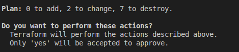
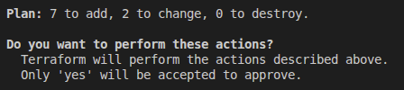

# OpenVidu Elastic administration: Oracle Cloud Infrastructure

<div class="provider-chip" markdown>

:custom-oracle-cloud-infrastructure:{ .provider-chip-icon } Oracle Cloud Infrastructure

</div>


The deployment of OpenVidu Elastic on Oracle Cloud Infrastructure is automated using the Terraform CLI, where Media Nodes are part of an [OCI Instance Pool :fontawesome-solid-external-link:{.external-link-icon}](https://docs.oracle.com/en-us/iaas/Content/Compute/Tasks/creatinginstancepool.htm){:target=\_blank}. An OCI Function takes care of triggering scale-in actions, while the Instance Pool itself handles scale-out when more capacity is needed.

Internally, the Oracle Cloud Infrastructure Elastic deployment mirrors the On Premises Elastic deployment, allowing you to follow the same administration and configuration guidelines of the [On Premises Elastic](../on-premises/admin.md) documentation. However, there are specific considerations unique to the Oracle Cloud Infrastructure environment that are worth keeping in mind:

## Cluster shutdown and startup

The Master Node is a Compute instance, while the Media Nodes are part of an OCI Instance Pool. The process for starting and stopping these components differs:

=== "Shutting down the cluster"

    To shut down the cluster, you need to stop the Media Nodes and then stop the Master Node.

    !!! warning "Gracefully stopping Media Nodes"

        Setting the Instance Pool size to 0 terminates the Media Nodes immediately without waiting for active Rooms to complete. The graceful drain that the scale-in OCI Function performs is **not** invoked on a manual pool resize.

        Wait for your active Rooms to finish before stopping the cluster, or SSH into each Media Node and run `/usr/local/bin/graceful_shutdown.sh` to drain it before saving the change.

    1. Navigate to the [OCI Instance Pools :fontawesome-solid-external-link:{.external-link-icon}](https://cloud.oracle.com/compute/instance-pools){:target=_blank}.
    2. Click into the Instance Pool called `<STACK_NAME>-media-pool`, then click on _"Edit"_.
        <figure markdown>
        { .svg-img .dark-img }
        </figure>
    3. Set the **Number of instances** to 0, then click _"Save changes"_ and wait for the change to be applied.
        <figure markdown>
        { .svg-img .dark-img }
        </figure>
    4. After confirming that all Media Node instances are terminated, go to [OCI Compute Instances :fontawesome-solid-external-link:{.external-link-icon}](https://cloud.oracle.com/compute/instances){:target="_blank"} and click the instance called `<STACK_NAME>-master-node`. There, click *"Stop"* to stop the Master Node.
        <figure markdown>
        { .svg-img .dark-img }
        </figure>


=== "Starting up the cluster"

    To start the cluster, first start the Master Node and then the Media Nodes.

    1. Navigate to the [OCI Compute Instances :fontawesome-solid-external-link:{.external-link-icon}](https://cloud.oracle.com/compute/instances){:target=_blank}.
    2. Select the instance named `<STACK_NAME>-master-node`, then click _"Start"_ to start the Master Node.
        <figure markdown>
        { .svg-img .dark-img }
        </figure>
    3. Wait until the instance is running.
    4. Go to the [OCI Instance Pools :fontawesome-solid-external-link:{.external-link-icon}](https://cloud.oracle.com/compute/instance-pools){:target="_blank"} and click the Instance Pool called `<STACK_NAME>-media-pool`, then click on *"Edit"*.
        <figure markdown>
        { .svg-img .dark-img }
        </figure>
    5. Set the **Number of instances** to your desired value and click _"Save changes"_, then wait for the Instance Pool to apply the changes.

        !!! warning

            This **Number of instances** is just an initial set — it does **not** become a fixed size and does **not** raise `minNumberOfMediaNodes`. If you set it above `minNumberOfMediaNodes`, the scale-in OCI Function may terminate the extra Media Nodes back down to the minimum as soon as it detects low CPU usage.

## Change the instance shape

You can change the OCI Compute shape of both the Master Node and the Media Nodes. Since the Media Nodes belong to an Instance Pool, the process differs. The following section details the procedures:

=== "Master Node"

    !!! warning

        This procedure requires downtime, as it involves stopping the Master Node.

    1. [Shutdown the cluster](#shutting-down-the-cluster).

        !!! info

            You can stop only the Master Node instance to change its shape, but it is recommended to stop the whole cluster to avoid any issues.
    2. Go to the [OCI Compute Instances :fontawesome-solid-external-link:{.external-link-icon}](https://cloud.oracle.com/compute/instances){:target="_blank"} and locate the resource with the name `<STACK_NAME>-master-node` and click on it.
    3. Click _"Edit"_ next to the **Shape** field, select the new shape (or adjust OCPUs/Memory for Flex shapes) and click _"Save changes"_.
        <figure markdown>
        { .svg-img .dark-img }
        </figure>
    4. [Start the cluster](#starting-up-the-cluster).

=== "Media Nodes"

    !!! warning
        This will replace the running Media Nodes without graceful shutdown. If you want to drain them gracefully, run `/usr/local/bin/graceful_shutdown.sh` on each Media Node and wait for it to finish before changing the Instance Configuration, since the Instance Pool will terminate existing instances and launch new ones with the updated configuration.

    1. Navigate to the [OCI Instance Configurations :fontawesome-solid-external-link:{.external-link-icon}](https://cloud.oracle.com/compute/instance-configurations){:target=_blank}.
    2. Locate the Instance Configuration used by `<STACK_NAME>-media-pool`, click on it, open the *"Actions"* menu and select *"Create duplicate"*. The form opens pre-filled with the current configuration — adjust the shape (or OCPUs/Memory for Flex shapes) and create the new Instance Configuration.
        <figure markdown>
        { .svg-img .dark-img }
        </figure>

        !!! warning

            **Only change the shape** (or OCPUs/Memory for Flex shapes). Do **not** modify any other field — the rest of the configuration must remain identical to the original so the Instance Pool keeps working as expected.

    3. Go back to the [OCI Instance Pools :fontawesome-solid-external-link:{.external-link-icon}](https://cloud.oracle.com/compute/instance-pools){:target="_blank"}, open `<STACK_NAME>-media-pool`, click *"Edit"*, and change the **Instance Configuration** to the one you just created. Click *"Save changes"* and wait for the Instance Pool to roll out the new configuration.
        <figure markdown>
        { .svg-img .dark-img }
        </figure>
    4. Terminate the existing Media Nodes from the [OCI Compute Instances :fontawesome-solid-external-link:{.external-link-icon}](https://cloud.oracle.com/compute/instances){:target="_blank"} page so the Instance Pool replaces them with new ones launched from the updated Instance Configuration. Old Media Nodes are **not** replaced automatically when the Instance Configuration changes — only newly launched instances use the new shape.

## Media Nodes Autoscaling Configuration

!!! warning

    If you previously [changed the Media Node shape](#change-the-instance-shape) by creating a duplicated Instance Configuration manually from the OCI Console, Terraform is unaware of it. Running `terraform apply` will point the Instance Pool back to its own Instance Configuration (the original one, recreated by Terraform), and the manually duplicated Instance Configuration will be orphaned.

You can modify the autoscaling configuration of the Media Nodes via the `terraform.tfvars` file and `terraform apply`:

=== "Media Nodes Autoscaling Configuration"

    1. Go to the `terraform.tfvars` file and change the values related to autoscaling, such as:
        - **scaleTargetCPU**
        - **minNumberOfMediaNodes**
        - **maxNumberOfMediaNodes**

    2. Open a terminal and run the following command once you have updated the value(s):
    ```
    terraform apply
    ```
    3. Confirm the change that Terraform proposes (it will update the Media Node Instance Pool and the OCI Function with the new values, and redeploy the Instance Configuration), and the changes will take effect.
        <figure markdown>
        { .svg-img .dark-img }
        </figure>

## Fixed Number of Media Nodes

You can switch between **elastic mode** (autoscaling Instance Pool + scale-in OCI Function) and **fixed mode** (a static number of Media Nodes with no autoscaling) by changing the **`fixedNumberOfMediaNodes`** variable and running `terraform apply`.

!!! warning

    Any Media Nodes terminated during these transitions are killed immediately without running the graceful shutdown — active Rooms on those nodes are cut.

=== "Activate Fixed Number of Media Nodes"

    1. Go to the `terraform.tfvars` file and set:
        - **`fixedNumberOfMediaNodes`** to the desired number of Media Nodes (must be greater than 0).

    2. Open a terminal and run:
        ```
        terraform apply
        ```

    3. Confirm the change that Terraform proposes. It will destroy the scale-in OCI Function and resize the Instance Pool to the fixed number of Media Nodes.
        <figure markdown>
        { .svg-img .dark-img }
        </figure>

=== "Activate Scale In"

    1. Go to the `terraform.tfvars` file and set:
        - **`fixedNumberOfMediaNodes`** to `0`.
        - **`scaleTargetCPU`** if you don't want the default.
        - **`minNumberOfMediaNodes`** if you don't want the default.
        - **`maxNumberOfMediaNodes`** if you don't want the default.

    2. Open a terminal and run:
        ```
        terraform apply
        ```

    3. Confirm the change that Terraform proposes. It will recreate the scale-in OCI Function and re-attach the autoscaling configuration to the Instance Pool.
        <figure markdown>
        { .svg-img .dark-img }
        </figure>

## Administration and configuration

Regarding the administration of your deployment, you can follow the instructions in section [On Premises Elastic Administration](../on-premises/admin.md).

Regarding the configuration of your deployment, you can follow the instructions in section [Changing Configuration](../../configuration/changing-config.md). Additionally, the [How to Guides](../../how-to-guides/index.md) offer multiple resources to assist with specific configuration changes.

In addition to these, an Oracle Cloud Infrastructure deployment provides the capability to manage global configurations via the OCI Console using OCI Vault Secrets:

=== "Changing configuration through OCI Secret Manager"

    1. Navigate to the [OCI Secrets Manager :fontawesome-solid-external-link:{.external-link-icon}](https://cloud.oracle.com/security/secrets){:target="_blank"} in the OCI Console.
    2. Click the secret you want to change.
    3. Scroll down to _"Versions"_ and click _"Create secret version"_ to add a new version with the updated value.
            <figure markdown>
            { .svg-img .dark-img }
            </figure>
    4. Enter the new secret value and click _"Create secret version"_.
            <figure markdown>
            { .svg-img .dark-img }
            </figure>
    5. [Shut down](#shutting-down-the-cluster) and [start up](#starting-up-the-cluster) the cluster to apply the changes to the OpenVidu Elastic deployment.

    Changes will be applied automatically.

## Backup and Restore

Review the [Backup and restore OpenVidu deployments](../../how-to-guides/backup-and-restore.md) guide for recommended backup workflows.
