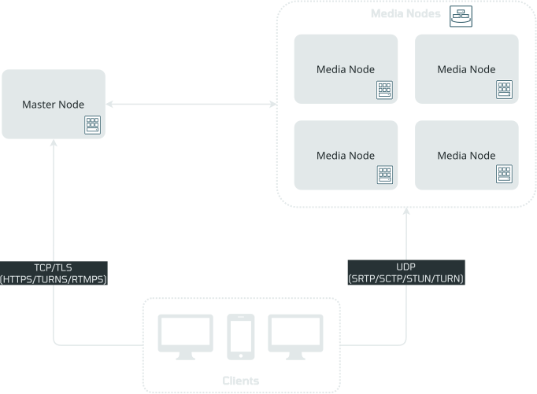
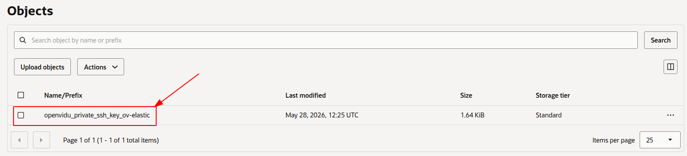
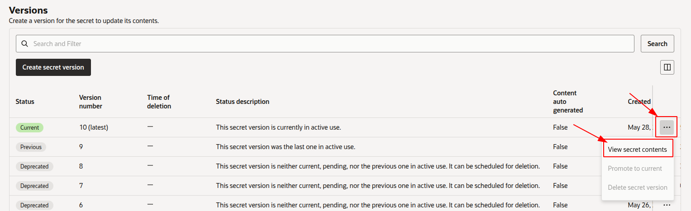

# OpenVidu Elastic installation: Oracle Cloud Infrastructure

--8<-- "self-hosting/oracle/provider-chip.md"


--8<-- "self-hosting/common/elastic-license-intro.md"

This section describes how to deploy a production-ready OpenVidu Elastic instance on Oracle Cloud Infrastructure (OCI). The deployed services are identical to those in the [On Premises Elastic installation](../on-premises/install.md), but are provisioned as OCI resources and the process is fully automated using the Terraform CLI.

- **OCI Object Storage** (S3-compatible via Customer Secret Keys) is used for storing application data and recordings.
- **OCI Vault** is used to securely store deployment secrets.
- Media Node scale-out is handled automatically by the **OCI Instance Pool autoscaling configuration** based on system load, and scale-in is delegated to an **OCI Function** that performs a graceful drain before terminating the instance. You can also use a fixed number of Media Nodes.

## Prerequisites

* An Oracle Cloud Infrastructure account with permissions to create Compute instances, VCNs, Object Storage buckets, Vaults, Functions and IAM resources.
* [Terraform CLI :fontawesome-solid-external-link:{.external-link-icon}](https://developer.hashicorp.com/terraform/tutorials/aws-get-started/install-cli){:target="_blank"} installed on your machine.
* Git installed on your machine.

=== "Architecture overview"

    The deployment architecture is as follows:

    { .round-corners .dark-img loading=lazy }

    - The Master Node acts as a Load Balancer, managing traffic and distributing it among the Media Nodes and the services running on the Master Node itself.
    - The Master Node has its own Caddy server acting as a Layer 4 (for TURN with TLS and RTMPS) and Layer 7 (for OpenVidu Dashboard, OpenVidu Meet, etc., APIs) reverse proxy.
    - WebRTC traffic (SRTP/SCTP/STUN/TURN) is routed directly to the Media Nodes.
    - Scale-out is performed automatically by the OCI Instance Pool autoscaling configuration based on the average CPU of the pool. Scale-in is delegated to an OCI Function that gracefully drains the target Media Node before terminating it.

## Custom scale-in strategy

Scale-out is handled natively by the OCI Instance Pool autoscaling configuration, which adds Media Nodes when the pool's average CPU exceeds **`scaleTargetCPU`**. Scale-in, however, uses a custom strategy to enable the graceful shutdown of Media Nodes, ensuring that active Rooms are never disrupted when the cluster removes a Media Node.

=== "Custom scale-in strategy"

    - An **OCI Function** is deployed and triggered on a regular schedule. It polls the average CPU of the Instance Pool against **`scaleTargetCPU`** and never scales the pool below **`minNumberOfMediaNodes`**, and when a scale-in decision is made, the target Media Node is flagged as "draining" so it stops accepting new Rooms.
    - Each Media Node runs a `systemd` daemon that periodically checks whether the instance has been marked as "draining". If so, the graceful shutdown script is triggered, which waits for all active Rooms on that node to end before shutting the instance down.

--8<-- "self-hosting/oracle/scalein-function-image.md"

## Deployment details

1. Clone the OpenVidu repository containing the Terraform files:

    ```bash
    git clone https://github.com/OpenVidu/openvidu-oracle.git
    git -C openvidu-oracle checkout 3.8.0
    cd openvidu-oracle/pro/elastic
    ```

2. Copy **`terraform.tfvars.example`** to **`terraform.tfvars`**, update the required parameters with your values, and adjust any optional defaults as needed.

    ??? details "Information about parameters"

        ### Mandatory Parameters

        | Input Value | Description |
        |---|---|
        | `tenancy_ocid`{ .nowrap } | OCI Tenancy OCID. Required for the Object Storage namespace. |
        | `compartment_ocid`{ .nowrap } | OCI Compartment OCID where resources will be created. |
        | `user_ocid`{ .nowrap } | OCI User OCID used to create Customer Secret Keys for S3-compatible access to Object Storage. |
        | `stackName`{ .nowrap } | Stack name for the OpenVidu deployment. |
        | `openviduLicense`{ .nowrap } | OpenVidu PRO license key. Visit [https://openvidu.io/account](https://openvidu.io/account){:target="_blank"} to obtain your license. |
        | `scale_in_function_image`{ .nowrap } | OCIR image URL consumed by the OCI Function that handles graceful Media Node scale-in. There is no default value — you must publish this image to an OCI Registry in your deployment's region and point this parameter to it. See [Publishing the scale-in function image](#publishing-the-scale-in-function-image). Ignored when `fixedNumberOfMediaNodes > 0`. |

        ### Optional Parameters

        | Input Value | Default Value | Description |
        |---|---|---|
        | `region`{ .nowrap } | `"eu-frankfurt-1"`{ .nowrap } | OCI region where resources will be created. |
        | `availability_domain`{ .nowrap } | `1`{ .nowrap } | Availability Domain number (1, 2, or 3) to use for resources. |
        | `masterNodeShape`{ .nowrap } | `"VM.Standard.E4.Flex"`{ .nowrap } | OCI Compute shape for the OpenVidu Master Node. |
        | `masterNodeOcpus`{ .nowrap } | `2`{ .nowrap } | Number of OCPUs for the Master Node (applies to Flex shapes only). |
        | `masterNodeMemory`{ .nowrap } | `8`{ .nowrap } | Memory in GB for the Master Node (applies to Flex shapes only). |
        | `masterNodeDiskSize`{ .nowrap } | `100`{ .nowrap } | Boot disk size in GB for the Master Node. |
        | `mediaNodeShape`{ .nowrap } | `"VM.Standard.E4.Flex"`{ .nowrap } | OCI Compute shape for the OpenVidu Media Nodes. |
        | `mediaNodeOcpus`{ .nowrap } | `3`{ .nowrap } | Number of OCPUs for each Media Node (applies to Flex shapes only). |
        | `mediaNodeMemory`{ .nowrap } | `4`{ .nowrap } | Memory in GB for each Media Node (applies to Flex shapes only). |
        | `mediaNodeDiskSize`{ .nowrap } | `100`{ .nowrap } | Boot disk size in GB for the Media Nodes. |
        | `fixedNumberOfMediaNodes`{ .nowrap } | `0`{ .nowrap } | If `> 0`, deploys a fixed number of Media Nodes with no autoscaling and no scale-in OCI Function (`initialNumberOfMediaNodes`, `minNumberOfMediaNodes`, `maxNumberOfMediaNodes`, `scaleTargetCPU` and `scale_in_function_image` are ignored). If `0` (default), the deployment is elastic and autoscaling is enabled. |
        | `initialNumberOfMediaNodes`{ .nowrap } | `1`{ .nowrap } | Initial number of Media Nodes to deploy. Ignored when `fixedNumberOfMediaNodes > 0`. |
        | `minNumberOfMediaNodes`{ .nowrap } | `1`{ .nowrap } | Minimum number of Media Nodes the autoscaling Instance Pool will keep running. Ignored when `fixedNumberOfMediaNodes > 0`. |
        | `maxNumberOfMediaNodes`{ .nowrap } | `5`{ .nowrap } | Maximum number of Media Nodes the autoscaling Instance Pool can launch. Ignored when `fixedNumberOfMediaNodes > 0`. |
        | `scaleTargetCPU`{ .nowrap } | `50`{ .nowrap } | Target CPU percentage. The Instance Pool autoscaling triggers scale-out above this threshold; the OCI Function triggers graceful scale-in when usage falls below it. Ignored when `fixedNumberOfMediaNodes > 0`. |
        | `certificateType`{ .nowrap } | `"letsencrypt"`{ .nowrap } | Certificate type for the OpenVidu deployment. Options: <ul><li>`selfsigned` - Not recommended for production use. Intended for testing or development environments only. A FQDN is not required.</li><li>`owncert` - Suitable for production environments. Uses your own certificate. A FQDN is required.</li><li>`letsencrypt` - Suitable for production environments. Can be used with or without a FQDN (if no FQDN is provided, the public IP is used as the domain name and a [Let's Encrypt](https://letsencrypt.org/2026/01/15/6day-and-ip-general-availability){:target="_blank"} certificate is issued for it).</li></ul> |
        | `domainName`{ .nowrap } | `(none)`{ .nowrap } | Domain name for the OpenVidu deployment. Optional — if not provided, the public IP is used as the domain name. |
        | `ownPublicCertificate`{ .nowrap } | `(none)`{ .nowrap } | If the certificate type is `owncert`, this parameter specifies the public certificate in base64 format. |
        | `ownPrivateCertificate`{ .nowrap } | `(none)`{ .nowrap } | If the certificate type is `owncert`, this parameter specifies the private certificate in base64 format. |
        | `initialMeetAdminPassword`{ .nowrap } | `(none)`{ .nowrap } | Initial password for the `admin` user in OpenVidu Meet. Alphanumeric characters, underscores or hyphens only (A-Z, a-z, 0-9, _, -). If not provided, a random password will be generated. |
        | `initialMeetApiKey`{ .nowrap } | `(none)`{ .nowrap } | Initial API key for OpenVidu Meet. Alphanumeric characters, underscores or hyphens only (A-Z, a-z, 0-9, _, -). If not provided, no API key will be set; one can be configured later from the Meet Console. |
        | `bucketName`{ .nowrap } | `(none)`{ .nowrap } | Name of the OCI Object Storage bucket for application data and recordings. If left empty, a bucket will be created with a default name. |
        | `rtcEngine`{ .nowrap } | `"pion"`{ .nowrap } | WebRTC media engine to use. Options: <ul><li>`pion` - Default media engine.</li><li>`mediasoup` - Alternative media engine with different performance characteristics.</li></ul> |
        | `vault_ocid`{ .nowrap } | `(none)`{ .nowrap } | OCI KMS Vault OCID for secrets management. If left empty, a new vault will be created. |
        | `key_ocid`{ .nowrap } | `(none)`{ .nowrap } | OCI KMS Key OCID for secrets management. If left empty, a new key will be created. |
        | `additionalInstallFlags`{ .nowrap } | `(none)`{ .nowrap } | Additional optional flags to pass to the OpenVidu installer (comma-separated, e.g., `--flag1=value, --flag2`). |

3. Deploy with Terraform using the following commands:

    ```bash
    terraform init
    terraform apply
    ```

4. Logs will appear in the `terraform apply` console output. Wait for it to finish and display `Apply Complete!`. Then go to [OCI Object Storage :fontawesome-solid-external-link:{.external-link-icon}](https://cloud.oracle.com/object-storage/buckets){:target="_blank"} and wait for the SSH key to appear in your configured bucket.

    !!! warning
        After downloading the SSH key, it is strongly recommended to **DELETE IT** from the bucket. This file is the private key used to access the Master Node — if exposed, unauthorized users could gain access.
    { .round-corners loading=lazy }

5. Set the correct permissions on the SSH key so it can be used.

--8<-- "self-hosting/oracle/ssh-key-permissions.md"

### Access OpenVidu

To verify that your OpenVidu deployment is working correctly, check the credentials in the OCI Vault Secrets Manager.

=== "View OpenVidu credentials in the Web"
    1. Navigate to the [OCI Secrets Manager :fontawesome-solid-external-link:{.external-link-icon}](https://cloud.oracle.com/security/secrets){:target="_blank"} in the OCI Console.
    2. Click the secret you want to view.
    3. Scroll down to _"Versions"_, click the _"3 dots"_ menu next to the current version, and select _"View secret contents"_.
        { .round-corners loading=lazy }

        !!! warning
            Click _"Show decoded Base64 digit"_ to see the actual value of the secret.

=== "View OpenVidu credentials in the instance"

    SSH into the Master Node by running the following command from the directory where your SSH key is located:
    ```bash
    ssh -i openvidu_private_ssh_key_<STACK_NAME>.pem ubuntu@PUBLIC_INSTANCE_IP
    ```

    Then navigate to `/opt/openvidu/config/` where you will find all credentials in the following files:

    - `openvidu.env`
    - `meet.env`

Open **OPENVIDU_URL** and you will see the OpenVidu Meet interface.

Log in with **MEET_INITIAL_ADMIN_PASSWORD** to start using OpenVidu Meet.

## Configure your application to use the deployment

To configure your OpenVidu application, you will need your OCI credentials. You can retrieve them by following the steps in [View OpenVidu credentials in the Web](#view-openvidu-credentials-in-the-web) or [View OpenVidu credentials in the instance](#view-openvidu-credentials-in-the-instance).

Your authentication credentials and the URL to point your applications to are:

--8<-- "self-hosting/oracle/credentials-general.md"

### Troubleshooting initial Oracle Cloud Infrastructure deployment

--8<-- "self-hosting/oracle/troubleshooting.md"

3. If everything appears to be in order, check the [status](../on-premises/admin.md#checking-the-status-of-services) and [logs](../on-premises/admin.md#checking-logs) of the installed OpenVidu services on the Master Node and Media Nodes.

### Configuration and administration

Once **OPENVIDU_URL** is reachable, the deployment is complete and working. See the [Administration](./admin.md) section to learn how to manage your OpenVidu Elastic deployment.
