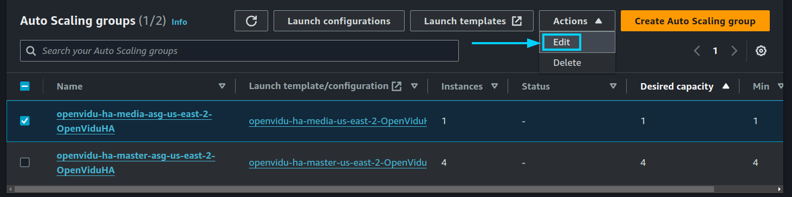
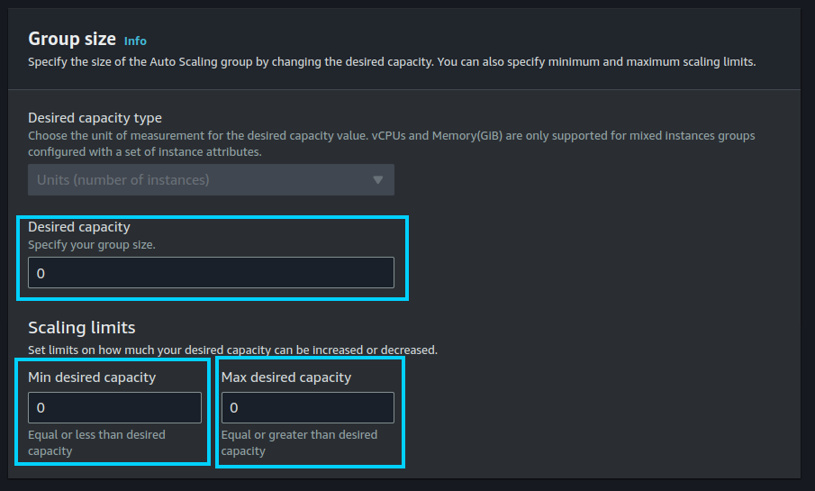
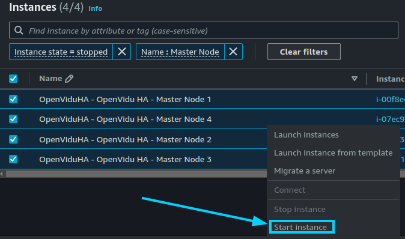
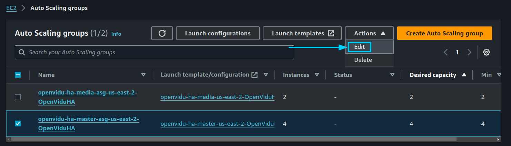
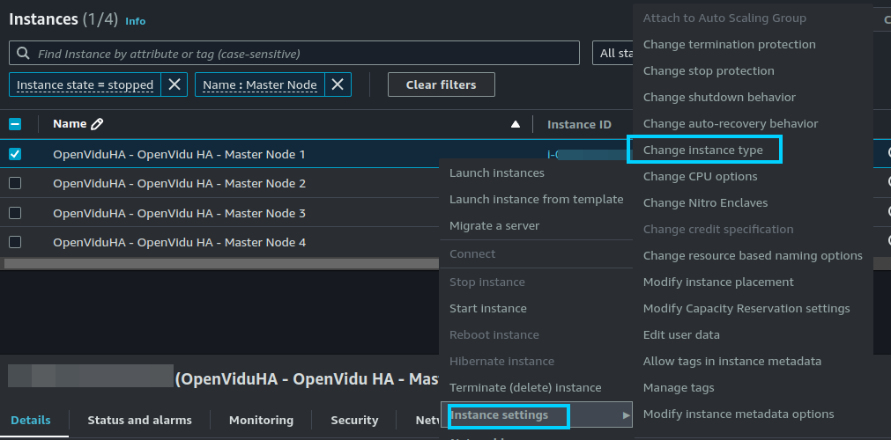
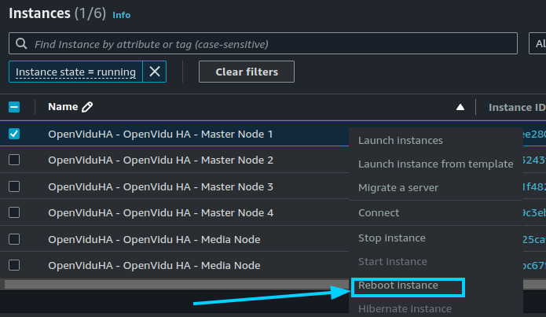

# OpenVidu High Availability: AWS Administration

The deployment of OpenVidu High Availability on AWS is automated using AWS CloudFormation, with 4 EC2 Instances as Master Nodes and any number of Media Nodes managed within an [Auto Scaling Group](https://docs.aws.amazon.com/autoscaling/ec2/userguide/auto-scaling-groups.html){:target=_blank}. The Auto Scaling Group of Media Nodes is configured to scale based on the target average CPU utilization.

Internally, the AWS deployment mirrors the on-premises setup, allowing you to follow the same administration and configuration guidelines provided in the [On Premises High Availability](../on-premises/admin.md) documentation. However, there are specific considerations unique to the AWS environment that are worth taking into account.

## Cluster Shutdown and Startup

You can start and stop the OpenVidu High Availability cluster at any time. The following sections detail the procedures.

=== "Shutdown the Cluster"

    To shut down the cluster, you need to stop the Media Nodes first and then stop the Master Nodes; this way, any ongoing session will not be interrupted.

    1. Navigate to the [CloudFormation Dashboard](https://console.aws.amazon.com/cloudformation/home){:target=_blank} on AWS.
    2. Select the CloudFormation Stack that you used to deploy OpenVidu High Availability.
    3. In the _"Resources"_ tab, locate the resource with the logical ID: **`OpenViduMediaNodeASG`**, and click on it to go to the Auto Scaling Group Dashboard with the Auto Scaling Group of the Media Nodes selected.
        <figure markdown>
        { .svg-img .dark-img }
        </figure>
    4. Click on _"Actions > Edit"_.
        <figure markdown>
        { .svg-img .dark-img }
        </figure>
    5. Set the _"Desired capacity"_, _"Min desired capacity"_, and _"Max desired capacity"_ to 0, and click on _"Update"_.
        <figure markdown>
        { .svg-img .dark-img }
        </figure>
    6. Wait until the _"Instance Management"_ tab shows that there are no instances in the Auto Scaling Group.
        <figure markdown>
        { .svg-img .dark-img }
        </figure>

        !!! warning
            
            It may happen that some instances are still in the _"Terminating:Wait"_ lifecycle state after setting the desired capacity to 0. This is because the Auto Scaling Group waits for the instances to finish processing any ongoing room, ingress, or egress operations before terminating them. This can take a few minutes. If you want to force the termination of the instances, you can manually terminate them from the EC2 Dashboard.

    7. Navigate to the [EC2 Dashboard](https://console.aws.amazon.com/ec2/v2/home#Instances:sort=instanceId){:target="_blank"} on AWS.
    8. Stop all the Master Nodes instances by selecting them and clicking on _"Stop instance"_.
        <figure markdown>
        { .svg-img .dark-img }
        </figure>
    9. Wait until the instances are stopped.

=== "Startup the Cluster"

    To start the cluster, we recommend starting the Master Node first and then the Media Nodes.

    1. Navigate to the [EC2 Dashboard](https://console.aws.amazon.com/ec2/v2/home#Instances:sort=instanceId){:target="_blank"} on AWS.
    2. Start all the Master Nodes instances by selecting them and clicking on _"Start instance"_.
        <figure markdown>
        { .svg-img .dark-img }
        </figure>
    3. Wait until the instances are running.
    5. Go to the [CloudFormation Dashboard](https://console.aws.amazon.com/cloudformation/home){:target=_blank} on AWS.
    6. Select the CloudFormation Stack that you used to deploy OpenVidu High Availability.
    7. Locate the resource with the logical ID: **`OpenViduMasterNodeASG`**. Click on it to go to the Auto Scaling Group Dashboard with the Auto Scaling Group of the Master Nodes selected.
        <figure markdown>
        { .svg-img .dark-img }
        </figure>
    8. Click on _"Actions > Edit"_.
        <figure markdown>
        { .svg-img .dark-img }
        </figure>
    9. Set the _"Desired capacity"_, _"Min desired capacity"_, and _"Max desired capacity"_ to the desired number of Media Nodes, and click on _"Update"_. **For the Master Nodes auto scaling group, the number of instances must be 4**.
        <figure markdown>
        { .svg-img .dark-img }
        </figure>
    10. Wait until the _"Instance Management"_ tab shows that there are the desired number of instances in the Auto Scaling Group.
        <figure markdown>
        { .svg-img .dark-img }
        </figure>
    11. Go back to the CloudFormation Stack and locate the resource with the logical ID: **`OpenViduMediaNodeASG`**. Click on it to go to the Auto Scaling Group Dashboard with the Auto Scaling Group of the Media Nodes selected.
        <figure markdown>
        { .svg-img .dark-img }
        </figure>
    12. Click on _"Actions > Edit"_.
        <figure markdown>
        { .svg-img .dark-img }
        </figure>
    13. Set the _"Desired capacity"_, _"Min desired capacity"_, and _"Max desired capacity"_ to the desired number of Media Nodes, and click on _"Update"_. In this example, we set the desired capacity to 2.
        <figure markdown>
        { .svg-img .dark-img }
        </figure>
    14. Wait until the _"Instance Management"_ tab shows that there are the desired number of instances in the Auto Scaling Group.
        <figure markdown>
        { .svg-img .dark-img }
        </figure>

## Change the instance type

It is possible to change the instance type of both the Master Node and the Media Nodes. The following section details the procedures.

=== "Master Nodes"

    !!! warning
        
        This procedure requires downtime, as it involves stopping all the Master Nodes and starting them again with the new instance type.

    1. Navigate to the [EC2 Dashboard](https://console.aws.amazon.com/ec2/v2/home#Instances:sort=instanceId){:target="_blank"} on AWS.
    2. Stop all the Master Nodes instances by selecting them and clicking on _"Stop instance"_.
        <figure markdown>
        { .svg-img .dark-img }
        </figure>
    3. Wait until the instances are stopped.
    4. For each node you want to change the instance type, select it, and click on _"Instance settings > Change instance type"_.
        <figure markdown>
        { .svg-img .dark-img }
        </figure>
    5. Select the new instance type and click on _"Change"_.
    6. Repeat the process for all the Master Nodes.

=== "Media Nodes"

    1. Go to the [CloudFormation Dashboard](https://console.aws.amazon.com/cloudformation/home){:target=_blank} on AWS.
    2. Select the CloudFormation Stack that you used to deploy OpenVidu High Availability.
    3. Locate the resource with the logical ID: **`OpenViduMediaNodeLaunchTemplate`**. Click on it to go to the Launch Template Dashboard with the Launch Template of the Media Nodes selected.
        <figure markdown>
        { .svg-img .dark-img }
        </figure>
    4. Click on _"Actions > Modify template (Create new version)"_.
        <figure markdown>
        { .svg-img .dark-img }
        </figure>
    5. In the _"Instance type"_ section, select the new instance type and click on _"Create template version"_.
        <figure markdown>
        { .svg-img .dark-img }
        </figure>
    6. Go to the CloudFormation Stack and locate the resource with the logical ID: **`OpenViduMediaNodeASG`**. Click on it to go to the Auto Scaling Group Dashboard with the Auto Scaling Group of the Media Nodes selected.
        <figure markdown>
        { .svg-img .dark-img }
        </figure>
    7. Click on _"Actions > Edit"_.
        <figure markdown>
        { .svg-img .dark-img }
        </figure>
    8. In the Launch Template section, select the new version of the launch template we just created at step 5 which is the highest version number.

        Then, click on _"Update"_.

        !!! info
            
            By configuring _"Latest"_ as the launch template version,  you no longer need to update the Auto Scaling Group every time you modify the launch template. The Auto Scaling Group will automatically use the latest version of the launch template.

        { .svg-img .dark-img }

    9. Terminate the old instances manually from the EC2 Dashboard if you want to force the termination of the instances. New instances will be launched with the new instance type.

        !!! info
            
            If you want to avoid downtime, you can wait until the Auto Scaling Group replaces the old instances with the new ones. But you will need to increase the desired capacity to force the replacement of the instances and then decrease it to the desired number of instances.

## Media Nodes Autoscaling Configuration

To configure the Auto Scaling settings for the Media Nodes, follow the steps outlined below. This configuration allows you to set the parameters that control how the Auto Scaling Group will scale based on the target average CPU utilization.

=== "Media Nodes Autoscaling Configuration"

    1. Navigate to the [CloudFormation Dashboard](https://console.aws.amazon.com/cloudformation/home){:target=_blank} on AWS.
    2. Select the CloudFormation Stack that you used to deploy OpenVidu High Availability.
    3. In the _"Resources"_ tab, locate the resource with the logical ID: **`OpenViduMediaNodeASG`** and click on it to go to the Auto Scaling Group Dashboard.
        <figure markdown>
        { .svg-img .dark-img }
        </figure>
    4. Click on _"Actions > Edit"_.
        <figure markdown>
        { .svg-img .dark-img }
        </figure>
    5. To configure scaling policies, navigate to the _"Automatic scaling"_ tab within the Auto Scaling Group Dashboard, select the unique _"Target tracking scaling"_ autoscaling policy, and click on _"Actions > Edit"_.
        <figure markdown>
        { .svg-img .dark-img }
        </figure>
    6. It will open a panel where you can configure multiple parameters. In this example, we set the target average CPU utilization to 30%. Then, click on _"Update"_.
        <figure markdown>
        { .svg-img .dark-img }
        </figure>

        !!! info
            
            OpenVidu High Availability is by default configured with a _"Target tracking scaling"_ policy that scales based on the target average CPU utilization, however, you can configure different autoscaling policies according to your needs. For more information on the various types of autoscaling policies and how to implement them, refer to the [AWS Auto Scaling documentation](https://docs.aws.amazon.com/autoscaling/ec2/userguide/as-scale-based-on-demand.html){:target=_blank}.

## Fixed Number of Media Nodes

If you need to maintain a fixed number of Media Nodes instead of allowing the Auto Scaling Group to dynamically adjust based on CPU utilization, you can configure the desired capacity settings accordingly. Follow the steps below to set a fixed number of Media Nodes:

=== "Set Fixed Number of Media Nodes"

    1. Navigate to the [CloudFormation Dashboard](https://console.aws.amazon.com/cloudformation/home){:target=_blank} on AWS.
    2. Select the CloudFormation Stack that you used to deploy OpenVidu High Availability.
    3. In the _"Resources"_ tab, locate the resource with the logical ID: **`OpenViduMediaNodeASG`** and click on it to go to the Auto Scaling Group Dashboard.
        <figure markdown>
        { .svg-img .dark-img }
        </figure>
    4. Click on _"Actions > Edit"_.
        <figure markdown>
        { .svg-img .dark-img }
        </figure>
    5. Set the _"Desired capacity"_, _"Min desired capacity"_, and _"Max desired capacity"_ to the fixed number of Media Nodes you require, and click on _"Update"_. In this example, we set the desired capacity to 2.
        <figure markdown>
        { .svg-img .dark-img }
        </figure>
    6. Wait until the _"Instance Management"_ tab shows that the Auto Scaling Group has the fixed number of instances running.
        <figure markdown>
        { .svg-img .dark-img }
        </figure>

## Administration and Configuration

For administration, you can follow the instructions from the [On Premises High Availability Administration](../on-premises/admin.md) section.

Regarding the configuration, in AWS it is managed similarly to an on-premises deployment. For detailed instructions, please refer to the [Changing Configuration](../../../self-hosting/configuration/changing-config.md) section. Additionally, the [How to Guides](../../../self-hosting/how-to-guides/index.md) offer multiple resources to assist with specific configuration changes.

In addition to these, an AWS deployment provides the capability to manage global configurations via the AWS Console using AWS Secrets created during the deployment. To manage configurations this way, follow these steps:

=== "Changing Configuration through AWS Secrets"

    1. Navigate to the [CloudFormation Dashboard](https://console.aws.amazon.com/cloudformation/home){:target=_blank} on AWS.
    2. Select the CloudFormation Stack that you used to deploy OpenVidu High Availability.
    3. In the _"Outputs"_ tab, click the Link at _"ServicesAndCredentials"_. This will open the AWS Secrets Manager which contains all the configurations of the OpenVidu High Availability Deployment.
        <figure markdown>
        { .svg-img .dark-img }
        </figure>
    4. Click on the _"Retrieve secret value"_ button to get the JSON with all the information.
        <figure markdown>
        { .svg-img .dark-img }
        </figure>
    5. Modify the parameter you want to change and click on _"Save"_. The changes will be applied to the OpenVidu High Availability deployment.
    6. Go to the EC2 Console and click on _"Reboot instance"_ in the Master Node instance to apply the changes.
        <figure markdown>
        { .svg-img .dark-img }
        </figure>

    The changes will be applied automatically in all the Nodes of the OpenVidu High Availability deployment.
