# OpenVidu High Availability installation: AWS

<div class="provider-chip" markdown>

:material-aws:{ .provider-chip-icon } AWS

</div>


--8<-- "self-hosting/common/ha-license-intro.md"

This section contains instructions for deploying a production-ready OpenVidu High Availability deployment on AWS. The deployed services are the same as in the [On Premises High Availability installation](../on-premises/install-nlb.md), but the process is automated through AWS CloudFormation.

First, import the template in the AWS CloudFormation console. You can click the following button...

[:fontawesome-brands-aws:{.deploy-button-icon} Deploy to AWS](https://console.aws.amazon.com/cloudformation/home?#/stacks/new?stackName=OpenViduHA&templateURL=https://s3.eu-west-1.amazonaws.com/get.openvidu.io/pro/ha/latest/aws/cf-openvidu-ha.yaml){.md-button .deploy-button .deploy-to-aws-btn target="_blank"}

...or access your [AWS CloudFormation console :fontawesome-solid-external-link:{.external-link-icon}](https://console.aws.amazon.com/cloudformation/home?#/stacks/new){:target="_blank"} and manually set this S3 URL in the `Specify template` section:

```
https://s3.eu-west-1.amazonaws.com/get.openvidu.io/pro/ha/latest/aws/cf-openvidu-ha.yaml
```

!!! info
    
    If you want to deploy a specific version of OpenVidu HA, replace `latest` with the version you want to deploy. For example, to deploy version `3.8.0`, use the following URL:

    ```
    https://s3.eu-west-1.amazonaws.com/get.openvidu.io/pro/ha/3.8.0/aws/cf-openvidu-ha.yaml
    ```

This is what the deployment architecture looks like.

=== "Architecture overview"

    { .round-corners .dark-img loading=lazy }

    - The Load Balancer distributes HTTPS traffic to the Master Nodes.
    - If RTMP media is ingested, the Load Balancer also routes this traffic to the Media Nodes.
    - WebRTC traffic (SRTP/SCTP/STUN/TURN) is routed directly to the Media Nodes.
    - Clients that cannot use UDP (for example, behind a firewall that blocks it) relay their media with TURN over TLS on **DomainName**, through the Load Balancer and the Master Nodes.
    - 4 fixed EC2 Instances are created for the Master Nodes. It must always be 4 Master Nodes to ensure high availability.
    - An autoscaling group of Media Nodes is created to scale the number of Media Nodes based on the system load.

=== "Network"

    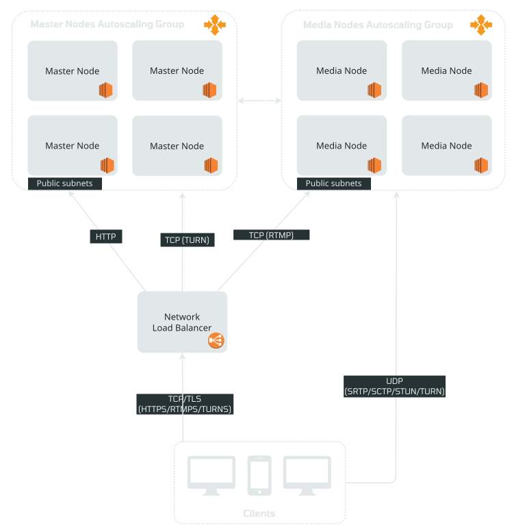{ .round-corners .dark-img loading=lazy }

    By default, every node has a public IP. Clients send media over UDP directly to the Media Nodes, the lowest latency and the best quality, and the Load Balancer runs in the Master Nodes' subnets. It is the simplest setup: no NAT gateway and no extra subnets or Load Balancers.

For this default deployment, these are the only parameters you need to fill in. Replace the example values with yours and leave every other parameter with its default value. The next section, [CloudFormation Parameters](#cloudformation-parameters), explains all of them.

| Parameter | Example value | Notes |
| --- | --- | --- |
| **DomainName** | `openvidu.example.com` | Your domain |
| **OpenViduCertificateARN** | `arn:aws:acm:us-east-1:123456789012:certificate/1a2b3c4d-5e6f-7a8b-9c0d-1e2f3a4b5c6d` | Your AWS Certificate Manager certificate for **DomainName** |
| **OpenViduLicense** | `<your OpenVidu license>` | [Request one](../../../../account.md) if you don't have it |
| **KeyName** | `my-key-pair` | An existing EC2 key pair of your account |
| **OpenViduVPC** | `vpc-0a1b2c3d4e5f67890` | Your VPC |
| **OpenViduMasterNodeSubnets** | `subnet-0aa11111,subnet-0aa22222,subnet-0aa33333,subnet-0aa44444` | Your public subnets, one per availability zone |
| **OpenViduMediaNodeSubnets** | `subnet-0aa11111,subnet-0aa22222,subnet-0aa33333,subnet-0aa44444` | Your public subnets, one per availability zone |

!!! info

    If your security policy does not allow public IPs on the nodes, or many of your clients are on networks that block UDP, see [Private subnets and TURN options](#private-subnets-and-turn-options) at the end of this page.

## CloudFormation Parameters

Depending on your needs, you need to fill the following CloudFormation parameters:

### Domain and Load Balancer configuration

In this section, you need to specify the domain name and the SSL certificate to use from AWS Certificate Manager. Optionally, you can also configure a dedicated TURN Load Balancer.

=== "Domain and Load Balancer configuration"

    The parameters in this section might look like this:

    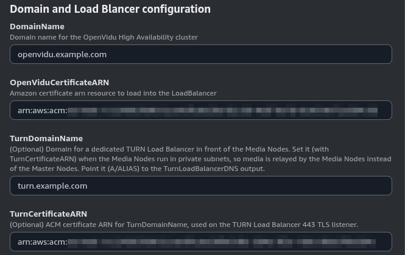{ .round-corners loading=lazy }

    Set the **DomainName** parameter to the domain name you intend to use for your OpenVidu deployment. Ensure this domain is not currently pointing to any other service; you can temporarily point it elsewhere.

    For the **OpenViduCertificateARN** parameter, specify the ARN of the SSL certificate you wish to use. This certificate should be created in the AWS Certificate Manager and configured for the domain specified in **DomainName**.

    The optional **TurnDomainName** and **TurnCertificateARN** parameters configure a dedicated TURN Load Balancer:

    - **What they do**: by default, clients that cannot send media over UDP use TURN over TLS on **DomainName**, and the Master Nodes relay that traffic to the Media Nodes. With these parameters, clients use **TurnDomainName** instead, and a dedicated TURN Load Balancer forwards the traffic directly to the Media Nodes (see layout 1 in [Private subnets and TURN options](#private-subnets-and-turn-options)).
    - **When to use them**: when many of your clients are on networks that block UDP, so that their media relay scales with the Media Nodes instead of adding load, even if small, to the Master Nodes.
    - **How to set them**: both are required to enable the TURN Load Balancer. Set **TurnDomainName** to a domain different from **DomainName** (for example `turn.example.io`) and **TurnCertificateARN** to the ARN of an AWS Certificate Manager certificate valid for it. Once the stack is created, point **TurnDomainName** to the `TurnLoadBalancerDNS` output.

    Leave both empty to keep the default behavior.

### OpenVidu HA Configuration

In this section, you need to specify some properties needed for the OpenVidu HA deployment.

=== "OpenVidu HA Configuration"

    Parameters of this section look like this:

    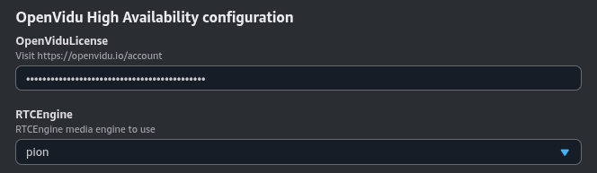{ .round-corners loading=lazy }

    Make sure to provide the **OpenViduLicense** parameter with the license key. If you don't have one, you can request one [here :fontawesome-solid-external-link:{.external-link-icon}](../../../../account.md){:target="_blank"}.

    For the **RTCEngine** parameter, you can choose between **Pion** (the default engine used by LiveKit) and **Mediasoup** (with a boost in performance). Learn more about the differences [here](../../production-ready/performance.md).

--8<-- "self-hosting/aws/meet.md"

### EC2 Instance Configuration

You need to specify some properties for the EC2 instances that will be created.

=== "EC2 Instance configuration"

    Parameters in this section look like this:

    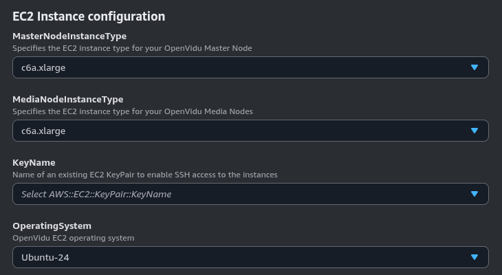{ .round-corners loading=lazy }

    Simply select the type of instance you want to deploy at **MasterNodeInstanceType** and **MediaNodeInstanceType**, the SSH key you want to use to access the machine at **KeyName**, and the Ubuntu distribution you want to use at **OperatingSystem**.

    By default, the parameter **OperatingSystem** is configured to use the latest LTS Ubuntu AMI, so ideally you don’t need to modify this.

    Besides SSH with **KeyName**, the Master and Media Nodes register with [AWS Systems Manager :fontawesome-solid-external-link:{.external-link-icon}](https://docs.aws.amazon.com/systems-manager/latest/userguide/session-manager.html){:target="_blank"}, so you can open a shell on any node from the AWS console with Session Manager. This needs no public IP and no open SSH port.

### Media Nodes Autoscaling Group Configuration

The number of Media Nodes can scale up or down based on the system load. You can configure the minimum and maximum number of Media Nodes and a target CPU utilization to trigger the scaling up or down.

--8<-- "self-hosting/aws/media-nodes-asg-config.md"

### S3 bucket for application data, cluster data and recordings

You can specify two S3 buckets to store the application data, cluster data, and recordings.

!!! info
    Port `9000` is MinIO's port. This deployment stores recordings and application data in Amazon S3 instead of MinIO, so MinIO is not deployed and port `9000` does not need to be open.

=== "S3 bucket for application data and recordings"

    Parameters in this section look like this:

    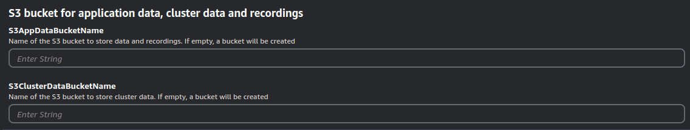{ .round-corners loading=lazy }

    If these parameters are not specified, new S3 buckets will be created by the CloudFormation stack.

### VPC Configuration

In this section, you need to specify the VPC and Subnet configuration for the deployment.

=== "VPC Configuration"

    Parameters in this section look like this:

    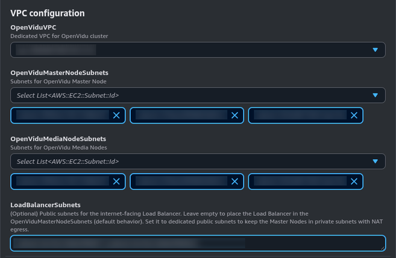{ .round-corners loading=lazy }

    The **OpenViduVPC** parameter specifies the VPC where the deployment will be created.

    The **OpenViduMasterNodeSubnets** specifies the subnets where the Master Nodes will be deployed. You can specify a maximum of 4 subnets.

    The **OpenViduMediaNodeSubnets** specifies the subnets where the Media Nodes will be deployed. There is no limit on the number of subnets you can specify.

    The optional **LoadBalancerSubnets** parameter specifies the public subnets where the internet-facing Load Balancer is placed. Leave it empty to place the Load Balancer in the **OpenViduMasterNodeSubnets** (the default behavior). Set it to dedicated public subnets when you want to run the Master Nodes in private subnets: the Load Balancer stays public and reachable while the Master Nodes have their own outbound internet access, for example through a NAT gateway. If you configure a dedicated TURN Load Balancer, it is placed in these subnets too, or in the **OpenViduMediaNodeSubnets** when this parameter is empty.

    !!! warning

        - It is recommended to deploy in a region with at least 4 availability zones and deploy the Master Nodes in 4 subnets, one in each availability zone. This is to ensure high availability.
        - By default, use public subnets for the Master Nodes and Media Nodes with the auto-assign public IP option enabled.
        - To run the Master Nodes or the Media Nodes in private subnets, see [Private subnets and TURN options](#private-subnets-and-turn-options).

### Volumes Configuration

In this section, you need to specify the configuration for the EBS volumes that will be created for the Master Nodes. Master Nodes will host all the recordings and metrics data replicated across all of them. The disk size of the EBS volumes is the same for all Master Nodes.

=== "Volumes Configuration"

    Parameters in this section look like this:

    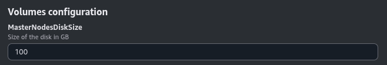{ .round-corners loading=lazy }

    The **MasterNodesDiskSize** parameter specifies the size of the EBS volumes in GB.

--8<-- "self-hosting/aws/additional-flags.md"

## Deploying the stack

When you are ready with your CloudFormation parameters, just click on _"Next"_, specify in _"Stack failure options"_ the option _"Preserve successfully provisioned resources"_ to be able to troubleshoot the deployment in case of error, click on _"Next"_ again, and finally _"Submit"_. The stack will take about 5 to 12 minutes to create all resources.

When everything is ready, you will see the following links in the _"Outputs"_ section of CloudFormation:

=== "CloudFormation Outputs"

    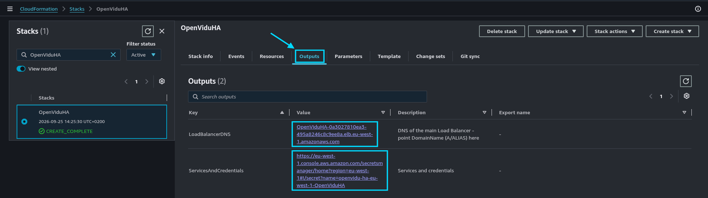{ .round-corners loading=lazy }

    Point **DomainName** to the **LoadBalancerDNS** output, for example with a CNAME or an alias record.

=== "With a dedicated TURN Load Balancer"

    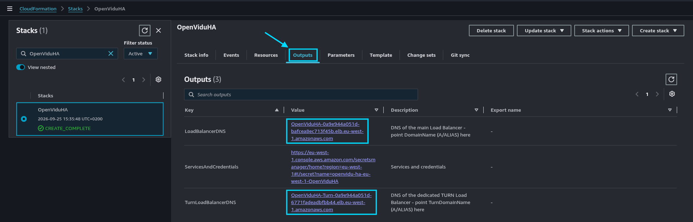{ .round-corners loading=lazy }

    If you configured a dedicated TURN Load Balancer, the Outputs also include **TurnLoadBalancerDNS**. Point **DomainName** to the **LoadBalancerDNS** output and **TurnDomainName** to the **TurnLoadBalancerDNS** output, for example with a CNAME or an alias record for each one.

## Configure your application to use the deployment

The Output Key **ServicesAndCredentials** of the [previous section](#deploying-the-stack) points to an AWS Secret Manager secret that contains all URLs and credentials to access the services deployed. You can access the secret by clicking on the link in the **Output Value** column.

Then, click on **Retrieve secret value** to get the JSON with all the information.

<div class="grid-container" markdown>

<div class="grid-50" markdown>
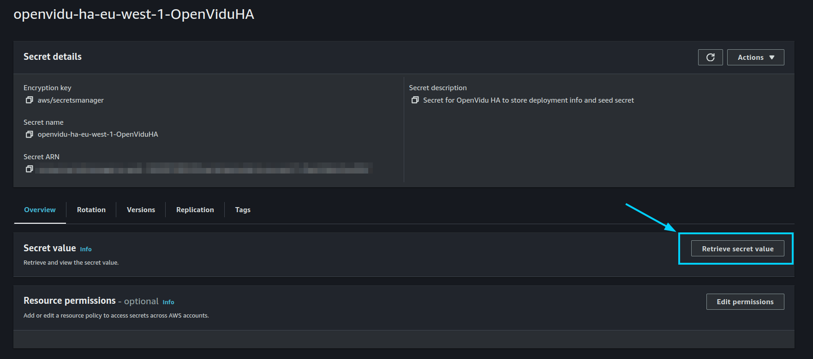{ .round-corners loading=lazy }
</div>

<div class="grid-50" markdown>
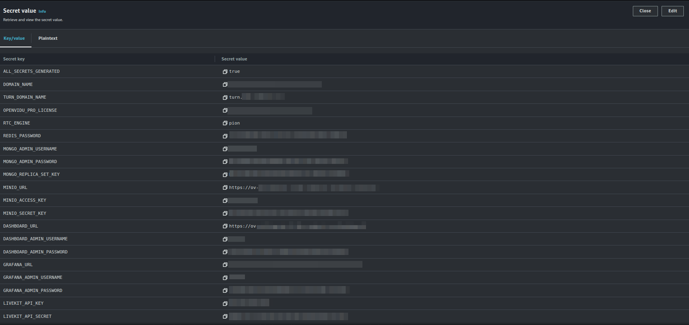{ .round-corners loading=lazy }
</div>

</div>

To use your OpenVidu deployment, check the values of the JSON secret. All access credentials of all services are defined in this object. The most relevant ones are:

--8<-- "self-hosting/aws/credentials-general.md"
--8<-- "self-hosting/aws/credentials-v2compatibility.md"

## Private subnets and TURN options

The default deployment puts every node in a public subnet. These four layouts change only the parameters that decide the network: the subnets of each node group, **LoadBalancerSubnets**, and the optional **TurnDomainName** and **TurnCertificateARN**. Each one shows the value of those parameters; fill in the rest as in the default deployment at the top of this page.

Nodes in private subnets always need outbound internet access, for example through a NAT gateway: they download OpenVidu during the installation and, while running, connect to the OpenVidu license service to validate the license.

Behind a NAT gateway, all the nodes reach Docker Hub from the same public IP, and Docker Hub limits the anonymous pulls per IP. So that many Media Nodes pulling at once do not hit that limit, when the Media Nodes are in private subnets the Master Nodes also run a pull-through cache of Docker Hub, and the Media Nodes pull their images through it. Each image is downloaded from Docker Hub only once. This is automatic: there is nothing to configure, and if the cache is not available the Media Nodes pull from Docker Hub directly.

Each layout includes its pros and cons to help you choose the one that fits your network:

- [**1. Dedicated TURN Load Balancer**](#1-dedicated-turn-load-balancer): the default layout plus a TURN Load Balancer, so that clients that cannot use UDP relay their media through the Media Nodes instead of the Master Nodes.
- [**2. Private Master Nodes**](#2-private-master-nodes): the Master Nodes have no public IP. The Media Nodes stay public and media still goes over UDP.
- [**3. All private**](#3-all-private): no node has a public IP. All media goes over TURN over TLS through the Master Nodes.
- [**4. All private + Dedicated TURN Load Balancer**](#4-all-private--dedicated-turn-load-balancer): as layout 3, but the TURN Load Balancer takes the relay to the Media Nodes, out of the Master Nodes.

=== "1. Dedicated TURN Load Balancer"

    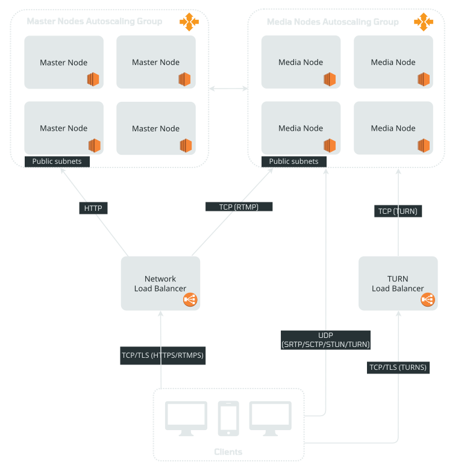{ .round-corners .dark-img loading=lazy }

    Use it when many of your clients are on networks that block UDP. Their TURN over TLS traffic goes to **TurnDomainName**, and a dedicated TURN Load Balancer forwards it directly to the Media Nodes. The example is the layout in the diagram, with every node in public subnets.

    **Pros**

    - TURN over TLS traffic goes directly to the Media Nodes: the Master Nodes are out of the media path, and the relay scales with the Media Nodes autoscaling group.
    - Clients that can use UDP are not affected: they still send media directly to the Media Nodes.
    - It combines with any of the other layouts.

    **Cons**

    - It needs a second domain, a second certificate and a second Load Balancer, with its own cost.
    - Two DNS records to point: **DomainName** and **TurnDomainName**.
    - For clients that relay their media, TURN over TLS still has more latency than UDP.

    | Parameter | Example value | Notes |
    | --- | --- | --- |
    | **OpenViduMasterNodeSubnets** | `subnet-0aa11111,subnet-0aa22222,subnet-0aa33333,subnet-0aa44444` | Your public subnets, one per availability zone |
    | **OpenViduMediaNodeSubnets** | `subnet-0aa11111,subnet-0aa22222,subnet-0aa33333,subnet-0aa44444` | Your public subnets, one per availability zone |
    | **LoadBalancerSubnets** | _(empty)_ | Both Load Balancers go in the subnets of their nodes |
    | **TurnDomainName** | `turn.example.com` | A second domain of yours, different from **DomainName** |
    | **TurnCertificateARN** | `arn:aws:acm:us-east-1:123456789012:certificate/9f8e7d6c-5b4a-3f2e-1d0c-9b8a7f6e5d4c` | Your certificate for **TurnDomainName** |

    After creating the stack, point **TurnDomainName** to the **TurnLoadBalancerDNS** output (see [Deploying the stack](#deploying-the-stack)).

    You can also add the TURN Load Balancer to layout 2 in the same way: use its values and set **TurnDomainName** and **TurnCertificateARN** as in this example. The TURN Load Balancer is then placed in the public **LoadBalancerSubnets**. For nodes that are all private, see layout 4.

=== "2. Private Master Nodes"

    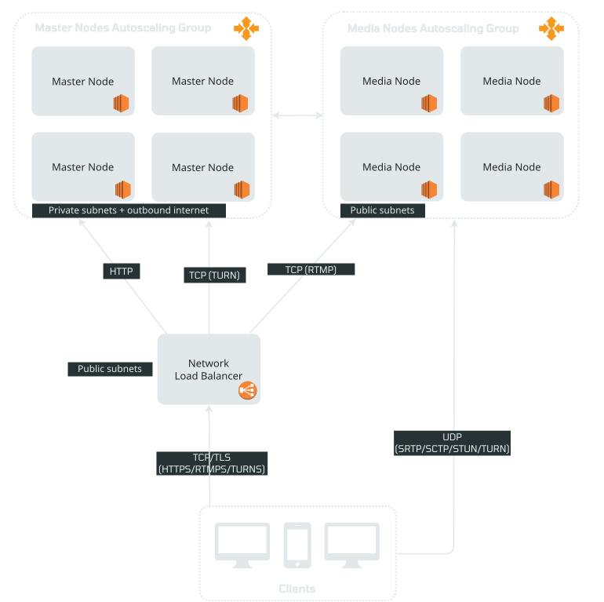{ .round-corners .dark-img loading=lazy }

    Use it when your security policy does not allow public IPs on the nodes that hold the cluster's services and data. The Master Nodes have no public IP. The Load Balancer stays public in its own subnets, and clients still send media over UDP directly to the Media Nodes.

    **Pros**

    - The Master Nodes, which hold the cluster's services and data, have no public IP.
    - Clients still send media over UDP directly to the Media Nodes: the same quality as the default layout.

    **Cons**

    - It needs public subnets for the Load Balancer and outbound internet access for the private subnets, for example a NAT gateway, with its own cost.
    - As in the default layout, clients that cannot use UDP relay their media through the Master Nodes, a small extra load for them, unless you add a TURN Load Balancer (layout 1).

    | Parameter | Example value | Notes |
    | --- | --- | --- |
    | **OpenViduMasterNodeSubnets** | `subnet-0bb11111,subnet-0bb22222,subnet-0bb33333,subnet-0bb44444` | Your private subnets with outbound internet access, one per availability zone |
    | **OpenViduMediaNodeSubnets** | `subnet-0aa11111,subnet-0aa22222,subnet-0aa33333,subnet-0aa44444` | Your public subnets, one per availability zone |
    | **LoadBalancerSubnets** | `subnet-0aa11111,subnet-0aa22222,subnet-0aa33333,subnet-0aa44444` | Your public subnets, in the same availability zones as the Master Nodes |
    | **TurnDomainName** | _(empty)_ | Set both to add a dedicated TURN Load Balancer (see layout 1) |
    | **TurnCertificateARN** | _(empty)_ | |

=== "3. All private"

    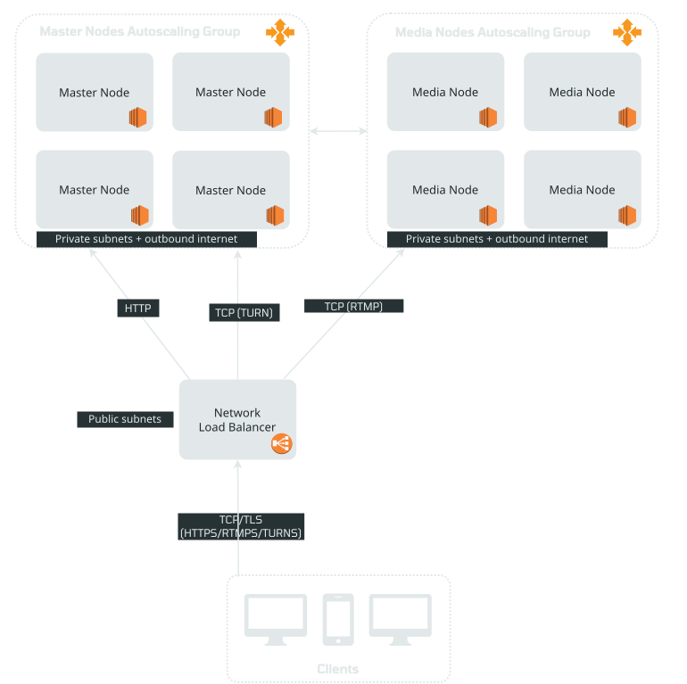{ .round-corners .dark-img loading=lazy }

    Use it when no node can have a public IP. Only the Load Balancer is public. Clients cannot reach the Media Nodes directly, so all media goes through TURN over TLS on **DomainName**: the Load Balancer forwards it to the Master Nodes, which relay it to the Media Nodes.

    **Pros**

    - No node has a public IP: only the Load Balancer is exposed to the internet.
    - It fits the strictest security policies.

    **Cons**

    - No UDP: all media goes over TURN over TLS, which runs on TCP. Latency is higher than with UDP, and quality drops sooner when there is packet loss.
    - All the media traffic of every client goes through the Load Balancer and the Master Nodes, which relay it to the Media Nodes. Forwarding it is a small load for each Master Node, but here it grows with the traffic of every client, so take it into account when sizing the Master Nodes. Adding a TURN Load Balancer (layout 4) moves this relay to the Media Nodes, but media still goes over TCP.
    - The Load Balancer processes all the media traffic, which increases its cost.
    - It needs public subnets for the Load Balancer and outbound internet access for the private subnets, for example a NAT gateway, with its own cost.

    | Parameter | Example value | Notes |
    | --- | --- | --- |
    | **OpenViduMasterNodeSubnets** | `subnet-0bb11111,subnet-0bb22222,subnet-0bb33333,subnet-0bb44444` | Your private subnets with outbound internet access, one per availability zone |
    | **OpenViduMediaNodeSubnets** | `subnet-0bb11111,subnet-0bb22222,subnet-0bb33333,subnet-0bb44444` | Your private subnets with outbound internet access, one per availability zone |
    | **LoadBalancerSubnets** | `subnet-0aa11111,subnet-0aa22222,subnet-0aa33333,subnet-0aa44444` | Your public subnets, in the same availability zones as the Master Nodes |
    | **TurnDomainName** | _(empty)_ | Set both to add a dedicated TURN Load Balancer (see layout 4) |
    | **TurnCertificateARN** | _(empty)_ | |

=== "4. All private + Dedicated TURN Load Balancer"

    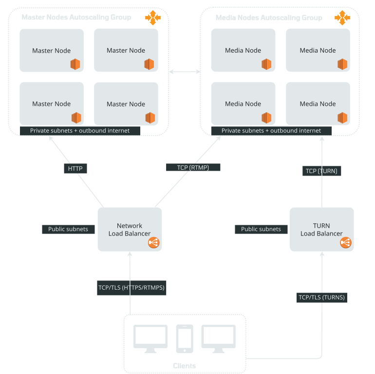{ .round-corners .dark-img loading=lazy }

    Use it when no node can have a public IP and you do not want the media to go through the Master Nodes. As in layout 3, clients cannot reach the Media Nodes directly and all media goes through TURN over TLS, but on **TurnDomainName**: a dedicated TURN Load Balancer forwards it straight to the Media Nodes, which relay it themselves.

    **Pros**

    - No node has a public IP: only the two Load Balancers are exposed to the internet.
    - The Master Nodes are out of the media path: the relay scales with the Media Nodes autoscaling group.

    **Cons**

    - No UDP: all media goes over TURN over TLS, which runs on TCP. Latency is higher than with UDP, and quality drops sooner when there is packet loss.
    - It needs a second domain, a second certificate and a second Load Balancer, with its own cost. The TURN Load Balancer processes all the media traffic.
    - It needs public subnets for the Load Balancers and outbound internet access for the private subnets, for example a NAT gateway, with its own cost.

    | Parameter | Example value | Notes |
    | --- | --- | --- |
    | **OpenViduMasterNodeSubnets** | `subnet-0bb11111,subnet-0bb22222,subnet-0bb33333,subnet-0bb44444` | Your private subnets with outbound internet access, one per availability zone |
    | **OpenViduMediaNodeSubnets** | `subnet-0bb11111,subnet-0bb22222,subnet-0bb33333,subnet-0bb44444` | Your private subnets with outbound internet access, one per availability zone |
    | **LoadBalancerSubnets** | `subnet-0aa11111,subnet-0aa22222,subnet-0aa33333,subnet-0aa44444` | Your public subnets, in the same availability zones as the Master Nodes. Both Load Balancers go here |
    | **TurnDomainName** | `turn.example.com` | A second domain of yours, different from **DomainName** |
    | **TurnCertificateARN** | `arn:aws:acm:us-east-1:123456789012:certificate/9f8e7d6c-5b4a-3f2e-1d0c-9b8a7f6e5d4c` | Your certificate for **TurnDomainName** |

    After creating the stack, point **DomainName** to the **LoadBalancerDNS** output and **TurnDomainName** to the **TurnLoadBalancerDNS** output (see [Deploying the stack](#deploying-the-stack)).


## Troubleshooting Initial CloudFormation Stack Creation

--8<-- "self-hosting/aws/troubleshooting.md"

4. If everything seems fine, check the [status](../on-premises/admin.md#checking-the-status-of-services) and the [logs](../on-premises/admin.md#checking-logs) of the installed OpenVidu services in all the Master Nodes and Media Nodes.

## Configuration and administration

When your CloudFormation stack reaches the **`CREATE_COMPLETE`** status (about 5 to 12 minutes), your OpenVidu High Availability deployment is ready to use. You can check the [Administration](./admin.md) section to learn how to manage your deployment.

!!! info

    The deployment may take considerably longer to become reachable through the configured **DomainName** than the stack takes to reach the `CREATE_COMPLETE` status, as this also depends on DNS propagation.
