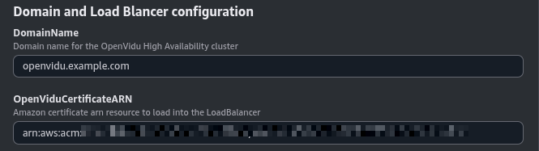
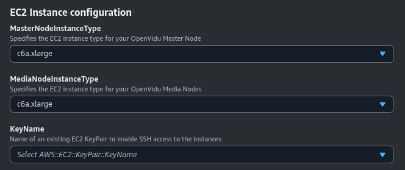
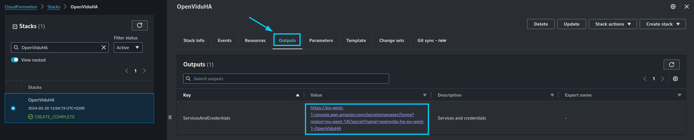

# OpenVidu High Availability Installation: AWS

!!!info
    OpenVidu High Availability is part of **OpenVidu <span class="openvidu-tag openvidu-pro-tag">PRO</span>**. Before deploying, you need to [create an OpenVidu account](https://openvidu.io/account){:target="_blank"} to get your license key.
    There's a 15-day free trial waiting for you!

This section contains the instructions to deploy a production-ready OpenVidu High Availability deployment in AWS. Deployed services are the same as the [On Premises High Availability Installation](../on-premises/install-nlb.md) but automate the process with AWS CloudFormation.

First of all, import the template in the AWS CloudFormation console. You can click the following button...

<div class="center-align" markdown>
[Deploy OpenVidu High Availability in :fontawesome-brands-aws:{style="font-size:32px; margin-left: 7px"}](https://console.aws.amazon.com/cloudformation/home?#/stacks/new?stackName=OpenViduHA&templateURL=https://s3.eu-west-1.amazonaws.com/get.openvidu.io/pro/ha/latest/aws/cf-openvidu-ha.yaml){.md-button .deploy-button target="_blank"}
</div>

...or access your [AWS CloudFormation console](https://console.aws.amazon.com/cloudformation/home?#/stacks/new){:target=_blank} and manually set this S3 URL in the `Specify template` section:

```
https://s3.eu-west-1.amazonaws.com/get.openvidu.io/pro/ha/latest/aws/cf-openvidu-ha.yaml
```

This is how the architecture of the deployment looks like.

=== "Architecture overview"

    <figure markdown>
    { .svg-img .dark-img }
    <figcaption>OpenVidu High Availability AWS Architecture</figcaption>
    </figure>

    - The Load Balancer distributes HTTPS traffic to the Master Nodes.
    - If RTMP media is ingested, the Load Balancer also routes this traffic to the Media Nodes.
    - WebRTC traffic (SRTP/SCTP/STUN/TURN) is routed directly to the Media Nodes.
    - An autoscaling group of Master Nodes is created with a fixed number of 4 Master Nodes. It must always have 4 Master Nodes to ensure high availability.
    - An autoscaling group of Media Nodes is created to scale the number of Media Nodes based on the system load.

=== "Architecture overview with TURN over TLS"

    <figure markdown>
    { .svg-img .dark-img }
    <figcaption>OpenVidu High Availability AWS Architecture with TURN over TLS</figcaption>
    </figure>

    - The Load Balancer distributes HTTPS traffic to the Master Nodes.
    - If RTMP media is ingested, the Load Balancer also routes this traffic to the Media Nodes.
    - WebRTC traffic (SRTP/SCTP/STUN/TURN) is routed directly to the Media Nodes.
    - An additional Load Balancer is created to route TURN over TLS traffic to the TURN server running on the Media Nodes. It is used to allow users behind restrictive firewalls to connect to the Media Nodes.
    - An autoscaling group of Master Nodes is created with a fixed number of 4 Master Nodes. It must always have 4 Master Nodes to ensure high availability.
    - An autoscaling group of Media Nodes is created to scale the number of Media Nodes based on the system load.

## CloudFormation Parameters

Depending on your needs, you need to fill the following CloudFormation parameters:

### Domain and Load Balancer configuration

In this section, you need to specify the domain name and the SSL certificate to use from AWS Certificate Manager.

=== "Domain and Load Balancer configuration"

    The parameters in this section might look like this:

    

    Set the **DomainName** parameter to the domain name you intend to use for your OpenVidu deployment. Ensure this domain is not currently pointing to any other service; you can temporarily point it elsewhere.

    For the **OpenViduCertificateARN** parameter, specify the ARN of the SSL certificate you wish to use. This certificate should be created in the AWS Certificate Manager and configured for the domain specified in **DomainName**.

### OpenVidu HA Configuration

In this section, you need to specify some properties needed for the OpenVidu HA deployment.

=== "OpenVidu Elastic Configuration"

    The parameters in this section might appear as follows:

    

    Make sure to provide the **OpenViduLicense** parameter with the license key. If you don't have one, you can request one [here](https://openvidu.io/account){:target="_blank"}.

    For the **RTCEngine** parameter, you can choose between **Pion** (the engine used by LiveKit) and **Mediasoup** (experimental).

    --8<-- "docs/docs/self-hosting/shared/mediasoup-warning.md"

### EC2 Instance Configuration

You need to specify some properties for the EC2 instances that will be created.

=== "EC2 Instance configuration"

    The parameters in this section may look like this:

    

    Simply select the type of instance you want to deploy at **MasterNodeInstanceType** and **MediaNodeInstanceType**, the SSH key you want to use to access the machine at **KeyName**, and the Amazon Image ID (AMI) to use at **AmiId**.

    By default, the parameter **AmiId** is configured to use the latest Amazon Linux AMI, so ideally you don’t need to modify this.

### Media Nodes Autoscaling Group Configuration

The number of Media Nodes can scale up or down based on the system load. You can configure the minimum and maximum number of Media Nodes and a target CPU utilization to trigger the scaling up or down.

=== "Media Nodes Autoscaling Group Configuration"

    The parameters in this section may look like this:

    

    The **InitialNumberOfMediaNodes** parameter specifies the initial number of Media Nodes to deploy. The **MinNumberOfMediaNodes** and **MaxNumberOfMediaNodes** parameters specify the minimum and maximum number of Media Nodes that you want to be deployed.

    The **ScaleTargetCPU** parameter specifies the target CPU utilization to trigger the scaling up or down. The goal is to keep the CPU utilization of the Media Nodes close to this value. The autoscaling policy is based on [Target Tracking Scaling Policy](https://docs.aws.amazon.com/autoscaling/application/userguide/target-tracking-scaling-policy-overview.html){:target="_blank"}.

### VPC Configuration

In this section, you need to specify the VPC and Subnet configuration for the deployment.

=== "VPC Configuration"

    The parameters in this section may look like this:

    

    The **OpenViduVPC** parameter specifies the VPC where the deployment will be created.

    The **OpenViduMasterNodeSubnets** specifies the subnets where the Master Nodes will be deployed. You can specify a maximum of 4 subnets.

    The **OpenViduMediaNodeSubnets** specifies the subnets where the Media Nodes will be deployed. There is no limit on the number of subnets you can specify.

    !!!warning
        - It is recommended to deploy in a region with at least 4 availability zones and deploy the Master Nodes in 4 subnets, one in each availability zone. This is to ensure high availability.
        - You must use public subnets for the Master Nodes and Media Nodes and have enabled the auto-assign public IP option.

### (Optional) TURN server configuration with TLS

This section is optional. It is useful when your users are behind a restrictive firewall that blocks UDP traffic.

=== "TURN server configuration with TLS"

    The parameters in this section may look like this:

    

    Set the **TurnDomainName** parameter to the domain name you intend to use for your TURN server. Ensure this domain is not currently pointing to any other service; you can temporarily point it elsewhere.

    For the **TurnCertificateARN** parameter, specify the ARN of the SSL certificate you wish to use. This certificate should be created in the AWS Certificate Manager and configured for the domain specified in **TurnDomainName**.

## Volumes Configuration

In this section, you need to specify the configuration for the EBS volumes that will be created for the Master Nodes. Master Nodes will host all the recordings and metrics data replicated across all of them. The disk size of the EBS volumes is the same for all Master Nodes.

=== "Volumes Configuration"

    The parameters in this section may look like this:

    

    The **RetainVolumes** parameter specifies whether the EBS volumes should be retained when the stack is deleted. If you set this parameter to `true`, the EBS volumes will not be deleted when the stack is deleted. This is useful if you want to keep the recordings and metrics data after deleting the stack. If you set this parameter to `false`, the EBS volumes will be deleted when the stack is deleted. In any case, it is recommended to create a snapshot backup policy.

    The **DiskSize** parameter specifies the size of the EBS volumes in GB.

## Deploying the Stack

When you are ready with your CloudFormation parameters, just click on _"Next"_, specify in _"Stack failure options"_ the option _"Preserve successfully provisioned resources"_ to be able to troubleshoot the deployment in case of error, click on _"Next"_ again, and finally _"Submit"_.

When everything is ready, you will see the following links in the _"Outputs"_ section of CloudFormation:

=== "CloudFormation Outputs"

    

## Deployment Credentials

The Output Key **ServicesAndCredentials** of the [previous section](#deploying-the-stack) points to an AWS Secret Manager secret that contains all URLs and credentials to access the services deployed. You can access the secret by clicking on the link in the **Output Value** column.

Then, click on **Retrieve secret value** to get the JSON with all the information.

<div class="grid-container">

<div class="grid-50"><p><a class="glightbox" href="/assets/images/self-hosting/ha/aws/1-secrets-retrieve.png" data-type="image" data-width="100%" data-height="auto" data-desc-position="bottom"></a></p></div>

<div class="grid-50"><p><a class="glightbox" href="/assets/images/self-hosting/ha/aws/2-secrets.png" data-type="image" data-width="100%" data-height="auto" data-desc-position="bottom"></a></p></div>

</div>

To point your applications to your OpenVidu deployment, check the values of the JSON secret. All access credentials of all services are defined in this object.

Your authentication credentials and URL to point your applications would be:

- Applications developed with LiveKit SDK:
    - **URL**: The value in `.env` of `DOMAIN_NAME` as a URL. It could be `wss://openvidu.example.io/` or `https://openvidu.example.io/` depending on the SDK you are using.
    - **API Key**: The value in `.env` of `LIVEKIT_API_KEY`
    - **API Secret**: The value in `.env` of `LIVEKIT_API_SECRET`

- Applications developed with OpenVidu v2:
    - **URL**: The value in `.env` of `DOMAIN_NAME` as a URL. For example, `https://openvidu.example.io/`
    - **Username**: `OPENVIDUAPP`
    - **Password**: The value in `.env` of `LIVEKIT_API_SECRET`

## Troubleshooting Initial CloudFormation Stack Creation

--8<-- "docs/docs/self-hosting/shared/aws-troubleshooting.md"

4. If everything seems fine, check the [status](../on-premises/admin.md/#checking-the-status-of-services) and the [logs](../on-premises/admin.md/#checking-logs) of the installed OpenVidu services in all the Master Nodes and Media Nodes.

## Configuration and administration

When your CloudFormation stack reaches the **`CREATE_COMPLETE`** status, your OpenVidu High Availability deployment is ready to use. You can check the [Configuration and Administration](../aws/admin.md) section to learn how to manage your deployment.
