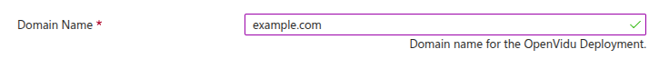

# OpenVidu High Availability Installation: Azure

!!! info
    
    OpenVidu High Availability is part of **OpenVidu <span class="openvidu-tag openvidu-pro-tag">PRO</span>**. Before deploying, you need to [create an OpenVidu account](/account/){:target="_blank"} to get your license key.
    There's a 15-day free trial waiting for you!

This section contains the instructions to deploy a production-ready OpenVidu High Availability deployment in Azure. Deployed services are almost the same as the [On Premises High Availability Installation](../on-premises/install-nlb.md)  but they will be resources in Azure and you can automate the process with the Template Spec of ARM.

To import the template into Azure you just need to click the button below and you will be redirected to azure.   
<div class="center-align" markdown>
[](https://portal.azure.com/#create/Microsoft.Template/uri/https%3A%2F%2Fs3.eu-west-1.amazonaws.com%2Fget.openvidu.io%2Fpro%2Fha%2Fmain%2Fazure%2Fcf-openvidu-ha.json)
</div>

This is how the architecture of the deployment looks like:

=== "Architecture overview"

    <figure markdown>
    { .svg-img .dark-img }
    <figcaption>OpenVidu High Availability Azure Architecture</figcaption>
    </figure>

    - The Load Balancer distributes HTTPS traffic to the Master Nodes.
    - If RTMP media is ingested, the Load Balancer also routes this traffic to the Media Nodes.
    - WebRTC traffic (SRTP/SCTP/STUN/TURN) is routed directly to the Media Nodes.
    - 4 fixed Virtual Machine Instances are created for the Master Nodes. It must always be 4 Master Nodes to ensure high availability.
    - A Scaling Set of Media Nodes is created to scale the number of Media Nodes based on the system load.

=== "Architecture overview with TURN over TLS"

    <figure markdown>
    { .svg-img .dark-img }
    <figcaption>OpenVidu High Availability Azure Architecture with TURN over TLS</figcaption>
    </figure>

    - The Load Balancer distributes HTTPS traffic to the Master Nodes.
    - If RTMP media is ingested, the Load Balancer also routes this traffic to the Media Nodes.
    - WebRTC traffic (SRTP/SCTP/STUN/TURN) is routed directly to the Media Nodes.
    - An additional Load Balancer is created to route TURN over TLS traffic to the TURN server running on the Media Nodes. It is used to allow users behind restrictive firewalls to connect to the Media Nodes.
    - 4 fixed Virtual Machine Instances are created for the Master Nodes. It must always be 4 Master Nodes to ensure high availability.
    - An Scaling Set of Media Nodes is created to scale the number of Media Nodes based on the system load.

## CloudFormation Parameters

Depending on your needs, you need to fill the following CloudFormation parameters:

### Domain and Load Balancer configuration

In this section, you just need to specify the domain name.

=== "Domain and Load Balancer configuration"

    The parameters in this section might look like this:

    

    Set the **Domain Name** parameter to the domain name you intend to use for your OpenVidu deployment. Ensure this domain is not currently pointing to any other service, you can temporarily point it elsewhere.

### OpenVidu HA Configuration

In this section, you need to specify some properties needed for the OpenVidu HA deployment.

=== "OpenVidu HA Configuration"

    The parameters in this section might appear as follows:

    

    Make sure to provide the **OpenVidu License** parameter with the license key. If you don't have one, you can request one [here](/account/){:target=_blank}.

    For the **RTC Engine** parameter, you can choose between **Pion** (the engine used by LiveKit) and **Mediasoup** (experimental).

    --8<-- "shared/self-hosting/mediasoup-warning.md"

### Azure Instance Configuration

You need to specify some properties for the Azure instances that will be created.

=== "Azure Instance configuration"

    The parameters in this section may look like this:

    

    Simply select the type of instance you want on the master nodes at **Master Node Instance Type** and select the type of instance you want on the media nodes at **Media Node Instance Type**, modify the username that will be the one standard in the instance at **Admin Username**, and paste the value of the public key you've created previously in Azure to be able to make ssh to the instance. 

    !!! info "SSH key"
    
        We are working to make the UI of the template less tedious to fill it up and one of the things when releasing a full version of this feature will be selecting the SSH key pair from the UI and be able to create a new one from there. 

### Media Nodes Scaling Set Configuration

!!! info "Scale Down"

    We are working in the scale in feature in the elastic deployment because Azure doesn't make the gracefull delete of the Media Nodes possible so for now we only have scale up, to be able to scale down you will need to delete the media nodes manually.

The number of Media Nodes can scale up based on the system load. You can configure the minimum and maximum number of Media Nodes and a target CPU utilization to trigger the scaling up.

=== "Media Nodes Scaling Set Configuration"

    The parameters in this section may look like this:

    

    The **Initial Number Of Media Nodes** parameter specifies the initial number of Media Nodes to deploy. The **Min Number Of Media Nodes** and **Max Number Of Media Nodes** parameters specify the minimum and maximum number of Media Nodes that you want to be deployed.

    The **Scale Target CPU** parameter specifies the target CPU utilization to trigger the scaling up or down. The goal is to keep the CPU utilization of the Media Nodes close to this value. The autoscaling policy is based on [Target Tracking Scaling Policy](https://learn.microsoft.com/en-us/azure/architecture/best-practices/auto-scaling){:target=_blank}

### (Optional) TURN server configuration with TLS

This section is optional. It is useful when your users are behind a restrictive firewall that blocks UDP traffic.

=== "TURN server configuration with TLS"

    The parameters in this section may look like this:

    

    Set the **Turn Domain Name** parameter to the domain name you intend to use for your TURN server. Ensure this domain is not currently pointing to any other service; you can temporarily point it elsewhere.

## Deploying the Stack

When you are ready with your Template parameters, just click on _"Next"_, then it will go through some validations, and if everything is correct, click on _"Create"_, then it will start deploying and you will have to wait the time that takes to install Openvidu, it takes about 5 to 10 minutes.

When everything is ready, you will see the following links in the KeyVault resource:   

!!! info
    
    If you have permission to give yourself access the KeyVault that has been created you will be able to see the outputs of the deployment there, if you don't have them you can use the other method to be able to get the outputs.

=== "Azure KeyVault Outputs"

    

=== "Check outputs in the instance"

    You will need to do SSH to the single instance that is created and there you need to make the following steps:   
    
    First go to the config folder using the following command: ```cd /opt/openvidu/config/cluster```. There you will see two folders and one **.env** file. To retrieve all access credentials check the following files:

    - `openvidu.env`
    - `master_node/app.env`

## Configure your Application to use the Deployment

As we mentioned before, if you have permissions to give yourself access to the KeyVault you will be able to check there all the outputs, if you dont have them check the tab [Check outputs in the instance](#check-outputs-in-the-instance).

Your authentication credentials and URL to point your applications would be:

- Applications developed with LiveKit SDK:
    - **URL**: The value in the KeyVault Secret of `DOMAIN_NAME` or in the instance in `openvidu.env` as a URL. It could be `wss://openvidu.example.io/` or `https://openvidu.example.io/` depending on the SDK you are using.
    - **API Key**: The value in the KeyVault Secret of `LIVEKIT_API_KEY` or in the instance in `openvidu.env`.
    - **API Secret**: The value in the KeyVault Secret of `LIVEKIT_API_SECRET` or in the instance in `openvidu.env`.

- Applications developed with OpenVidu v2:
    - **URL**: The value in the KeyVault Secret of `DOMAIN_NAME` or in the instance in `openvidu.env` as a URL. For example, `https://openvidu.example.io/`.
    - **Username**: `OPENVIDUAPP`.
    - **Password**: The value in the KeyVault Secret of `LIVEKIT_API_SECRET` or in the instance in `openvidu.env`.
 
## Troubleshooting Initial Azure Stack Creation

--8<-- "shared/self-hosting/azure-troubleshooting.md"

3. If everything seems fine, check the [status](../on-premises/admin.md#checking-the-status-of-services) and the [logs](../on-premises/admin.md#checking-logs) of the installed OpenVidu services.

## Configuration and administration

When your Azure stack reaches the **`Succeeded`** status, it means that all the resources have been created. You will need to wait about 5 to 10 minutes to let the instance install OpenVidu. When this time has passed, try connecting to the deployment URL. If it doesn't work, we recommend checking the previous section. Once finished you can check the [Administration](./admin.md) section to learn how to manage your deployment.
