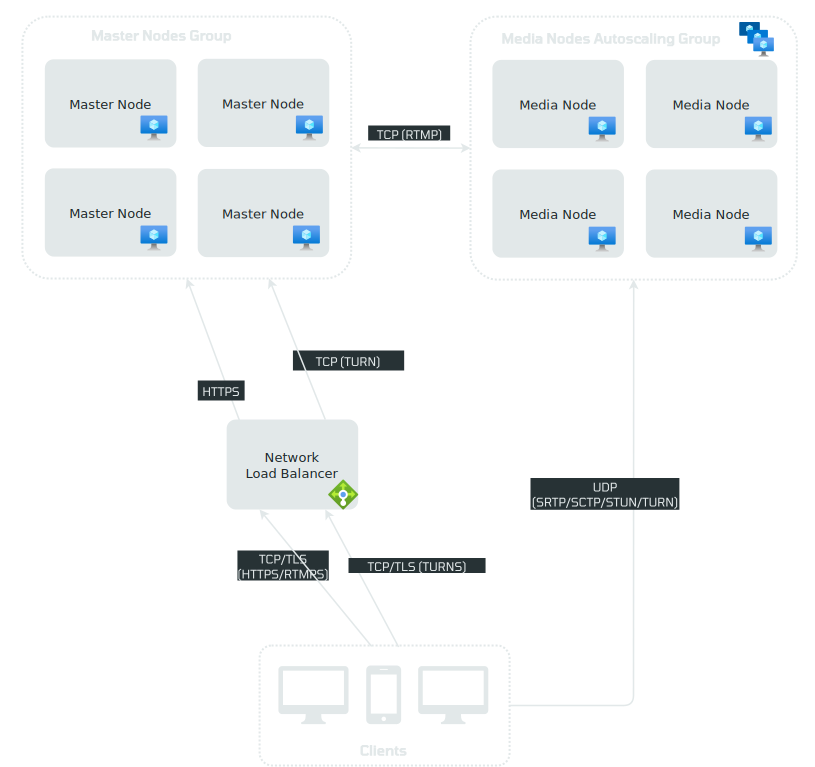
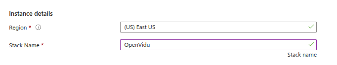
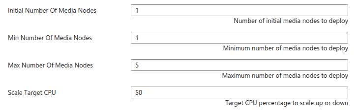

# OpenVidu High Availability Installation: Azure

!!! info

    Azure is Expermiental in version 3.2.0 of OpenVidu


!!! info
    
    OpenVidu High Availability is part of **OpenVidu <span class="openvidu-tag openvidu-pro-tag">PRO</span>**. Before deploying, you need to [create an OpenVidu account](/account/){:target="_blank"} to get your license key.
    There's a 15-day free trial waiting for you!

This section contains the instructions to deploy a production-ready OpenVidu High Availability deployment in Azure. Deployed services are almost the same as the [On Premises High Availability Installation](../on-premises/install-nlb.md)  but they will be resources in Azure and you can automate the process with the Template Spec of ARM.

To import the template into Azure you just need to click the button below and you will be redirected to azure.   
<div class="center-align" markdown>
[](https://portal.azure.com/#create/Microsoft.Template/uri/https%3A%2F%2Fraw.githubusercontent.com%2FOpenVidu%2Fopenvidu%2Frefs%2Fheads%2Fmaster%2Fopenvidu-deployment%2Fpro%2Fha%2Fazure%2Fcf-openvidu-ha.json/uiFormDefinitionUri/https%3A%2F%2Fraw.githubusercontent.com%2FOpenVidu%2Fopenvidu%2Frefs%2Fheads%2Fmaster%2Fopenvidu-deployment%2Fpro%2Fha%2Fazure%2FcreateUiDefinition.json)
</div>

This is how the architecture of the deployment looks like:

=== "Architecture overview"

    <figure markdown>
    { .svg-img .dark-img }
    <figcaption>OpenVidu High Availability Azure Architecture</figcaption>
    </figure>

    - The Load Balancer distributes HTTPS traffic to the Master Nodes.
    - If RTMP media is ingested, the Load Balancer also routes this traffic to the Master Nodes that they act as a bridge, because it exists a limitation in Azure.
    - WebRTC traffic (SRTP/SCTP/STUN/TURN) is routed directly to the Media Nodes.
    - 4 fixed Virtual Machine Instances are created for the Master Nodes. It must always be 4 Master Nodes to ensure high availability.
    - A Scaling Set of Media Nodes is created to scale the number of Media Nodes based on the system load.

=== "Architecture overview with TURN over TLS"

    <figure markdown>
    { .svg-img .dark-img }
    <figcaption>OpenVidu High Availability Azure Architecture with TURN over TLS</figcaption>
    </figure>

    - The Load Balancer distributes HTTPS traffic to the Master Nodes.
    - If RTMP media is ingested, the Load Balancer also routes this traffic to the Master Nodes that they act as a bridge, because it exists a limitation in Azure.
    - WebRTC traffic (SRTP/SCTP/STUN/TURN) is routed directly to the Media Nodes.
    - An additional Load Balancer is created to route TURN over TLS traffic to the TURN server running on the Media Nodes. It is used to allow users behind restrictive firewalls to connect to the Media Nodes.
    - 4 fixed Virtual Machine Instances are created for the Master Nodes. It must always be 4 Master Nodes to ensure high availability.
    - An Scaling Set of Media Nodes is created to scale the number of Media Nodes based on the system load.


We use a strategy to shut down gracefully the media nodes: 

=== "Strategy used"

    The instances in the scale set are protected to prevent their shutdown when they are started. That prevents them from shutting down when the shutdown event arrives but that event can be captured and a custom action executed. That custom action determines the instance that has to terminate and executes the appropriate commands in the LiveKit services to not receive any more jobs. When all jobs on the instance identified to be shutdown are finished, then it autoshutdown with a command that kills the instance.    

## Template Parameters

Depending on your needs, you need to fill the following parameters.

!!! warning

    The resource group may not be the same as a previous one, the deployment can fail if is the same, the only case you want it to be new is when using an existing IP. Fill the parameter **Stack Name** with the name you want for the stack (it will be used to create the names of the resources). Select the **Region** that you want or the region where the resource group is located (it will be autoselected).   

    <figure markdown>
    { .svg-img .dark-img }
    </figure>

--8<-- "shared/self-hosting/azure-ssl-domain.md"

### OpenVidu HA Configuration

In this section, you need to specify some properties needed for the OpenVidu HA deployment.

=== "OpenVidu HA Configuration"

    The parameters in this section might appear as follows:

    <figure markdown>
    { .svg-img .dark-img }
    </figure>

    Make sure to provide the **OpenVidu License** parameter with the license key. If you don't have one, you can request one [here](/account/){:target=_blank}.

    For the **RTC Engine** parameter, you can choose between **Pion** (the engine used by LiveKit) and **Mediasoup** (experimental).

    --8<-- "shared/self-hosting/mediasoup-warning.md"

### Azure Instance Configuration

You need to specify some properties for the Azure instances that will be created.

=== "Azure Instance configuration"

    The parameters in this section may look like this:

    <figure markdown>
    { .svg-img .dark-img }
    </figure>

    Simply select the type of instance you want on the master nodes at **Master Node Instance Type** and select the type of instance you want on the media nodes at **Media Node Instance Type**, fill in the parameter **Admin Username** that will be set as admin username in the instance, then select the SSH key you've created previously in **SSH public key source**, or you can create a new one in the same drop down, to be able to make ssh to the instance.   

### Media Nodes Scaling Set Configuration

The number of Media Nodes can scale up based on the system load. You can configure the minimum and maximum number of Media Nodes and a target CPU utilization to trigger the scaling up.

=== "Media Nodes Scaling Set Configuration"

    The parameters in this section may look like this:

    <figure markdown>
    { .svg-img .dark-img }
    </figure>

    The **Initial Number Of Media Nodes** parameter specifies the initial number of Media Nodes to deploy. The **Min Number Of Media Nodes** and **Max Number Of Media Nodes** parameters specify the minimum and maximum number of Media Nodes that you want to be deployed.

    The **Scale Target CPU** parameter specifies the target CPU utilization to trigger the scaling up or down. The goal is to keep the CPU utilization of the Media Nodes close to this value. The autoscaling policy is based on [Target Tracking Scaling Policy](https://learn.microsoft.com/en-us/azure/architecture/best-practices/auto-scaling){:target=_blank}

### Scale In

Azure has a restriction with the scale in, when it is determined that a instance is surplus, it can only wait at most 15 minutes for graceful shutdown. But that poses a problem when instance sessions can last longer. To avoid unexpectedly shutting down a instance's sessions, an indirect strategy has been implemented to get instances to not terminate until they have finished all their sessions.

Due to the limitations of azure, this strategy has the disadvantage that it can take up to 5 minutes from the time a instance is detected to be shutdown until the shutdown process is gracefully initiated.

=== "Automation Account Configuration"

    You will need to fill the next parameter in order to be able to create the automation account that contains the runbook that is going to be executed when a scale in event comes in.   
    You can choose the name that you want and it will be used to create a new automation account with that name, the only restriction that the name has is being an unique name for all the automation accounts that may be in the resource group that you are deploying. Leave it blank to set an autogenerated name.   
    This resource cannot be reused between deployments.   
    <figure markdown>
    { .svg-img .dark-img }
    </figure>

--8<-- "shared/self-hosting/azure-storageaccount.md"

### (Optional) TURN server configuration with TLS

This section is optional. It is useful when your users are behind a restrictive firewall that blocks UDP traffic.

=== "TURN server configuration with TLS"

    The parameters in this section may look like this:

    <figure markdown>
    { .svg-img .dark-img }
    </figure>

    Set the **Turn Domain Name** parameter to the domain name you intend to use for your TURN server. Ensure this domain is not currently pointing to any other service; you can temporarily point it elsewhere.

## Deploying the Stack

When you are ready with your Template parameters, just click on _"Next"_, then it will go through some validations, and if everything is correct, click on _"Create"_, then it will start deploying and you will have to wait the time that takes to install Openvidu, it takes about 10 to 15 minutes.

!!! warning

    In case of fail, it might be that some role failed to create, in this case redeploy in a new resource group and change the **Stack Name**. To remove a role in a resource group go to [Remove Azure role assignments](https://learn.microsoft.com/en-us/azure/role-based-access-control/role-assignments-remove).  
    In case that the error is something about conflict in the creation of a network interface just redeploy in another resource group with another **Stack Name**, this happens rarely.

When everything is ready, you can check the output secrets on the Key Vault or by making SSH to the instance, you can find how to do it in the next steps:  

=== "Azure Key Vault Outputs"

    1. Go to the Key Vault created called **yourstackname-keyvault** in the Resource Group that you deployed, you can access in [Azure Portal Dashboard](https://portal.azure.com/#home){:target="_blank"}.


    2. Once you are in the Key Vault on the left panel click on _"Objects"_ and then into _"Secrets"_.

        <figure markdown>
        { .svg-img .dark-img }
        </figure>

    3. Here click on the secret of your choice or whatever you need to check and click again in the current version of that secret

        <figure markdown>
        { .svg-img .dark-img }
        </figure>

    4. Now you will see a lot of properties but the one you are searching for is located at the bottom and it will be revealed by clicking in _"Show Secret Value"_.

        <figure markdown>
        { .svg-img .dark-img }
        </figure>

=== "Check outputs in the instance"

    You will need to do SSH to one of the Master Nodes, is not an usual SSH because the Master Nodes do not have Public Ip Address, to do it follow these steps:
    
    1. Go to the resource group where you deployed OpenVidu High Availability and click on one of the Master Nodes resources.
    2. Once you are in click on _"Connect -> Connect via Bastion"_.
        <figure markdown>
            { .svg-img .dark-img }
        </figure>

    3. After that, click on _"Deploy Bastion"_ button.
        <figure markdown>
            { .svg-img .dark-img }
        </figure>

    4. Now, change **Authentication Type** to _"SSH Private Key from Local File"_, fill the username with the username you've used when filling the parameters and select the local file corresponding to the SSH Private Key of the SSH Public Key yo've used when deploying.
        <figure markdown>
            { .svg-img .dark-img }
        </figure>
    
    5. Click on connect and you will be inside the Virtual Machine of the Master Node you've selected. You can do this for every Master Node the same way.
    
    When you are inside of one Master Node go to the config folder using the following command: ```cd /opt/openvidu/config/cluster```. There you will see two folders and one **.env** file. To retrieve all access credentials check the following files:

    - `openvidu.env`
    - `master_node/app.env`

    !!! warning
        We recommend to delete the **Bastion** once you finished because is not necessary and it is an expensive resource.

## Configure your Application to use the Deployment

As we mentioned before, if you have permissions to give yourself access to the Key Vault you will be able to check there all the outputs, if you dont have them check the tab [Check outputs in the instance](#check-outputs-in-the-instance).

Your authentication credentials and URL to point your applications would be:

- Applications developed with LiveKit SDK:
    - **URL**: The value in the Key Vault Secret of `DOMAIN_NAME` or in the instance in `openvidu.env` as a URL. It could be `wss://openvidu.example.io/` or `https://openvidu.example.io/` depending on the SDK you are using.
    - **API Key**: The value in the Key Vault Secret of `LIVEKIT_API_KEY` or in the instance in `openvidu.env`.
    - **API Secret**: The value in the Key Vault Secret of `LIVEKIT_API_SECRET` or in the instance in `openvidu.env`.

- Applications developed with OpenVidu v2:
    - **URL**: The value in the Key Vault Secret of `DOMAIN_NAME` or in the instance in `openvidu.env` as a URL. For example, `https://openvidu.example.io/`.
    - **Username**: `OPENVIDUAPP`.
    - **Password**: The value in the Key Vault Secret of `LIVEKIT_API_SECRET` or in the instance in `openvidu.env`.
 
## Troubleshooting Initial Azure Stack Creation

!!! info
    If you need to do SSH to a Master Node check [Check Outputs In The Instance](#check-outputs-in-the-instance)

--8<-- "shared/self-hosting/azure-troubleshooting.md"

3. If everything seems fine, check the [status](../on-premises/admin.md#checking-the-status-of-services) and the [logs](../on-premises/admin.md#checking-logs) of the installed OpenVidu services.

## Configuration and administration

When your Azure stack reaches the **`Succeeded`** status, it means that all the resources have been created. You will need to wait about 5 to 10 minutes to let the instance install OpenVidu. When this time has passed, try connecting to the deployment URL. If it doesn't work, we recommend checking the previous section. Once finished you can check the [Administration](./admin.md) section to learn how to manage your deployment.
