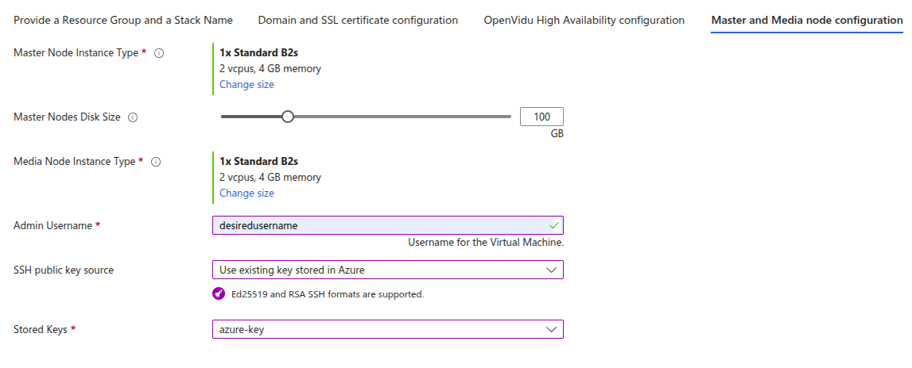

# OpenVidu High Availability installation: Azure

!!! info
    
    OpenVidu High Availability is part of **OpenVidu PRO**. Before deploying, you need to [create an OpenVidu account](/account/){:target="_blank"} to get your license key.
    There's a 15-day free trial waiting for you!

This section contains the instructions to deploy a production-ready OpenVidu High Availability deployment in Azure. Deployed services are almost the same as the [On Premises High Availability installation](../on-premises/install-nlb.md)  but they will be resources in Azure and you can automate the process with the Template Spec of ARM.

To import the template into Azure you just need to click the button below and you will be redirected to azure.   

{:target=_blank}

This is how the architecture of the deployment looks like:

=== "Architecture overview"

    <figure markdown>
    { .svg-img .dark-img }
    <figcaption>OpenVidu High Availability Azure Architecture</figcaption>
    </figure>

    - The Load Balancer distributes HTTPS traffic to the Master Nodes.
    - If RTMP media is ingested, the Load Balancer also routes this traffic to the Master Nodes that they act as a bridge, because it exists a limitation in Azure.
    - WebRTC traffic (SRTP/SCTP/STUN/TURN) is routed directly to the Media Nodes.
    - 4 fixed Virtual Machine Instances are created for the Master Nodes. It must always be 4 Master Nodes to ensure high availability.
    - A Scaling Set of Media Nodes is created to scale the number of Media Nodes based on the system load.

--8<-- "shared/self-hosting/azure-custom-scale-in.md"

## Template Parameters

To deploy the template you need to fill the following parameters.

--8<-- "shared/self-hosting/azure-resource-group-stack-name.md"

--8<-- "shared/self-hosting/azure-ssl-domain.md"

--8<-- "shared/self-hosting/azure-meet.md"

### OpenVidu HA Configuration

In this section, you need to specify some properties needed for the OpenVidu HA deployment.

=== "OpenVidu HA Configuration"

    Parameters of this section look like this:

    <figure markdown>
    { .svg-img .dark-img }
    </figure>

    Make sure to provide the **OpenVidu License** parameter with the license key. If you don't have one, you can request one [here](/account/){:target=_blank}.

    For the **RTC Engine** parameter, you can choose between **Pion** (the default engine used by LiveKit) and **Mediasoup** (with a boost in performance). Learn more about the differences [here](../../production-ready/performance.md).

### Azure Instance Configuration

You need to specify some properties for the Azure instances that will be created.

=== "Azure Instance configuration"

    Parameters in this section look like this:

    <figure markdown>
    { .svg-img .dark-img }
    </figure>

    Simply select the type of instance you want for your Master Nodes at **Master Node Instance Type** and select the type of instance you want for your Media Nodes at **Media Node Instance Type**. Fill in the parameter **Admin Username** that will be set as admin username in the instance. Select the SSH key you've created previously in **SSH public key source** (or create a new one in the same drop down) to allow you to SSH into the instances.

### Media Nodes Scaling Set Configuration

The number of Media Nodes can scale up based on the system load. You can configure the minimum and maximum number of Media Nodes and a target CPU utilization to trigger the scaling up.

--8<-- "shared/self-hosting/media-nodes-azure-asg-config.md"

--8<-- "shared/self-hosting/azure-scale-in-config.md"

--8<-- "shared/self-hosting/azure-storageaccount.md"

--8<-- "shared/self-hosting/azure-additional-flags.md"

## Deploying the stack

Whenever you are satisfied with your Template parameters, just click on _"Next"_ to trigger the validation process. If correct, click on _"Create"_ to start the deployment process (which will take about 10 to 15 minutes).

!!! warning

    In case of failure, it might be that some role failed to create. In this case redeploy in a new resource group and change the **Stack Name**. To remove a role in a resource group visit [Remove Azure role assignments :fontawesome-solid-external-link:{.external-link-icon}](https://learn.microsoft.com/en-us/azure/role-based-access-control/role-assignments-remove){:target="_blank"}.

    In case that the error is related to a conflict in the creation of a network interface, just redeploy in another resource group with a different **Stack Name**.

When everything is ready, you can check the output secrets on the Key Vault or by connecting through SSH to the instance:

=== "Check deployment outputs in Azure Key Vault"

    1. Go to the Key Vault created called **yourstackname-keyvault** in the Resource Group that you deployed. You can access it from the [Azure Portal Dashboard :fontawesome-solid-external-link:{.external-link-icon}](https://portal.azure.com/#home){:target="_blank"}.

    2. Once you are in the Key Vault on the left panel click on _"Objects"_ 🡒 _"Secrets"_.

        <figure markdown>
        { .svg-img .dark-img }
        </figure>

    3. Here click on the secret of your choice or whatever you need to check and click again in the current version of that secret

        <figure markdown>
        { .svg-img .dark-img }
        </figure>

    4. Now you will see a lot of properties but the one you are searching for is located at the bottom and it will be revealed by clicking in _"Show Secret Value"_.

        <figure markdown>
        { .svg-img .dark-img }
        </figure>

=== "Check deployment outputs in the instance"

    You must connect through SSH to any of the Master Nodes. It is not an regular SSH process, because Master Nodes do not have a public IP address. The easiest way is by connecting through a **Bastion** resource:

    1. Go to the resource group where you deployed OpenVidu High Availability and click on one (any) of the Master Nodes Virtual Machines.
    2. Inside the Virtual Machine resource, click on _"Connect"_ 🡒 _"Connect via Bastion"_.
        <figure markdown>
            { .svg-img .dark-img }
        </figure>

    3. Click on _"Deploy Bastion"_ button.
        <figure markdown>
            { .svg-img .dark-img }
        </figure>

    4. Change **Authentication Type** to _"SSH Private Key from Local File"_, set the same username used when you deployed OpenVidu, and select the local file corresponding to the SSH Private Key of the SSH Key used when deploying.
        <figure markdown>
            { .svg-img .dark-img }
        </figure>

    5. Click on connect and you will be inside the Virtual Machine of the Master Node. This process works the same way for any of the Master Nodes.

    Once inside the Master Node, navigate to the config folder `/opt/openvidu/config/cluster`. Files with the access credentials outputs are:

    - `openvidu.env`
    - `master_node/meet.env`

    !!! warning

        We recommend to delete the **Bastion** resource once you no longer require SSH access to your Master Node, as it will incur in additional costs in your Azure account.

## Configure your application to use the deployment

You need your Azure deployment outputs to configure your OpenVidu application. If you have permissions to access the Key Vault you will be able to check there all the outputs ([Check deployment outputs in Azure Key Vault](#check-deployment-outputs-in-azure-key-vault)). If you don't have permissions to access the Key Vault you can still check the outputs directly in the instance through SSH ([Check deployment outputs in the instance](#check-deployment-outputs-in-the-instance)).

Your authentication credentials and URL to point your applications would be:

--8<-- "shared/self-hosting/azure-credentials-general.md"
--8<-- "shared/self-hosting/azure-credentials-v2compatibility.md"

## Troubleshooting initial Azure stack creation

!!! info

    If you need to connect through SSH to a Master Node check [Check deployment outputs in the instance](#check-deployment-outputs-in-the-instance).

--8<-- "shared/self-hosting/azure-troubleshooting.md"

3. If everything seems fine, check the [status](../on-premises/admin.md#checking-the-status-of-services) and the [logs](../on-premises/admin.md#checking-logs) of the installed OpenVidu services.

## Configuration and administration

When your Azure stack reaches the **`Succeeded`** status, it means that all the resources have been created. You will need to wait about 5 to 10 minutes to let the instance install OpenVidu. When this time has elapsed, try connecting to the deployment URL. If it doesn't work, we recommend checking the previous section. Once finished you can check the [Administration](./admin.md) section to learn how to manage your deployment.
