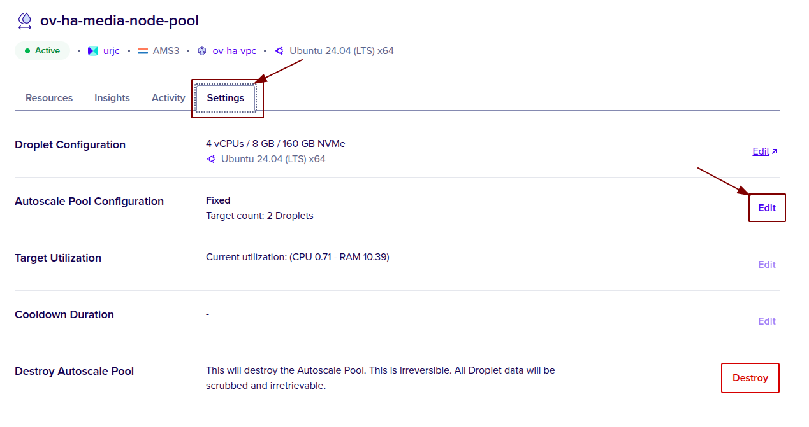
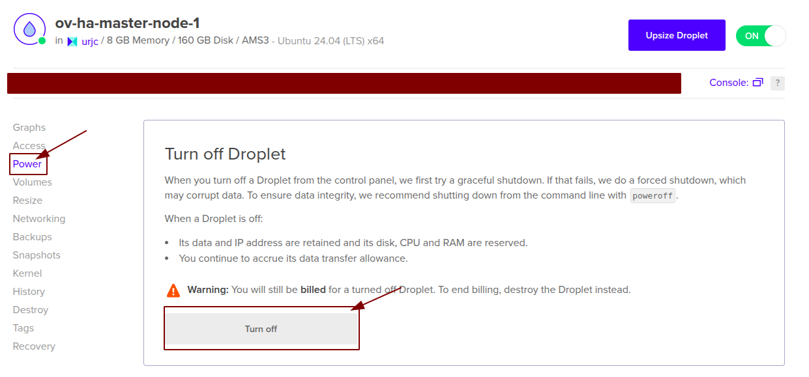
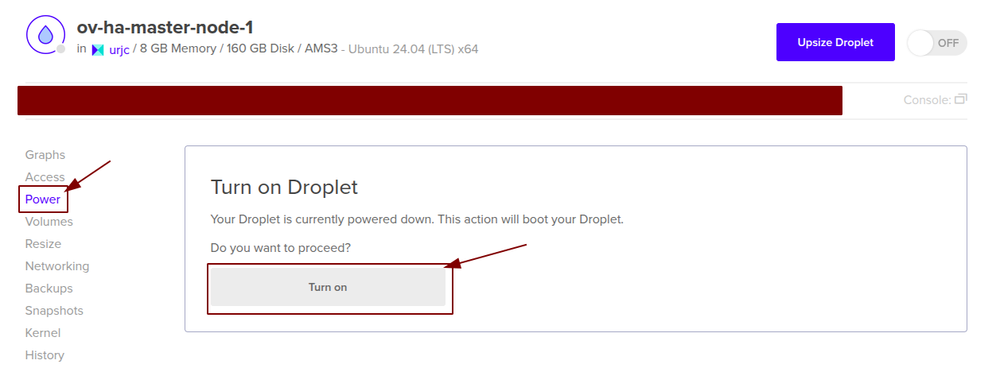
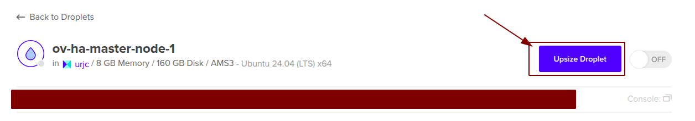
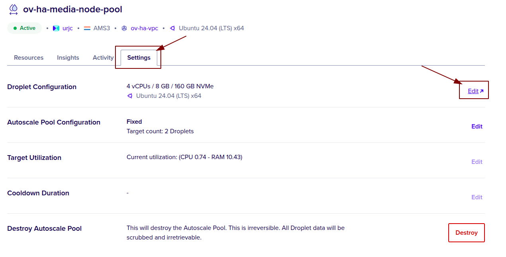
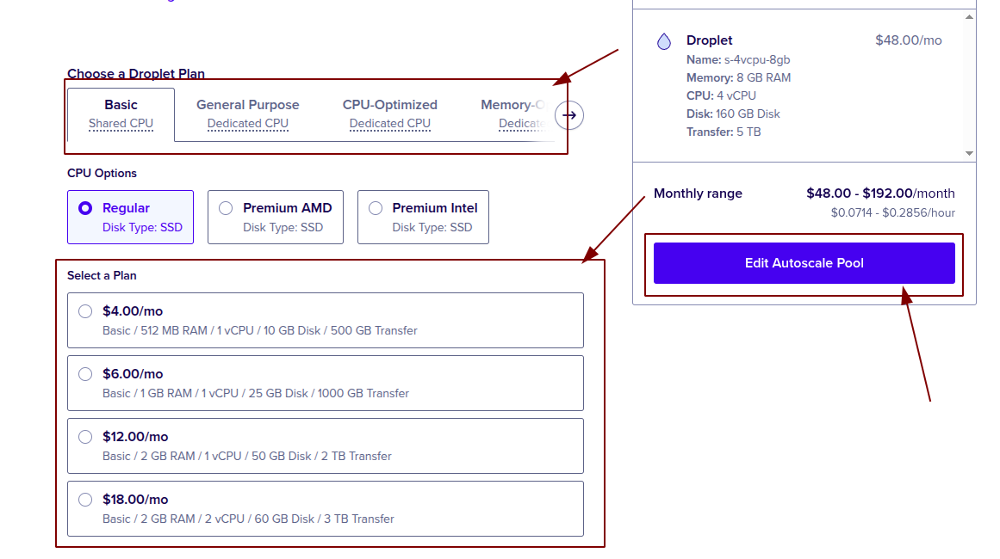
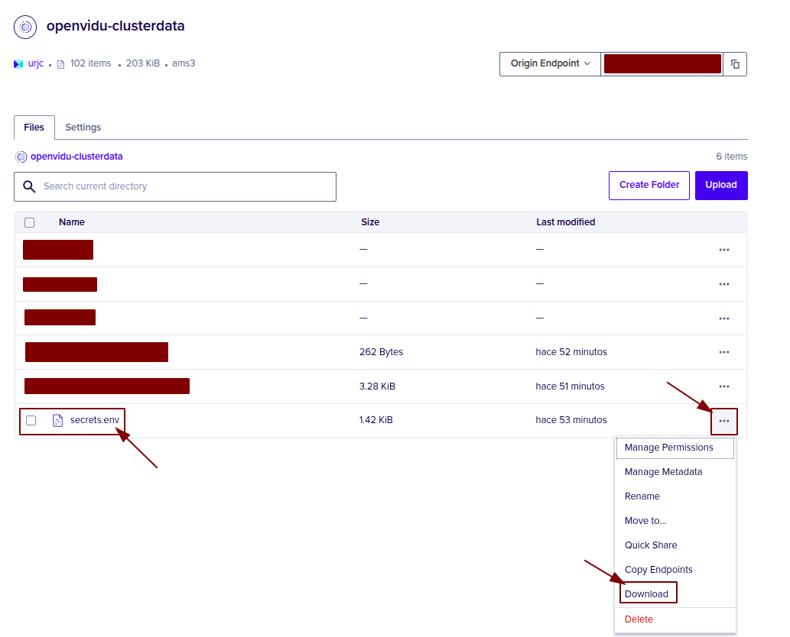
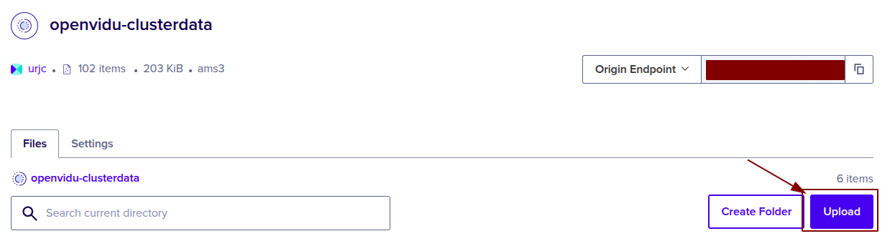
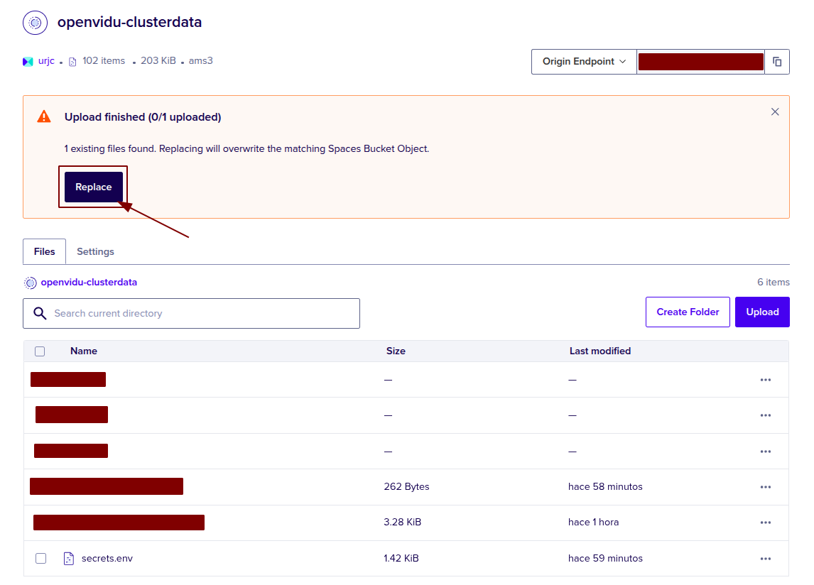

# OpenVidu High Availability administration: Digital Ocean

The OpenVidu High Availability deployment on Digital Ocean is fully automated using the Terraform CLI. It provisions 4 Droplets for the Master Nodes, while Media Nodes are managed through a [Fixed Droplet Autoscale Pool :fontawesome-solid-external-link:{.external-link-icon}](https://docs.digitalocean.com/products/droplets/autoscale/){:target=\_blank}.

Internally, the Digital Ocean High Availability deployment mirrors the On Premises High Availability deployment, allowing you to follow the same administration and configuration guidelines of the [On Premises High Availability](../on-premises/admin.md) documentation. However, there are specific considerations unique to the Digital Ocean environment that are worth taking into account:

## Cluster shutdown and startup

You can start and stop the OpenVidu High Availability cluster at any time. The following sections detail the procedures:

=== "Shutting down the cluster"

    To shut down the cluster, you need to stop the Media Nodes and then stop the Master Nodes.

    1. Navigate to the [Digital Ocean Autoscale Pools Web :fontawesome-solid-external-link:{.external-link-icon}](https://cloud.digitalocean.com/droplets-autoscale){:target=_blank}.
    2. Click into the Droplet Autoscale Pool resource called `<STACK_NAME>-media-node-pool`, go to _"Settings"_ and click on _"Edit"_ in the **Autoscale Pool Configuration**.
        <figure markdown>
        { .svg-img .dark-img }
        </figure>
    3. Drop down the **Number of Droplets** to 0, click _"Save"_ and wait for it to apply the changes.
    4. After confirming that all Media Node instances are terminated, in the _"Droplets"_ tab select the droplet called `<STACK_NAME>-master-node-1`. Click on it to go to the Master Node 1 instance, there click on _"Power"_ and then _"Turn off"_ the droplet.
        <figure markdown>
        { .svg-img .dark-img }
        </figure>    
    5. Repeat step 4 for all Master Nodes.

=== "Starting up the cluster"

    To start the cluster, start the Master Nodes first and then the Media Nodes.

    1. Navigate to the [Digital Ocean Droplet Web :fontawesome-solid-external-link:{.external-link-icon}](https://cloud.digitalocean.com/droplets){:target=_blank}.
    2. Select the droplet named `<STACK_NAME>-master-node-1`, then go to _"Power"_ and then _"Turn on"_ the droplet.
        <figure markdown>
        { .svg-img .dark-img }
        </figure>
    3. Wait until the instance is running.
    4. Repeat steps 2 and 3 until all Master Nodes are up and running.
    5. Go back to the _"Autoscale Pools"_ tab, and there click into the Droplet Autoscale Pool resource called `<STACK_NAME>-media-node-pool` go to _"Settings"_ and click on _"Edit"_ in the **Autoscale Pool Configuration**.
        <figure markdown>
        { .svg-img .dark-img }
        </figure>
    6. Change the number to the number of media nodes you want and click on save, now wait for it to apply the change.

## Change the instance size

It is possible to change the instance size of both the Master Node and the Media Nodes. However, since the Media Nodes are part of an Autoscale Pool, the process differs. The following section details the procedures:

=== "Master Nodes"

    !!! warning

        This procedure requires downtime, as it involves stopping the Master Node.

    1. [Shutdown the cluster](#shutting-down-the-cluster).

        !!! info

            You can stop only the Master Node droplet to change its droplet size, but it is recommended to stop the whole cluster to avoid any issues.
    2. Go to the [Digital Ocean Droplet Web :fontawesome-solid-external-link:{.external-link-icon}](https://cloud.digitalocean.com/droplets){:target=_blank} and locate the resource with the name `<STACK_NAME>-master-node-1` and click on it.
    3. Click on _"Upsize"_ and select the Droplet size you desire and click on _"Resize"_
        <figure markdown>
        { .svg-img .dark-img }
        </figure>
    4. Repeat step 3 on every Master Node.
    5. [Start the cluster](#starting-up-the-cluster).

=== "Media Nodes"

    !!! warning
        This will delete the media nodes without the graceful delete option, you can stop them graceful manually by running the `/usr/local/bin/graceful_shutdown.sh` script and waiting for it to finish. You have to do it in all the media nodes because the autoscale pool will delete all media nodes and create new ones.

    1. Navigate to the [Digital Ocean Autoscale Pools Web :fontawesome-solid-external-link:{.external-link-icon}](https://cloud.digitalocean.com/droplets-autoscale){:target=_blank}.
    2. Click into the Droplet Autoscale Pool resource called `<STACK_NAME>-media-node-pool`, go to _"Settings"_ and click on _"Edit"_ in the **Droplet Configuration**.
        <figure markdown>
        { .svg-img .dark-img }
        </figure>
    3. Go down into the **Choose a Droplet Plan** section and change the size to the one you prefer, then click on _"Edit Autoscale Pool"_ and wait for the changes to apply.
        <figure markdown>
        { .svg-img .dark-img }
        </figure>

## Change Fixed Number of Media Nodes

You can change the fixed number of Media Node by following these steps:

=== "Change Fixed Number of Media Nodes"

    1. Go to the [Digital Ocean Autoscale Pools Web :fontawesome-solid-external-link:{.external-link-icon}](https://cloud.digitalocean.com/droplets-autoscale){:target=_blank}.
    2. Click into the Droplet Autoscale Pool resource called `<STACK_NAME>-media-node-pool`, go to _"Settings"_ and click on _"Edit"_ in the **Autoscale Pool Configuration**.
        <figure markdown>
        { .svg-img .dark-img }
        </figure>
    3. Change the number to the desired one and click on _"Save"_, then wait to the Autoscale Pool to apply the changes.
    !!! warning

        This will delete the media nodes if you have set them to less than the number of media nodes that existed, you can stop them graceful manually by running the `/usr/local/bin/graceful_shutdown.sh` script and waiting for it to finish. You have to do it in all the media nodes because the autoscale pool deletes all and creates new ones.

## Administration and configuration

Regarding the administration of your deployment, you can follow the instructions in section [On Premises High Availability Administration](../on-premises/admin.md).

Regarding the configuration of your deployment, you can follow the instructions in section [Changing Configuration](../../configuration/changing-config.md). Additionally, the [How to Guides](../../how-to-guides/index.md) offer multiple resources to assist with specific configuration changes.

In addition to these, a Digital Ocean deployment provides the capability to manage global configurations by downloading `secrets.env` file of the bucket and changing it, then upload it again. Here are the detailed steps:

=== "Changing configuration through `secrets.env`"

    1. Navigate to the [Digital Ocean Spaces Object Storage :fontawesome-solid-external-link:{.external-link-icon}](https://cloud.digitalocean.com/spaces){:target=_blank} and click on the cluster data bucket that you are using for the deployment.
    2. Download the `secrets.env` file that is in the bucket.
        <figure markdown>
        { .svg-img .dark-img }
        </figure>
    3. Open it and edit the values of the credental of your choice.
    4. Upload the edited `secrets.env` to the bucket, select private file and replace it.
        <figure markdown>
        { .svg-img .dark-img }
        </figure>
        <figure markdown>
        { .svg-img .dark-img }
        </figure>
    5. Restart Master Node 1 by shutting it down and then starting it again. Changes will be applied automatically in all the nodes of your OpenVidu High Availability deployment.

## Backup and Restore

Review the [Backup and restore OpenVidu deployments](../../how-to-guides/backup-and-restore.md) guide for recommended backup workflows.