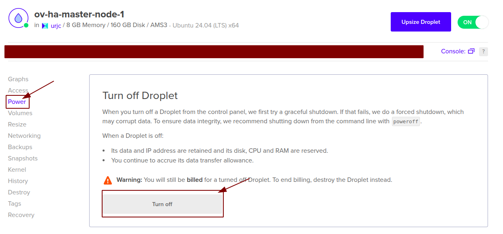
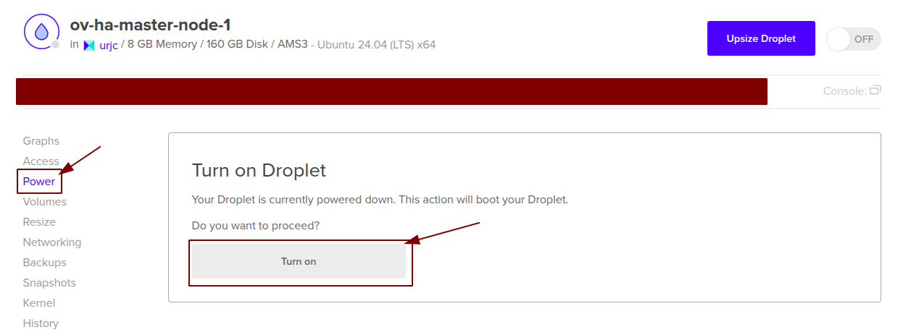
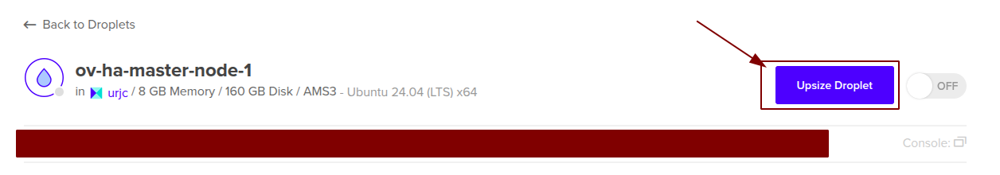
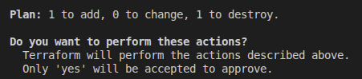
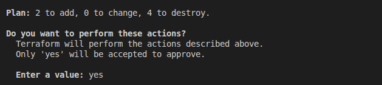
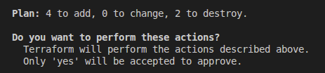
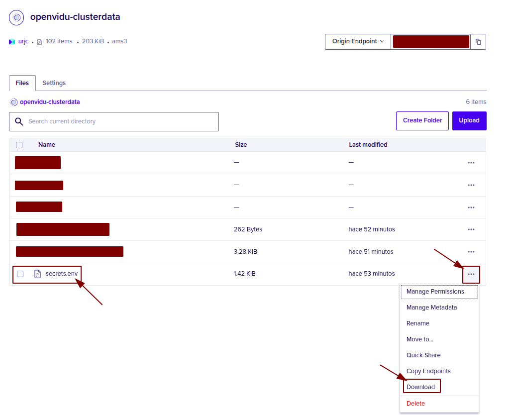
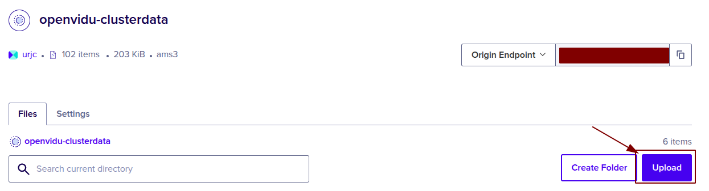
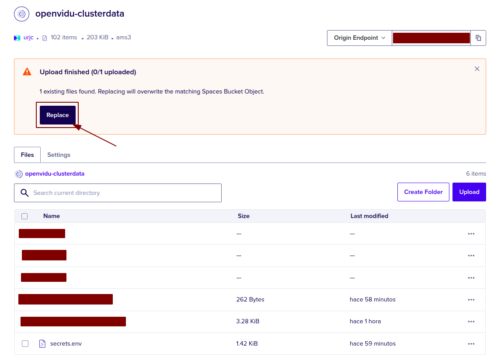

# OpenVidu High Availability administration: DigitalOcean

<div class="provider-chip" markdown>

:material-digital-ocean:{ .provider-chip-icon } DigitalOcean

</div>


The OpenVidu High Availability deployment on DigitalOcean is fully automated using the Terraform CLI. It provisions 4 Droplets for the Master Nodes, while Media Nodes are plain Droplets created and removed by a [DigitalOcean Function :fontawesome-solid-external-link:{.external-link-icon}](https://docs.digitalocean.com/products/functions/){:target="_blank"} that acts as the autoscaler.

Internally, the DigitalOcean High Availability deployment mirrors the On Premises High Availability deployment, allowing you to follow the same administration and configuration guidelines of the [On Premises High Availability](../on-premises/admin.md) documentation. However, there are specific considerations unique to the DigitalOcean environment that are worth keeping in mind:

!!! info "How Media Nodes are managed"

    - Terraform deploys the autoscaler as a DigitalOcean Function (namespace `<STACK_NAME>-autoscaler`, function `autoscaler/check`) and a scheduled trigger named `<STACK_NAME>-autoscale-cron` that invokes it **every four minutes**.
    - Media Nodes created by the autoscaler are Droplets named `<STACK_NAME>-media-<TIMESTAMP>-<RANDOM>` and tagged `<STACK_NAME>-media-node-tag`. They are not managed by Terraform, and they are not part of any Droplet Autoscale Pool.
    - `minNumberOfMediaNodes`, `maxNumberOfMediaNodes`, `initialNumberOfMediaNodes`, `scaleTargetCPU` and `mediaNodeInstanceType` are baked into the function when it is deployed. They are changed by editing `terraform.tfvars` and running `terraform apply`, which redeploys the function: there is no autoscaling setting to edit in the DigitalOcean console.
    - If `fixedNumberOfMediaNodes` is greater than 0, no autoscaler function is deployed and Media Nodes are Terraform-managed Droplets named `<STACK_NAME>-media-node-<N>`.

## Cluster shutdown and startup

You can start and stop the OpenVidu High Availability cluster at any time. Master Nodes are Droplets that you power off and on, while Media Nodes are ephemeral: they are drained and re-created instead of being powered off. The following sections detail the procedures:

=== "Shutting down the cluster"

    To shut down the cluster, stop the autoscaler, then remove the Media Nodes, and finally power off the Master Nodes.

    1. From the directory containing your Terraform state, remove the autoscaler so that no new Media Nodes are created:

        ```bash
        terraform destroy -target='null_resource.deploy_autoscaler_function'
        ```

        This deletes only the scheduled trigger, the function and its namespace. The rest of the deployment is untouched.

        !!! info

            In a deployment with a fixed number of Media Nodes (`fixedNumberOfMediaNodes` greater than 0) there is no autoscaler function. Skip this step and power off the `<STACK_NAME>-media-node-<N>` Droplets the same way as the Master Nodes in step 4.

    2. Drain every Droplet tagged `<STACK_NAME>-media-node-tag` as described in [Removing a Media Node gracefully](#removing-a-media-node-gracefully). Each Media Node waits for its active Rooms to end and then deletes itself.
    3. After confirming that no Media Node is left, navigate to the [DigitalOcean Droplet Web :fontawesome-solid-external-link:{.external-link-icon}](https://cloud.digitalocean.com/droplets){:target="_blank"}.
    4. Select the droplet called `<STACK_NAME>-master-node-1`. Click on it to go to the Master Node 1 instance, then click _"Power"_ and then _"Turn off"_ the droplet.
        <figure markdown>
        { .svg-img .dark-img }
        </figure>
    5. Repeat step 4 for all Master Nodes.


=== "Starting up the cluster"

    To start the cluster, start the Master Nodes first and then let the autoscaler re-create the Media Nodes.

    1. Navigate to the [DigitalOcean Droplet Web :fontawesome-solid-external-link:{.external-link-icon}](https://cloud.digitalocean.com/droplets){:target="_blank"}.
    2. Select the droplet named `<STACK_NAME>-master-node-1`, then go to _"Power"_ and then _"Turn on"_ the droplet.
        <figure markdown>
        { .svg-img .dark-img }
        </figure>
    3. Wait until the instance is running.
    4. Repeat steps 2 and 3 until all Master Nodes are up and running.
    5. Redeploy the autoscaler from the directory containing your Terraform state:

        ```bash
        terraform apply
        ```

        Terraform re-creates the function and its scheduled trigger and invokes the function once immediately, so the cluster goes back to `max(minNumberOfMediaNodes, initialNumberOfMediaNodes)` Media Nodes without waiting for the first scheduled run.

        !!! info

            With a fixed number of Media Nodes, power on the `<STACK_NAME>-media-node-<N>` Droplets instead, following steps 2 and 3.

## Removing a Media Node gracefully

Media Nodes are removed through the `<STACK_NAME>-draining` tag. Every Media Node checks its own tags every two minutes and, as soon as the draining tag is present, it waits for its active Rooms to conclude and then deletes its own Droplet. This is exactly what the autoscaler does on a scale-in decision, and you can trigger it manually on any Media Node:

=== "DigitalOcean console"

    1. Navigate to the [DigitalOcean Droplet Web :fontawesome-solid-external-link:{.external-link-icon}](https://cloud.digitalocean.com/droplets){:target="_blank"} and click on the Media Node you want to remove. Media Nodes created by the autoscaler are named `<STACK_NAME>-media-<TIMESTAMP>-<RANDOM>`.
    2. Open the _"Tags"_ section of the droplet and add the tag `<STACK_NAME>-draining`.
    3. In the same section, remove the tag `<STACK_NAME>-media-node-tag` so the autoscaler stops counting this droplet as an active Media Node.
    4. Within two minutes the Media Node starts its graceful shutdown. The droplet disappears once its active Rooms have finished.

!!! warning

    Do not power off a Media Node to remove it. The autoscaler counts Droplets by tag, so a powered-off Media Node still counts towards `minNumberOfMediaNodes` and `maxNumberOfMediaNodes` while reporting no CPU metrics, and it never runs its graceful shutdown script.

    If you do not need the graceful behavior, destroy the droplet directly (_"Destroy"_ in the console). Active Rooms on it are interrupted, and the autoscaler brings the number of Media Nodes back to `minNumberOfMediaNodes` on its next run.

!!! info

    With a fixed number of Media Nodes (`fixedNumberOfMediaNodes` greater than 0) the tag watcher is not installed, so tagging has no effect. Instead, SSH into the Media Node and run `/usr/local/bin/graceful_shutdown.sh`: it waits for the active Rooms to end and then deletes the droplet. Run `terraform apply` afterwards to re-create it.

## Change the instance size

It is possible to change the instance size of both the Master Nodes and the Media Nodes. Master Nodes are resized from the DigitalOcean console, while the Media Node size is a Terraform variable because Media Nodes are created by the autoscaler. The following section details the procedures:

=== "Master Nodes"

    !!! warning

        This procedure requires downtime, as it involves stopping the Master Node.

    1. [Shutdown the cluster](#shutting-down-the-cluster).

        !!! info

            You can stop only the Master Node droplet to change its droplet size, but it is recommended to stop the whole cluster to avoid any issues.
    2. Go to the [DigitalOcean Droplet Web :fontawesome-solid-external-link:{.external-link-icon}](https://cloud.digitalocean.com/droplets){:target="_blank"} and locate the resource with the name `<STACK_NAME>-master-node-1` and click on it.
    3. Click on _"Upsize"_ and select the Droplet size you desire and click on _"Resize"_
        <figure markdown>
        { .svg-img .dark-img }
        </figure>
    4. Repeat step 3 on every Master Node.
    5. [Start the cluster](#starting-up-the-cluster).

=== "Media Nodes"

    1. Go to the `terraform.tfvars` file and set **mediaNodeInstanceType** to the Droplet size you want.
    2. Open a terminal and run the following command:

        ```bash
        terraform apply
        ```

    3. Confirm the change that Terraform proposes. The Media Node size is baked into the autoscaler function, so Terraform redeploys it with the new value.
    4. Running Media Nodes keep their current size: only Media Nodes created after the apply use the new one. To roll out the change immediately, drain the running Media Nodes as described in [Removing a Media Node gracefully](#removing-a-media-node-gracefully); the autoscaler replaces them with Droplets of the new size on its next run.

    !!! info

        With a fixed number of Media Nodes, `terraform apply` applies the new size to the `<STACK_NAME>-media-node-<N>` Droplets that Terraform manages, which interrupts the Rooms running on them. To avoid that, first SSH into each Media Node and run `/usr/local/bin/graceful_shutdown.sh` (it waits for the active Rooms to end and then deletes the droplet), and then run `terraform apply` to re-create them with the new size.

## Media Nodes Autoscaling Configuration

You can modify the autoscaling configuration of the Media Nodes via `terraform.tfvars` file and `terraform apply`:

=== "Media Nodes Autoscaling Configuration"

    1. Go to the `terraform.tfvars` file and change the config related to autoscaling, such as:
        - **scaleTargetCPU**
        - **minNumberOfMediaNodes**
        - **maxNumberOfMediaNodes**
        - **initialNumberOfMediaNodes**

    2. Open a terminal and write the following command once you've changed the value/s.
    ```
    terraform apply
    ```
    3. Say yes to the proposed change that Terraform is suggesting (the changes are the autoscaler function redeploying with the new values), and your changes will be applied. The function is invoked once right after being redeployed, so the new limits take effect without waiting for the next scheduled run. Running Media Nodes are not affected.
        <figure markdown>
        { .svg-img .dark-img }
        </figure>

!!! info "How the autoscaler uses these values"

    - On a run where no Media Node exists, the cluster is brought straight to `max(minNumberOfMediaNodes, initialNumberOfMediaNodes)` Media Nodes. The same logic re-creates missing Media Nodes: whenever the number of Media Nodes drops below `minNumberOfMediaNodes`, the autoscaler creates the ones needed.
    - On every other run, the average CPU usage of the last four minutes across all Media Nodes is compared against `scaleTargetCPU`: above it, one Media Node is added (never exceeding `maxNumberOfMediaNodes`); below it, one Media Node is drained (never going below `minNumberOfMediaNodes`).
    - Setting `minNumberOfMediaNodes` equal to `maxNumberOfMediaNodes` keeps an exact number of Media Nodes while still using the autoscaler, so failed or drained nodes are replaced automatically.
    - If `initialNumberOfMediaNodes` is greater than `maxNumberOfMediaNodes`, the extra Media Nodes are drained again on the following runs.

!!! tip

    Every autoscaler run returns its full log in the activation result. You can review its decisions in the DigitalOcean console under _"Functions"_, in the `<STACK_NAME>-autoscaler` namespace.

## Change Fixed Number of Media Nodes

You can change the fixed number of Media Nodes **in case you put a number of fixed Media Nodes** by following these steps:

=== "Change Fixed Number of Media Nodes"

    1. Go to the `terraform.tfvars` file and set **fixedNumberOfMediaNodes** to the number of Media Nodes you want.
    2. Open a terminal and write the following command once you've changed the value.
    ```
    terraform apply
    ```
    3. Say yes to the proposed change that Terraform is suggesting. Terraform creates or destroys `<STACK_NAME>-media-node-<N>` Droplets until their number matches the new value.

    !!! warning

        Lowering the value destroys Droplets without draining them, so the Rooms running on them are interrupted. To avoid this, SSH into the highest-numbered Media Nodes (they are the ones Terraform removes first) and run the `/usr/local/bin/graceful_shutdown.sh` script, which waits for the active Rooms to end and then deletes the droplet. Then lower **fixedNumberOfMediaNodes** and run `terraform apply`.

### Activate Scale In when Fixed Number of Media Nodes

You can activate or deactivate the scale in when you decide you need autoscale option activated or not.

=== "Activate Scale In"

    1. Go to the `terraform.tfvars` file and change the config related to autoscaling, such as:
        - **fixedNumberOfMediaNodes needs to be set to 0**.
        - **scaleTargetCPU** if you don't want the default.
        - **minNumberOfMediaNodes** if you don't want the default.
        - **maxNumberOfMediaNodes** if you don't want the default.
        - **initialNumberOfMediaNodes** if you don't want the default.

    2. Open a terminal and write the following command once you've changed the value/s.
    ```
    terraform apply
    ```
    3. Say yes to the proposed change that Terraform is suggesting (the changes are destroying the fixed number of media nodes and deploying the autoscaler function), and your changes will be applied. The autoscaler is invoked right after being deployed and creates `max(minNumberOfMediaNodes, initialNumberOfMediaNodes)` Media Nodes.
        <figure markdown>
        { .svg-img .dark-img }
        </figure>

    !!! warning

        The fixed Media Node Droplets are destroyed without being drained, so their active Rooms are interrupted. Drain them first with the `/usr/local/bin/graceful_shutdown.sh` script if you need a graceful transition.

=== "Deactivate Scale In"

    1. Go to the `terraform.tfvars` file and change the config related to autoscaling, such as:
        - **fixedNumberOfMediaNodes needs to be set to your desired value**.

    2. Open a terminal and write the following command once you've changed the value/s.
    ```
    terraform apply
    ```
    3. Say yes to the proposed change that Terraform is suggesting. Terraform removes the autoscaler function (trigger, function and namespace), deletes every Droplet tagged `<STACK_NAME>-media-node-tag` or `<STACK_NAME>-draining`, and creates the `<STACK_NAME>-media-node-<N>` Droplets. When the apply finishes, check in the Droplets console that the expected number of Media Nodes is running.
        <figure markdown>
        { .svg-img .dark-img }
        </figure>

    !!! warning

        The Media Nodes are deleted without being drained, so their active Rooms are interrupted. Drain them first as described in [Removing a Media Node gracefully](#removing-a-media-node-gracefully) if you need a graceful transition.


## Administration and configuration

Regarding the administration of your deployment, you can follow the instructions in section [On Premises High Availability Administration](../on-premises/admin.md).

Regarding the configuration of your deployment, you can follow the instructions in section [Changing Configuration](../../configuration/changing-config.md). Additionally, the [How to Guides](../../how-to-guides/index.md) offer multiple resources to assist with specific configuration changes.

In addition to these, a DigitalOcean deployment provides the capability to manage global configurations by downloading `secrets.env` file of the bucket and changing it, then upload it again. Here are the detailed steps:

=== "Changing configuration through `secrets.env`"

    1. Navigate to the [DigitalOcean Spaces Object Storage :fontawesome-solid-external-link:{.external-link-icon}](https://cloud.digitalocean.com/spaces){:target="_blank"} and click on the cluster data bucket that you are using for the deployment.
    2. Download the `secrets.env` file that is in the bucket.
        <figure markdown>
        { .svg-img .dark-img }
        </figure>
    3. Open it and edit the credential values of your choice.
    4. Upload the edited `secrets.env` to the bucket, select private file and replace it.
        <figure markdown>
        { .svg-img .dark-img }
        </figure>
        <figure markdown>
        { .svg-img .dark-img }
        </figure>
    5. Restart Master Node 1 by shutting it down and then starting it again. Changes will be applied automatically in all the nodes of your OpenVidu High Availability deployment.

## Backup and Restore

Review the [Backup and restore OpenVidu deployments](../../how-to-guides/backup-and-restore.md) guide for recommended backup workflows.
