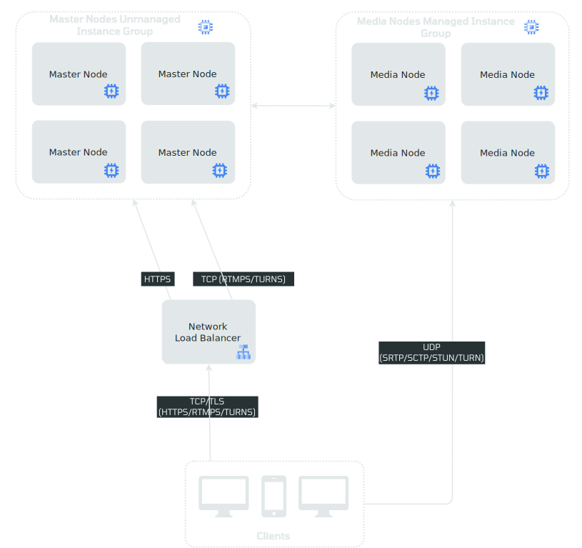
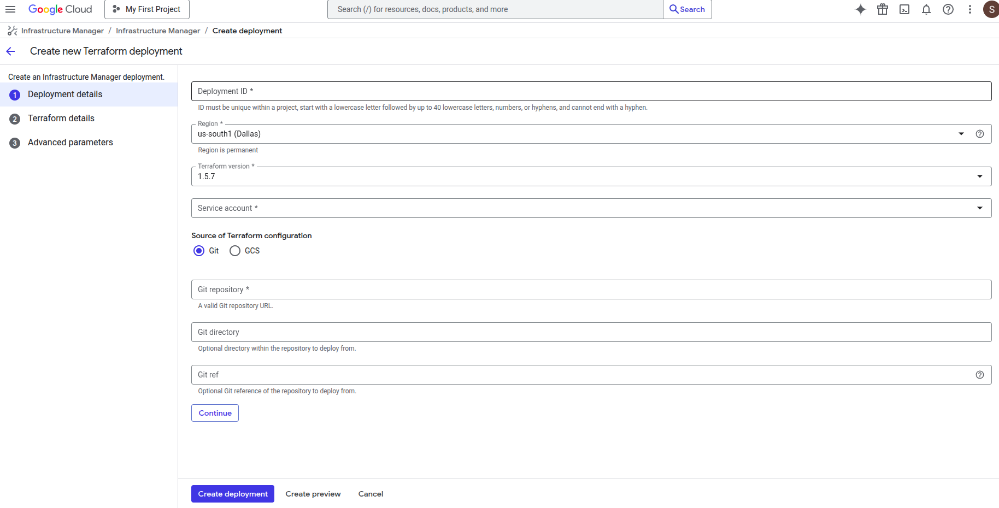
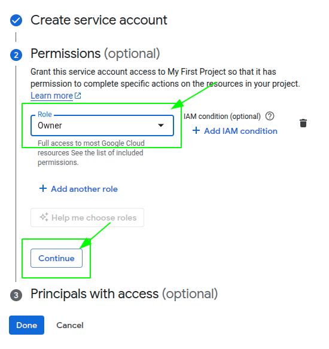
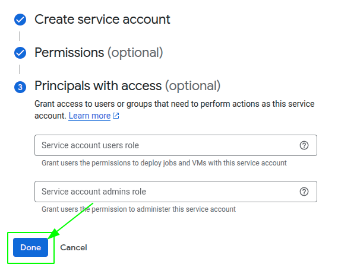
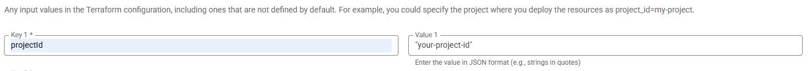
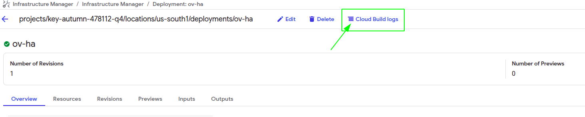
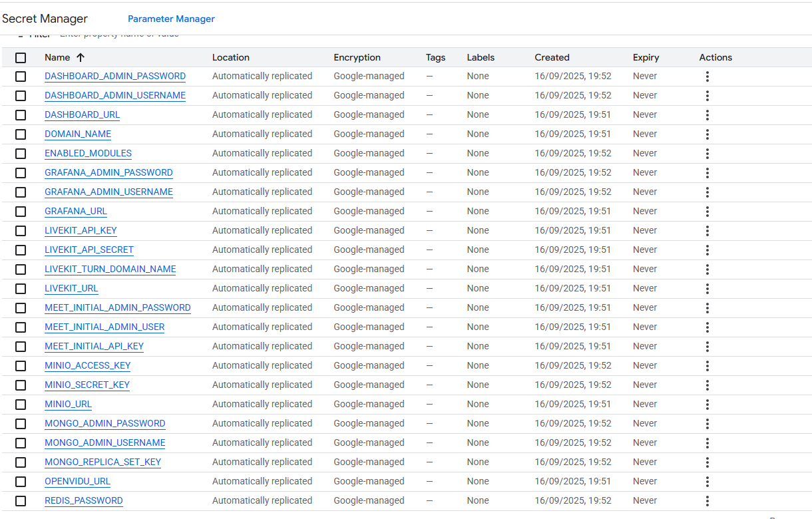
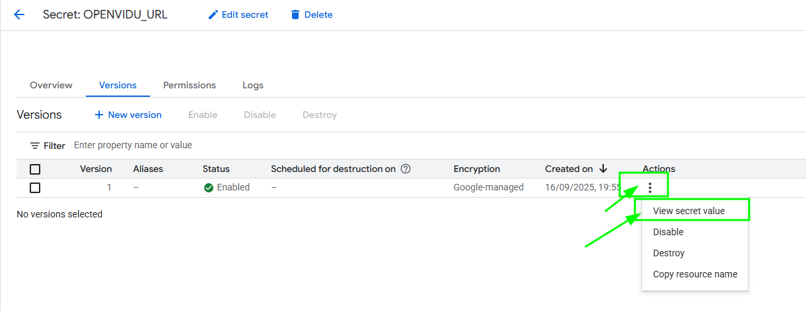
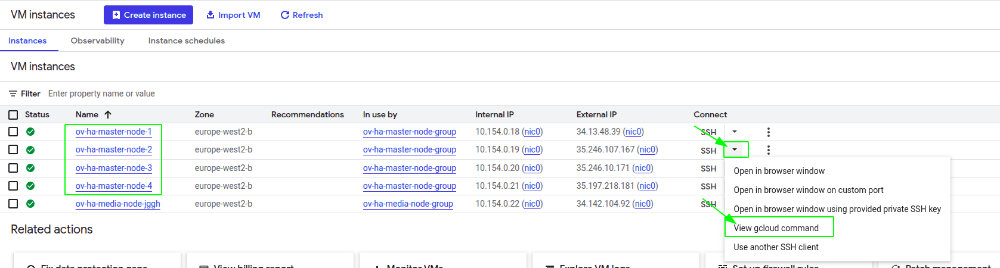

# OpenVidu High Availability installation: Google Cloud Platform

!!! info
    
    OpenVidu High Availability is part of **OpenVidu PRO**. Before deploying, you need to [create an OpenVidu account](/account/){:target=_blank} to get your license key.
    There's a 15-day free trial waiting for you!

This section contains the instructions to deploy a production-ready OpenVidu High Availability deployment in Google Cloud Platform. Deployed services are the same as the [On Premises High Availability installation](../on-premises/install.md) but they will be resources in Google Cloud Platform and you can automate the process in the Google Cloud Console.

To deploy OpenVidu into Google Cloud Platform you just need to log into your [Infrastructure Manager :fontawesome-solid-external-link:{.external-link-icon}](https://console.cloud.google.com/infra-manager/deployments) in the GCP console. Then follow the next steps to fill the parameters of your choice.

This is how the architecture of the deployment looks like:

=== "Architecture overview"

    <figure markdown>
    { .svg-img .dark-img }
    <figcaption>OpenVidu High Availability Google Cloud Platform Architecture</figcaption>
    </figure>

    - The Load Balancer distributes HTTPS traffic to the Master Nodes.
    - If RTMP media is ingested, the Load Balancer also routes this traffic to the Master Nodes that they act as a bridge.
    - WebRTC traffic (SRTP/SCTP/STUN/TURN) is routed directly to the Media Nodes.
    - 4 fixed Virtual Machine Instances are created for the Master Nodes. It must always be 4 Master Nodes to ensure high availability.
    - A Managed Instace Group of Media Nodes is created to scale the number of Media Nodes based on the system load.

=== "Architecture overview with TURN over TLS"

    <figure markdown>
    { .svg-img .dark-img }
    <figcaption>OpenVidu High Availability Google Cloud Platform Architecture with TURN over TLS</figcaption>
    </figure>

    - The Load Balancer distributes HTTPS traffic to the Master Nodes.
    - If RTMP media is ingested, the Load Balancer also routes this traffic to the Master Nodes that they act as a bridge.
    - WebRTC traffic (SRTP/SCTP/STUN/TURN) is routed directly to the Media Nodes.
    - An additional Load Balancer is created to route TURN over TLS traffic to the TURN server running on the Media Nodes. It is used to allow users behind restrictive firewalls to connect to the Media Nodes.
    - 4 fixed Virtual Machine Instances are created for the Master Nodes. It must always be 4 Master Nodes to ensure high availability.
    - A Managed Instace Group of Media Nodes is created to scale the number of Media Nodes based on the system load.

--8<-- "shared/self-hosting/gcp-custom-scale-in.md"

## Deployment details

--8<-- "shared/self-hosting/gcp-info-deployment.md"

To deploy OpenVidu, first you need to create a new deployment in the top left button as you can see in the image.

<figure markdown>
{ .svg-img .dark-img }
</figure>

Once you click the button you will see this window.

<figure markdown>
{ .svg-img .dark-img }
</figure>

Fill **Deployment ID** with any name that you desire like openvidu-High Availability-deployment, next choose the **Region** that you prefer, leave **Terraform version** in the 1.5.7 and for **Service Account** you will need to create a new one with _"Owner"_ permissions, in order to do that click on _"Service Account"_ label and then into _"New Service Account"_, choose your service account name click on _"Create and Continue"_ and then select the _"Owner"_ role, click on _"Continue"_ and the in _"Done"_.   

!!! warning
    If you change the region in the previous step, don't forget to change the [region and zone](https://docs.cloud.google.com/compute/docs/regions-zones?hl=en) in the terraform values.

??? details "New Service Account Steps"

    <figure markdown>
    { .svg-img .dark-img }
    <figcaption>Step 1: Create Service Account</figcaption>
    </figure>

    <figure markdown>
    { .svg-img .dark-img }
    <figcaption>Step 2: Service Account Details</figcaption>
    </figure>

    <figure markdown>
    { .svg-img .dark-img }
    <figcaption>Step 3: Grant Permissions</figcaption>
    </figure>

    <figure markdown>
    { .svg-img .dark-img }
    <figcaption>Step 4: Complete Setup</figcaption>
    </figure>

* Fill **Git repository** with this link <code>https://github.com/OpenVidu/openvidu.git</code>:material-content-copy: that corresponds to our git repository where are allocated the terraform files to deploy openvidu. 
* Fill the **Git directory** with the following path <code>openvidu-deployment/pro/ha/gcp</code>:material-content-copy: 
* For the **Git ref** use <code>3.5.0</code>:material-content-copy: corresponding to the version 

Finally click on continue.

## Input Values

In Google Cloud Platform there is no such thing like template with parameters, you will need to introduce by yourself in the console the parameters that are declared in our terraform files, so there is a detailed table of all the optional and non-optional parameters.

### Mandatory Parameters

    

        <table border="1" cellspacing="0" cellpadding="6" style="margin: 0 auto;">
            <tr>
                <th>Input Value</th>
                <th>Description</th>
            </tr>
            <tr>
                <td>projectId</td>
                <td>GCP project id where the resources will be created.</td>
            </tr>
            <tr>
                <td>stackName</td>
                <td>Stack name for OpenVidu deployment.</td>
            </tr>
            <tr>
                <td>openviduLicense</td>
                <td>Your OpenVidu License, get one <a href="https://openvidu.io/account" target="_blank" rel="noopener">here</a> if you dont have one.</td>
            </tr>
        </table>
    

### Optional Parameters

    <table border="1" cellspacing="0" cellpadding="6" style="margin: 0 auto;">
      <tr>
        <th>Input Value</th>
        <th>Default Value</th>
        <th>Description</th>
      </tr>
      <tr>
        <td>region</td>
        <td>"europe-west2"</td>
        <td>GCP region where resources will be created.</td>
      </tr>
      <tr>
        <td>zone</td>
        <td>"europe-west2-b"</td>
        <td>GCP zone that some resources will use.</td>
      </tr>
      <tr>
        <td>certificateType</td>
        <td>"letsEncrypt"</td>
        <td>Certificate type for OpenVidu deployment. Options:
          <ul>
            <li><strong>[selfsigned]</strong> Not recommended for production use. Just for testing purposes or development environments. You don't need a FQDN to use this option.</li>
            <li><strong>[owncert]</strong> Valid for production environments. Use your own certificate. You need a FQDN to use this option.</li>
            <li><strong>[letsencrypt]</strong> Valid for production environments. Can be used with or without a FQDN (if no FQDN is provided, a random sslip.io domain will be used).</li>
          </ul>
          <!-- TODO: Remove this warning when sslip.io rate limiting issue is resolved. Track at https://openvidu.discourse.group/t/deployment-without-domain/5474 -->
          
<strong>Warning:</strong> sslip.io is currently experiencing Let's Encrypt rate limiting issues, which may prevent SSL certificates from being generated. It is recommended to use your own domain name. Check <a href="https://openvidu.discourse.group/t/deployment-without-domain/5474" target="_blank">this community thread</a> for troubleshooting and updates.

              </td>    </tr>
      <tr>
        <td>publicIpAddress</td>
        <td>(none)</td>
        <td>Previously created Public IP address for the OpenVidu Deployment. Blank will generate a public IP.</td>
      </tr>
      <tr>
        <td>domainName</td>
        <td>(none)</td>
        <td>Domain name for the OpenVidu Deployment.</td>
      </tr>
      <tr>
        <td>ownPublicCertificate</td>
        <td>(none)</td>
        <td>If certificate type is 'owncert', this parameter will be used to specify the public certificate in base64 format.</td>
      </tr>
      <tr>
        <td>ownPrivateCertificate</td>
        <td>(none)</td>
        <td>If certificate type is 'owncert', this parameter will be used to specify the private certificate in base64 format.</td>
      </tr>
      <tr>
        <td>initialMeetAdminPassword</td>
        <td>(none)</td>
        <td>Initial password for the 'admin' user in OpenVidu Meet. If not provided, a random password will be generated.</td>
      </tr>
      <tr>
        <td>initialMeetApiKey</td>
        <td>(none)</td>
        <td>Initial API key for OpenVidu Meet. If not provided, no API key will be set and the user can set it later from Meet Console.</td>
      </tr>
      <tr>
        <td>masterNodesInstanceType</td>
        <td>"e2-standard-2"</td>
        <td>Specifies the GCE machine type for your OpenVidu Master Node.</td>
      </tr>
      </tr>
      <tr>
        <td>masterNodesDiskSize</td>
        <td>100</td>
        <td>Size of the disk in GB for master nodes</td>
      </tr>
      <tr>
        <td>mediaNodeInstanceType</td>
        <td>"e2-standard-2"</td>
        <td>Specifies the GCE machine type for your OpenVidu Media Nodes.</td>
      </tr>
      <tr>
        <td>initialNumberOfMediaNodes</td>
        <td>1</td>
        <td>Number of initial media nodes to deploy.</td>
      </tr>
      <tr>
        <td>minNumberOfMediaNodes</td>
        <td>1</td>
        <td>Minimum number of media nodes to deploy.</td>
      </tr>
      <tr>
        <td>maxNumberOfMediaNodes</td>
        <td>5</td>
        <td>Maximum number of media nodes to deploy.</td>
      </tr>
      <tr>
        <td>scaleTargetCPU</td>
        <td>50</td>
        <td>Target CPU percentage to scale out or in.</td>
      </tr>
      <tr>
        <td>GCSAppDataBucketName</td>
        <td>(none)</td>
        <td>Name of the GCS bucket to store application data and recordings. If empty, a bucket will be created</td>
      </tr>
      <tr>
        <td>GCSClusterDataBucketName</td>
        <td>(none)</td>
        <td>Name of the GCS bucket to store cluster data. If empty, a bucket will be created</td>
      </tr>
      <tr>
        <td>RTCEngine</td>
        <td>"pion"</td>
        <td>RTCEngine media engine to use. Allowed values are 'pion' and 'mediasoup'.</td>
      </tr>
      <tr>
        <td>additionalInstallFlags</td>
        <td>(none)</td>
        <td>Additional optional flags to pass to the OpenVidu installer (comma-separated, e.g., '--flag1=value, --flag2').</td>
      </tr>
      <tr>
        <td>turnDomainName</td>
        <td>(none)</td>
        <td>(Optional) Domain name for the TURN server with TLS. Only needed if your users are behind restrictive firewalls.</td>
      </tr>
      <tr>
        <td>turnOwnPublicCertificate</td>
        <td>(none)</td>
        <td>(Optional) This setting is applicable if the certificate type is set to 'owncert' and the TurnDomainName is specified. Specify the certificate in base64 format.</td>
      </tr>
      <tr>
        <td>turnOwnPrivateCertificate</td>
        <td>(none)</td>
        <td>(Optional) This setting is applicable if the certificate type is set to 'owncert' and the TurnDomainName is specified. Specify the certificate in base64 format.</td>
      </tr>
    </table>

For more detail you can check the [variables.tf :fontawesome-solid-external-link:{.external-link-icon}](https://github.com/OpenVidu/openvidu/blob/master/openvidu-deployment/pro/ha/gcp/variables.tf) file to see more information about the inputs.   

!!! warning
    It's important that you put the input variables with the same name as they appear in the table like in the next image.

    <figure markdown>
    { .svg-img .dark-img }
    </figure>

## Deploying the stack

Whenever you are satisfied with your input values, just click on _"Continue"_ and then in _"Create deployment"_. Now it will validate the deployment and create all the resources. Wait around 7 to 12 minutes for the nodes to install OpenVidu.

!!! warning

    In case of failure, check the cloud build logs that appears on the top of the screen and redeploy with the changes that are causing the deployment to fail, if it is something about some API delete the deployment and deploy another one, it should work now. If it keeps failing contact us.
    
    <figure markdown>
    { .svg-img .dark-img }
    </figure>

When everything is ready, you can check the secrets on the [Secret Manager :fontawesome-solid-external-link:{.external-link-icon}](https://console.cloud.google.com/security/secret-manager) or by connecting through SSH to the instances:

=== "Check deployment outputs in GCP Secret Manager"

    1. Go to the [Secret Manager :fontawesome-solid-external-link:{.external-link-icon}](https://console.cloud.google.com/security/secret-manager).

    2. Once you are in the Secret Manager you will see all the secrets by their name.

        <figure markdown>
        { .svg-img .dark-img }
        </figure>

    3. Here click on the secret of your choice, choose the last version and then click on the _"3 dots"_ -> _"View secret value"_ to retrieve that secret.

        <figure markdown>
        { .svg-img .dark-img }
        </figure>

=== "Check deployment outputs in the instance"

    SSH to any of the Master Nodes by gcloud command generated in the web console and navigate to the config folder `/opt/openvidu/config/cluster`. Files with the deployment outputs are:

    - `openvidu.env`
    - `master_node/meet.env`

    To find out the command go to [Compute Engine Instances :fontawesome-solid-external-link:{.external-link-icon}](https://console.cloud.google.com/compute/instances) and click on the arrow close to the SSH letters and then _"View gcloud command"_.
    <figure markdown>
    { .svg-img .dark-img }
    </figure>   

    To install gcloud in your shell follow the official [instructions :fontawesome-solid-external-link:{.external-link-icon}](https://cloud.google.com/sdk/docs/install?hl=en#linux){:target="_blank"}.

## Configure your application to use the deployment 

You need your Google Cloud Platform secret outputs to configure your OpenVidu application. You can check these secrets by searching in the Secrets Manager with any of these two ways ([Check deployment outputs in GCP Secret Manager](#check-deployment-outputs-in-gcp-secret-manager)) or ([Check deployment outputs in the instance](#check-deployment-outputs-in-the-instance)).

Your authentication credentials and URL to point your applications would be:

--8<-- "shared/self-hosting/gcp-credentials-general.md"
--8<-- "shared/self-hosting/gcp-credentials-v2compatibility.md"

## Troubleshooting initial Google Cloud Platform deployment creation

--8<-- "shared/self-hosting/gcp-troubleshooting.md"

3. If everything seems fine, check the [status](../on-premises/admin.md#checking-the-status-of-services) and the [logs](../on-premises/admin.md#checking-logs) of the installed OpenVidu services.

## Configuration and administration

When your Google Cloud Platform deployment reaches the **`Active`** state, it means that all the resources have been created. You will need to wait about 7 to 12 minutes to let the instances install OpenVidu as we mentioned before. When this time has elapsed, try connecting to the deployment URL. If it doesn't work, we recommend checking the previous section. Once finished you can check the [Administration](./admin.md) section to learn how to manage your deployment.