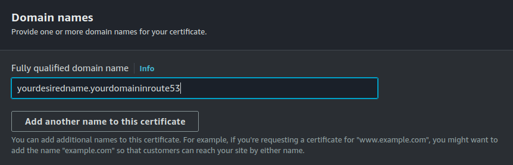
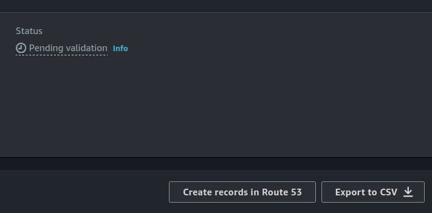
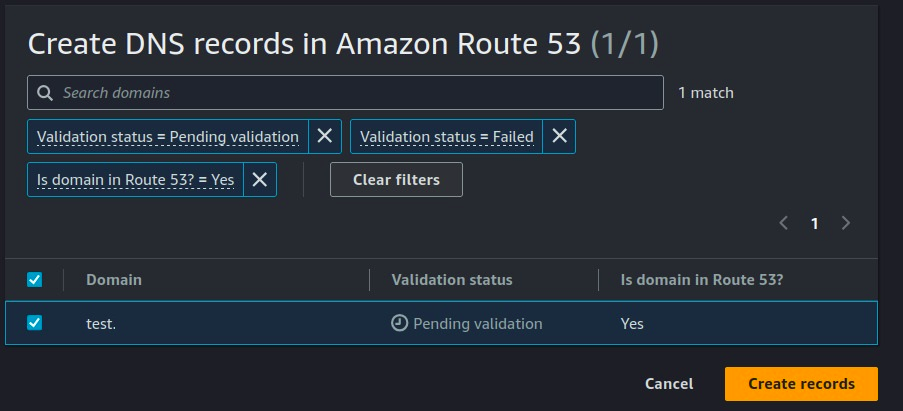
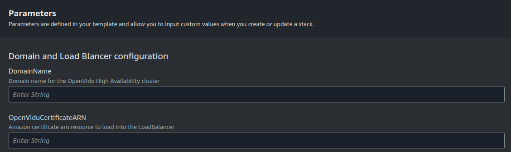
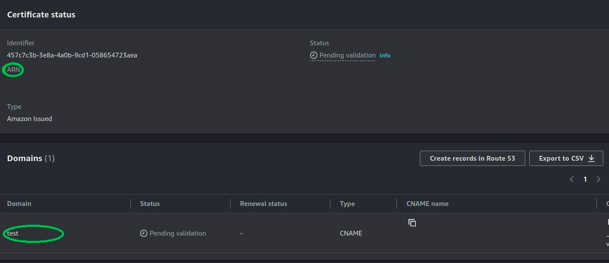
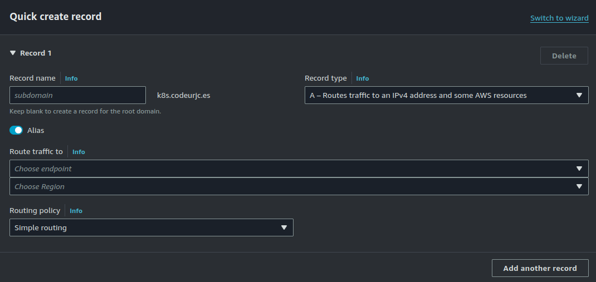

# Create AWS certificate for OpenVidu HA deployment

You will need this certificate to deploy the High Availability deployment. This guide shows you how to create it.

## Prerequisites

It is important to note that you will need access to the Certificate Manager in your AWS account, as well as access to a domain provider.
You will need a domain to be able to create and associate the certificate.

## Creation

=== "AWS Certificate creation"

    These are the steps you need to follow to create the AWS certificate; keep in mind that you need a domain.

    First, go to AWS Certificate Manager and request a new public certificate. The following parameter is the most important.
    <figure markdown>
    { .png-img .dark-img }
    <figcaption>Domain configuration</figcaption>
    </figure>

    You need to replace **`yourdesiredname`** for whatever name you want and **`yourdomain`** for the name of the domain that you own.

    Next, leave the rest of the parameters as they are and click request.

The next page will display the certificate status. Here you will need to create a record in your domain provider to validate the status; initially it will show as pending.

=== "Create record in your domain provider"

    Here you will need to create a new CNAME record in the domain you own by using the CNAME name (up to the domain name portion) as the subdomain and the CNAME value as the record value.

    In AWS Certificate Manager, you can check the CNAME name and value by clicking on the certificate you want.

=== "Create record in Route 53"

    <figure markdown>
    { .png-img .dark-img }
    <figcaption>Create record in Route 53</figcaption>
    </figure>

    You need to click the button called **`Create records in Route 53`**. This will lead you to the next page, where you just click Create records and that's it.

    <figure markdown>
    { .png-img .dark-img }
    <figcaption>Create record for certificate</figcaption>
    </figure>

    Please verify that you have a new entry in the records table of the specified Hosted Zone in Route 53 with the CNAME of the certificate you just created.

    Try refreshing until the status changes to Issued (shown in green).

Finally, when deploying the HA stack in CloudFormation, follow these steps:

=== "Configuration of Load Balancer"

    <figure markdown>
    { .png-img .dark-img }
    <figcaption>Load balancer configuration</figcaption>
    </figure>

    These are parameters related to the certificate you just created.

    You have to fill in the **`DomainName`** field with the domain name that appears in the certificate you created, the one that matches yourdesiredname.yourdomain mentioned earlier.

    Next, for the **`OpenViduCertificateARN`**, you can find it at the top of the same page mentioned earlier; it is called **`ARN`**, as you can see in the image below.

    <figure markdown>
    { .png-img .dark-img }
    <figcaption>Domain name and ARN location</figcaption>
    </figure>

When everything is up and running, you will need to create a new record in the Hosted Zone referring to the Load Balancer resource created in the stack.

=== "Associating the Load Balancer"

    <figure markdown>
    { .png-img .dark-img }
    <figcaption>Create Load Balancer record</figcaption>
    </figure>

    Note that Alias is checked.

    In **`subdomain`**, just enter the same value you used for yourdesiredname when creating the AWS certificate.
    In **`Choose endpoint`**, select Alias to Network Load Balancer, and in **`Choose Region`**, select the region where the stack is deployed.
    After selecting the endpoint and region, a new field will appear; select the load balancer that belongs to the stack you have deployed.

    For the other fields, leave them as they are.