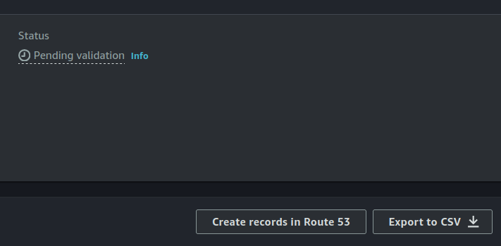

# Create AWS certificate for HA deployment

You will need this certificate to be able to deploy the High Availability deployment. This guide is meant to show you how to do it.

## Prerequisites

Is important to notice that in your AWS you will need to have acces to Route 53 and Certificate Manager.   
You will need to have one Hosted Zone in Route 53 to be able to create the certificate.

## Creation

=== "AWS Certificate creation"

    Those are the steps you need to follow to create the AWS certificate, keep in mind that you need a Hosted Zone.   
    
    First go to AWS Certificate Manager and request a new public certificate. The following parameter is the most important.
    <figure markdown>
    { .png-img .dark-img }
    <figcaption>Domain configuration</figcaption>
    </figure>

    You need to replace **`yourdesiredname`** for whatever name you want and **`yourdomininroute53`** for the name of the domain that you have in Route 53.  

    Next leave the rest of the parameters as they are and click request.

The next page will prompt out the certificate status, here you will need to create a record in Route 53 to validate the status, first you will have status pending.

=== "Create record in Route 53"

    <figure markdown>
    { .png-img .dark-img }
    <figcaption>Create record in Route 53</figcaption>
    </figure>

    You need to click the button called Create records in Route 53. This will lead you to the next image where you just click Create records and that's it.

    <figure markdown>
    { .png-img .dark-img }
    <figcaption>Create record for certificate</figcaption>
    </figure>

    Please verify that you have a new entry in the records table of the specified Hosted Zone in Route 53 with the CNAME of the certificate you just created.   
    
    Try to refresh until you reach the Issued status in green.

Finally when deploying the HA stack in CloudFormation follow these steps

=== "Configuration of Load Balancer"

    <figure markdown>
    { .png-img .dark-img }
    <figcaption>Load balancer configuration</figcaption>
    </figure>

    Those are parameters related to the certificate you just created.    

    You have to fill field **`DomainName`** with the domain name that appears in the certificate that you created, the one that matches yourdesiredname.yourdomininroute53 mentioned earlier.  

    Next for the **`OpenViduCertificateARN`**, you can find it at the top of the same page I mentioned earlier, it is called **`ARN`**, as you can see in the image below.   
    
    <figure markdown>
    { .png-img .dark-img }
    <figcaption>Domain name and ARN location</figcaption>
    </figure>

When everything is up and running you will need to create a new record in the Hosted Zone referring to the Load Balancer resource created in the stack.   

=== "Vinculating Load Balancer"
    
    <figure markdown>
    { .png-img .dark-img }
    <figcaption>Create Load Balancer record</figcaption>
    </figure>

    Note that Alias is checked.   

    In **`subdomain`** you just have to put the same as you put in yourdesiredname creating the AWS certificate.   
    In **`Choose endpoint`** you just have to select Alias to Network Load Balancer, and in **`Choose Region`** select your region where the stack is deployed.   
    After selecting the endpoint and region a new field will appear, select there the load balancer that belongs to the stack you have deployed.   

    For the other fields, leave them as they are.