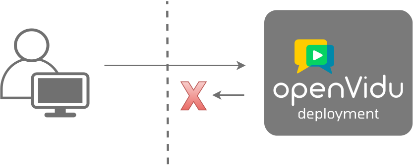

# Enable Webhooks

If you need to integrate OpenVidu with other services, you can use webhooks to send notifications about events that occur in your OpenVidu deployment. This guide explains how to enable webhooks.

## OpenVidu Server Configuration

1. SSH into one of your Master Nodes (or Single Node).
2. Add to the file `livekit.yaml` the following configuration:

    ```yaml
    webhook:
        api_key: ${openvidu.LIVEKIT_API_KEY:?mandatory}
        urls:
        ...
            - https://<YOUR_WEBHOOK_URL>
    ```

    The file is located at:

    - **Single Node**: `/opt/openvidu/config/livekit.yaml`
    - **Elastic / High Availability**: `/opt/openvidu/config/cluster/media_node/livekit.yaml`

    Make sure the `webhook` section exists in the file, and if it doesn't, add it as stated in the previous snippet. Then, add the URL where you want to receive the webhook notifications. In this example, `<YOUR_WEBHOOK_URL>` is the URL where you want to receive the notifications.

3. Restart the Master Node (or Single Node) to apply the changes:

    ```bash
    systemctl restart openvidu
    ```

    This command will restart the services which changed their configuration files in your entire OpenVidu deployment.

## <span class="openvidu-tag openvidu-pro-tag">PRO</span> V2 Compatibility Configuration

If you are using the V2 Compatibility module, you can also enable webhooks for the V2 Compatibility layer.

1. SSH into one of your Master Nodes (or Single Node).
2. Add to the file `v2compatibility.env` the following parameters:

    ```
    V2COMPAT_OPENVIDU_WEBHOOK=true
    V2COMPAT_OPENVIDU_WEBHOOK_ENDPOINT=https://<YOUR_WEBHOOK_URL>
    ```

    Where `<YOUR_WEBHOOK_URL>` is the URL where you want to receive the notifications.

    Check in the [Configuration Reference](../../self-hosting/configuration/reference.md#pro-v2compatibilityenv){:target=\_blank} all the webhook events that you can receive setting up the parameter `V2COMPAT_OPENVIDU_WEBHOOK_EVENTS`.

## Send Webhooks to a Local Application Server

When developing locally pointing to a production deployment and webhooks events are required by your application, you will face issues because OpenVidu cannot access your local application server.

To receive webhooks from OpenVidu on your local machine, you need to expose your local application server to the internet. This exposure allows OpenVidu to send webhooks directly to your application server.

The following images illustrate the difference between an unreachable and a reachable local application server:

<div class="grid cards" markdown>

<figure markdown>
  { loading=lazy .svg-img  .mkdocs-img}
  <figcaption>Unreachable local application server</figcaption>
</figure>

<figure markdown>
  { loading=lazy .svg-img  .mkdocs-img}
  <figcaption>Reachable local application server</figcaption>
</figure>

</div>

Exposing your local application server to the internet is a common practice when developing applications locally. Tools like [Ngrok](https://ngrok.com/){target="\_blank"}, [LocalTunnel](https://localtunnel.github.io/www/){target="\_blank"}, [LocalXpose](https://localxpose.io/){target="\_blank"} and [Zrok](https://zrok.io/){target="\_blank"} can help you achieve this.

These tools provide you with a public URL that forwards requests to your local application server. You can use this URL to receive webhooks from OpenVidu, configuring it in the OpenVidu Server as explained in the [previous section](#openvidu-server-configuration).
