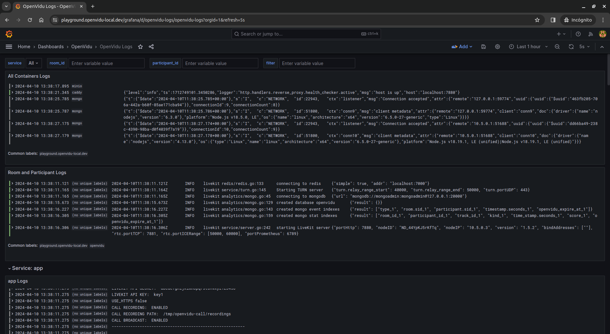
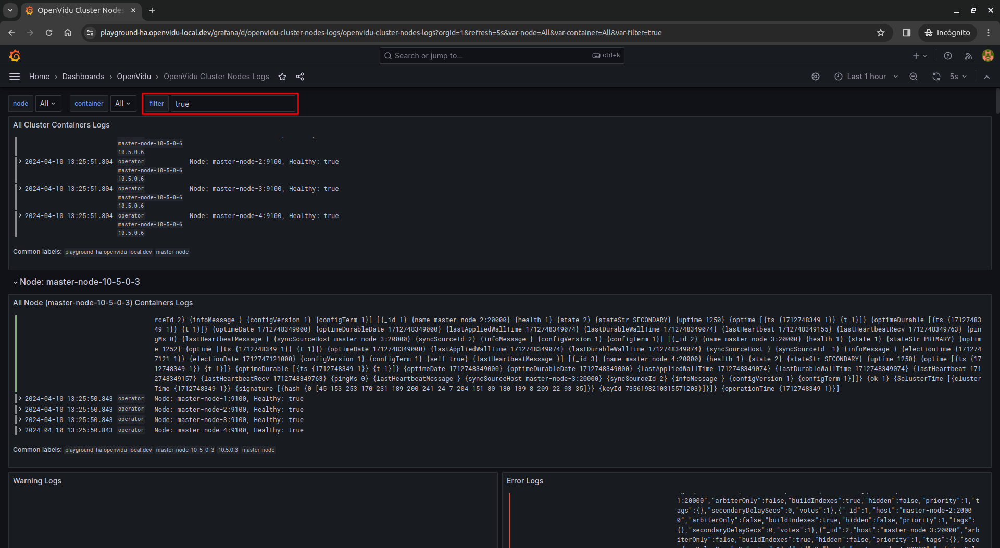

## Grafana Stack

OpenVidu also provides different **Grafana dashboards** to monitor **metrics** from **OpenVidu Server** and **logs** from your **cluster**.

<video controls>
<source src="/assets/videos/grafana_trailer.mp4" type="video/mp4">
</video>

Grafana is available at [https://your.domain/grafana/]() and can be accessed using your **Grafana admin credentials**.

<figure markdown>
  { .mkdocs-img }
</figure>

Dashboards can be found in the **OpenVidu** folder at [https://your.domain/grafana/dashboards/f/openvidu-dashboards/openvidu]().

<figure markdown>
  { .mkdocs-img }
</figure>

### Services

The **Grafana stack** that comes with OpenVidu is composed of the following services:

- **Grafana** :simple-grafana:: Tool for **querying**, **visualizing**, **alerting on** and **exploring** **metrics**, **logs** and **traces**. It queries different **data sources** to show data in beautiful **dashboards**. In OpenVidu, contains all [dashboards](#dashboards) built from **Mimir**/**Prometheus** and **Loki** data sources to monitor **OpenVidu Server** and **logs** from your **cluster**.
- **Prometheus** :simple-prometheus:: System **monitoring** and **alerting** toolkit. It collects and stores **metrics** from different targets as **time series data**. In OpenVidu, it collects metrics from **OpenVidu Server** of each **Media Node** and sends them to **Mimir**.
- **Mimir**: Grafana software project that provides **multi-tenant**, **long-term storage** for **Prometheus** metrics. In **OpenVidu**, it is used to store metrics collected by **Prometheus**.
- **Promtail**: Agent that ships the contents of **local logs** to a **Loki** instance. In OpenVidu, it is used to collect logs from all **services** in your **cluster** and send them to **Loki**.
- **Loki**: **Horizontally-scalable**, **highly-available**, **multi-tenant** **log aggregation** system inspired by **Prometheus**. In OpenVidu, it is used to store logs collected by **Promtail**.

### Dashboards

#### OpenVidu Server Metrics

This dashboard provides **metrics** about **OpenVidu Server**. It includes charts about **active rooms**, **active participants**, **published tracks**, **subscribed tracks**, **send/receive bytes**, **packet loss percentage** and **quality score**.

In case you are using **OpenVidu** <a href="/pricing#openvidu-pro">PRO</a> and you have more than one **Media Node** deployed, you will see all metrics from all nodes combined in the same chart.

#### OpenVidu Media Nodes Server Metrics

!!! info "This dashboard is part of OpenVidu <a href="/pricing#openvidu-pro">PRO</a> edition."

This dashboard provides the same **metrics** as the [OpenVidu Server Metrics](#openvidu-server-metrics) dashboard, but grouped by **Media Node**.

You can select the **Media Node** you want to see metrics from in the **media_node** dropdown. You will see different charts in the same panel according to the selected **Media Nodes**.

<figure markdown>
  { .mkdocs-img }
</figure>

!!! info
    If you add new Media Nodes to your OpenVidu deployment, you will have to refresh the page in order to see the new Media Nodes in the dropdown.

<figure markdown>
  { .mkdocs-img }
</figure>

#### OpenVidu Logs

In case you are using **OpenVidu** <a href="/pricing#openvidu-community">COMMUNITY</a>, this dashboard provides different visualizations for **logs** from your **OpenVidu Single Node deployment**.

There is a panel showing **all containers** logs,

<figure markdown>
  { .mkdocs-img }
</figure>

another panel to **filter** logs by **room_id** and **participant_id**,

and one row for each selected **service**, containing **all logs**, **warnings** and **errors** from that service.

<figure markdown>
  { .mkdocs-img }
</figure>

<figure markdown>
  { .mkdocs-img }
</figure>

You can also filter logs containing a specific **text** by using the **filter search box**.

<figure markdown>
  { .mkdocs-img }
</figure>

#### OpenVidu Cluster Nodes Logs

!!! info "This dashboard is part of OpenVidu <a href="/pricing#openvidu-pro">PRO</a> edition."

In case you are using **OpenVidu** <a href="/pricing#openvidu-pro">PRO</a>, this dashboard provides different visualizations for **logs** from your **OpenVidu Elastic** or **OpenVidu High Availability** cluster, grouped by **node**.

First of all, there is a panel showing **all containers** logs from all nodes.

<figure markdown>
  { .mkdocs-img }
</figure>

Then, there is a row for each selected **node**, containing **all logs**, **warnings** and **errors** from that node. Besides, each row contains a panel for each selected container, showing all its logs.

!!! info
    Note that some panels have no data. This is because some containers are running in **Master Nodes** and others in **Media Nodes**.

You can also filter logs containing a specific **text** by using the **filter search box**.

<figure markdown>
  { .mkdocs-img }
</figure>

#### OpenVidu Cluster Services Logs

!!! info "This dashboard is part of OpenVidu <a href="/pricing#openvidu-pro">PRO</a> edition."

In case you are using **OpenVidu** <a href="/pricing#openvidu-pro">PRO</a>, this dashboard provides different visualizations for **logs** from your **OpenVidu Elastic** or **OpenVidu High Availability** cluster, grouped by **service**.

First of all, there is a panel to **filter** logs by **room_id** and **participant_id**.

Then, there is a row for each selected **service**, containing **all logs**, **warnings** and **errors** from that service.

<figure markdown>
  { .mkdocs-img }
</figure>

<figure markdown>
  { .mkdocs-img }
</figure>

### Limitations

For now, in [**OpenVidu High Availability deployments**](../../deployment-types.md#openvidu-high-availability), we have decided to **not** implement Grafana in High Availability (HA) mode. This decision is based on the fact that Grafana needs a configured HA MySQL or PostgreSQL database to work in HA mode, and we want to keep the deployment as simple as possible.

There are 4 instances of Grafana in an OpenVidu High Availability deployment, one for each Master Node, but they are not synchronized between them. Therefore, if you make any change (change your admin password, create a new dashboard...) in one Grafana instance and the Master Node suddenly goes down, you will be redirected to another Grafana instance where the changes will not be reflected. That is the reason why we disable user signups and saving dashboard or datasource modifications in Grafana.

However, all metrics and logs from all nodes are available in all Grafana instances, so you can monitor your OpenVidu cluster without any problem.

