It is a web application designed to provide **OpenVidu administrators** with a comprehensive view of **usage statistics** and **real-time monitoring** of video **Rooms**. OpenVidu Dashboard is included by default in any [OpenVidu deployment](../../../self-hosting/deployment-types.md).

To access **OpenVidu Dashboard**, go to [https://your.domain/dashboard/]() and **log in** using your **admin credentials**.

<figure markdown>
  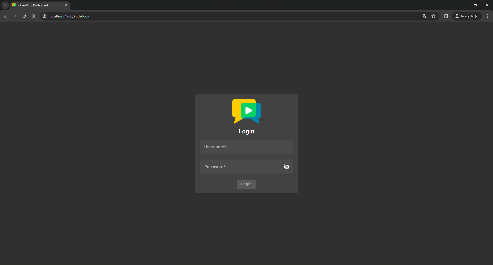{ .mkdocs-img }
</figure>

### Views

#### Analytics

Display **graphical analytics** for client SDKs, connection types, bandwidth usage, unique participants, rooms and egresses created over different **time periods** (last 24 hours, last 7 days, last 28 days or current month).

<a class="glightbox" href="../../../../../assets/images/dashboard/analytics1.png" data-type="image" data-width="100%" data-height="auto" data-desc-position="bottom">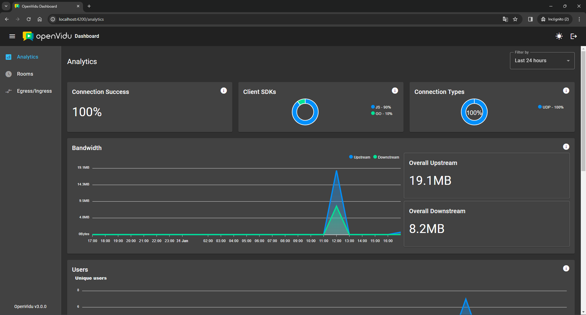</a>

<a class="glightbox" href="../../../../../assets/images/dashboard/analytics2.png" data-type="image" data-width="100%" data-height="auto" data-desc-position="bottom">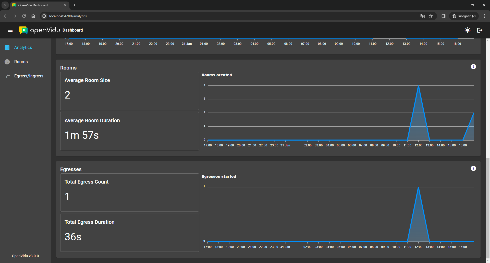</a>

<a class="glightbox" href="../../../../../assets/images/dashboard/analytics3.png" data-type="image" data-width="100%" data-height="auto" data-desc-position="bottom">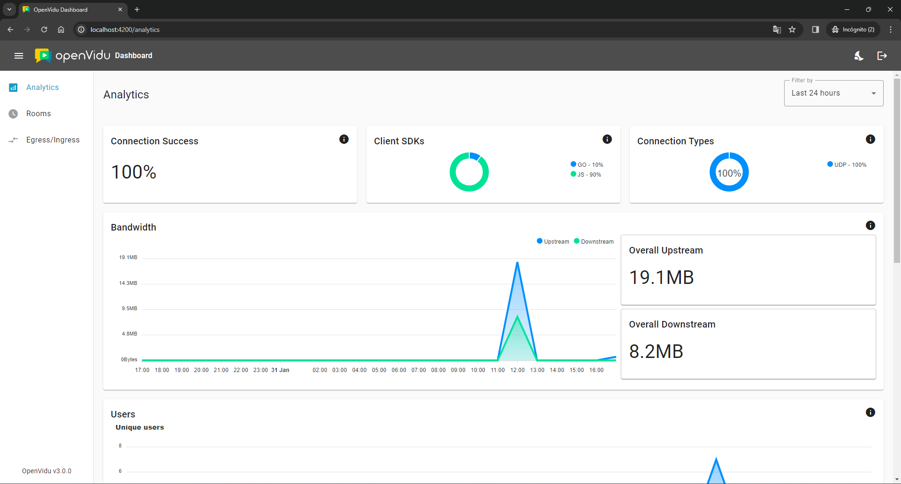</a>

<a class="glightbox" href="../../../../../assets/images/dashboard/analytics4.png" data-type="image" data-width="100%" data-height="auto" data-desc-position="bottom">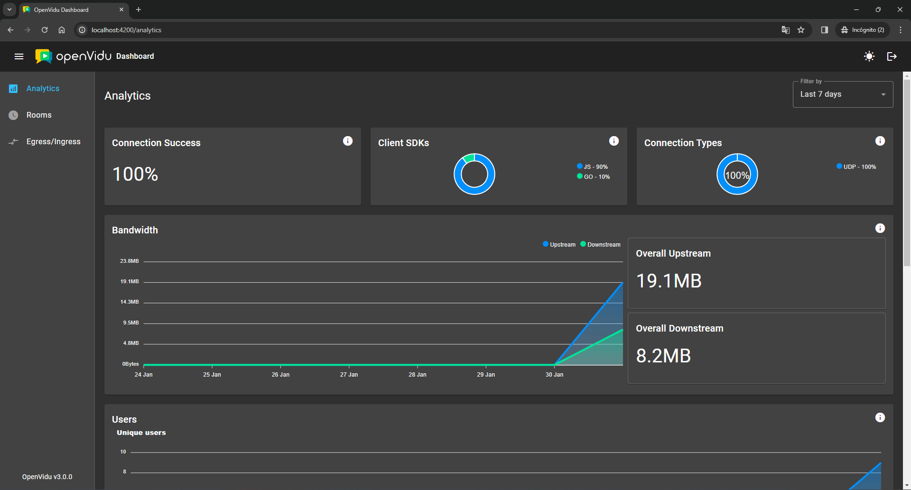</a>

#### Rooms

Review the total count of **active rooms** and **active participants**, along with a roster of currently active rooms and a history of **closed rooms** within the last 28 days. Detailed information on each room is accessible by clicking on the respective row.

<figure markdown>
  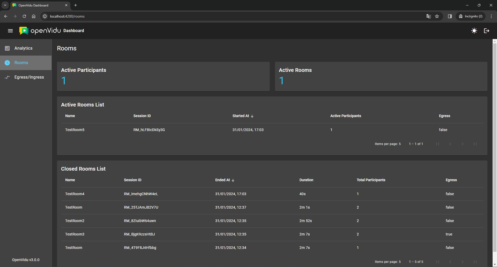{ .mkdocs-img }
</figure>

#### Room Details

!!! info "This view is part of OpenVidu <a href="/pricing#openvidu-pro">PRO</a> edition."

Retrieve in-depth information about a specific **room**, including its duration, bandwidth consumption, participants and related events. A chart illustrating the active participants count over time is also provided.

<a class="glightbox" href="../../../../../assets/images/dashboard/room_active.png" data-type="image" data-width="100%" data-height="auto" data-desc-position="bottom">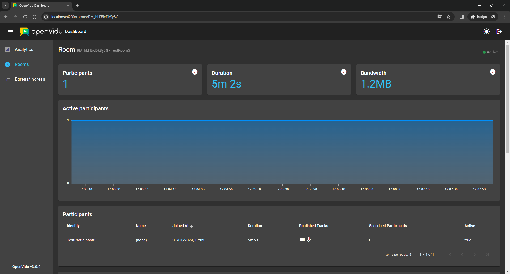</a>

<a class="glightbox" href="../../../../../assets/images/dashboard/room1.png" data-type="image" data-width="100%" data-height="auto" data-desc-position="bottom">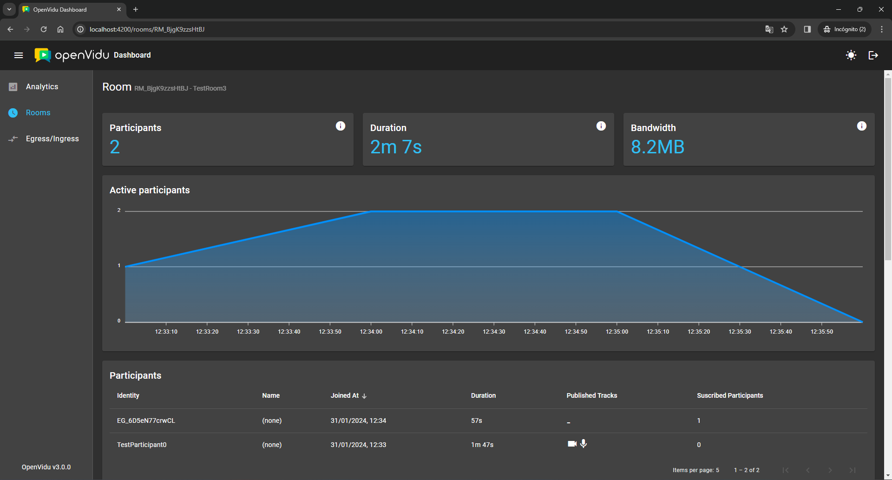</a>

<a class="glightbox" href="../../../../../assets/images/dashboard/room2.png" data-type="image" data-width="100%" data-height="auto" data-desc-position="bottom">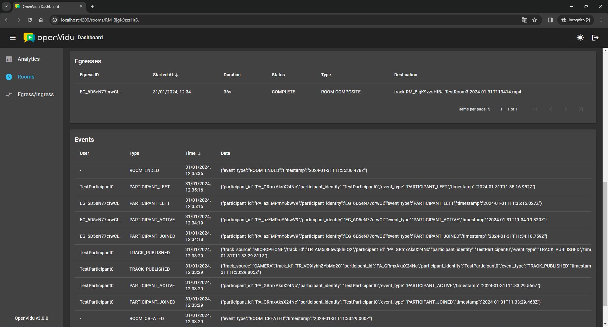</a>

#### Participant Details

!!! info "This view is part of OpenVidu <a href="/pricing#openvidu-pro">PRO</a> edition."

Obtain detailed insights into each **participant**, covering their duration, bandwidth usage, average audio and video quality score, information about the client they are connecting with, connection stats, published tracks and related events.

<a class="glightbox" href="../../../../../assets/images/dashboard/participant1.png" data-type="image" data-width="100%" data-height="auto" data-desc-position="bottom">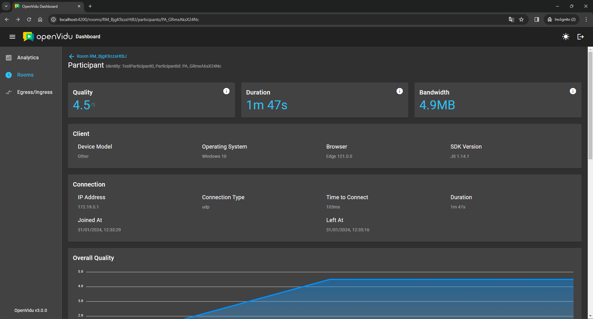</a>

<a class="glightbox" href="../../../../../assets/images/dashboard/participant2.png" data-type="image" data-width="100%" data-height="auto" data-desc-position="bottom">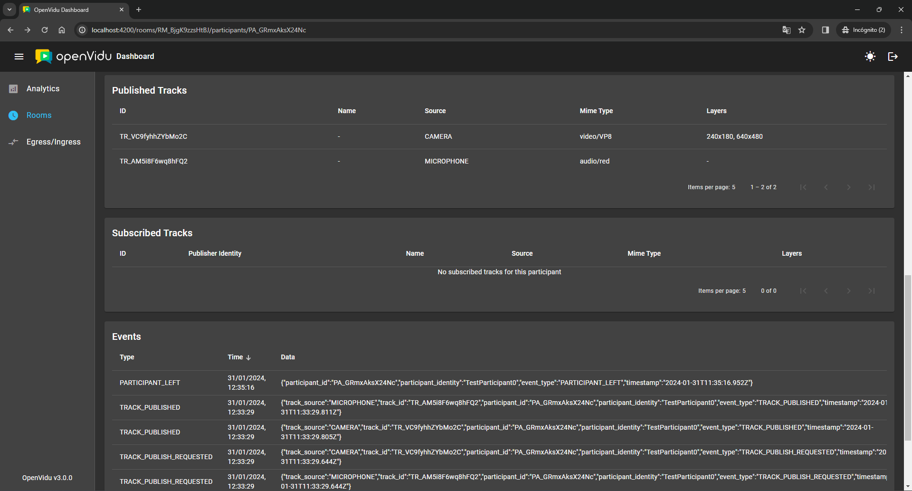</a>

A participant may **connect** and **disconnect** from a room multiple times while it remains open. Each instance of connection using the same **participant identity** is referred to as a **`participant session`**. If multiple sessions occur, we will aggregate all participant sessions together and organize them into a timeline at the top of the participant details view. You can easily switch between participant sessions by clicking on each corresponding row:

<figure markdown>
  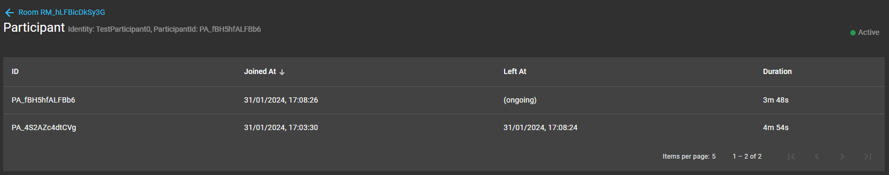{ .mkdocs-img }
</figure>

#### Egress-Ingress

Review an overview of all **egresses** and **ingresses**, including their duration and status. Detailed information for each egress or ingress can be accessed by clicking on the respective row.

<figure markdown>
  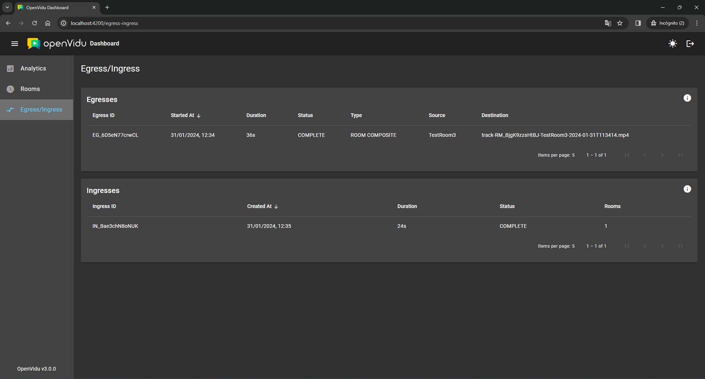{ .mkdocs-img }
</figure>

#### Egress Details

!!! info "This view is part of OpenVidu <a href="/pricing#openvidu-pro">PRO</a> edition."

Access comprehensive details about a specific **egress**, including its duration, current status, type, associated room, destinations, status timeline and request information.

<a class="glightbox" href="../../../../../assets/images/dashboard/egress1.png" data-type="image" data-width="100%" data-height="auto" data-desc-position="bottom">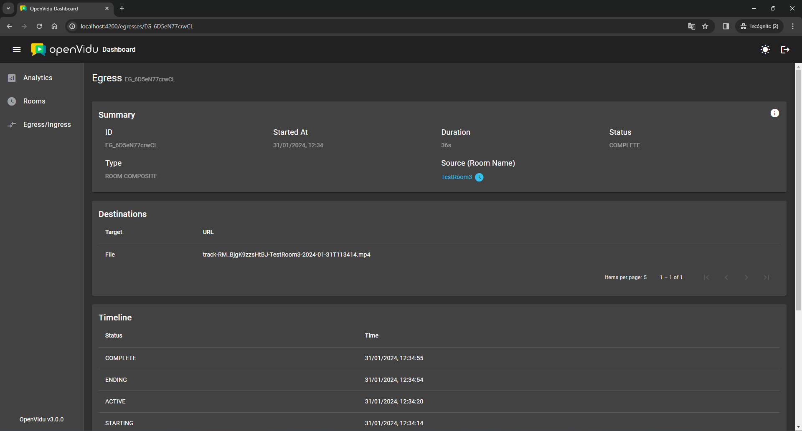</a>

<a class="glightbox" href="../../../../../assets/images/dashboard/egress2.png" data-type="image" data-width="100%" data-height="auto" data-desc-position="bottom">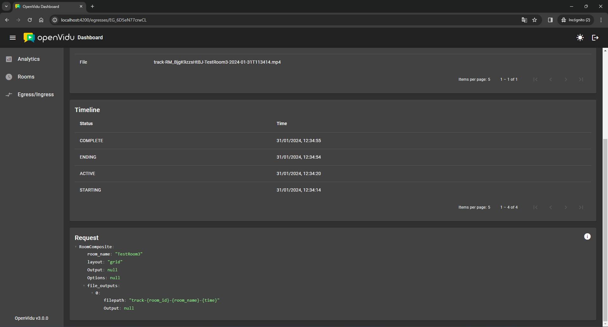</a>

#### Ingress Details

!!! info "This view is part of OpenVidu <a href="/pricing#openvidu-pro">PRO</a> edition."

Explore detailed information about a specific **ingress**, including its total duration, status and a list of all associated rooms.

<figure markdown>
  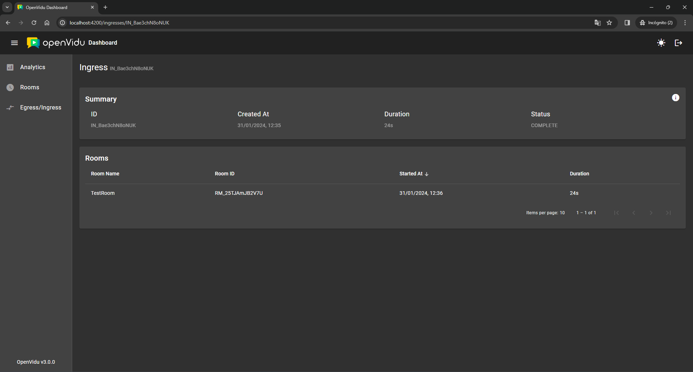{ .mkdocs-img }
</figure>

