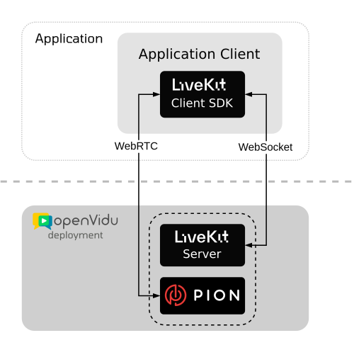
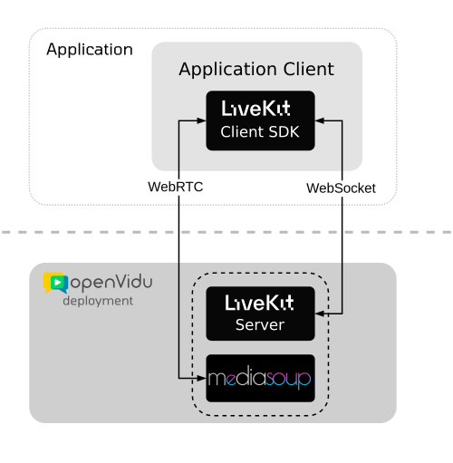
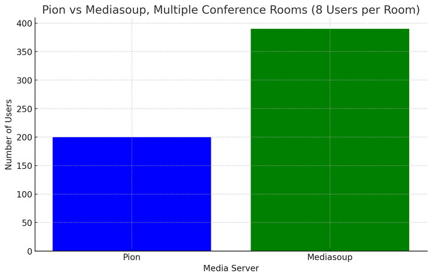
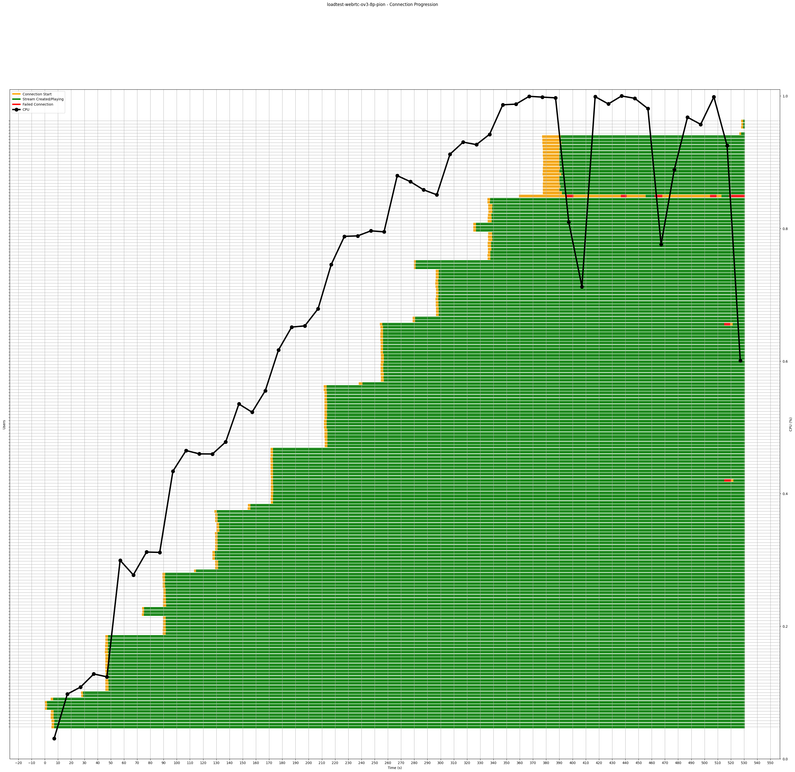

# Performance :material-lightning-bolt:

!!! warning

    mediasoup integration in OpenVidu is **experimental**, and should not be used in production environments. There are some [limitations](#limitations) that are currently being worked on, expected to be ironed out in the near future.

OpenVidu is able to handle up to **2x** the load in a single server, doubling the amount of media Tracks that can be transmitted compared to base LiveKit. By not only building upon the giant Open-Source shoulders of LiveKit, but also pushing the bar further, OpenVidu uses the best-in-class technologies to bring considerable performance improvements to the table.

The key element of any WebRTC server solution is the ability to exchange media between participants of a room, in the so-called [WebRTC SFU](../../comparing-openvidu.md#openvidu-vs-sfus). LiveKit implements its own SFU, and that's where OpenVidu makes a different choice by using [mediasoup](https://mediasoup.org/){target="\_blank"}.

The key points of how this works are:

- On the surface, OpenVidu is the same than LiveKit, and for the most part features work equally, such as connection establishment, participant management, and SDK support.
- Internally however, **mediasoup** is used to replace the original WebRTC engine implementation of LiveKit. *mediasoup* is built with the most efficient technologies and has outstanding low-level optimizations, which translates in a **2x** improvement with respect to the original LiveKit Open Source performance.

## About mediasoup integration

### Architecture

LiveKit created its own WebRTC SFU, based on the [Pion](https://github.com/pion/webrtc){target="\_blank"} library to route media between participants:

<figure markdown>
  { .mkdocs-img }
</figure>

OpenVidu is built by a team of expert WebRTC developers who know all the ins and outs of low-level WebRTC development, so it was possible to replace LiveKit's own implementation with an alternative, and *mediasoup* was the clear best choice given its fantastic performance characteristics:

<figure markdown>
  { .mkdocs-img }
</figure>

This means that applications built on top of LiveKit will continue to work exactly the same, while the internal WebRTC engine inside the server can be swapped at will and applications can benefit from that change, without having to be rebuilt.

In terms of the signaling protocol, API and SDKs, OpenVidu maintains the original LiveKit implementation. LiveKit's API is very well designed, with a simple but powerful [set of concepts](../../getting-started.md#basic-concepts), and the amount of SDKs available is very large.

### Choice of technology

Both LiveKit and Pion are written in the [Go programming language](https://go.dev/){target="\_blank"}, and this has some implications for speed and efficiency. While Go is popular for its simplicity, readability, and approach to concurrency, when it comes to performance other alternatives rank higher in common benchmarks.

First and foremost, the two most defining limitations of Go is that it requires a quite heavy runtime that is able to handle all of the low-level features of the language, such as *goroutines* and memory allocations. Also, speaking of memory management, Go requires a Garbage Collector, which knowledgeable readers will recognize as a hindrance for performance-critical applications.

*mediasoup*, on the other hand, focuses all of its efforts on maximum efficiency. It is written in [C++](https://isocpp.org/){target="\_blank"}, and it is ultra-optimized for the specific task of routing media packets. C++ is a language that provides fully manual management of all resources, and direct access to the hardware, with the benefit of software that is as fast as it can be on any machine.

We believe that by combining the best of the LiveKit stack with a top-notch WebRTC engine like *mediasoup*, OpenVidu is the best option for those who need a self-hosted and high-performance real-time solution.

## Limitations

OpenVidu developers are hard at work with integrating *mediasoup* as a WebRTC engine within LiveKit, aiming to provide feature parity with the original Pion engine.

There are, for now, some limitations that are expected to be ironed out over time:

- Data messages are not supported ([LiveKit reference](https://docs.livekit.io/realtime/client/data-messages/#Data-messages){target="\_blank"}).
- No Ingress ([LiveKit reference](https://docs.livekit.io/realtime/ingress/overview/){target="\_blank"}).
- No support for Speaker Detection events ([LiveKit reference](https://docs.livekit.io/realtime/client/receive/#Speaker-detection){target="\_blank"}).
- No `ConnectionQualityChanged` event ([LiveKit reference](https://docs.livekit.io/realtime/client/events/#Events){target="\_blank"}).
- No support for Dynacast ([LiveKit reference](https://docs.livekit.io/realtime/client/publish/#Dynamic-broadcasting){target="\_blank"}).
- No support for Adaptive Streaming ([LiveKit reference](https://docs.livekit.io/realtime/client/receive/#Adaptive-stream){target="\_blank"}).
- Compatibility with OpenVidu v2 applications is limited with mediasoup. If your OpenVidu deployment is using module `v2compatibility`, do not use mediasoup.

## Benchmarking

Numerous load tests have been performed to determine the true capabilities of OpenVidu on different hardware. To do so we have developed the tool [Openvidu LoadTest](https://github.com/OpenVidu/openvidu-loadtest){target="\_blank"}: an in development project that aims to improve the precision of load and performance tests in WebRTC systems.

We have compared OpenVidu using the original **Pion** WebRTC engine (this is the default LiveKit Open Source implementation) and using **mediasoup** as WebRTC engine. We tested the performance for both cases in the scenario below.

### Results: Conference rooms

This tests increasingly adds Rooms of 8 Participants each, every one sending 1 video Track and 1 audio Track, and subscribing to all remote Tracks.

The following plot shows the number of Participants that can be added to a Room in OpenVidu using Pion and using mediasoup as WebRTC engines:

<figure markdown>
  {style="max-width: 600px"}
</figure>

The conclusion is that for multiple Rooms, mediasoup performs much better than Pion, almost doubling the total number of Participants (and Tracks) that fit in the server.

Below there is the deatiled connection progression for each Participant in each test.

The X axis reflects the point of time in seconds. For each Participant there is a bar indicating its connection status:

- An orange bar indicates that the browser is up, but the connection to the media server is still in progress.
- A green bar indicates that the connection is up and running.
- A red bar indicates that the connection has failed, indicating the time that it's down.

CPU load of the server is also shown with a black marked plot (from 0 to 1, representing 0% to 100% CPU load).

<figure markdown>

</figure>
<figcaption>Progression of the connection of each Participant through the test execution. Benchmark test for Rooms with 8 Participants using OpenVidu with Pion</figcaption>

<figure markdown>

</figure>
<figcaption>Progression of the connection of each Participant through the test execution. Benchmark test for Rooms with 8 Participants using OpenVidu with mediasoup</figcaption>

### Benchmarking technical details

- Each participant sending video and audio to the media server uses the following video in loop: [Video](https://openvidu-loadtest-mediafiles.s3.amazonaws.com/interview_480p_30fps.y4m). The video is in `YUV4MPEG2` format and with a `640x480` resolution. The audio is in WAV format: [Audio](https://openvidu-loadtest-mediafiles.s3.amazonaws.com/interview.wav).
- All tests were done using AWS EC2 instances. The media server runs with a `m6in.xlarge` instance type, an instance type with 4 vCPUs and better network capabilities compared to other instance types.
- The workers running the browsers that act as participants ran in `c5.xlarge` instances, an instance type with 4 vCPUs with better computing capabilities.

### Benchmarking methodology

Each test begins with no participants on the media server. First, the test controller creates EC2 instances to host the browsers. The controller then sends a request to create a number of participants (this number is known as the batch size). After each browser sends confirmation to the controller that it is connected, the controller sends another request to add more participants (as many participants as the batch size specifies). A participant is considered connected to the room if:

- If the participants sends video and audio, the participant is connected after confirming that both local tracks are being sent correctly.
- If the participant acts as viewer (is only receiving video and audio from a different participant), the participant is connected when it confirms that it is receiving at least both tracks from a user in the room.

The test stops when it determines that no more users can be added to a room. This happens when a user has 5 failed connections. A connection is considered to have failed when it terminates with a fatal error (in LiveKit this is captured when a [`Disconnected`](https://docs.livekit.io/realtime/client/events/#Events){target="\_blank"} event occurs) or when the connection times out. A failure in connection can occur when trying to join a room (ending usually in timeout) or during the connection (a `Disconnected` event is thrown). Each time a failure is communicated to the controller, it will kill that browser and restart it again, effectively restarting the connection (up to 5 times, as mentioned before).

### About OpenVidu LoadTest

Tools like [livekit-cli](https://github.com/livekit/livekit-cli){target="\_blank"} simulate participants directly using WebRTC SDKs, but we found out that browsers add significant more load that these kind of systems. This makes [Openvidu LoadTest](https://github.com/OpenVidu/openvidu-loadtest){target="\_blank"} give results that are closer to real-world scenarios, as it uses real browsers. Using real browsers also allows for the collection of useful data related to connections, events and WebRTC statistics. On the other hand, tests performed with Openvidu LoadTest are more expensive, as they require real instances to host the browsers.
