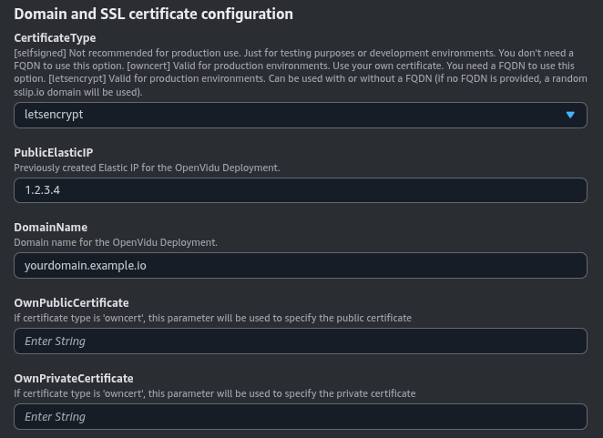
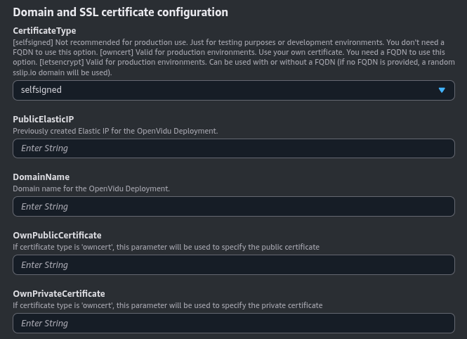
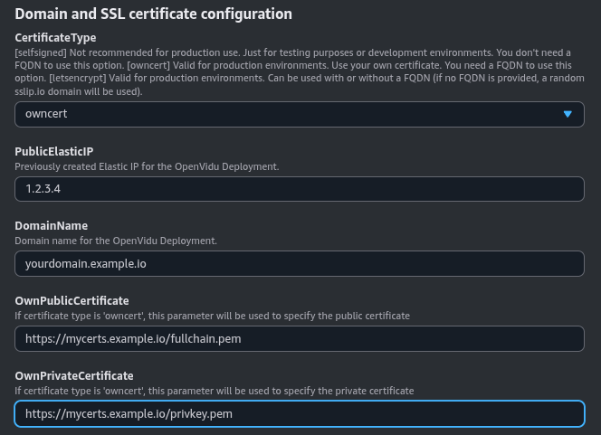

### Domain and SSL Certificate Configuration

These are the three possible scenarios you may have to configure in this section:

=== "Let's Encrypt Certificate (recommended)"

    For a production-ready setup, this scenario is ideal when you have an **FQDN (Fully Qualified Domain Name)** and an **Elastic IP** at your disposal. It leverages the services of Let's Encrypt to automatically generate valid certificates.

    First, you need to have the FQDN pointing to the Elastic IP you are going to use.

    Then, you need to fill in the following parameters:

    

    As you can see, you need to specify the **DomainName** with your FQDN, the **PublicElasticIP** with the Elastic IP that the domain points to, and the **LetsEncryptEmail** with your email address for Let’s Encrypt notifications. These parameters are mandatory.

=== "Self-Signed Certificate"

    This is the most straightforward option for deploying OpenVidu on AWS when you do not have a Fully Qualified Domain Name (FQDN). This method allows for the immediate use of OpenVidu in AWS using CloudFormation.

    However, this convenience comes with the caveat that users will need to manually accept the certificate in their web browsers. Please be aware that this configuration is solely for developmental and testing purposes and is not suitable for a production environment.

    These are the parameters needed in this section to use self-signed certificates:

    

    You don’t need to specify any parameters; just select the **CertificateType** as _self-signed_. The domain name used will be an AWS-generated one.

=== "Custom Certificates"

    Opt for this method if you possess **your own certificate for an existing FQDN**. It enables you to deploy OpenVidu on AWS using your certificates.

    You need to have a Fully Qualified Domain Name (FQDN) pointing to a previously created Elastic IP.

    Also, you need a **temporary HTTP server** hosting your private and public certificate under a specific URL. These URLs are needed for the instance to be able to download and install your certificates.

    The configured parameters would look like this:

    

    You need to specify at **OwnPublicCertificate** and **OwnPrivateCertificate** the URLs where the public and private certificates are hosted, respectively. The **DomainName** and **PublicElasticIP** are mandatory parameters.

    Certificates need to be in PEM format and the URLs must be accessible from the instance.
