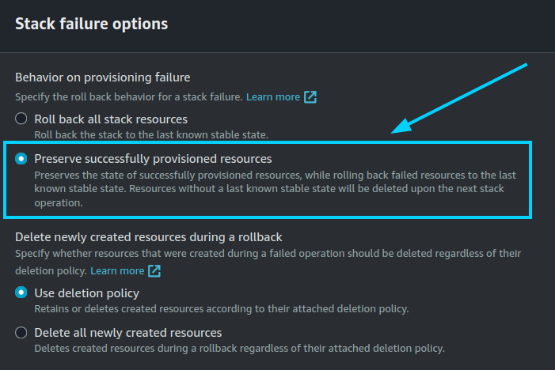

If something goes wrong during the initial CloudFormation stack creation, your stack may reach the `CREATE_FAILED` status for multiple reasons. It could be due to a misconfiguration in the parameters, a lack of permissions, or a problem with the AWS services. When this happens, the following steps can help you troubleshoot the issue and identify what went wrong:

1. While deploying the stack, make sure at _"Stack failure options"_ you have selected the option _"Preserve successfully provisioned resources"_ to be able to troubleshoot the deployment in case of an error.

    === "Disable Rollback on failure"

        <figure markdown>
        { .svg-img .dark-img }
        </figure>

2. Check if the EC2 instance or instances are running. If they are not, check the CloudFormation events for any error messages.
3. If the EC2 instance or instances are running, SSH into the instance and check the logs of the following files:

    - `/var/log/cloud-init-output.log`
    - `/var/log/cloud-init.log`

    These logs will give you more information about the CloudFormation stack creation process.
