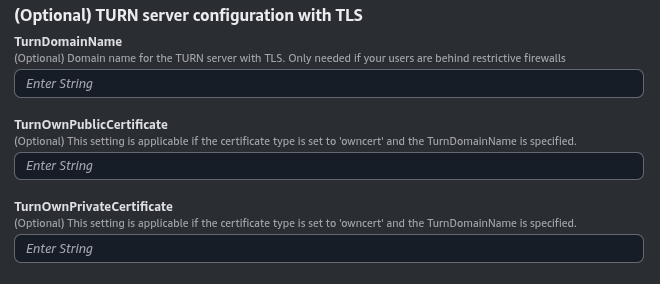

### (Optional) TURN server configuration with TLS

This section is optional. It is useful when your users are behind a restrictive firewall that blocks UDP traffic. This parameter will only works if you are using `letsencrypt` or `owncert` as the **CertificateType** parameter.

=== "TURN server configuration with TLS"

    The parameters in this section may look like this:

    

    Set the **TurnDomainName** parameter to the domain name you intend to use for your TURN server. It should be pointing to the `PublicElasticIP` specified in the previous section.

    If you are using `letsencrypt` as the **CertificateType** parameter, you can leave the **TurnOwnPublicCertificate** and **TurnOwnPrivateCertificate** parameters empty. If you are using `owncert`, you need to specify the URLs where the public and private certificates are hosted.
