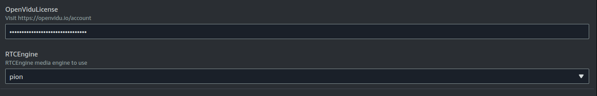

# OpenVidu Single Node <span class="openvidu-tag openvidu-pro-tag" style="font-size: .6em; vertical-align: text-bottom">PRO</span> installation: AWS

This section contains the instructions to deploy a production-ready OpenVidu Single Node <span class="openvidu-tag openvidu-pro-tag" style="font-size: 12px">PRO</span> deployment in AWS. Deployed services are the same as the [On Premises Single Node installation](../on-premises/install.md) but automate the process with AWS CloudFormation.

First of all, import the template in the AWS CloudFormation console. You can click the following button...

[:fontawesome-brands-aws:{style="font-size:36px; margin-right: 14px"} Deploy to AWS](https://console.aws.amazon.com/cloudformation/home?#/stacks/new?stackName=OpenViduSingleNode&templateURL=https://s3.eu-west-1.amazonaws.com/get.openvidu.io/pro/singlenode/latest/aws/cf-openvidu-singlenode.yaml){.md-button .deploy-button .deploy-to-aws-btn target="_blank"}

...or access your [AWS CloudFormation console](https://console.aws.amazon.com/cloudformation/home?#/stacks/new){:target=_blank} and manually set this S3 URL in the `Specify template` section:

```
https://s3.eu-west-1.amazonaws.com/get.openvidu.io/pro/singlenode/latest/aws/cf-openvidu-singlenode.yaml
```

!!! info

    If you want to deploy an specific version of OpenVidu Single Node, replace `latest` with the version you want to deploy. For example, to deploy version `3.0.0`, use the following URL:

    ```
    https://s3.eu-west-1.amazonaws.com/get.openvidu.io/pro/singlenode/3.1.0/aws/cf-openvidu-singlenode.yaml
    ```

=== "Architecture overview"

    This is how the architecture of the deployment looks like:

    <figure markdown>
    { .svg-img .dark-img }
    <figcaption>OpenVidu Single Node AWS Architecture</figcaption>
    </figure>

## CloudFormation Parameters

Depending on your needs, you need to fill the following CloudFormation parameters:

--8<-- "shared/self-hosting/aws-ssl-domain.md"

## OpenVidu Single Node PRO configuration

In this section, you need to specify some properties needed for the OpenVidu Single Node PRO deployment.

=== "OpenVidu Single Node PRO Configuration"

    Parameters of this section look like this:

    

    Make sure to provide the **OpenViduLicense** parameter with the license key. If you don't have one, you can request one [here](/account/){:target=_blank}.

    For the **RTCEngine** parameter, you can choose between **Pion** (the default engine used by LiveKit) and **Mediasoup** (with a boost in performance). Learn more about the differences [here](../../../production-ready/performance/).

### EC2 Instance Configuration

You need to specify some properties for the EC2 instance that will be created.

=== "EC2 Instance configuration"

    Parameters in this section look like this:

    

    Simply select the type of instance you want to deploy at **InstanceType**, the SSH key you want to use to access the machine at **KeyName**, and the Amazon Image ID (AMI) to use at **AmiId**.

    By default, the parameter **AmiId** is configured to use the latest LTS Ubuntu AMI, so ideally you don’t need to modify this.

--8<-- "shared/self-hosting/aws-single-elastic-s3.md"

--8<-- "shared/self-hosting/aws-turn-domain.md"

## Deploying the stack

When you are ready with your CloudFormation parameters, just click on _"Next"_, specify in _"Stack failure options"_ the option _"Preserve successfully provisioned resources"_ to be able to troubleshoot the deployment in case of error, click on _"Next"_ again, and finally _"Submit"_.

When everything is ready, you will see the following links in the _"Outputs"_ section of CloudFormation:

=== "CloudFormation Outputs"

    

## Configure your application to use the deployment

The Output Key **ServicesAndCredentials** of the [previous section](#deploying-the-stack) points to an AWS Secret Manager secret that contains all URLs and credentials to access the services deployed. You can access the secret by clicking on the link in the **Output Value** column.

Then, click on **Retrieve secret value** to get the JSON with all the information.

<div class="grid-container">

<div class="grid-50"><p><a class="glightbox" href="../../../../../assets/images/self-hosting/single-node/aws/1-secrets-retrieve.png" data-type="image" data-width="100%" data-height="auto" data-desc-position="bottom"></a></p></div>

<div class="grid-50"><p><a class="glightbox" href="../../../../../assets/images/self-hosting/single-node/aws/2-secrets.png" data-type="image" data-width="100%" data-height="auto" data-desc-position="bottom"></a></p></div>

</div>

To point your applications to your OpenVidu deployment, check the values of the JSON secret. All access credentials of all services are defined in this object.

Your authentication credentials and URL to point your applications would be:

- Applications developed with LiveKit SDK:
    - **URL**: The value in the AWS Secret of `DOMAIN_NAME` as a URL. It could be `wss://openvidu.example.io/` or `https://openvidu.example.io/` depending on the SDK you are using.
    - **API Key**: The value in the AWS Secret of `LIVEKIT_API_KEY`
    - **API Secret**: The value in the AWS Secret of `LIVEKIT_API_SECRET`

- Applications developed with OpenVidu v2:
    - **URL**: The value in the AWS Secret of `DOMAIN_NAME` as a URL. For example, `https://openvidu.example.io/`
    - **Username**: `OPENVIDUAPP`
    - **Password**: The value in the AWS Secret of `LIVEKIT_API_SECRET`


## Troubleshooting Initial CloudFormation Stack Creation

--8<-- "shared/self-hosting/aws-troubleshooting.md"

4. If everything seems fine, check the [status](../on-premises/admin.md#checking-the-status-of-services) and the [logs](../on-premises/admin.md#checking-logs) of the installed OpenVidu services.

## Configuration and administration

When your CloudFormation stack reaches the **`CREATE_COMPLETE`** status, your OpenVidu Single Node deployment is ready to use. You can check the [Administration](./admin.md) section to learn how to manage your deployment.
