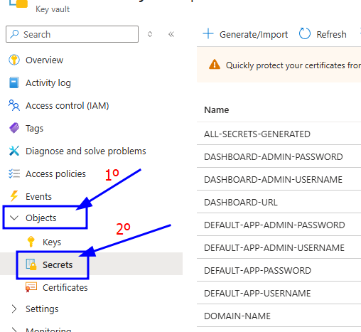

# OpenVidu Single Node PRO administration: Azure

Azure OpenVidu Single Node deployments are internally identical to On Premises Single Node deployments, so you can follow the same instructions from [On Premises Single Node](../on-premises/admin.md) documentation for administration and configuration. The only difference is that the deployment is automated with ARM Templates from Azure.

However, there are certain things worth mentioning:

## Start and stop OpenVidu through Azure Portal

You can start and stop all services as explained in the [On Premises Single Node](../on-premises/admin.md#starting-stopping-and-restarting-openvidu) section. But you can also start and stop the Virtual Machine instance directly from Azure Portal. This will stop all services running in the instance and reduce Azure costs.

=== "Stop OpenVidu Single Node"

    1. Go to [Azure Portal Dashboard :fontawesome-solid-external-link:{.external-link-icon}](https://portal.azure.com/#home){:target="_blank"} of Azure and enter into the resource group where you deployed OpenVidu Single Node.
    2. There, you will find the Virtual Machine that runs OpenVidu. Its name should be something like **yourstackname-VM-CE**. Click on it.
    3. In the section of the Virtual Machine click on stop button to stop the Virtual Mache (and therefore OpenVidu).

    <figure markdown>
    { .svg-img .dark-img }
    </figure>

=== "Start OpenVidu Single Node"

    1. Go to [Azure Portal Dashboard :fontawesome-solid-external-link:{.external-link-icon}](https://portal.azure.com/#home){:target="_blank"} of Azure and enter into the resource group where you deployed OpenVidu Single Node.
    2. There, you will find the Virtual Machine that runs OpenVidu. Its name should be something like **yourstackname-VM-CE**.  Click on it.
    3. In the section of the Virtual Machine click on start button to start the Virtual Mache (and therefore OpenVidu).

    <figure markdown>
    { .svg-img .dark-img }
    </figure>

## Change the instance type

You can change the instance type of the OpenVidu Single Node instance to adapt it to your needs. To do this, follow these steps:

1. Go to [Azure Portal Dashboard :fontawesome-solid-external-link:{.external-link-icon}](https://portal.azure.com/#home){:target="_blank"} of Azure and enter into the resource group where you deployed OpenVidu Single Node.
2. There, you will find the Virtual Machine that runs OpenVidu. Its name should be something like **yourstackname-VM-CE**. Click on it.
3. In the left pannel click on _"Availability + scale"_ 🡒 _"Size"_.

    === "Change instance type"

        <figure markdown>
        { .svg-img .dark-img }
        </figure>

4. Select the new instance type and click on _"Resize"_.

## Administration and configuration

Regarding the administration of your deployment, you can follow the instructions in section [On Premises Single Node Administration](../on-premises/admin.md).

Regarding the configuration of your deployment, you can follow the instructions in section [Changing Configuration](../../configuration/changing-config.md). Additionally, the [How to Guides](../../how-to-guides/index.md) offer multiple resources to assist with specific configuration changes.

In addition to these, an Azure deployment provides the capability to manage global configurations via the Azure portal using Key Vault Secrets created during the deployment:

=== "Changing configuration through Key Vault secrets"

    1. Navigate to the [Azure Portal Dashboard :fontawesome-solid-external-link:{.external-link-icon}](https://portal.azure.com/#home){:target=_blank} on Azure.
    2. Select the Resource Group where you deployed your OpenVidu Single Node Stack.
    3. In the _"stackname-keyvault"_ resource, click on _"Objects"_ 🡒 _"Secrets"_ on the left panel. This will show you all the secrets that are stored in the Key Vault of the OpenVidu deployment.
        <figure markdown>
        { .svg-img .dark-img }
        </figure>
    4. Click on the desired secret you want to change and click on _"New Version"_.
        <figure markdown>
        { .svg-img .dark-img }
        </figure>
    5. Enter the new secret value on _"Secret Value"_ filed and click on _"Create"_.
        <figure markdown>
        { .svg-img .dark-img }
        </figure>
    6. Go to the Instance resource of OpenVidu and click on _"Restart"_ to apply the changes to the OpenVidu Single Node deployment.
        <figure markdown>
        { .svg-img .dark-img }
        </figure>

    Changes will be applied automatically.
