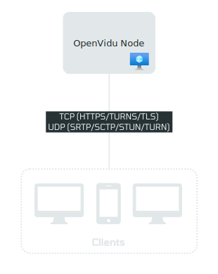
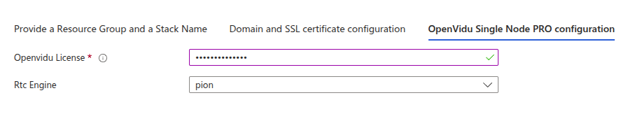
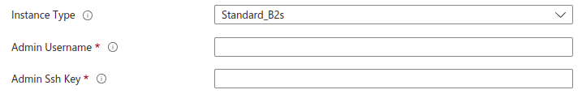
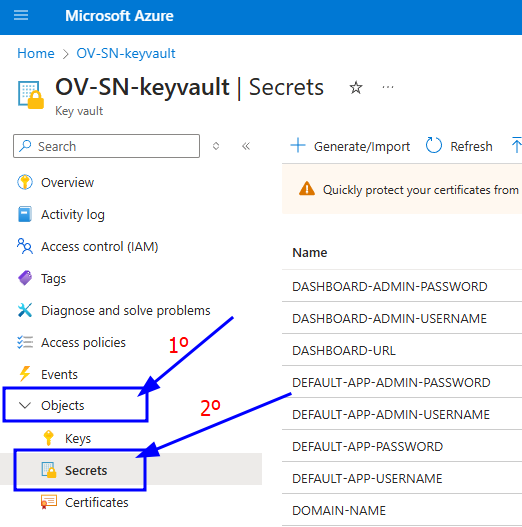
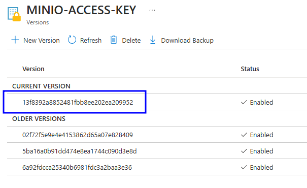
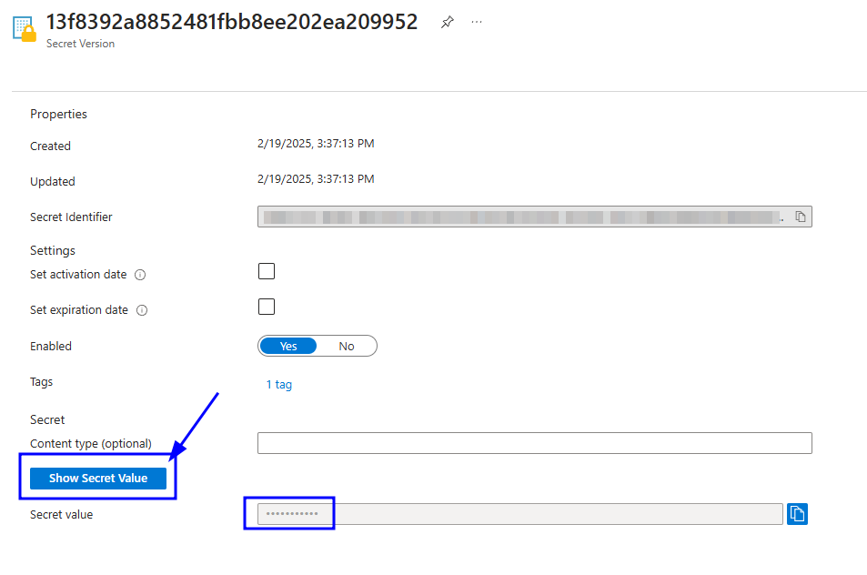

# OpenVidu Single Node PRO installation: Azure

:material-microsoft-azure:{ .provider-chip-icon } Azure

!!! info
    
    OpenVidu Single Node Pro is part of **OpenVidu PRO**. Before deploying, you need to [create an OpenVidu account](/account/){:target=_blank} to get your license key.
    There's a 15-day free trial waiting for you!

This section contains instructions for deploying a production-ready OpenVidu Single Node PRO deployment on Azure. The deployed services are the same as in the [On Premises Single Node installation](../on-premises/install.md), but the process is automated through ARM Template Specs.

To use the Azure template, click the button below (you will be redirected to Azure).

{:target=_blank}

=== "Architecture overview"

    This is what the deployment architecture looks like:

    <figure markdown>
    { .svg-img .dark-img }
    <figcaption>OpenVidu Single Node Azure Architecture</figcaption>
    </figure>

## Template Parameters

To deploy the template, you need to fill in the following parameters.

--8<-- "shared/self-hosting/azure-resource-group-stack-name.md"

--8<-- "shared/self-hosting/azure-ssl-domain.md"

--8<-- "shared/self-hosting/azure-meet.md"

### OpenVidu Single Node PRO configuration

In this section, you need to specify some properties needed for the OpenVidu Single Node PRO deployment.

=== "OpenVidu Single Node PRO Configuration"

    Parameters of this section look like this:

    

    Make sure to provide the **OpenViduLicense** parameter with the license key. If you don't have one, you can request one [here](/account/){:target=_blank}.

    For the **RTCEngine** parameter, you can choose between **Pion** (the default engine used by LiveKit) and **Mediasoup** (with a boost in performance). Learn more about the differences [here](../../production-ready/performance.md).

### Azure Instance Configuration

Specify properties for the Azure instance that will host Openvidu.

=== "Azure Instance configuration"

    Parameters in this section look like this:

    <figure markdown>
    { .svg-img .dark-img }
    </figure>

    Simply select the type of instance you want to deploy in **Type of Instance**. Fill in **Admin Username**, which will be set as the admin username on the instance. Select the SSH key you created previously in **SSH public key source** (or create a new one in the same drop-down) to allow SSH access to the instance.

--8<-- "shared/self-hosting/azure-storageaccount.md"

--8<-- "shared/self-hosting/azure-additional-flags.md"

## Deploying the stack

Whenever you are satisfied with your Template parameters, just click on _"Next"_ to trigger the validation process. If correct, click on _"Create"_ to start the deployment process (which will take about 5 to 10 minutes).

!!! warning

    In case of failure, it may be due to a role creation failure. In this case, redeploy in a new resource group and change the **Stack Name**. To remove a role in a resource group, visit [Remove Azure role assignments :fontawesome-solid-external-link:{.external-link-icon}](https://learn.microsoft.com/en-us/azure/role-based-access-control/role-assignments-remove){:target="_blank"}.

When everything is ready, you can check the output secrets on the Key Vault or by connecting through SSH to the instance:

=== "Check deployment outputs in Azure Key Vault"

    1. Go to the Key Vault created called **yourstackname-keyvault** in the Resource Group that you deployed. You can access it from the [Azure Portal Dashboard :fontawesome-solid-external-link:{.external-link-icon}](https://portal.azure.com/#home){:target="_blank"}.

    2. Once you are in the Key Vault, click _"Objects"_ 🡒 _"Secrets"_ in the left panel.

        <figure markdown>
        { .svg-img .dark-img }
        </figure>

    3. Click the secret you want to inspect, then click the current version of that secret.

        <figure markdown>
        { .svg-img .dark-img }
        </figure>

    4. You will see many properties, but the value you need is at the bottom. Click _"Show Secret Value"_ to reveal it.

        <figure markdown>
        { .svg-img .dark-img }
        </figure>

=== "Check deployment outputs in the instance"

    SSH to the instance and navigate to the config folder `/opt/openvidu/config`. Files with the deployment outputs are:

    - `openvidu.env`
    - `meet.env`

## Configure your application to use the deployment 

You need your Azure deployment outputs to configure your OpenVidu application. If you have permissions to access the Key Vault you will be able to check there all the outputs ([Check deployment outputs in Azure Key Vault](#check-deployment-outputs-in-azure-key-vault)). If you don't have permissions to access the Key Vault you can still check the outputs directly in the instance through SSH ([Check deployment outputs in the instance](#check-deployment-outputs-in-the-instance)).

Your authentication credentials and the URL to point your applications to are:

--8<-- "shared/self-hosting/azure-credentials-general.md"
--8<-- "shared/self-hosting/azure-credentials-v2compatibility.md"

## Troubleshooting initial Azure stack creation

--8<-- "shared/self-hosting/azure-troubleshooting.md"

3. If everything seems fine, check the [status](../on-premises/admin.md#checking-the-status-of-services) and the [logs](../on-premises/admin.md#checking-logs) of the installed OpenVidu services.

## Configuration and administration

When your Azure stack reaches the **`Succeeded`** status, it means that all resources have been created. You will need to wait about 5 to 10 minutes for the instance to install OpenVidu, as mentioned before. After this time, try connecting to the deployment URL. If it doesn't work, we recommend checking the previous section. Once everything is ready, you can check the [Administration](./admin.md) section to learn how to manage your deployment.
