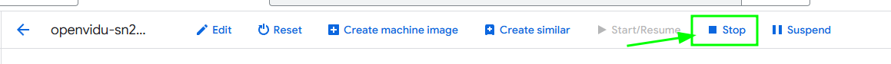

# OpenVidu Single Node PRO administration: Google Cloud Platform

Google Cloud Platform OpenVidu Single Node deployments are internally identical to On Premises Single Node deployments, so you can follow the same instructions from [On Premises Single Node](../on-premises/admin.md) documentation for administration and configuration. The only difference is that the deployment is automated with terraform from Google Cloud Platform.

However, there are certain things worth mentioning:

## Start and stop OpenVidu through Google Cloud Platform Console

You can start and stop all services as explained in the [On Premises Single Node](../on-premises/admin.md#starting-stopping-and-restarting-openvidu) section. But you can also start and stop the Virtual Machine instance directly from Google Cloud Platform Console. This will stop all services running in the instance and reduce Google Cloud Platform costs.

=== "Stop OpenVidu Single Node"

    1. Go to [GCP Compute Engine Instances :fontawesome-solid-external-link:{.external-link-icon}](https://console.cloud.google.com/compute/instances){:target="_blank"} of Google Cloud Platform.
    2. There, you will find the Virtual Machine that runs OpenVidu. Its name should be something like `<STACK_NAME>-vm-pro`. Click on it.
    3. In the section of the Virtual Machine click on stop button to stop the Virtual Machine (and therefore OpenVidu).

    <figure markdown>
    { .svg-img .dark-img }
    </figure>

=== "Start OpenVidu Single Node"

    1. Go to [GCP Compute Engine Instances :fontawesome-solid-external-link:{.external-link-icon}](https://console.cloud.google.com/compute/instances){:target="_blank"} of Google Cloud Platform.
    2. There, you will find the Virtual Machine that runs OpenVidu. Its name should be something like `<STACK_NAME>-vm-pro`.  Click on it.
    3. In the section of the Virtual Machine click on start button to start the Virtual Mache (and therefore OpenVidu).

    <figure markdown>
    { .svg-img .dark-img }
    </figure>

## Change the instance type

You can change the instance type of the OpenVidu Single Node instance to adapt it to your needs. To do this, follow these steps:

1. Go to [GCP Compute Engine Instances :fontawesome-solid-external-link:{.external-link-icon}](https://console.cloud.google.com/compute/instances){:target="_blank"} of Google Cloud Platform.
2. There, you will find the Virtual Machine that runs OpenVidu. Its name should be something like `<STACK_NAME>-vm-pro`. Click on it.
3. Stop the instance if is not stopped. Wait for it to stop.
4. Click on _"Edit"_, go down and change the **Machine Type**.

    === "Change instance type"

        <figure markdown>
        { .svg-img .dark-img }
        </figure>

5. Select the new instance type and click on _"Save"_.

## Administration and configuration

Regarding the administration of your deployment, you can follow the instructions in section [On Premises Single Node Administration](../on-premises/admin.md).

Regarding the configuration of your deployment, you can follow the instructions in section [Changing Configuration](../../configuration/changing-config.md). Additionally, the [How to Guides](../../how-to-guides/index.md) offer multiple resources to assist with specific configuration changes.

In addition to these, a Google Cloud Platform deployment provides the capability to manage global configurations via the Google Cloud Platform Console using Secrets Manager created during the deployment:

=== "Changing configuration through Secrets Manager"

    1. Navigate to the [GCP Secrets Manager :fontawesome-solid-external-link:{.external-link-icon}](https://console.cloud.google.com/security/secret-manager){:target=_blank} on Google Cloud Platform.
    2. Click on the desired secret you want to change and click on _"New Version"_.
        <figure markdown>
        { .svg-img .dark-img }
        </figure>
    3. Enter the new secret value on _"Secret Value"_ field and click on _"Add new version"_.
        <figure markdown>
        { .svg-img .dark-img }
        </figure>
    4. Go to the Instance resource of OpenVidu and click on [_Stop_](#stop-openvidu-single-node) -> [_Start_](#start-openvidu-single-node) to apply the changes to the OpenVidu Single Node deployment.

    Changes will be applied automatically.

## Backup and Restore

Review the [Backup and restore OpenVidu deployments](../../how-to-guides/backup-and-restore.md) guide for recommended backup workflows.