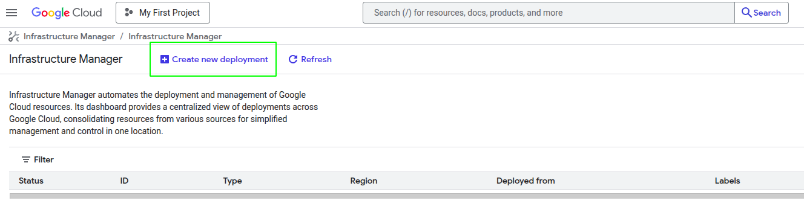
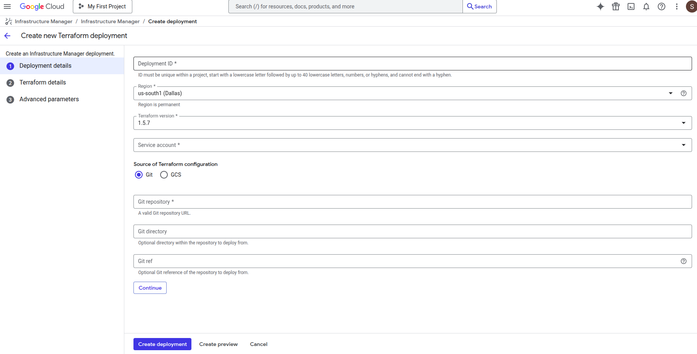
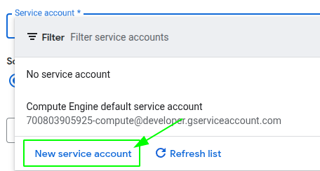
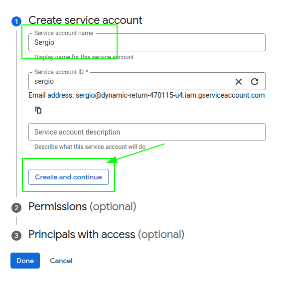
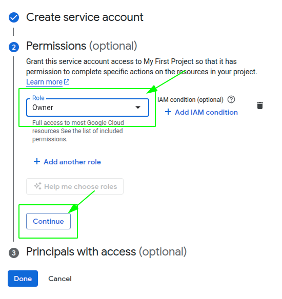
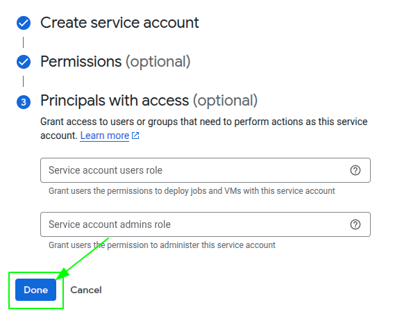
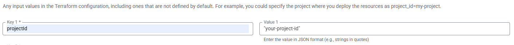

# OpenVidu Single Node PRO installation: Google Cloud Platform

:material-google-cloud:{ .provider-chip-icon } Google Cloud Platform

!!! info
    
    OpenVidu Single Node Pro is part of **OpenVidu PRO**. Before deploying, you need to [create an OpenVidu account](/account/){:target=_blank} to get your license key.
    There's a 15-day free trial waiting for you!

This section contains instructions for deploying a production-ready OpenVidu Single Node PRO deployment on Google Cloud Platform. The deployed services are the same as in the [On Premises Single Node installation](../on-premises/install.md), but the process is automated through the Google Cloud Console.

To deploy OpenVidu on Google Cloud Platform, log in to [Infrastructure Manager :fontawesome-solid-external-link:{.external-link-icon}](https://console.cloud.google.com/infra-manager/deployments) in the GCP Console. Then follow the next steps and fill in your preferred parameters.

=== "Architecture overview"

    This is what the deployment architecture looks like:

    <figure markdown>
    { .svg-img .dark-img }
    <figcaption>OpenVidu Single Node Google Cloud Platform Architecture</figcaption>
    </figure>

## Deployment details

--8<-- "shared/self-hosting/gcp-info-deployment.md"

To deploy OpenVidu, first create a new deployment using the top-left button, as shown in the image.

<figure markdown>
{ .svg-img .dark-img }
</figure>

Once you click the button, you will see this window.

<figure markdown>
{ .svg-img .dark-img }
</figure>

* Fill **Deployment ID** with any name you prefer (for example, openvidu-singlenodepro-deployment).   
* Change the **Region** to the one you prefer.
!!! warning
  If you change the region in the previous step, don't forget to update the [region and zone :fontawesome-solid-external-link:{.external-link-icon}](https://docs.cloud.google.com/compute/docs/regions-zones?hl=en){:target=_blank} in the Terraform values.

* Leave **Terraform version** as 1.5.7.   
* For **Service Account**, you will need to create a new one with _"Owner"_ permissions. To do this, click the _"Service Account"_ label and then _"New Service Account"_. Choose your service account name, click _"Create and Continue"_, select the _"Owner"_ role, click _"Continue"_, and then _"Done"_.   
??? details "New Service Account Steps"

    <figure markdown>
    { .svg-img .dark-img }
    <figcaption>Step 1: Create Service Account</figcaption>
    </figure>

    <figure markdown>
    { .svg-img .dark-img }
    <figcaption>Step 2: Service Account Details</figcaption>
    </figure>

    <figure markdown>
    { .svg-img .dark-img }
    <figcaption>Step 3: Grant Permissions</figcaption>
    </figure>

    <figure markdown>
    { .svg-img .dark-img }
    <figcaption>Step 4: Complete Setup</figcaption>
    </figure>

* Fill **Git repository** with this link <code>https://github.com/OpenVidu/openvidu.git</code>:material-content-copy:, which corresponds to our Git repository where the Terraform files to deploy OpenVidu are located. 
* Fill the **Git directory** with the following path <code>openvidu-deployment/pro/singlenode/gcp</code>:material-content-copy: 
* For the **Git ref**, use <code>v3.5.0</code>:material-content-copy:, corresponding to the version you want to deploy. 

Finally, click Continue.
## Input Values

In Google Cloud Platform, there is no built-in template with parameters. You need to manually enter in the console the parameters declared in our Terraform files, so below is a detailed table of all optional and mandatory parameters.

### Mandatory Parameters

    <table border="1" cellspacing="0" cellpadding="6" style="margin: 0 auto;">
      <tr>
        <th>Input Value</th>
        <th>Description</th>
      </tr>
      <tr>
        <td>projectId</td>
        <td>GCP project id where the resources will be created.</td>
      </tr>
      <tr>
        <td>stackName</td>
        <td>Stack name for OpenVidu deployment.</td>
      </tr>
      <tr>
        <td>openviduLicense</td>
        <td>Your OpenVidu License. Get one <a href="https://openvidu.io/account" target="_blank" rel="noopener">here</a> if you don't have one.</td>
      </tr>
    </table>

### Optional Parameters

    <table border="1" cellspacing="0" cellpadding="6" style="margin: 0 auto;">
      <tr>
        <th>Input Value</th>
        <th>Default Value</th>
        <th>Description</th>
      </tr>
      <tr>
        <td>region</td>
        <td>"europe-west2"</td>
        <td>GCP region where resources will be created.</td>
      </tr>
      <tr>
        <td>zone</td>
        <td>"europe-west2-b"</td>
        <td>GCP zone that some resources will use.</td>
      </tr>
      <tr>
        <td>certificateType</td>
        <td>"letsEncrypt"</td>
        <td>Certificate type for OpenVidu deployment. Options:
          <ul>
            <li><strong>[selfsigned]</strong> Not recommended for production use. Just for testing purposes or development environments. You don't need a FQDN to use this option.</li>
            <li><strong>[owncert]</strong> Valid for production environments. Use your own certificate. You need a FQDN to use this option.</li>
            <li><strong>[letsencrypt]</strong> Valid for production environments. Can be used with or without a FQDN (if no FQDN is provided, a random sslip.io domain will be used).</li>
          </ul>
          <!-- TODO: Remove this warning when sslip.io rate limiting issue is resolved. Track at https://openvidu.discourse.group/t/deployment-without-domain/5474 -->
          
<strong>Warning:</strong> sslip.io is currently experiencing Let's Encrypt rate limiting issues, which may prevent SSL certificates from being generated. It is recommended to use your own domain name. Check <a href="https://openvidu.discourse.group/t/deployment-without-domain/5474" target="_blank">this community thread</a> for troubleshooting and updates.

              </td>    </tr>
      <tr>
        <td>publicIpAddress</td>
        <td>(none)</td>
        <td>Previously created Public IP address for the OpenVidu Deployment. Blank will generate a public IP.</td>
      </tr>
      <tr>
        <td>domainName</td>
        <td>(none)</td>
        <td>Domain name for the OpenVidu Deployment.</td>
      </tr>
      <tr>
        <td>ownPublicCertificate</td>
        <td>(none)</td>
        <td>If certificate type is 'owncert', this parameter will be used to specify the public certificate in base64 format.</td>
      </tr>
      <tr>
        <td>ownPrivateCertificate</td>
        <td>(none)</td>
        <td>If certificate type is 'owncert', this parameter will be used to specify the private certificate in base64 format.</td>
      </tr>
      <tr>
        <td>initialMeetAdminPassword</td>
        <td>(none)</td>
        <td>Initial password for the 'admin' user in OpenVidu Meet. If not provided, a random password will be generated.</td>
      </tr>
      <tr>
        <td>initialMeetApiKey</td>
        <td>(none)</td>
        <td>Initial API key for OpenVidu Meet. If not provided, no API key will be set and the user can set it later from Meet Console.</td>
      </tr>
      <tr>
        <td>instanceType</td>
        <td>"e2-standard-2"</td>
        <td>Specifies the GCE machine type for your OpenVidu instance.</td>
      </tr>
      <tr>
        <td>bucketName</td>
        <td>(none)</td>
        <td>Name of the GCS bucket to store data and recordings. If empty, a bucket will be created.</td>
      </tr>
      <tr>
        <td>rtcEngine</td>
        <td>"pion"</td>
        <td>RTCEngine media engine to use. Allowed values are 'pion' and 'mediasoup'.</td>
      </tr>
      <tr>
        <td>additionalInstallFlags</td>
        <td>(none)</td>
        <td>Additional optional flags to pass to the OpenVidu installer (comma-separated, e.g., '--flag1=value, --flag2').</td>
      </tr>
    </table>

For more details, you can check the [variables.tf :fontawesome-solid-external-link:{.external-link-icon}](https://github.com/OpenVidu/openvidu/blob/master/openvidu-deployment/pro/singlenode/gcp/variables.tf) file to see additional information about the inputs.   

!!! warning
    It's important that you enter the input variables with the exact same names as they appear in the table, as shown in the next image.

    <figure markdown>
    { .svg-img .dark-img }
    </figure>

## Deploying the stack

--8<-- "shared/self-hosting/gcp-deploying-stack.md"

## Configure your application to use the deployment 

You need the secret outputs from Google Cloud Platform to configure your OpenVidu application. You can check these secrets in Secret Manager using either of these two methods: ([Check deployment outputs in GCP Secret Manager](#check-deployment-outputs-in-gcp-secret-manager)) or ([Check deployment outputs in the instance](#check-deployment-outputs-in-the-instance)).

Your authentication credentials and the URL to point your applications to are:

--8<-- "shared/self-hosting/gcp-credentials-general.md"
--8<-- "shared/self-hosting/gcp-credentials-v2compatibility.md"

## Troubleshooting initial Google Cloud Platform deployment creation

--8<-- "shared/self-hosting/gcp-troubleshooting.md"

3. If everything seems fine, check the [status](../on-premises/admin.md#checking-the-status-of-services) and the [logs](../on-premises/admin.md#checking-logs) of the installed OpenVidu services.

## Configuration and administration

When your Google Cloud Platform deployment reaches the **`Active`** state, it means that all resources have been created. You will need to wait around 5 to 10 minutes for the instance to install OpenVidu, as mentioned before. After this time, try connecting to the deployment URL. If it doesn't work, we recommend checking the previous section. Once everything is ready, you can check the [Administration](./admin.md) section to learn how to manage your deployment.
