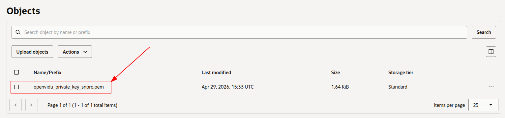

# OpenVidu Single Node <span class="openvidu-tag openvidu-pro-tag" style="font-size: .6em; vertical-align: text-bottom">PRO</span> installation: Oracle Cloud Infrastructure

--8<-- "shared/self-hosting/oracle-provider-chip.md"

This section describes two ways to install OpenVidu Single Node on Oracle Cloud Infrastructure:

* [**Web Console**](#web-console): Can be deployed without installing anything on your machine, but requires more manual steps and has some limitations. For example, recordings are stored on the machine itself rather than in OCI Object Storage.
* [**Terraform**](#terraform): More powerful and fully automated, but requires the Terraform CLI to be installed on your machine.


## Web Console

This page explains how to create a Compute instance in Oracle Cloud Infrastructure (OCI), configure networking, and prepare it for an OpenVidu Single Node PRO On-Premises installation. Installing, administering, and upgrading OpenVidu Single Node PRO itself is covered in the On-Premises documentation.

--8<-- "shared/self-hosting/oracle-singlenode-webconsole-steps.md"

6. Follow the [On-Premises install instructions](../on-premises/install.md) to install OpenVidu <span class="openvidu-tag openvidu-pro-tag" style="font-size: .6em; vertical-align: text-bottom">PRO</span> on the instance.

    <!-- TODO: Remove this warning when sslip.io rate limiting issue is resolved. Track at https://openvidu.discourse.group/t/deployment-without-domain/5474 -->
    !!! warning "sslip.io rate limiting"
        **sslip.io** is currently experiencing **Let's Encrypt rate limiting issues**, which may prevent SSL certificates from being issued. It is recommended to use your own domain name. Check [this community thread :fontawesome-solid-external-link:{.external-link-icon}](https://openvidu.discourse.group/t/deployment-without-domain/5474){:target="_blank"} for troubleshooting and updates.

---

### 5. Administration and upgrade

- For administration of this OpenVidu Single Node PRO deployment, see the [Administration](./admin.md) section.
- To upgrade OpenVidu, see the [Upgrade](./upgrade.md) section.

## Terraform

This section contains instructions for deploying a production-ready OpenVidu Single Node <span class="openvidu-tag openvidu-pro-tag" style="font-size: 12px">PRO</span> deployment on Oracle Cloud Infrastructure. The deployed services are the same as in the [On-Premises Single Node installation](../on-premises/install.md), but the process is fully automated through the Terraform CLI. OCI Object Storage is used to store recordings and other persistent data.

--8<-- "shared/self-hosting/oracle-singlenode-terraform-architecture.md"

### Deployment details

1. Clone the OpenVidu repository containing the Terraform files:

    ```bash
    git clone https://github.com/OpenVidu/openvidu-oracle.git
    git -C openvidu-oracle checkout 3.7.0
    cd openvidu-oracle/pro/singlenode
    ```

2. Copy **`terraform.tfvars.example`** to **`terraform.tfvars`**, update the required parameters with your values, and adjust any optional defaults as needed.
  <details>
    <summary>Information about parameters</summary>

    <h4>Mandatory Parameters</h4>

    <div align="center">
    <table>
    <thead>
    <tr>
    <th>Input Value</th>
    <th>Description</th>
    </tr>
    </thead>
    <tbody>
    <tr>
    <td style="white-space: nowrap;"><code>tenancy_ocid</code></td>
    <td>OCI Tenancy OCID. Required for the Object Storage namespace.</td>
    </tr>
    <tr>
    <td style="white-space: nowrap;"><code>compartment_ocid</code></td>
    <td>OCI Compartment OCID where resources will be created.</td>
    </tr>
    <tr>
    <td style="white-space: nowrap;"><code>user_ocid</code></td>
    <td>OCI User OCID used to create Customer Secret Keys for S3-compatible access to Object Storage.</td>
    </tr>
    <tr>
    <td style="white-space: nowrap;"><code>stackName</code></td>
    <td>Stack name for the OpenVidu deployment.</td>
    </tr>
    <tr>
    <td style="white-space: nowrap;"><code>openviduLicense</code></td>
    <td>OpenVidu PRO license key. Visit <a href="https://openvidu.io/account" target="_blank">https://openvidu.io/account</a> to obtain your license.</td>
    </tr>
    </tbody>
    </table>
    </div>

    <h4>Optional Parameters</h4>

    <div align="center">
    <table>
    <thead>
    <tr>
    <th>Input Value</th>
    <th>Default Value</th>
    <th>Description</th>
    </tr>
    </thead>
    <tbody>
    <tr>
    <td style="white-space: nowrap;"><code>region</code></td>
    <td style="white-space: nowrap;"><code>"eu-frankfurt-1"</code></td>
    <td>OCI region where resources will be created.</td>
    </tr>
    <tr>
    <td style="white-space: nowrap;"><code>availability_domain</code></td>
    <td style="white-space: nowrap;"><code>1</code></td>
    <td>Availability Domain number (1, 2, or 3) to use for resources.</td>
    </tr>
    <tr>
    <td style="white-space: nowrap;"><code>instanceType</code></td>
    <td style="white-space: nowrap;"><code>"VM.Standard.E4.Flex"</code></td>
    <td>OCI Compute shape for the OpenVidu instance.</td>
    </tr>
    <tr>
    <td style="white-space: nowrap;"><code>instanceOCPUs</code></td>
    <td style="white-space: nowrap;"><code>4</code></td>
    <td>Number of OCPUs for the instance (applies to Flex shapes only).</td>
    </tr>
    <tr>
    <td style="white-space: nowrap;"><code>instanceMemory</code></td>
    <td style="white-space: nowrap;"><code>4</code></td>
    <td>Memory in GB for the instance (applies to Flex shapes only).</td>
    </tr>
    <tr>
    <td style="white-space: nowrap;"><code>certificateType</code></td>
    <td style="white-space: nowrap;"><code>"letsencrypt"</code></td>
    <td>Certificate type for the OpenVidu deployment. Options: <ul><li><code>selfsigned</code> - Not recommended for production use. Intended for testing or development environments only. A FQDN is not required.</li><li><code>owncert</code> - Suitable for production environments. Uses your own certificate. A FQDN is required.</li><li><code>letsencrypt</code> - Suitable for production environments. Can be used with or without a FQDN (if no FQDN is provided, a random sslip.io domain will be used).</li></ul>
    <!-- TODO: Remove this warning when sslip.io rate limiting issue is resolved. Track at https://openvidu.discourse.group/t/deployment-without-domain/5474 -->
    <p><strong>Warning:</strong> sslip.io is currently experiencing Let's Encrypt rate limiting issues, which may prevent SSL certificates from being issued. It is recommended to use your own domain name. Check <a href="https://openvidu.discourse.group/t/deployment-without-domain/5474" target="_blank">this community thread</a> for troubleshooting and updates.</p>
    </td>
    </tr>
    <tr>
    <td style="white-space: nowrap;"><code>domainName</code></td>
    <td style="white-space: nowrap;"><code>(none)</code></td>
    <td>Domain name for the OpenVidu deployment. Optional — if not provided, a sslip.io domain will be used instead.</td>
    </tr>
    <tr>
    <td style="white-space: nowrap;"><code>ownPublicCertificate</code></td>
    <td style="white-space: nowrap;"><code>(none)</code></td>
    <td>If the certificate type is <code>owncert</code>, this parameter specifies the public certificate URL.</td>
    </tr>
    <tr>
    <td style="white-space: nowrap;"><code>ownPrivateCertificate</code></td>
    <td style="white-space: nowrap;"><code>(none)</code></td>
    <td>If the certificate type is <code>owncert</code>, this parameter specifies the private certificate URL.</td>
    </tr>
    <tr>
    <td style="white-space: nowrap;"><code>initialMeetAdminPassword</code></td>
    <td style="white-space: nowrap;"><code>(none)</code></td>
    <td>Initial password for the <code>admin</code> user in OpenVidu Meet. Alphanumeric characters only (A-Z, a-z, 0-9). If not provided, a random password will be generated.</td>
    </tr>
    <tr>
    <td style="white-space: nowrap;"><code>initialMeetApiKey</code></td>
    <td style="white-space: nowrap;"><code>(none)</code></td>
    <td>Initial API key for OpenVidu Meet. Alphanumeric characters only (A-Z, a-z, 0-9). If not provided, no API key will be set; one can be configured later from the Meet Console.</td>
    </tr>
    <tr>
    <td style="white-space: nowrap;"><code>bucketName</code></td>
    <td style="white-space: nowrap;"><code>(none)</code></td>
    <td>Name of the OCI Object Storage bucket for application data and recordings. If left empty, a bucket will be created with a default name.</td>
    </tr>
    <tr>
    <td style="white-space: nowrap;"><code>RTCEngine</code></td>
    <td style="white-space: nowrap;"><code>"pion"</code></td>
    <td>WebRTC media engine to use. Options: <ul><li><code>pion</code> - Default media engine.</li><li><code>mediasoup</code> - Alternative media engine with different performance characteristics.</li></ul></td>
    </tr>
    <tr>
    <td style="white-space: nowrap;"><code>vault_ocid</code></td>
    <td style="white-space: nowrap;"><code>(none)</code></td>
    <td>OCI KMS Vault OCID for secrets management. If left empty, a new vault will be created.</td>
    </tr>
    <tr>
    <td style="white-space: nowrap;"><code>key_ocid</code></td>
    <td style="white-space: nowrap;"><code>(none)</code></td>
    <td>OCI KMS Key OCID for secrets management. If left empty, a new key will be created.</td>
    </tr>
    <tr>
    <td style="white-space: nowrap;"><code>additionalInstallFlags</code></td>
    <td style="white-space: nowrap;"><code>(none)</code></td>
    <td>Additional optional flags to pass to the OpenVidu installer (comma-separated, e.g., <code>--flag1=value, --flag2</code>).</td>
    </tr>
    </tbody>
    </table>
    </div>

  </details>

3. Deploy with Terraform using the following commands:

    ```bash
    terraform init
    terraform apply
    ```

4. Logs will appear in the `terraform apply` console output. Wait for it to finish and display `Apply Complete!`. Then go to [OCI Object Storage :fontawesome-solid-external-link:{.external-link-icon}](https://cloud.oracle.com/object-storage/buckets){:target=_blank} and wait for the SSH key to appear in your configured bucket.

    !!! warning
        After downloading the SSH key, it is strongly recommended to **DELETE IT** from the bucket. This file is the private key used to access the instance — if exposed, unauthorized users could gain access.
    <figure markdown>
    { .svg-img .dark-img }
    </figure>

5. Set the correct permissions on the SSH key so it can be used.

--8<-- "shared/self-hosting/oracle-singlenode-ssh-key-permissions.md"

--8<-- "shared/self-hosting/oracle-singlenode-access-openvidu.md"

--8<-- "shared/self-hosting/oracle-singlenode-configure-app.md"