# OpenVidu Single Node <span class="openvidu-tag openvidu-pro-tag" style="font-size: .6em; vertical-align: text-bottom">PRO</span> installation: Oracle Cloud Infrastructure

<div class="provider-chip" markdown>

:custom-oracle-cloud-infrastructure:{ .provider-chip-icon } Oracle Cloud Infrastructure

</div>

This section describes two ways to install OpenVidu Single Node on Oracle Cloud Infrastructure:

* [**Web Console**](#web-console): Can be deployed without installing anything on your machine, but requires more manual steps and has some limitations. For example, recordings are stored on the machine itself rather than in OCI Object Storage.
* [**Terraform**](#terraform): More powerful and fully automated, but requires the Terraform CLI to be installed on your machine.


## Web Console

This page explains how to create a Compute instance in Oracle Cloud Infrastructure (OCI), configure networking, and prepare it for an OpenVidu Single Node PRO On-Premises installation. Installing, administering, and upgrading OpenVidu Single Node PRO itself is covered in the On-Premises documentation.

### Prerequisites

- An OCI account with permission to create Compute instances and networking resources.

---

### 1. Create the Compute instance

1. Log in to your [**Oracle Cloud Infrastructure** :fontawesome-solid-external-link:{.external-link-icon}](https://cloud.oracle.com/){:target=_blank} account.
2. Search for **Instances**, open it, and click _"Create instance"_.

    <figure markdown>
    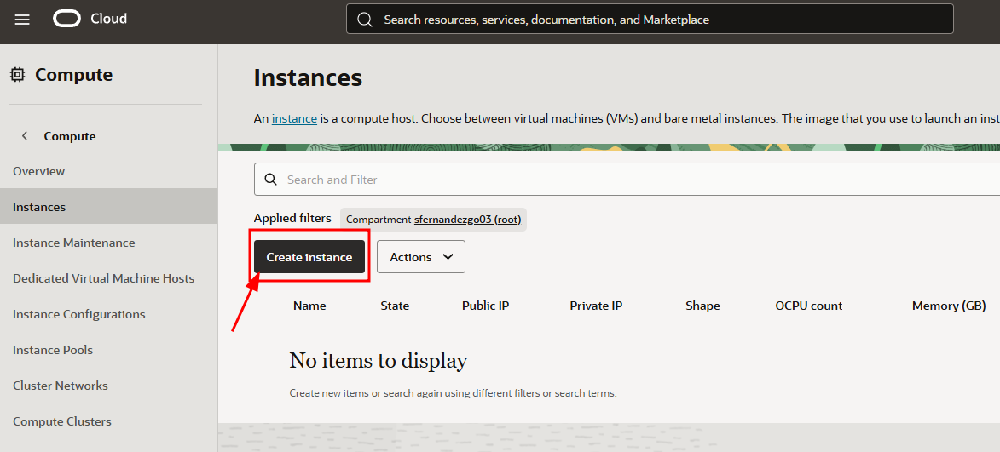{ .svg-img .dark-img }
    </figure>

3. Set a name for the instance (for example, `openvidu-singlenode`), or keep the default.
4. Change the image to _"Canonical Ubuntu 24.04"_.

    <figure markdown>
    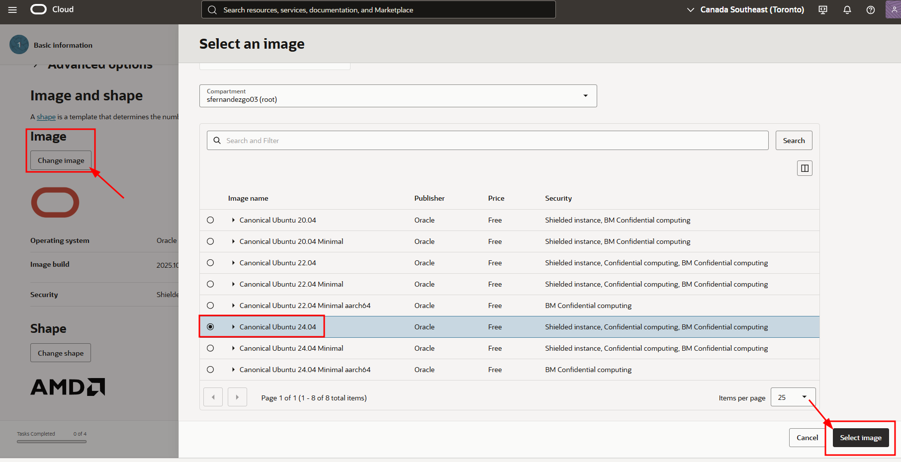{ .svg-img .dark-img }
    </figure>

5. Select the shape for your OpenVidu server. We recommend **at least 1 OCPU and 4 GB of RAM** for OpenVidu to run correctly. Then click _"Next"_.

    !!! note
        ARM-based instances are also supported. OpenVidu supports ARM, and the [**Always Free-eligible**](https://docs.oracle.com/en-us/iaas/Content/FreeTier/freetier_topic-Always_Free_Resources.htm){:target="_blank"} tier includes an ARM instance at no cost.

6. In the **Security** tab, keep the default options and click _"Next"_.
7. Create a new `VNIC` with a new `virtual cloud network` and a new `public subnet`.

    <figure markdown>
    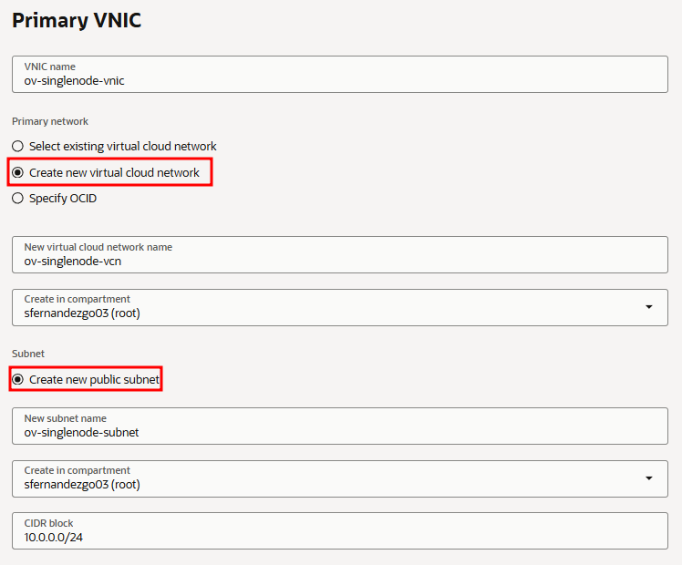{ .svg-img .dark-img }
    </figure>

8. Scroll down and download the private key for the instance so you can connect via SSH. Then click _"Next"_.

    <figure markdown>
    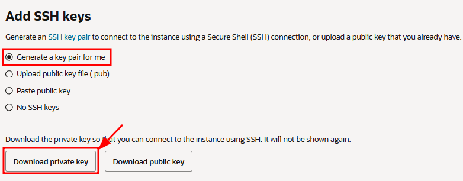{ .svg-img .dark-img }
    </figure>

9.  In the **Storage** tab, select _"Specify a custom boot volume size"_ and set it to **100 GB** instead of the default 50 GB. You can keep 50 GB, but OpenVidu may fail due to insufficient disk space. Then click _"Next"_.

    <figure markdown>
    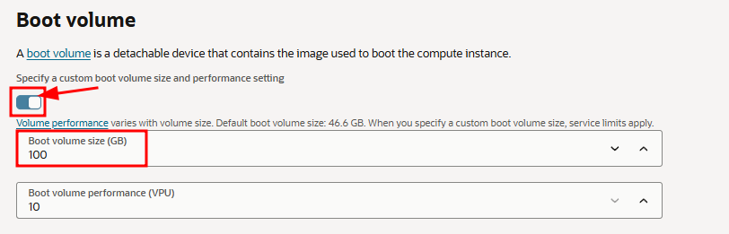{ .svg-img .dark-img }
    </figure>

10. Review the configuration and click _"Create"_.

---

### 2. Attach a public IP address to the instance

1. Open the instance details, navigate to the **VNIC** resource, and go to the _"Networking"_ tab.

    <figure markdown>
    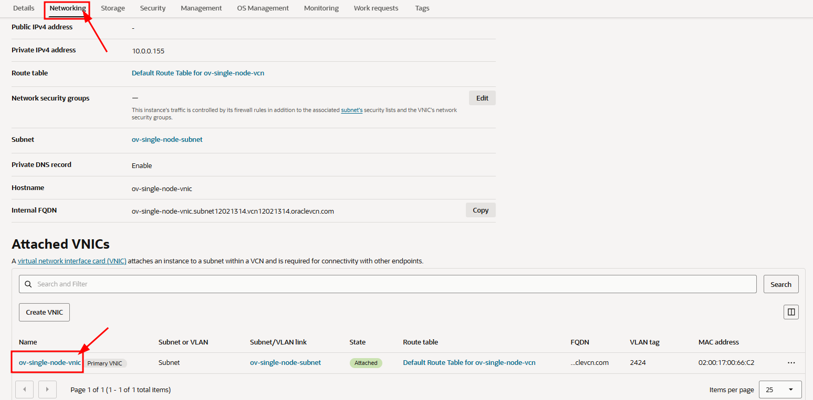{ .svg-img .dark-img }
    </figure>

2. Open the _"IP administration"_ tab. In the row of the existing IPv4 address, click the three-dots menu and select _"Edit"_.

    <figure markdown>
    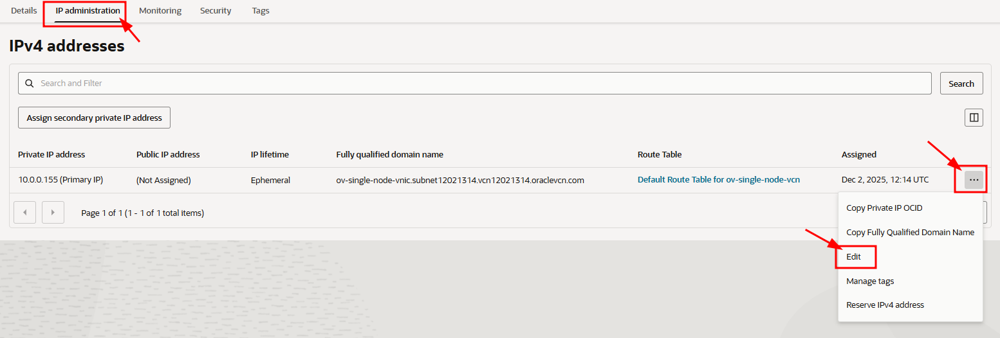{ .svg-img .dark-img }
    </figure>

3. Select _"Ephemeral public IP"_ and click _"Update"_.

    <figure markdown>
    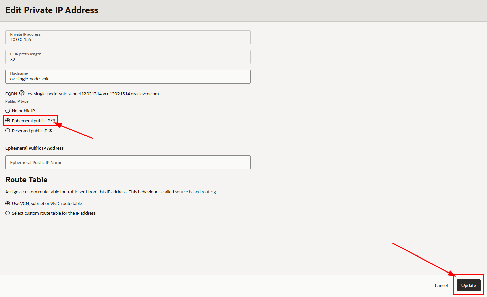{ .svg-img .dark-img }
    </figure>

---

### 3. Port rules in the network security lists

OpenVidu and WebRTC require specific inbound rules on both the instance network security (OCI NSG or subnet security list) and the instance firewall (configured later).

The [minimum inbound ports to allow](../on-premises/install.md#port-rules) must be included in the security list rules.

1. From the instance _"Details"_ page, click the _"Virtual cloud network"_ resource.

    <figure markdown>
    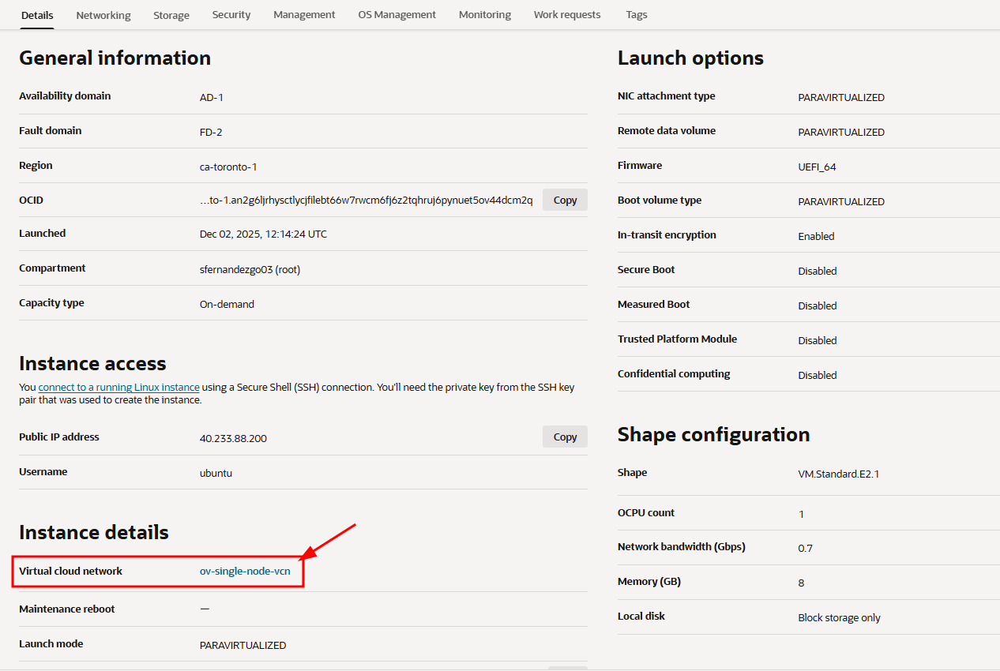{ .svg-img .dark-img }
    </figure>

2. Go to the _"Security"_ tab and click the default security list.

    <figure markdown>
    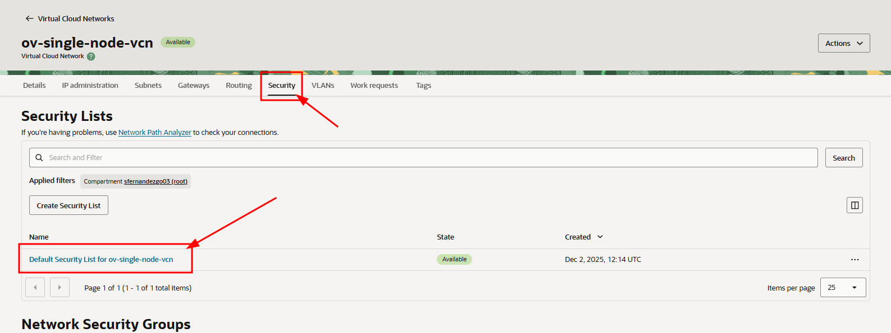{ .svg-img .dark-img }
    </figure>

3. In the _"Security Rules"_ tab, add the following **Ingress rules**.

??? "Ingress Rules"
    <figure markdown>
    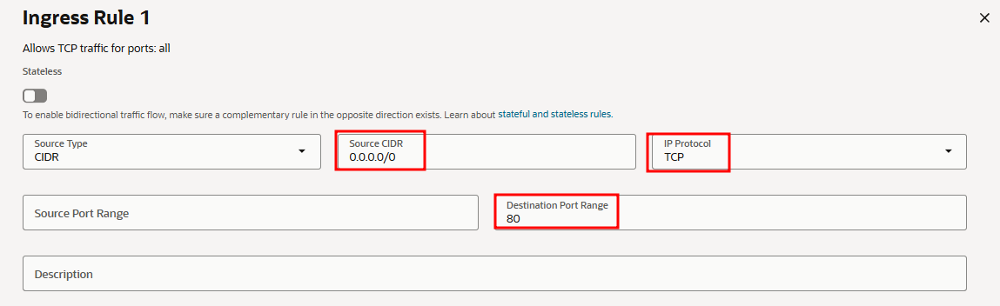{ .svg-img .dark-img }
    </figure>
    <figure markdown>
    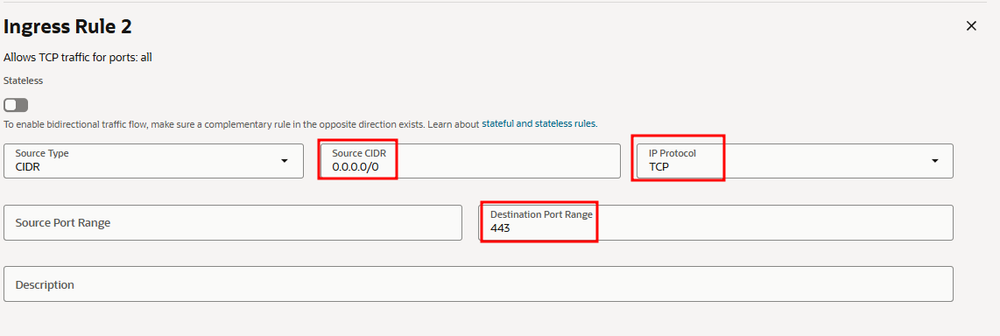{ .svg-img .dark-img }
    </figure>
    <figure markdown>
    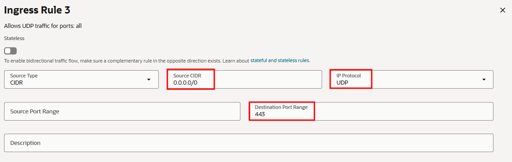{ .svg-img .dark-img }
    </figure>
    <figure markdown>
    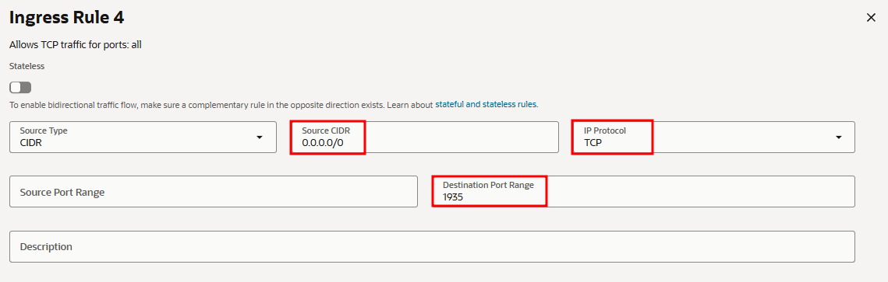{ .svg-img .dark-img }
    </figure>
    <figure markdown>
    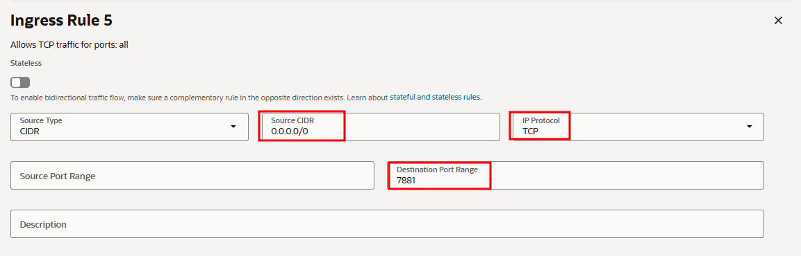{ .svg-img .dark-img }
    </figure>
    <figure markdown>
    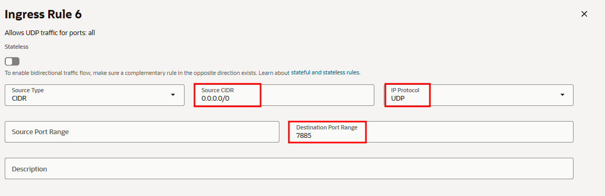{ .svg-img .dark-img }
    </figure>
    <figure markdown>
    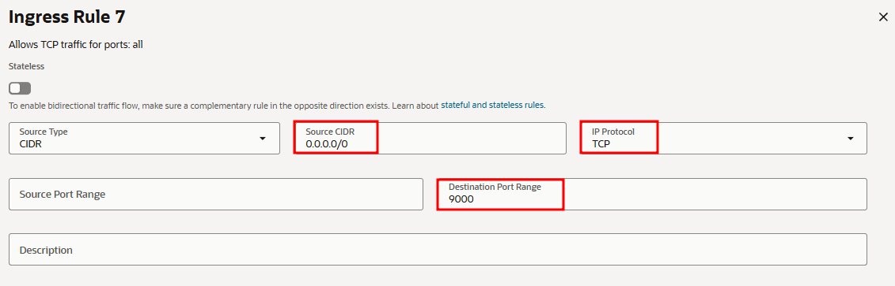{ .svg-img .dark-img }
    </figure>
    <figure markdown>
    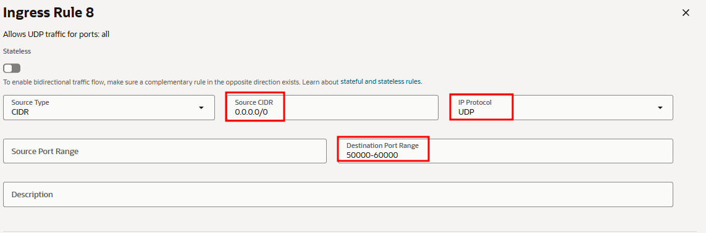{ .svg-img .dark-img }
    </figure>

---

### 4. SSH access, OpenVidu installation, and firewall rules

!!! warning
    Open the required ports in the OS firewall before installing OpenVidu to avoid connectivity issues.

1. SSH into the instance:

    ```bash
    ssh -i private_key_downloaded.key ubuntu@PUBLIC_IP
    sudo apt update && sudo apt upgrade -y
    ```

2. Install and start the `firewalld` tool:

    ```bash
    sudo apt install firewalld -y
    sudo systemctl enable firewalld
    sudo systemctl start firewalld
    ```

3. Clear the existing `iptables` rules, set the default input policy to ACCEPT, disable `iptables` persistence at startup, and restart the network service if required:

    ```bash
    sudo iptables -F
    sudo iptables -P INPUT ACCEPT
    sudo systemctl disable netfilter-persistent
    ```

4. Add the required firewall rules:

    ```bash
    firewall-cmd --add-port=80/tcp
    firewall-cmd --permanent --add-port=80/tcp

    firewall-cmd --add-port=443/tcp
    firewall-cmd --permanent --add-port=443/tcp

    firewall-cmd --add-port=443/udp
    firewall-cmd --permanent --add-port=443/udp

    firewall-cmd --add-port=1935/tcp
    firewall-cmd --permanent --add-port=1935/tcp

    firewall-cmd --add-port=7881/tcp
    firewall-cmd --permanent --add-port=7881/tcp

    firewall-cmd --add-port=7885/udp
    firewall-cmd --permanent --add-port=7885/udp

    firewall-cmd --add-port=9000/tcp
    firewall-cmd --permanent --add-port=9000/tcp

    firewall-cmd --add-port=50000-60000/udp
    firewall-cmd --permanent --add-port=50000-60000/udp
    ```

5. Apply the rules and verify they are correctly configured:

    ```bash
    firewall-cmd --reload
    firewall-cmd --runtime-to-permanent

    firewall-cmd --list-all
    ```

6. Follow the [On-Premises install instructions](../on-premises/install.md) to install OpenVidu <span class="openvidu-tag openvidu-pro-tag" style="font-size: .6em; vertical-align: text-bottom">PRO</span> on the instance.

    <!-- TODO: Remove this warning when sslip.io rate limiting issue is resolved. Track at https://openvidu.discourse.group/t/deployment-without-domain/5474 -->
    !!! warning "sslip.io rate limiting"
        **sslip.io** is currently experiencing **Let's Encrypt rate limiting issues**, which may prevent SSL certificates from being issued. It is recommended to use your own domain name. Check [this community thread :fontawesome-solid-external-link:{.external-link-icon}](https://openvidu.discourse.group/t/deployment-without-domain/5474){:target="_blank"} for troubleshooting and updates.

---

### 5. Administration and upgrade

- For administration of this OpenVidu Single Node PRO deployment, see the [Administration](./admin.md) section.
- To upgrade OpenVidu, see the [Upgrade](./upgrade.md) section.

## Terraform

This section contains instructions for deploying a production-ready OpenVidu Single Node <span class="openvidu-tag openvidu-pro-tag" style="font-size: 12px">PRO</span> deployment on Oracle Cloud Infrastructure. The deployed services are the same as in the [On-Premises Single Node installation](../on-premises/install.md), but the process is fully automated through the Terraform CLI. OCI Object Storage is used to store recordings and other persistent data.

### Prerequisites
* An Oracle Cloud Infrastructure account with the required permissions to create Compute instances, VCNs, and Object Storage buckets.
* The [Terraform CLI :fontawesome-solid-external-link:{.external-link-icon}](https://developer.hashicorp.com/terraform/tutorials/aws-get-started/install-cli){:target=_blank} installed on your machine.
* Git installed on your machine.

=== "Architecture overview"

    The deployment architecture is as follows:

    <figure markdown>
    { .svg-img .dark-img }
    <figcaption>OpenVidu Single Node Oracle Cloud Infrastructure Architecture</figcaption>
    </figure>

### Deployment details

1. Clone the OpenVidu repository containing the Terraform files:

    ```bash
    git clone https://github.com/OpenVidu/openvidu-oracle.git
    git -C openvidu-oracle checkout 3.7.0
    cd openvidu-oracle/pro/singlenode
    ```

2. Copy **`terraform.tfvars.example`** to **`terraform.tfvars`**, update the required parameters with your values, and adjust any optional defaults as needed.
  <details>
    <summary>Information about parameters</summary>

    <h4>Mandatory Parameters</h4>

    <div align="center">
    <table>
    <thead>
    <tr>
    <th>Input Value</th>
    <th>Description</th>
    </tr>
    </thead>
    <tbody>
    <tr>
    <td style="white-space: nowrap;"><code>tenancy_ocid</code></td>
    <td>OCI Tenancy OCID. Required for the Object Storage namespace.</td>
    </tr>
    <tr>
    <td style="white-space: nowrap;"><code>compartment_ocid</code></td>
    <td>OCI Compartment OCID where resources will be created.</td>
    </tr>
    <tr>
    <td style="white-space: nowrap;"><code>user_ocid</code></td>
    <td>OCI User OCID used to create Customer Secret Keys for S3-compatible access to Object Storage.</td>
    </tr>
    <tr>
    <td style="white-space: nowrap;"><code>stackName</code></td>
    <td>Stack name for the OpenVidu deployment.</td>
    </tr>
    <tr>
    <td style="white-space: nowrap;"><code>openviduLicense</code></td>
    <td>OpenVidu PRO license key. Visit <a href="https://openvidu.io/account" target="_blank">https://openvidu.io/account</a> to obtain your license.</td>
    </tr>
    </tbody>
    </table>
    </div>

    <h4>Optional Parameters</h4>

    <div align="center">
    <table>
    <thead>
    <tr>
    <th>Input Value</th>
    <th>Default Value</th>
    <th>Description</th>
    </tr>
    </thead>
    <tbody>
    <tr>
    <td style="white-space: nowrap;"><code>region</code></td>
    <td style="white-space: nowrap;"><code>"eu-frankfurt-1"</code></td>
    <td>OCI region where resources will be created.</td>
    </tr>
    <tr>
    <td style="white-space: nowrap;"><code>availability_domain</code></td>
    <td style="white-space: nowrap;"><code>1</code></td>
    <td>Availability Domain number (1, 2, or 3) to use for resources.</td>
    </tr>
    <tr>
    <td style="white-space: nowrap;"><code>instanceType</code></td>
    <td style="white-space: nowrap;"><code>"VM.Standard.E4.Flex"</code></td>
    <td>OCI Compute shape for the OpenVidu instance.</td>
    </tr>
    <tr>
    <td style="white-space: nowrap;"><code>instanceOCPUs</code></td>
    <td style="white-space: nowrap;"><code>4</code></td>
    <td>Number of OCPUs for the instance (applies to Flex shapes only).</td>
    </tr>
    <tr>
    <td style="white-space: nowrap;"><code>instanceMemory</code></td>
    <td style="white-space: nowrap;"><code>4</code></td>
    <td>Memory in GB for the instance (applies to Flex shapes only).</td>
    </tr>
    <tr>
    <td style="white-space: nowrap;"><code>certificateType</code></td>
    <td style="white-space: nowrap;"><code>"letsencrypt"</code></td>
    <td>Certificate type for the OpenVidu deployment. Options: <ul><li><code>selfsigned</code> - Not recommended for production use. Intended for testing or development environments only. A FQDN is not required.</li><li><code>owncert</code> - Suitable for production environments. Uses your own certificate. A FQDN is required.</li><li><code>letsencrypt</code> - Suitable for production environments. Can be used with or without a FQDN (if no FQDN is provided, a random sslip.io domain will be used).</li></ul>
    <!-- TODO: Remove this warning when sslip.io rate limiting issue is resolved. Track at https://openvidu.discourse.group/t/deployment-without-domain/5474 -->
    <p><strong>Warning:</strong> sslip.io is currently experiencing Let's Encrypt rate limiting issues, which may prevent SSL certificates from being issued. It is recommended to use your own domain name. Check <a href="https://openvidu.discourse.group/t/deployment-without-domain/5474" target="_blank">this community thread</a> for troubleshooting and updates.</p>
    </td>
    </tr>
    <tr>
    <td style="white-space: nowrap;"><code>publicIpAddress</code></td>
    <td style="white-space: nowrap;"><code>(none)</code></td>
    <td>A previously created Reserved Public IP address for the OpenVidu deployment. Leave blank to generate a new public IP.</td>
    </tr>
    <tr>
    <td style="white-space: nowrap;"><code>domainName</code></td>
    <td style="white-space: nowrap;"><code>(none)</code></td>
    <td>Domain name for the OpenVidu deployment. Optional — if not provided, a sslip.io domain will be used instead.</td>
    </tr>
    <tr>
    <td style="white-space: nowrap;"><code>ownPublicCertificate</code></td>
    <td style="white-space: nowrap;"><code>(none)</code></td>
    <td>If the certificate type is <code>owncert</code>, this parameter specifies the public certificate URL.</td>
    </tr>
    <tr>
    <td style="white-space: nowrap;"><code>ownPrivateCertificate</code></td>
    <td style="white-space: nowrap;"><code>(none)</code></td>
    <td>If the certificate type is <code>owncert</code>, this parameter specifies the private certificate URL.</td>
    </tr>
    <tr>
    <td style="white-space: nowrap;"><code>initialMeetAdminPassword</code></td>
    <td style="white-space: nowrap;"><code>(none)</code></td>
    <td>Initial password for the <code>admin</code> user in OpenVidu Meet. Alphanumeric characters only (A-Z, a-z, 0-9). If not provided, a random password will be generated.</td>
    </tr>
    <tr>
    <td style="white-space: nowrap;"><code>initialMeetApiKey</code></td>
    <td style="white-space: nowrap;"><code>(none)</code></td>
    <td>Initial API key for OpenVidu Meet. Alphanumeric characters only (A-Z, a-z, 0-9). If not provided, no API key will be set; one can be configured later from the Meet Console.</td>
    </tr>
    <tr>
    <td style="white-space: nowrap;"><code>bucketName</code></td>
    <td style="white-space: nowrap;"><code>(none)</code></td>
    <td>Name of the OCI Object Storage bucket for application data and recordings. If left empty, a bucket will be created with a default name.</td>
    </tr>
    <tr>
    <td style="white-space: nowrap;"><code>RTCEngine</code></td>
    <td style="white-space: nowrap;"><code>"pion"</code></td>
    <td>WebRTC media engine to use. Options: <ul><li><code>pion</code> - Default media engine.</li><li><code>mediasoup</code> - Alternative media engine with different performance characteristics.</li></ul></td>
    </tr>
    <tr>
    <td style="white-space: nowrap;"><code>vault_ocid</code></td>
    <td style="white-space: nowrap;"><code>(none)</code></td>
    <td>OCI KMS Vault OCID for secrets management. If left empty, a new vault will be created.</td>
    </tr>
    <tr>
    <td style="white-space: nowrap;"><code>key_ocid</code></td>
    <td style="white-space: nowrap;"><code>(none)</code></td>
    <td>OCI KMS Key OCID for secrets management. If left empty, a new key will be created.</td>
    </tr>
    <tr>
    <td style="white-space: nowrap;"><code>additionalInstallFlags</code></td>
    <td style="white-space: nowrap;"><code>(none)</code></td>
    <td>Additional optional flags to pass to the OpenVidu installer (comma-separated, e.g., <code>--flag1=value, --flag2</code>).</td>
    </tr>
    </tbody>
    </table>
    </div>

  </details>

3. Deploy with Terraform using the following commands:

    ```bash
    terraform init
    terraform apply
    ```

4. Logs will appear in the `terraform apply` console output. Wait for it to finish and display `Apply Complete!`. Then go to [OCI Object Storage :fontawesome-solid-external-link:{.external-link-icon}](https://cloud.oracle.com/object-storage/buckets){:target=_blank} and wait for the SSH key to appear in your configured bucket.

    !!! warning
        After downloading the SSH key, it is strongly recommended to **DELETE IT** from the bucket. This file is the private key used to access the instance — if exposed, unauthorized users could gain access.
    <figure markdown>
    { .svg-img .dark-img }
    </figure>

5. Set the correct permissions on the SSH key so it can be used.

    === "Linux"
        ```bash
        chmod 600 <PATH_TO_THE_KEY>/openvidu_ssh_key_sn.pem
        ```
    === "Powershell"
        ```powershell
        $KeyPath = "<PATH_TO_THE_KEY>" &&
        icacls $KeyPath /inheritance:r &&
        icacls $KeyPath /grant:r "$($env:USERNAME):(R)"
        ```

### Access OpenVidu

To verify that your OpenVidu deployment is working correctly, check the credentials in the OCI Vault Secrets Manager.

=== "View OpenVidu credentials in the Web"
    1. Navigate to the [OCI Secrets Manager :fontawesome-solid-external-link:{.external-link-icon}](https://cloud.oracle.com/security/secrets){:target="_blank"} in the OCI Console.
    2. Click the secret you want to view.
    3. Scroll down to _"Versions"_, click the _"3 dots"_ menu next to the current version, and select _"View secret contents"_.
        <figure markdown>
        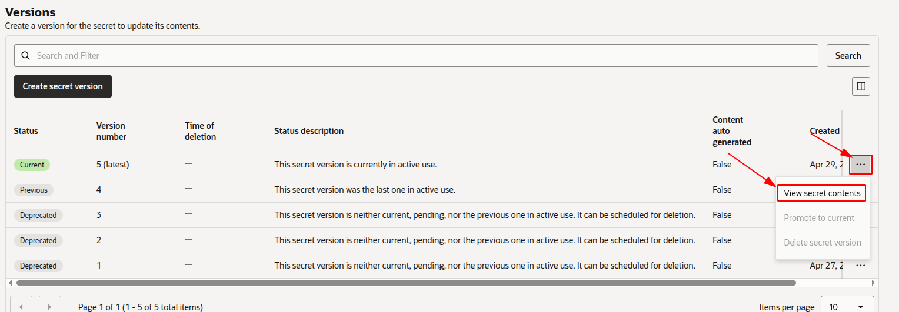{ .svg-img .dark-img }
        </figure>

        !!! warning
            Click _"Show decoded Base64 digit"_ to see the actual value of the secret.

=== "View OpenVidu credentials in the instance"

    SSH into the instance by running the following command from the directory where your SSH key is located:
    ```bash
    ssh -i openvidu_ssh_key_sn.pem ubuntu@PUBLIC_INSTANCE_IP
    ```

    Then navigate to `/opt/openvidu/config/` where you will find all credentials in the following files:

    - `openvidu.env`
    - `meet.env`

Open **OPENVIDU_URL** and you will see the OpenVidu Meet interface. Log in with **MEET_INITIAL_ADMIN_PASSWORD** to start using OpenVidu Meet.

### Configure your application to use the deployment

To configure your OpenVidu application, you will need your OCI credentials. You can retrieve them by following the steps in [View OpenVidu credentials in the Web](#view-openvidu-credentials-in-the-web) or [View OpenVidu credentials in the instance](#view-openvidu-credentials-in-the-instance).

Your authentication credentials and the URL to point your applications to are:

--8<-- "shared/self-hosting/oracle-credentials-general.md"

### Troubleshooting initial Oracle Cloud Infrastructure deployment

--8<-- "shared/self-hosting/oracle-troubleshooting.md"

3. If everything appears to be in order, check the [status](../on-premises/admin.md#checking-the-status-of-services) and [logs](../on-premises/admin.md#checking-logs) of the installed OpenVidu services.

### Configuration and administration

Once **OPENVIDU_URL** is reachable, the deployment is complete and working. See the [Administration](./admin.md) section to learn how to manage your deployment.