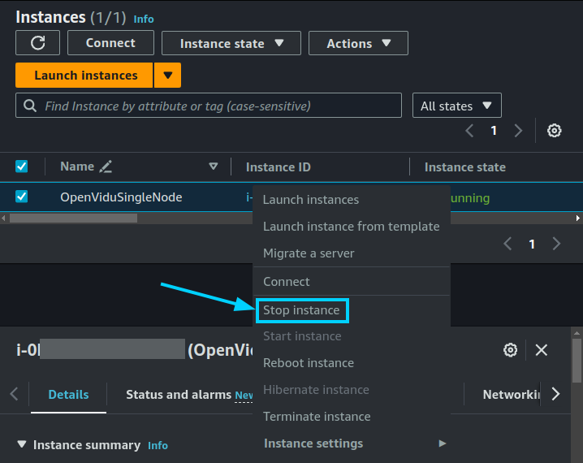

# OpenVidu Single Node: AWS configuration and administration

AWS deployment of OpenVidu Single Node is internally identical to the on-premises deployment, so you can follow the same instructions from the [On Premises Single Node](../on-premises/admin.md) for administration and configuration. The only difference is that the deployment is automated with AWS CloudFormation.

However, there are certain things worth mentioning:

## Start and stop OpenVidu through AWS Console

You can start and stop all services as explained in the [On Premises Single Node](../on-premises/admin.md#starting-stopping-and-restarting-openvidu) section. But you can also start and stop the EC2 instance directly from the AWS Console. This will stop all services running in the instance and reduce AWS costs.

=== "Stop OpenVidu Single Node"

    1. Go to the [EC2 Dashboard](https://console.aws.amazon.com/ec2/v2/home#Instances:sort=instanceId){:target="_blank"} of AWS.
    2. Right-click on the instance you want to start and select _"Stop instance"_.

    <figure markdown>
    { .svg-img .dark-img }
    </figure>

=== "Start OpenVidu Single Node"

    1. Go to the [EC2 Dashboard](https://console.aws.amazon.com/ec2/v2/home#Instances:sort=instanceId){:target="_blank"} of AWS.
    2. Right-click on the instance you want to start and select _"Start instance"_.

    <figure markdown>
    { .svg-img .dark-img }
    </figure>

## Change the instance type

You can change the instance type of the OpenVidu Single Node instance to adapt it to your needs. To do this, follow these steps:

1. [Stop the instance](#start-and-stop-openvidu-through-aws-console).
2. Right-click on the instance and select _"Instance Settings > Change Instance Type"_.

    === "Change instance type"

        <figure markdown>
        { .svg-img .dark-img }
        </figure>

3. Select the new instance type and click on _"Apply"_.
