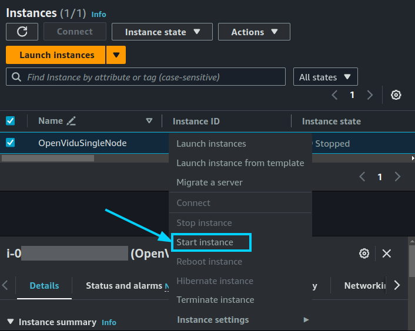
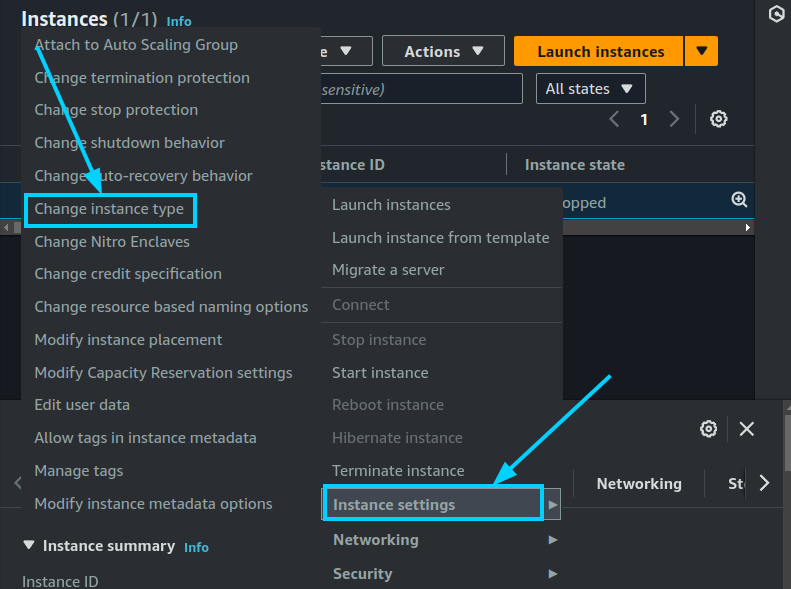

# COMMUNITY OpenVidu Single Node Administration: AWS

AWS deployment of OpenVidu Single Node is internally identical to the on-premises deployment, so you can follow the same instructions from the [On Premises Single Node](../on-premises/admin.md) for administration and configuration. The only difference is that the deployment is automated with AWS CloudFormation.

However, there are certain things worth mentioning:

## Start and stop OpenVidu through AWS Console

You can start and stop all services as explained in the [On Premises Single Node](../on-premises/admin.md#starting-stopping-and-restarting-openvidu) section. But you can also start and stop the EC2 instance directly from the AWS Console. This will stop all services running in the instance and reduce AWS costs.

=== "Stop OpenVidu Single Node"

    1. Go to the [EC2 Dashboard](https://console.aws.amazon.com/ec2/v2/home#Instances:sort=instanceId){:target="_blank"} of AWS.
    2. Right-click on the instance you want to start and select _"Stop instance"_.

    <figure markdown>
    { .svg-img .dark-img }
    </figure>

=== "Start OpenVidu Single Node"

    1. Go to the [EC2 Dashboard](https://console.aws.amazon.com/ec2/v2/home#Instances:sort=instanceId){:target="_blank"} of AWS.
    2. Right-click on the instance you want to start and select _"Start instance"_.

    <figure markdown>
    { .svg-img .dark-img }
    </figure>

## Change the instance type

You can change the instance type of the OpenVidu Single Node instance to adapt it to your needs. To do this, follow these steps:

1. [Stop the instance](#start-and-stop-openvidu-through-aws-console).
2. Right-click on the instance and select _"Instance Settings > Change Instance Type"_.

    === "Change instance type"

        <figure markdown>
        { .svg-img .dark-img }
        </figure>

3. Select the new instance type and click on _"Apply"_.

## Administration and Configuration

For administration, you can follow the instructions from the [On Premises Single Node Administration](../on-premises/admin.md) section.

Regarding the configuration, in AWS it is managed similarly to an on-premises deployment. For detailed instructions, please refer to the [Changing Configuration](../../configuration/changing-config.md) section. Additionally, the [How to Guides](../../how-to-guides/index.md) offer multiple resources to assist with specific configuration changes.

In addition to these, an AWS deployment provides the capability to manage global configurations via the AWS Console using AWS Secrets created during the deployment. To manage configurations this way, follow these steps:

=== "Changing Configuration through AWS Secrets"

    1. Navigate to the [CloudFormation Dashboard](https://console.aws.amazon.com/cloudformation/home){:target=_blank} on AWS.
    2. Select the CloudFormation Stack that you used to deploy OpenVidu Single Node.
    3. In the _"Outputs"_ tab, click the Link at _"ServicesAndCredentials"_. This will open the AWS Secrets Manager which contains all the configurations of the OpenVidu Single Node deployment.
        <figure markdown>
        { .svg-img .dark-img }
        </figure>
    4. Click on the _"Retrieve secret value"_ button to get the JSON with all the information.
        <figure markdown>
        { .svg-img .dark-img }
        </figure>
    5. Modify the parameter you want to change and click on _"Save"_. The changes will be applied to the OpenVidu Single Node deployment.
    6. Go to the EC2 Console and click on _"Reboot instance"_ to apply the changes to the Master Node.
        <figure markdown>
        { .svg-img .dark-img }
        </figure>

    The changes will be applied automatically.
