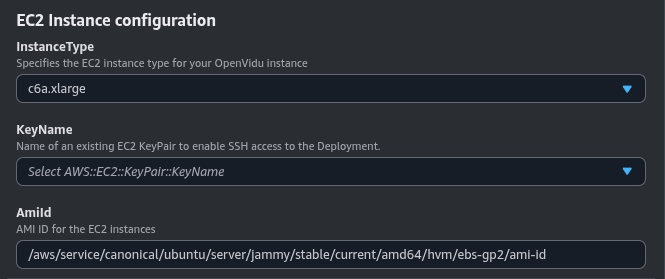

# OpenVidu Single Node <span class="openvidu-tag openvidu-community-tag" style="font-size: .6em; vertical-align: text-bottom">COMMUNITY</span> installation: AWS

This section contains the instructions to deploy a production-ready OpenVidu Single Node <span class="openvidu-tag openvidu-community-tag" style="font-size: 12px">COMMUNITY</span> deployment in AWS. Deployed services are the same as the [On Premises Single Node installation](../on-premises/install.md) but automate the process with AWS CloudFormation.

First of all, import the template in the AWS CloudFormation console. You can click the following button...

[:fontawesome-brands-aws:{style="font-size:36px; margin-right: 14px"} Deploy to AWS](https://console.aws.amazon.com/cloudformation/home?#/stacks/new?stackName=OpenViduSingleNode&templateURL=https://s3.eu-west-1.amazonaws.com/get.openvidu.io/community/singlenode/latest/aws/cf-openvidu-singlenode.yaml){.md-button .deploy-button .deploy-to-aws-btn target="_blank"}

...or access your [AWS CloudFormation console :fontawesome-solid-external-link:{.external-link-icon}](https://console.aws.amazon.com/cloudformation/home?#/stacks/new){:target=_blank} and manually set this S3 URL in the `Specify template` section:

```
https://s3.eu-west-1.amazonaws.com/get.openvidu.io/community/singlenode/latest/aws/cf-openvidu-singlenode.yaml
```

!!! info

    If you want to deploy a specific version of OpenVidu Single Node, replace `latest` with the version you want to deploy. For example, to deploy version `3.4.1`, use the following URL:

    ```
    https://s3.eu-west-1.amazonaws.com/get.openvidu.io/community/singlenode/3.4.1/aws/cf-openvidu-singlenode.yaml
    ```

=== "Architecture overview"

    This is how the architecture of the deployment looks like:

    <figure markdown>
    { .svg-img .dark-img }
    <figcaption>OpenVidu Single Node AWS Architecture</figcaption>
    </figure>

## CloudFormation Parameters

Depending on your needs, you need to fill the following CloudFormation parameters:

--8<-- "shared/self-hosting/aws-ssl-domain.md"

--8<-- "shared/self-hosting/aws-meet.md"

### EC2 Instance Configuration

You need to specify some properties for the EC2 instance that will be created.

=== "EC2 Instance configuration"

    Parameters in this section look like this:

    

    Simply select the type of instance you want to deploy at **InstanceType**, the SSH key you want to use to access the machine at **KeyName**, and the Ubuntu distribution you want to use at **OperatingSystem**.

    By default, the parameter **OperatingSystem** is configured to use the latest LTS Ubuntu AMI, so ideally you don’t need to modify this.

--8<-- "shared/self-hosting/aws-single-elastic-s3.md"

--8<-- "shared/self-hosting/aws-additional-flags.md"

--8<-- "shared/self-hosting/aws-turn-domain.md"

## Deploying the stack

When you are ready with your CloudFormation parameters, just click on _"Next"_, specify in _"Stack failure options"_ the option _"Preserve successfully provisioned resources"_ to be able to troubleshoot the deployment in case of error, click on _"Next"_ again, and finally _"Submit"_.

When everything is ready, you will see the following links in the _"Outputs"_ section of CloudFormation:

=== "CloudFormation Outputs"

    

## Configure your application to use the deployment

The Output Key **ServicesAndCredentials** of the [previous section](#deploying-the-stack) points to an AWS Secret Manager secret that contains all URLs and credentials to access the services deployed. You can access the secret by clicking on the link in the **Output Value** column.

Then, click on **Retrieve secret value** to get the JSON with all the information.

<div class="grid-container">

<div class="grid-50"><p><a class="glightbox" href="../../../../../assets/images/self-hosting/single-node/aws/1-secrets-retrieve.png" data-type="image" data-desc-position="bottom"></a></p></div>

<div class="grid-50"><p><a class="glightbox" href="../../../../../assets/images/self-hosting/single-node/aws/2-secrets.png" data-type="image" data-desc-position="bottom"></a></p></div>

</div>

To use your OpenVidu deployment, check the values of the JSON secret. All access credentials of all services are defined in this object. The most relevant ones are:

--8<-- "shared/self-hosting/aws-credentials-general.md"

## Troubleshooting Initial CloudFormation Stack Creation

--8<-- "shared/self-hosting/aws-troubleshooting.md"

4. If everything seems fine, check the [status](../on-premises/admin.md#checking-the-status-of-services) and the [logs](../on-premises/admin.md#checking-logs) of the installed OpenVidu services.

## Configuration and administration

When your CloudFormation stack reaches the **`CREATE_COMPLETE`** status, your OpenVidu Single Node deployment is ready to use. You can check the [Administration](./admin.md) section to learn how to manage your deployment.
