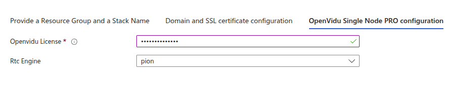

# PRO OpenVidu Single Node PRO installation: Azure

!!! info

    Azure is Expermiental in version 3.2.0 of OpenVidu

This section contains the instructions to deploy a production-ready OpenVidu Single Node PRO deployment in Azure. Deployed services are the same as the [On Premises Single Node installation](../on-premises/install-pro.md) but automate the process with Template Spec of ARM.

To use the Azure template you just need to click the button below and you will be redirected to azure...   

=== "Architecture overview"

    This is how the architecture of the deployment looks like:

    <figure markdown>
    { .svg-img .dark-img }
    <figcaption>OpenVidu Single Node Azure Architecture</figcaption>
    </figure>

## Template Parameters

To be able to deploy the template you need to fill the following parameters.

!!! warning

    The resource group may not be the same as a previous one, the deployment can fail if is the same. Fill the parameter **Stack Name** with the name you want for the stack (it will be used to create the names of the resources). Select the **Region** that you want or the region where the resource group is located (it will be autoselected).   

    <figure markdown>
    { .svg-img .dark-img }
    </figure>

--8<-- "shared/self-hosting/azure-ssl-domain.md"

## OpenVidu Single Node PRO configuration

In this section, you need to specify some properties needed for the OpenVidu Single Node PRO deployment.

=== "OpenVidu Single Node PRO Configuration"

    The parameters in this section might appear as follows:

    

    Make sure to provide the **OpenViduLicense** parameter with the license key. If you don't have one, you can request one [here](/account/){:target=_blank}.

    For the **RTCEngine** parameter, you can choose between **Pion** (the engine used by LiveKit) and **Mediasoup** (experimental).

    --8<-- "shared/self-hosting/mediasoup-warning.md"

### Azure Instance Configuration

You need to specify some properties for the Azure instance that will be created to run Openvidu.

=== "Azure Instance configuration"

    The parameters in this section may look like this:

    <figure markdown>
    { .svg-img .dark-img }
    </figure>

    Simply select the type of instance you want to deploy at **Type of Instance**, fill in the parameter **Admin Username** that will be set as admin username in the instance, then select the SSH key you've created previously in **SSH public key source**, or you can create a new one in the same drop down, to be able to make ssh to the instance.   

--8<-- "shared/self-hosting/azure-storageaccount.md"

--8<-- "shared/self-hosting/azure-turn-domain.md"

## Configure your Application to use the Deployment 

As we mentioned before, if you have permissions to give yourself access to the Key Vault you will be able to check there all the outputs in the tab [Azure Key Vault Outputs](#azure-key-vault-outputs), if you dont have them check the tab [Check outputs in the instance](#check-outputs-in-the-instance).

Your authentication credentials and URL to point your applications would be:

- **URL**: The value in the Key Vault Secret of `DOMAIN-NAME` or in the instance in `openvidu.env` as a URL. It could be `wss://openvidu.example.io/` or `https://openvidu.example.io/` depending on the SDK you are using.
- **API Key**: The value in the Key Vault Secret of `LIVEKIT-API-KEY` or in the instance in `openvidu.env`.
- **API Secret**: The value in the Key Vault Secret of `LIVEKIT-API-SECRET` or in the instance in `openvidu.env`.

## Troubleshooting Initial Azure Stack Creation

--8<-- "shared/self-hosting/azure-troubleshooting.md"

3. If everything seems fine, check the [status](../on-premises/admin.md#checking-the-status-of-services) and the [logs](../on-premises/admin.md#checking-logs) of the installed OpenVidu services.

## Configuration and administration

When your Azure stack reaches the **`Succeeded`** status, it means that all the resources have been created. You will need to wait about 5 to 10 minutes to let the instance install OpenVidu as we mentioned before. When this time has passed, try connecting to the deployment URL. If it doesn't work, we recommend checking the previous section. Once finished you can check the [Administration](./admin.md) section to learn how to manage your deployment.