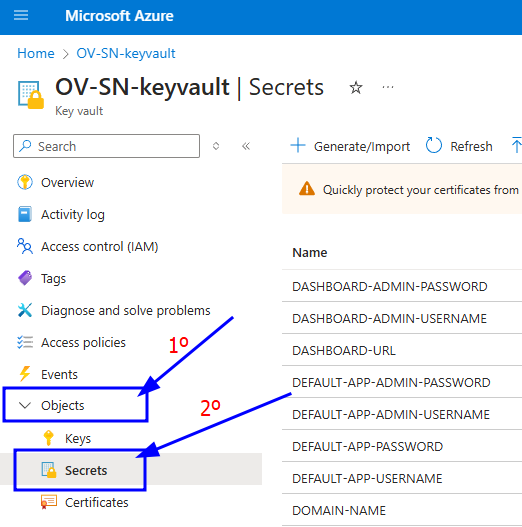
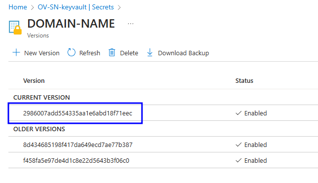
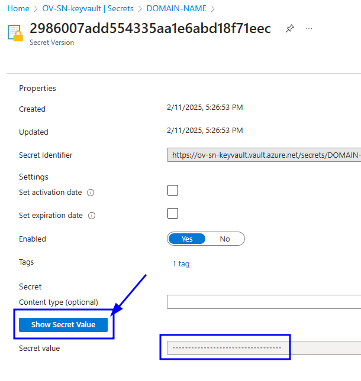

# OpenVidu Single Node Installation: Azure

--8<-- "shared/self-hosting/single-node/v2compat-warning.md"

This section contains the instructions to deploy a production-ready OpenVidu Single Node deployment in Azure. Deployed services are the same as the [On Premises Single Node Installation](../on-premises/install.md) but they will be resources in Azure and you can automate the process with the Template Spec of ARM.

To import the template into Azure you just need to click the button below and you will be redirected to azure.   
<div class="center-align" markdown>
[](https://portal.azure.com/#create/Microsoft.Template/uri/https%3A%2F%2Fs3.eu-west-1.amazonaws.com%2Fget.openvidu.io%2Fcommunity%2Fsinglenode%2Fmain%2Fazure%2Fcf-openvidu-singlenode.json)
</div>

=== "Architecture overview"

    This is how the architecture of the deployment looks like:

    <figure markdown>
    { .svg-img .dark-img }
    <figcaption>OpenVidu Single Node Azure Architecture</figcaption>
    </figure>

## Template Parameters

To be able to deploy the template you need to fill the following parameters

--8<-- "shared/self-hosting/azure-ssl-domain.md"

### Azure Instance Configuration

You need to specify some properties for the Azure instance that will be created to run Openvidu.

=== "Azure Instance configuration"

    The parameters in this section may look like this:

    <figure markdown>
    { .svg-img .dark-img }
    </figure>

    Simply select the type of instance you want to deploy at **Instance Type**, modify the username that will be the one standard in the instance at **Admin Username**, then you will need to paste the value of the public key you've created previously in **Admin Ssh Key** to be able to make ssh to the instance. 

    !!! info "SSH key"
    
        We are working to make the UI of the template less tedious to fill it up and one of the things when releasing a full version of this feature will be selecting the SSH key pair from the UI and be able to create a new one from there. 

--8<-- "shared/self-hosting/azure-turn-domain.md"

## Deploying the Stack

!!! warning

    Don't forget about changing the resource group where all the previous resources may be created (in case you use an existing public IP) and don't forget to fill the parameter **Stack Name** with the name you want for the stack (it will be used to create the names of the resources).

When you are ready with your Template parameters, just click on _"Next"_, then it will go through some validations, and if everything is correct, click on _"Create"_, then it will start deploying and you will have to wait the time that takes to install Openvidu, it takes about 5 to 10 minutes.

When everything is ready, you will see the following links in the Key Vault resource:   

=== "Azure Key Vault Outputs"

    1. Go to the Key Vault created called **yourstackname-keyvault** in the Resource Group that you deployed, you can access in [Azure Portal Dashboard](https://portal.azure.com/#home){:target="_blank"}.


    2. Once you are in the Key Vault on the left panel click on _"Objects"_ and then into _"Secrets"_.

        <figure markdown>
        { .svg-img .dark-img }
        </figure>

    3. Here click on the secret of your choice or whatever you need to check and click again in the current version of that secret

        <figure markdown>
        { .svg-img .dark-img }
        </figure>

    4. Now you will see a lot of properties but the one you are searching for is located at the bottom and it will be revealed by clicking in _"Show Secret Value"_.

        <figure markdown>
        { .svg-img .dark-img }
        </figure>

=== "Check outputs in the instance"

    You will need to do SSH to the single instance that is created and there you need to make the following steps:   
    
    First go to the config folder using the following command: ```cd /opt/openvidu/config```. There you will see a lot of **.env** files, those are the files you need to check to retrieve all access credentials of all services are:

    - `openvidu.env`
    - `app.env`

## Configure your Application to use the Deployment 

As we mentioned before, if you have permissions to give yourself access to the Key Vault you will be able to check there all the outputs, if you dont have them check the tab [Check outputs in the instance](#check-outputs-in-the-instance).

Your authentication credentials and URL to point your applications would be:

- **URL**: The value in the Key Vault Secret of `DOMAIN-NAME` or in the instance in `openvidu.env` as a URL. It could be `wss://openvidu.example.io/` or `https://openvidu.example.io/` depending on the SDK you are using.
- **API Key**: The value in the Key Vault Secret of `LIVEKIT-API-KEY` or in the instance in `openvidu.env`.
- **API Secret**: The value in the Key Vault Secret of `LIVEKIT-API-SECRET` or in the instance in `openvidu.env`.

## Troubleshooting Initial Azure Stack Creation

--8<-- "shared/self-hosting/azure-troubleshooting.md"

3. If everything seems fine, check the [status](../on-premises/admin.md#checking-the-status-of-services) and the [logs](../on-premises/admin.md#checking-logs) of the installed OpenVidu services.

## Configuration and administration

When your Azure stack reaches the **`Succeeded`** status, it means that all the resources have been created. You will need to wait about 5 to 10 minutes to let the instance install OpenVidu as we mentioned before. When this time has passed, try connecting to the deployment URL. If it doesn't work, we recommend checking the previous section. Once finished you can check the [Administration](./admin.md) section to learn how to manage your deployment.
